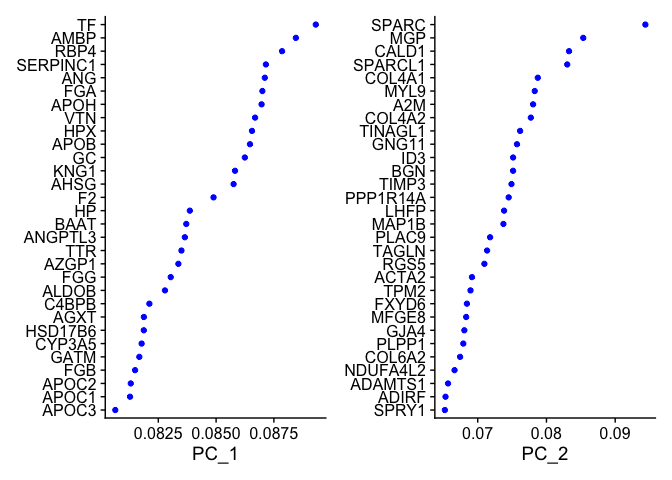
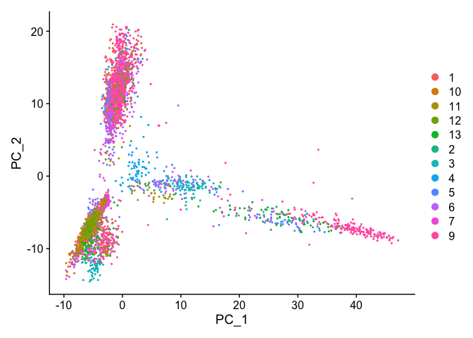
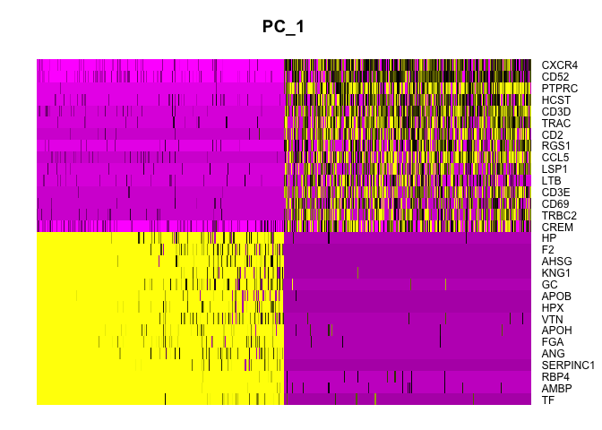
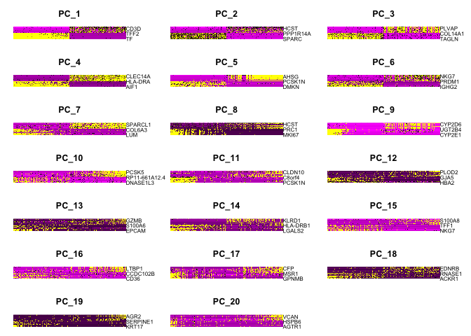
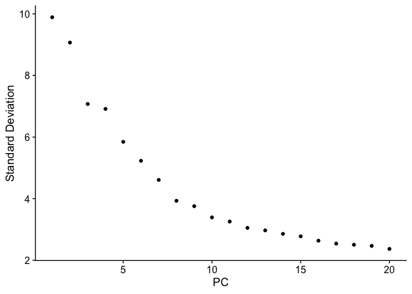
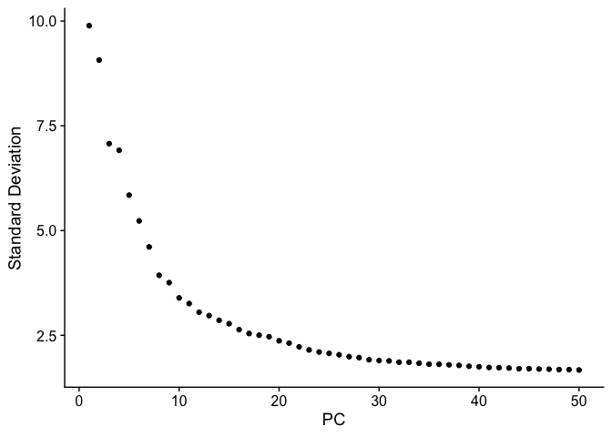
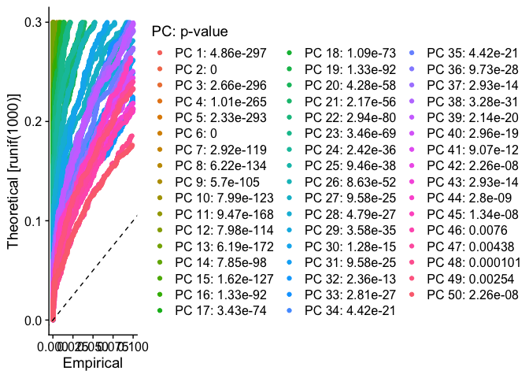
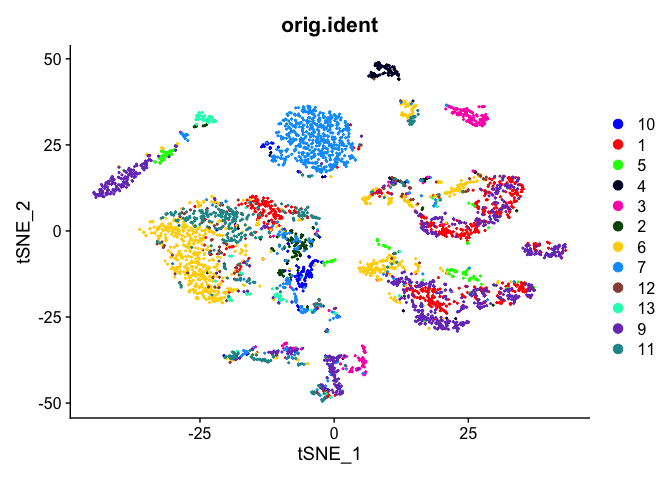

# Libraries

## Installations


```r
# if (!require("BiocManager", quietly = TRUE))
#     install.packages("BiocManager")
#
# BiocManager::install("GEOquery")

# install.packages(c("R.utils", "Seurat", "dplyr", "patchwork"))
```

## Loading


```r
library(GEOquery)

library(R.utils)

library(Seurat)
library(dplyr)
library(patchwork)
```

# Data retrieval


```r
setwd("/Users/iamakhilverma/Desktop/short_exercise_tsankov_lab")
getwd()
```

```
## [1] "/Users/iamakhilverma/Desktop/short_exercise_tsankov_lab"
```


GEO accession: `GSE125449`
A total of 19 tumors were profiled. Set 1 contains scRNA-seq data of twelve samples, i.e., S16_P10_LCP18, S02_P01_LCP21, S10_P05_LCP23, S09_P04_LCP25, S08_P03_LCP26, S07_P02_LCP28, S11_P06_LCP29, S12_P07_LCP30, S20_P12_LCP35, S21_P13_LCP37, S15_P09_LCP38, and S19_P11_LCP39. Set 2 includes scRNA-seq data of seven samples, i.e., S351_P10_LCP34, S355_P13_LCP42, S358_P16_LCP46, S305_P06_LCP56, S300_P02_LCP60, 364_P21_LCP65, and S365_P22_LCP66. Detailed information can be found in samples.txt file of each Set.

`GPL18573`	Illumina NextSeq 500 (Homo sapiens)
`GPL20301`	Illumina HiSeq 4000 (Homo sapiens)

We care about the data contained in Set 1, i.e., `GSE125449-GPL18573_series_matrix.txt.gz`.


```r
# gse <- getGEO('GSE125449',GSEMatrix=TRUE)
# show(gse)
```

```r
options(timeout = max(300, getOption("timeout")))
# options(download.file.method.GEOquery = "wget")
```


```r
if (!(
  file.exists(
    "/Users/iamakhilverma/Desktop/short_exercise_tsankov_lab/GSE125449/"
  )
)) {
  filePaths <- getGEOSuppFiles('GSE125449')
  filePaths
}
```

```r
unzipper <- function(filename) {
  gunzip(
    filename,
    destname = paste(
      '/Users/iamakhilverma/Desktop/short_exercise_tsankov_lab/GSE125449/gse125449_set1/',
      gsub("^GSE125449_Set1_", "", tail(strsplit(
        gsub("[.]gz$", "", filename), '/'
      )[[1]], n = 1)),
      sep = ''
    ),
    remove = FALSE
  )
}
```


```r
if (!(
  file.exists(
    "/Users/iamakhilverma/Desktop/short_exercise_tsankov_lab/GSE125449/gse125449_set1"
  )
)) {
  filenames <-
    list.files(path = "/Users/iamakhilverma/Desktop/short_exercise_tsankov_lab/GSE125449/",
               pattern = "GSE125449_Set1_[A-Za-z0-9.]+.gz",
               full.names = TRUE)
  filenames
  sapply(filenames, unzipper)
}
```

The MTX format is a sparse matrix format with genes on the rows and cells on the columns as output by Cell Ranger. You should also have TSV files with genes and barcode sequences corresponding to row and column indices, respectively. These files must be located in the same folder as the MTX file with the same base file name. For example if the MTX file is my_data.mtx, you should also have a my_data.genes.txt file and a my_data.barcodes.txt file.


```r
# Load the liver cancer set 1 dataset
livcan.data <- Read10X(data.dir = "./GSE125449/gse125449_set1/")
dim(livcan.data)
```

```
## [1] 20124  5115
```

```r
# Genes were retained with detected expression in more than 0.1% of all the cells (Total cells in our matrix was 5115, hence 0.1% of 5115 is 511.5). Cells with less than 500 detected genes were excluded.
livcan <-
  CreateSeuratObject(
    counts = livcan.data,
    project = "livcan_set1",
    # min.cells = 511,
    min.cells = 6,
    min.features = 500
  )
```

```
## Warning: Feature names cannot have underscores ('_'), replacing with dashes
## ('-')
```

```r
dim(livcan)
```

```
## [1] 20041  5115
```

```r
# head(livcan.data)
```
"A total of 5,115 cells passed the initial quality control."
Indeed.

# Preprocessing

## QC and selecting cells for further analysis

"We also performed additional quality control steps including choosing the minimum UMI counts (> 700), removing doublets (0.4%, according to the multiplet rate provided by 10x Genomics based on the number of cells loaded and recovered), filtering cells with the percentage of mitochondrial genes (> 20%) (Vento-Tormo et al., 2018)."

NOTE: The pattern provided (“^MT-“) works for human gene names. You may need to adjust depending on your organism of interest. If you weren’t using gene names as the gene ID, then this function wouldn’t work. 


```r
# Show QC metrics for the first 5 cells
head(livcan@meta.data, 5)
```

```
##                     orig.ident nCount_RNA nFeature_RNA
## AAACCTGAGGCGTACA-1 livcan_set1       2235          909
## AAACGGGAGATCGATA-1 livcan_set1       3555         1266
## AAAGCAAAGATCGGGT-1 livcan_set1       7751         2495
## AAATGCCGTCTCAACA-1 livcan_set1       3168         1100
## AACACGTCACGGCTAC-1 livcan_set1       2040         1096
```

```r
livcan[["percent.mt"]] <-
  PercentageFeatureSet(livcan, pattern = "^MT-")
head(livcan@meta.data, 5)
```

```
##                     orig.ident nCount_RNA nFeature_RNA percent.mt
## AAACCTGAGGCGTACA-1 livcan_set1       2235          909   5.861298
## AAACGGGAGATCGATA-1 livcan_set1       3555         1266   3.769339
## AAAGCAAAGATCGGGT-1 livcan_set1       7751         2495   5.173526
## AAATGCCGTCTCAACA-1 livcan_set1       3168         1100   4.671717
## AACACGTCACGGCTAC-1 livcan_set1       2040         1096   1.813725
```

```r
# Visualize QC metrics as a violin plot
VlnPlot(
  livcan,
  features = c("nFeature_RNA", "nCount_RNA", "percent.mt"),
  ncol = 3
)
```

<!-- -->

- nFeature_RNA is the number of genes detected in each cell
- nCount_RNA is the total number of molecules (UMIs) detected within a cell

Low nFeature_RNA for a cell indicates that it may be dead/dying or an empty droplet. High nCount_RNA and/or nFeature_RNA indicates that the "cell" may in fact be a doublet (or multiplet).


```r
dim(livcan)
```

```
## [1] 20041  5115
```

```r
# livcan <- subset(livcan, subset = nCount_RNA > 700 & percent.mt < 20)
livcan <- subset(livcan,
                 subset = (nCount_RNA > 700) &
                   # (nFeature_RNA < 2500) &
                   (percent.mt < 20))
dim(livcan)
```

```
## [1] 20041  4749
```

"We found that additional filtering steps did not change an overall cellular composition among these samples."
In our case, No. of cells passing the quality control dropped from 5115 to 4321!

I added the nFeature_RNA cutoffs to take care of any empty droplets or doublets or multiplets. Also, instead of the standard `nFeature_RNA > 200 & nFeature_RNA < 2500`, I used only `nFeature_RNA < 2500` as we only have cells with at least 500 genes in them because of a previous filtration step.
Even if I wouldn't have added the nFeature_RNA cutoffs, the no. of cells passing the quality control was ~4700.

More on doublet detection and removal can be found on- 
1. http://bioconductor.org/books/3.16/OSCA.advanced/doublet-detection.html
2. https://nbisweden.github.io/workshop-scRNAseq/labs/compiled/seurat/seurat_01_qc.html#Predict_doublets


## Normalizing the data

"The total number of transcripts in each single-cell was normalized to 10,000, followed by log transformation, i.e., NormalizedExp = log (RawExp/TotalExp * 10000+1), where RawExp, NormalizedExp and TotalExp represent the raw gene expression value, normalized gene expression as well as the total expression of all genes in a single-cell, respectively."

This step is just using the default scaling factor of 10,000 in the "LogNormalize" global-scaling normalization method.


```r
dim(livcan)
```

```
## [1] 20041  4749
```

```r
livcan <-
  NormalizeData(livcan,
                normalization.method = "LogNormalize",
                scale.factor = 10000)
# # Same can be achieved with the following as we're just using the default values
# livcan <- NormalizeData(livcan)
dim(livcan)
```

```
## [1] 20041  4749
```

## Identification of highly variable features (feature selection)

We next calculate a subset of features that exhibit high cell-to-cell variation in the dataset (i.e, they are highly expressed in some cells, and lowly expressed in others). Researchers have found that focusing on these genes in downstream analysis helps to highlight biological signal in single-cell datasets.

"Highly variable genes (k = 2,244) were detected according to average expression (between 0.05 to 3) and dispersion (above 0.5) of the genes, followed by data scaling (subtracting the average expression) and centering (divided by standard deviation)."

More on FindVariableFeatures()- https://satijalab.org/seurat/reference/findvariablefeatures


```r
dim(livcan)
```

```
## [1] 20041  4749
```

```r
livcan <- FindVariableFeatures(
  livcan,
  selection.method = "mvp",
  mean.cutoff = c(0.05, 3),
  dispersion.cutoff = c(0.5, Inf),
  verbose = TRUE
)

dim(livcan)
```

```
## [1] 20041  4749
```

```r
# Identify the 10 most highly variable genes
top10_hvg <- head(VariableFeatures(livcan), 10)
# plot variable features with and without labels
plot1 <- VariableFeaturePlot(livcan)
plot2 <- LabelPoints(plot = plot1,
                     points = top10_hvg,
                     repel = TRUE)
```

```
## When using repel, set xnudge and ynudge to 0 for optimal results
```

```r
plot1 + plot2
```

<!-- -->
With the stringent cutoffs, only 1086 genes were classified as HVGs out of 5124, i.e., 4038 non-variable genes.

So, maybe they've used only the cutoffs mentioned in their methods. After using only those cutoffs, I got 2240 HVGs compared to their 2244 HVGs.

## Scaling the data

"...data scaling (subtracting the average expression) and centering (divided by standard deviation)"

Setting center to TRUE will center the expression for each feature by subtracting the average expression for that feature. Setting scale to TRUE will scale the expression level for each feature by dividing the centered feature expression levels by their standard deviations if center is TRUE and by their root mean square otherwise.

More on ScaleData()- https://satijalab.org/seurat/reference/scaledata


```r
all.genes <- rownames(livcan)

livcan <-
  ScaleData(
    livcan,
    do.center = TRUE,
    do.scale = TRUE,
    features = all.genes, 
    verbose = TRUE
  )
```

```
## Centering and scaling data matrix
```

# Linear dimensional reduction

"Those variable genes were considered accounting for cell-to-cell differences, and were further used for PCA."

Now to perform PCA on the scaled data- By default, only the previously determined variable features are used as input, but can be defined using features argument if we wish to choose a different subset.


```r
length(VariableFeatures(object = livcan))
```

```
## [1] 2240
```

```r
livcan <-
  RunPCA(livcan, features = VariableFeatures(object = livcan))
```

```
## PC_ 1 
## Positive:  TF, AMBP, RBP4, SERPINC1, ANG, FGA, APOH, VTN, HPX, APOB 
## 	   GC, KNG1, AHSG, F2, HP, BAAT, ANGPTL3, TTR, AZGP1, FGG 
## 	   ALDOB, C4BPB, AGXT, HSD17B6, CYP3A5, GATM, FGB, APOC2, APOC1, APOC3 
## Negative:  CXCR4, CD52, PTPRC, HCST, CD3D, TRAC, CD2, RGS1, CCL5, LSP1 
## 	   LTB, CD3E, CD69, TRBC2, CREM, FYB, COTL1, IL7R, TRBC1, CD74 
## 	   SAMSN1, GZMA, KLRB1, ALOX5AP, RGS2, CD7, RGCC, CELF2, PTPN7, CD3G 
## PC_ 2 
## Positive:  SPARC, MGP, CALD1, SPARCL1, COL4A1, MYL9, A2M, COL4A2, TINAGL1, GNG11 
## 	   ID3, BGN, TIMP3, PPP1R14A, LHFP, MAP1B, PLAC9, TAGLN, RGS5, ACTA2 
## 	   TPM2, FXYD6, MFGE8, GJA4, PLPP1, COL6A2, NDUFA4L2, ADAMTS1, ADIRF, SPRY1 
## Negative:  CD52, CXCR4, PTPRC, HCST, RGS1, CD3D, TRAC, LSP1, FYB, CD2 
## 	   LTB, SAMSN1, ALOX5AP, CD69, CCL5, CD3E, BIRC3, TRBC2, GPR183, HLA-DPB1 
## 	   HLA-DQA1, TRBC1, GZMA, CTSS, RGS10, IL7R, DOK2, COTL1, UCP2, LST1 
## PC_ 3 
## Positive:  TAGLN, ACTA2, MFGE8, TPM2, FRZB, SOD3, DCN, PDGFRB, MYL9, NDUFA4L2 
## 	   BGN, COL1A2, NOTCH3, COL14A1, CRYAB, MAP3K7CL, ASPN, TPPP3, COL3A1, NEXN 
## 	   MYH11, RGS5, SDC2, CRISPLD2, PDLIM3, SEPT4, LMOD1, COL1A1, ENPEP, HEYL 
## Negative:  RAMP2, CLEC14A, RNASE1, PLVAP, EGFL7, EMCN, FLT1, CD93, ECSCR, RBP7 
## 	   NOTCH4, CD34, THBD, ADGRL4, PODXL, SLC9A3R2, HSPG2, RAMP3, CLDN5, PTPRB 
## 	   IFI27, HYAL2, TMEM88, HBEGF, AQP1, CALCRL, LDB2, PCAT19, FAM198B, KDR 
## PC_ 4 
## Positive:  AIF1, TYROBP, FCER1G, CST3, LYZ, MS4A6A, CD68, C1QA, MNDA, C1QC 
## 	   HLA-DQA1, C1QB, MS4A7, HLA-DRA, CYBB, HLA-DQB1, LST1, IGSF6, CLEC7A, HLA-DRB5 
## 	   HLA-DPA1, PLAUR, SPI1, IL1B, HLA-DMB, FCGR2A, CPVL, MS4A4A, HLA-DPB1, HLA-DMA 
## Negative:  RAMP2, PLVAP, EMCN, CLEC14A, ECSCR, EGFL7, RAMP3, ADGRL4, CD34, PODXL 
## 	   CD3D, FLT1, NOTCH4, RBP7, HSPG2, KDR, SLC9A3R2, TRAC, AQP1, PTPRB 
## 	   PCAT19, TMEM88, CLDN5, LDB2, HYAL2, EFNB2, RNASE1, TIE1, HSPA1B, CD3E 
## PC_ 5 
## Positive:  DMKN, WFDC2, CXCL6, SPP1, MMP7, SLPI, KRT19, AHNAK2, CD24, ELF3 
## 	   CXCL1, CLDN4, CXCL5, PCSK1N, SPINT2, IGFBP1, PERP, SPINK1, TMEM45A, CCL20 
## 	   GPX2, LGALS4, SFN, AKR1C3, ANXA4, BICC1, ATP1B1, C19orf33, EPCAM, DSP 
## Negative:  APOC3, ALDOB, CYP2D6, TAT, AHSG, SDS, AGXT, SLC22A1, HRG, CYP2A6 
## 	   SERPINC1, LINC01485, F2, CYP2A7, HPX, HP, A1BG, FAM99A, HSD17B13, KNG1 
## 	   TTR, SLC22A7, CD14, RBP4, APOA1, CYP17A1, TF, ACSM2A, MRC1, MASP2
```

```r
# Same can be achieved with livcan <- RunPCA(livcan) as it picks-up HVGs by default
# npcs, i.e.,Total Number of PCs to compute and store (50 by default)
```

Some different ways to visualize cells and features that define the PCA-


```r
# Way 1
print(livcan[["pca"]], dims = 1:5, nfeatures = 5)
```

```
## PC_ 1 
## Positive:  TF, AMBP, RBP4, SERPINC1, ANG 
## Negative:  CXCR4, CD52, PTPRC, HCST, CD3D 
## PC_ 2 
## Positive:  SPARC, MGP, CALD1, SPARCL1, COL4A1 
## Negative:  CD52, CXCR4, PTPRC, HCST, RGS1 
## PC_ 3 
## Positive:  TAGLN, ACTA2, MFGE8, TPM2, FRZB 
## Negative:  RAMP2, CLEC14A, RNASE1, PLVAP, EGFL7 
## PC_ 4 
## Positive:  AIF1, TYROBP, FCER1G, CST3, LYZ 
## Negative:  RAMP2, PLVAP, EMCN, CLEC14A, ECSCR 
## PC_ 5 
## Positive:  DMKN, WFDC2, CXCL6, SPP1, MMP7 
## Negative:  APOC3, ALDOB, CYP2D6, TAT, AHSG
```

```r
# Way2
VizDimLoadings(livcan, dims = 1:2, reduction = "pca")
```

<!-- -->

```r
# Way3
DimPlot(livcan, reduction = "pca")
```

<!-- -->

```r
# Way4
DimHeatmap(livcan, dims = 1, cells = 500, balanced = TRUE)
```

<!-- -->

```r
DimHeatmap(livcan, dims = 1:20, cells = 500, balanced = TRUE)
```

<!-- -->

# Determining the "dimensionality" of the dataset

‘Elbow plot’: a ranking of principle components based on the percentage of variance explained by each one (ElbowPlot() function). 


```r
ElbowPlot(livcan, ndims=20)
```

<!-- -->

```r
ElbowPlot(livcan, ndims=50)
```

<!-- -->

- From the Elbow plot with 20 dims, we can observe an ‘elbow’ around PC19-20, suggesting that the majority of true signal is captured in the first 20 PCs.
- From the Elbow plot with 50 dims, we can observe an ‘elbow’ around PC44-45, suggesting that the majority of true signal is captured in the first 45 PCs.


An alternate approach would be to use JackStrawPlot().


```r
livcan <- JackStraw(livcan, num.replicate = 100, dims = 50, verbose = TRUE)
livcan <- ScoreJackStraw(livcan, dims = 1:50)

JackStrawPlot(livcan, dims = 1:50)
```

```
## Warning: Removed 80817 rows containing missing values (`geom_point()`).
```

<!-- -->

- From the JackStraw plot with 50 dims, it appears that there is a sharp drop-off in significance after the first 45 PCs (same can be said about a sharp drop-off about after 19 PCs or 26 PCs).

# Cluster the cells

lorem ipsum dolor sit amet


```r
livcan <- FindNeighbors(livcan, dims = 1:20)
```

```
## Computing nearest neighbor graph
```

```
## Computing SNN
```

```r
livcan <- FindClusters(livcan, resolution = 0.325)
```

```
## Modularity Optimizer version 1.3.0 by Ludo Waltman and Nees Jan van Eck
## 
## Number of nodes: 4749
## Number of edges: 157978
## 
## Running Louvain algorithm...
## Maximum modularity in 10 random starts: 0.9466
## Number of communities: 12
## Elapsed time: 0 seconds
```

```r
# Look at cluster IDs of the first 5 cells
head(Idents(livcan), 5)
```

```
## AAACCTGAGGCGTACA-1 AAACGGGAGATCGATA-1 AAAGCAAAGATCGGGT-1 AAATGCCGTCTCAACA-1 
##                  2                  2                  2                  2 
## AACACGTCACGGCTAC-1 
##                  1 
## Levels: 0 1 2 3 4 5 6 7 8 9 10 11
```


# Non-linear dimensional reduction

The first 20 PCs were applied for t-SNE analysis according to the eigenvalues (data not shown). 


```r
livcan <- RunTSNE(livcan, dims = 1:20)
DimPlot(livcan, reduction = "tsne", label = TRUE)
```

<!-- -->

```r
# DimPlot(livcan, reduction = "tsne")

# # By default Seurat’s DimPlot() plots each group on top of the next which can make plots harder to interpret. DimPlot_scCustom sets shuffle = TRUE by default as I believe this setting is more often the visualization that provides the most clarity.
# # https://samuel-marsh.github.io/scCustomize/articles/Gene_Expression_Plotting.html
# DimPlot(seurat_object = marsh_human_pm, group.by = "sample_id")
# DimPlot_scCustom(seurat_object = marsh_human_pm, group.by = "sample_id")
```


```r
livcan@meta.data
```

```
##                      orig.ident nCount_RNA nFeature_RNA  percent.mt
## AAACCTGAGGCGTACA-1  livcan_set1       2235          909  5.86129754
## AAACGGGAGATCGATA-1  livcan_set1       3555         1266  3.76933896
## AAAGCAAAGATCGGGT-1  livcan_set1       7751         2495  5.17352600
## AAATGCCGTCTCAACA-1  livcan_set1       3168         1100  4.67171717
## AACACGTCACGGCTAC-1  livcan_set1       2040         1096  1.81372549
## AACCGCGAGACGCTTT-1  livcan_set1      10126         2864  2.69603002
## AACCGCGGTGACCAAG-1  livcan_set1       2720          804  1.83823529
## AACGTTGCATGCCACG-1  livcan_set1       8063         2647  2.03398239
## AACTCAGAGGCTATCT-1  livcan_set1      17798         1261  0.56186088
## AACTCCCAGCTCTCGG-1  livcan_set1       5079         1649  6.04449695
## AACTCTTGTTCAACCA-1  livcan_set1       9987         2736  1.73225193
## AACTCTTTCCTGCAGG-1  livcan_set1       2527          834  2.25563910
## AACTGGTCACAAGCCC-1  livcan_set1       4023         1507  1.36713895
## AACTGGTGTCGGGTCT-1  livcan_set1       2820         1052  0.95744681
## AACTGGTTCTGTCCGT-1  livcan_set1       7245         2064  2.65010352
## AACTTTCAGTCGCCGT-1  livcan_set1       3610         1086  1.46814404
## AACTTTCAGTGTCTCA-1  livcan_set1      24297         4721  3.36255505
## AAGCCGCAGGGAGTAA-1  livcan_set1      12525         3418  2.25149701
## AAGCCGCCAACGATCT-1  livcan_set1       2740         1265  7.26277372
## AAGGAGCAGTAGGCCA-1  livcan_set1       7671         2342  3.35028028
## AAGGTTCGTTGGAGGT-1  livcan_set1       1924          893  3.74220374
## AAGGTTCTCCTTGGTC-1  livcan_set1       4181         1665  1.84166467
## AATCCAGCATCGGAAG-1  livcan_set1       6187         1911  3.63665751
## AATCCAGGTGGTACAG-1  livcan_set1       4465         1671  2.50839866
## AATCCAGTCCTACAGA-1  livcan_set1       2328          732  2.49140893
## ACACCCTAGAGTCGGT-1  livcan_set1       3907         1402  4.06961863
## ACACCCTAGCCCAGCT-1  livcan_set1       2075          934  2.69879518
## ACACCCTCAAGGGTCA-1  livcan_set1       2309          805  3.24815938
## ACACCGGGTCAGAAGC-1  livcan_set1       2425         1196  2.92783505
## ACAGCCGCATCATCCC-1  livcan_set1       2422          849  1.44508671
## ACAGCCGGTTTGACTG-1  livcan_set1       3055          752  2.45499182
## ACAGCTAAGTGTCTCA-1  livcan_set1       2045          697  1.90709046
## ACAGCTAGTTTCGCTC-1  livcan_set1      17447         4120  5.41067232
## ACAGCTATCATGTCCC-1  livcan_set1       3375         1126  5.86666667
## ACATACGCACCAGCAC-1  livcan_set1      11968         3348  2.84090909
## ACATCAGTCTCTTATG-1  livcan_set1       7592         2383  1.56743941
## ACATGGTAGAGGGCTT-1  livcan_set1       2220          984  4.27927928
## ACCAGTAGTTTACTCT-1  livcan_set1       3910         1550  3.29923274
## ACCCACTAGGACTGGT-1  livcan_set1       3426         1270 10.74138938
## ACCCACTAGTACGATA-1  livcan_set1       3276         1251  6.44078144
## ACCCACTCAGCGTTCG-1  livcan_set1      14116         3431  2.41569850
## ACCCACTCAGCTATTG-1  livcan_set1       6072         2119  1.71277997
## ACCCACTGTTGCGCAC-1  livcan_set1       2213         1021  4.56394035
## ACCCACTTCACAGTAC-1  livcan_set1       7707         2216  4.60620215
## ACCGTAAGTGTTCTTT-1  livcan_set1       5766         1987  2.32396809
## ACCTTTAAGTGTCTCA-1  livcan_set1       5017         1799  1.77396851
## ACCTTTATCAGTTAGC-1  livcan_set1       3354         1407 10.16696482
## ACCTTTATCGGCTACG-1  livcan_set1       4587         1805  3.33551341
## ACGAGCCAGAGTACAT-1  livcan_set1      15723         3952  2.11791643
## ACGATACAGTACGCCC-1  livcan_set1       2519          923  0.23818976
## ACGATACTCTTGTTTG-1  livcan_set1       7255         2253  2.60509993
## ACGATGTAGCCCGAAA-1  livcan_set1       6382         1992 10.09088060
## ACGCCAGAGTTCGATC-1  livcan_set1       2309          872  2.07882200
## ACGCCAGCAACACGCC-1  livcan_set1       2902          922  1.34390076
## ACGCCGAAGCAGCGTA-1  livcan_set1       6429         2060  3.40643957
## ACGCCGATCGTACGGC-1  livcan_set1      17343         3666  3.38465087
## ACGGAGACACACAGAG-1  livcan_set1       2373         1024  4.17193426
## ACGGAGACAGATAATG-1  livcan_set1       2439          899  2.50102501
## ACGGCCACAACTGCTA-1  livcan_set1       8100         2392  2.82716049
## ACGGCCACACAGGAGT-1  livcan_set1       4244         1560  3.22808671
## ACGGCCAGTTACGACT-1  livcan_set1      15622         4138  2.70131865
## ACGGGCTGTGTTGGGA-1  livcan_set1       2532         1187  2.52764613
## ACGGGTCGTTCTGAAC-1  livcan_set1       2582         1053  9.41130906
## ACGGGTCTCAGGCAAG-1  livcan_set1       7234         2292  6.31739010
## ACGGGTCTCGTTTATC-1  livcan_set1       6400         2261  3.10937500
## ACGTCAAGTACCCAAT-1  livcan_set1       5311         1990  5.47919413
## ACTATCTGTTACCAGT-1  livcan_set1       7848         2338  3.47859327
## ACTATCTTCAGCACAT-1  livcan_set1       7189         2302  4.04785088
## ACTGAACAGTTAGCGG-1  livcan_set1       6210         1921  1.90016103
## ACTGAGTAGTCCATAC-1  livcan_set1       3614         1434  2.82235750
## ACTGATGGTACATCCA-1  livcan_set1      10333         3114  2.65169844
## ACTGATGGTCTAGGTT-1  livcan_set1       3128         1316  2.52557545
## ACTGATGTCAGTTCGA-1  livcan_set1       4771         1169  1.94927688
## ACTGATGTCCGTTGTC-1  livcan_set1       2651         1022  1.73519427
## ACTGCTCAGGATATAC-1  livcan_set1       3493         1236  3.26367020
## ACTGTCCTCTTCGGTC-1  livcan_set1       2490         1058  1.52610442
## ACTTACTAGCTATGCT-1  livcan_set1       2097          706  0.85836910
## ACTTACTAGGCTATCT-1  livcan_set1       6013         1873  3.70863130
## ACTTACTCATATGGTC-1  livcan_set1       7702         2465  2.05141522
## ACTTGTTAGATGCGAC-1  livcan_set1       6322         2140  3.82790256
## ACTTTCAGTTAAGACA-1  livcan_set1       4664         1606  3.32332762
## ACTTTCATCCTGTACC-1  livcan_set1       2902         1018  1.20606478
## AGAATAGAGGTCGGAT-1  livcan_set1      17333         3682  2.96544164
## AGAATAGTCAACACGT-1  livcan_set1       3465         1420  2.04906205
## AGACGTTAGTGACTCT-1  livcan_set1       7818         2321  2.63494500
## AGACGTTCAAGTAGTA-1  livcan_set1       2835         1323  4.83245150
## AGACGTTTCTTCATGT-1  livcan_set1       8208         2544  2.63157895
## AGAGCGACATGGTAGG-1  livcan_set1       2492          973  3.57142857
## AGAGCGAGTAGTAGTA-1  livcan_set1       7619         2268  3.18939493
## AGAGTGGGTCTTGCGG-1  livcan_set1       2304         1100  1.90972222
## AGATCTGAGAGTCTGG-1  livcan_set1       7152         2171  1.63590604
## AGATCTGAGATAGCAT-1  livcan_set1       3629         1478  1.26756682
## AGATTGCAGTACACCT-1  livcan_set1       3265          911  1.62327718
## AGCAGCCAGCCCAGCT-1  livcan_set1       3588          954  1.47714604
## AGCAGCCGTCTTTCAT-1  livcan_set1       4870         1797  9.69199179
## AGCAGCCTCCTTGCCA-1  livcan_set1       2311         1046  2.50973605
## AGCATACCAGATGGGT-1  livcan_set1       2105         1106  5.98574822
## AGCATACGTCTCAACA-1  livcan_set1       2182          860  2.79560037
## AGCCTAAAGCTGAAAT-1  livcan_set1      24345         4613  1.79502978
## AGCCTAAGTCGACTAT-1  livcan_set1      19670         4353  4.66700559
## AGCCTAATCCTCATTA-1  livcan_set1       6304         2001  1.93527919
## AGCCTAATCTGCGTAA-1  livcan_set1       3491          995  1.11715841
## AGCGGTCAGATGCCTT-1  livcan_set1       3638         1412  2.61132490
## AGCGGTCGTCGTCTTC-1  livcan_set1       3129         1449  3.67529562
## AGCGGTCTCACCATAG-1  livcan_set1       2579         1195  3.83869717
## AGCGTATAGTGTACCT-1  livcan_set1      10807         3350  3.49773295
## AGCGTATCACAGGCCT-1  livcan_set1       3603         1199  1.63752429
## AGCGTATCAGGTTTCA-1  livcan_set1       2070          862  1.73913043
## AGCGTATTCCAAAGTC-1  livcan_set1       7920         2485  3.30808081
## AGCGTCGTCCCTCTTT-1  livcan_set1      10855         3121  2.66236757
## AGCTCTCAGCTTCGCG-1  livcan_set1       2103          813  3.56633381
## AGCTCTCTCGTAGATC-1  livcan_set1       4243         1278  3.95946264
## AGCTTGAGTACAGCAG-1  livcan_set1       4047         1638  4.76896467
## AGCTTGAGTAGTAGTA-1  livcan_set1       3811         1333  3.62109682
## AGCTTGATCACTTATC-1  livcan_set1       4486         1879  2.76415515
## AGGCCACTCAGTCAGT-1  livcan_set1       4512         1528  2.83687943
## AGGGAGTAGAAGGACA-1  livcan_set1       3213         1305  3.61033302
## AGGGAGTCATATACGC-1  livcan_set1       3635         1531  3.16368638
## AGGGATGGTAGGACAC-1  livcan_set1       2797         1275  4.21880586
## AGGGATGGTGTTTGTG-1  livcan_set1       2480          881  1.45161290
## AGGGTGACACATGACT-1  livcan_set1       4032         1699  1.78571429
## AGGTCATGTTTCCACC-1  livcan_set1       4889         1894  2.78175496
## AGGTCCGCAAAGCGGT-1  livcan_set1       2620          853  1.45038168
## AGGTCCGGTTAAGTAG-1  livcan_set1       8954         2652  3.03774849
## AGTAGTCAGACCACGA-1  livcan_set1       5625         1934  2.57777778
## AGTAGTCAGCGATCCC-1  livcan_set1       2370          884  1.09704641
## AGTGAGGGTCTTGATG-1  livcan_set1       6103         2145  4.57152220
## AGTTGGTGTGAAGGCT-1  livcan_set1       3687         1291  2.00705180
## ATAGACCCAAATCCGT-1  livcan_set1       2700         1278  2.22222222
## ATAGACCGTGTGAAAT-1  livcan_set1       2591         1333  1.11925897
## ATAGACCGTTCTGAAC-1  livcan_set1       1980          774  3.53535354
## ATCACGAAGCAGGCTA-1  livcan_set1       3116         1059  0.70603338
## ATCACGAGTACGAAAT-1  livcan_set1       3560         1149  2.86516854
## ATCACGAGTTGGACCC-1  livcan_set1       5289         1910  4.40536964
## ATCATCTAGGGTGTGT-1  livcan_set1       3541         1209  1.94860209
## ATCATCTGTGCCTGTG-1  livcan_set1      11850         3102  1.16455696
## ATCCACCGTGACTCAT-1  livcan_set1       3546         1491  2.28426396
## ATCCGAAAGGAGTACC-1  livcan_set1      30328         1715  0.23410710
## ATCCGAACAATCGAAA-1  livcan_set1       2325          762  3.82795699
## ATCCGAACATTCTTAC-1  livcan_set1       2407         1098  0.99709182
## ATCCGAATCGCCTGTT-1  livcan_set1       8227         2399  1.81110976
## ATCGAGTCATCCGGGT-1  livcan_set1       6396         2031  2.97060663
## ATCGAGTTCCATGAAC-1  livcan_set1       3042         1029  1.34779750
## ATCTACTGTTTAGGAA-1  livcan_set1       1977         1001  4.75467881
## ATCTGCCAGAATGTGT-1  livcan_set1       6136         1898  4.05801825
## ATCTGCCTCCGAGCCA-1  livcan_set1       3749         1351  3.28087490
## ATGAGGGGTCAAAGCG-1  livcan_set1       3501         1303  3.82747786
## ATGCGATAGTATCGAA-1  livcan_set1      12043         3105  2.04268040
## ATGCGATCATAACCTG-1  livcan_set1       2578          962  3.91776571
## ATGCGATCATGACATC-1  livcan_set1       5298         1714  3.34088335
## ATGCGATGTTACGACT-1  livcan_set1       2679          994  3.35946249
## ATGGGAGAGTCAAGCG-1  livcan_set1       2696          741  2.07715134
## ATGTGTGAGTTGAGTA-1  livcan_set1       5104         1973  4.80015674
## ATGTGTGTCTGATTCT-1  livcan_set1       2494         1056  3.88933440
## ATTACTCAGACTAGGC-1  livcan_set1       4486         1528  2.20686580
## ATTACTCCACGGATAG-1  livcan_set1       3566         1493  4.76724621
## ATTACTCGTCTACCTC-1  livcan_set1       3268         1221  2.81517748
## ATTCTACAGAGACTTA-1  livcan_set1       2930         1197  4.12969283
## ATTCTACGTCCTCCAT-1  livcan_set1      22728         4201  2.49032031
## ATTCTACGTGTGCGTC-1  livcan_set1       2147          908  1.44387517
## ATTGGACTCGCGGATC-1  livcan_set1       2342         1172  2.39111870
## ATTTCTGAGCTGCAAG-1  livcan_set1       3022         1120  2.44870946
## CAACCAACAGGCTCAC-1  livcan_set1       3806         1604  2.86389911
## CAACCAAGTTGAACTC-1  livcan_set1      24778         4993  2.88158851
## CAACCAATCCACGAAT-1  livcan_set1      17646         4306  4.18791794
## CAACCAATCCATGAGT-1  livcan_set1       3869         1468  2.04187128
## CAACCTCCAAGGACTG-1  livcan_set1       2751          900  3.34423846
## CAACCTCCATTCACTT-1  livcan_set1       6377         2102  2.02289478
## CAAGAAAAGACTACAA-1  livcan_set1       2482          920  1.41015310
## CAAGAAAGTAAGAGGA-1  livcan_set1      24272         4519  1.65622940
## CAAGAAAGTAGGGTAC-1  livcan_set1       3271         1233  1.34515439
## CAAGATCCAACACCCG-1  livcan_set1       6341         2114  3.86374389
## CAAGATCGTTCAGGCC-1  livcan_set1       3940         1301  2.38578680
## CAAGGCCGTGAGTGAC-1  livcan_set1       2483          997  2.77889650
## CAAGTTGAGAGTCTGG-1  livcan_set1       3205         1019  1.37285491
## CAAGTTGAGGGCACTA-1  livcan_set1       2337         1154  2.43902439
## CAAGTTGCATTCACTT-1  livcan_set1       4520         1746  4.09292035
## CAAGTTGGTCCGAATT-1  livcan_set1       6664         2126  2.55102041
## CACAAACCAATGAAAC-1  livcan_set1       9570         2708  3.98119122
## CACAAACGTACTCTCC-1  livcan_set1      31250         5273  1.56800000
## CACACAATCTTGACGA-1  livcan_set1       6540         2235  4.29663609
## CACACAATCTTGTTTG-1  livcan_set1       4914         1575 17.07366707
## CACACCTGTTCCAACA-1  livcan_set1      14969         3750  3.29347318
## CACACCTGTTGGTTTG-1  livcan_set1      21431         4297  2.62703560
## CACACCTTCAATAAGG-1  livcan_set1       2245          821  1.33630290
## CACAGGCCAAACAACA-1  livcan_set1      16176         3711  3.11572700
## CACAGGCCAGACGTAG-1  livcan_set1       3547         1728  1.04313504
## CACAGTAAGAGCTTCT-1  livcan_set1       8543         2398  2.00163877
## CACAGTATCCGTCATC-1  livcan_set1      10381         3158  1.39678258
## CACATAGAGAGTCGGT-1  livcan_set1       2884         1145  2.18446602
## CACATAGGTTCCCGAG-1  livcan_set1       2664         1068 11.29879880
## CACATAGGTTGACGTT-1  livcan_set1       6909         2117  2.47503257
## CACATTTAGCGAAGGG-1  livcan_set1      21618         4837  4.03367564
## CACATTTAGTGTACCT-1  livcan_set1       2889         1104  5.67670474
## CACATTTCACTATCTT-1  livcan_set1       3430         1088  1.83673469
## CACATTTGTTGTGGCC-1  livcan_set1       3645         1575  1.28943759
## CACATTTTCACCGGGT-1  livcan_set1       3366         1378  1.87165775
## CACCACTTCTTTACAC-1  livcan_set1       8099         2353  3.00037042
## CACCAGGCATTGTGCA-1  livcan_set1       4467         1110  2.23863891
## CACCAGGTCGCCCTTA-1  livcan_set1       2642         1075  6.77517033
## CAGAATCAGCTTATCG-1  livcan_set1      16367         4056  2.30952526
## CAGAATCAGGGTTTCT-1  livcan_set1       3193         1264  4.10272471
## CAGAATCTCCACGTTC-1  livcan_set1       6593         2005  3.79190050
## CAGATCAAGACCCACC-1  livcan_set1       2431          880  2.18017277
## CAGATCAAGCGTTCCG-1  livcan_set1       2765         1162  3.54430380
## CAGCAGCAGCCAGAAC-1  livcan_set1       2501         1062  5.95761695
## CAGCAGCCACGGCTAC-1  livcan_set1       2341         1050  1.06791969
## CAGCATAAGATCGGGT-1  livcan_set1       2618          915 15.66080978
## CAGCATAAGATTACCC-1  livcan_set1       3340         1220  1.91616766
## CAGCATAGTTCACGGC-1  livcan_set1       3835         1632  1.64276402
## CAGCCGAAGTCTCGGC-1  livcan_set1       3760         1558  1.19680851
## CAGCCGACACGACTCG-1  livcan_set1       2190          792  2.00913242
## CAGCCGATCCGCATAA-1  livcan_set1       7505         2184  4.47701532
## CAGCTAAAGTTCGATC-1  livcan_set1       2891         1309  2.66343826
## CAGCTGGAGCGGATCA-1  livcan_set1       5269         1964  5.02941735
## CAGCTGGCATGGTCTA-1  livcan_set1       6280         2091  3.85350318
## CAGGTGCCAGTATCTG-1  livcan_set1       4186         1440  3.22503583
## CAGGTGCGTACGCTGC-1  livcan_set1       2518         1178  2.14455917
## CAGGTGCTCATGTAGC-1  livcan_set1       3223         1015  1.83059262
## CAGGTGCTCGACAGCC-1  livcan_set1       2682         1108  6.00298285
## CAGTAACAGCTGTCTA-1  livcan_set1      18940         4645  1.59450898
## CAGTAACCATCCAACA-1  livcan_set1       4299         1583  3.14026518
## CAGTCCTTCCTTTCGG-1  livcan_set1       1981          709  1.21150934
## CATATGGCACCCAGTG-1  livcan_set1      10423         2751 11.05248009
## CATATGGGTCATCCCT-1  livcan_set1      10778         3134  1.02987567
## CATCAAGGTCCGTTAA-1  livcan_set1       6974         2012  2.03613421
## CATCAGAGTCCTCCAT-1  livcan_set1       3709         1436  3.34321920
## CATCCACAGAAGGTGA-1  livcan_set1       2300         1223  2.34782609
## CATCCACAGTCTCCTC-1  livcan_set1      13144         3696  2.90626902
## CATCCACAGTGAACGC-1  livcan_set1       9335         2676  3.21371184
## CATCCACCACAGGTTT-1  livcan_set1       4109         1635  5.62180579
## CATCCACCACGAAGCA-1  livcan_set1       2091          807  1.43472023
## CATCGAAAGTTGCAGG-1  livcan_set1      15486         3648  2.02118042
## CATCGAAGTACATGTC-1  livcan_set1       4477         1562  4.66830467
## CATCGAATCAAACGGG-1  livcan_set1       5188         1736  3.43099460
## CATCGGGAGCCAACAG-1  livcan_set1       2779          802  1.07952501
## CATCGGGCAAACCTAC-1  livcan_set1       4523         1888  1.72451912
## CATGACAAGAGGGCTT-1  livcan_set1       5043         1720  4.93753718
## CATGGCGGTCTAGAGG-1  livcan_set1       4940         1728  2.57085020
## CATGGCGTCATACGGT-1  livcan_set1       4805         1607  1.97710718
## CATTATCAGACAATAC-1  livcan_set1       8916         2412  1.88425303
## CATTATCAGATGCGAC-1  livcan_set1       3635         1418  3.02613480
## CATTATCCAGTTCCCT-1  livcan_set1       2354          836  2.63381478
## CATTATCTCCCTTGCA-1  livcan_set1       7231         2431  4.32858526
## CATTCGCGTTAGATGA-1  livcan_set1       1997          861  7.71156735
## CATTCGCTCACATAGC-1  livcan_set1       2162          642  0.83256244
## CCACCTAAGGAGTCTG-1  livcan_set1       2416          818  1.65562914
## CCATTCGCACGTTGGC-1  livcan_set1       3326          985  1.92423331
## CCATTCGGTTTACTCT-1  livcan_set1       3710         1157  2.21024259
## CCCAATCTCTGGCGAC-1  livcan_set1       2146          712  4.61323392
## CCCAGTTAGTACCGGA-1  livcan_set1       2658          966  1.27915726
## CCCAGTTTCCAACCAA-1  livcan_set1       2453         1138  3.99510803
## CCCAGTTTCCTTTCGG-1  livcan_set1       6689         2029  2.58633578
## CCCATACGTAAGCACG-1  livcan_set1       2147         1052  0.55891942
## CCCTCCTAGGCAAAGA-1  livcan_set1       2430          859  2.22222222
## CCCTCCTAGGGTGTGT-1  livcan_set1       4196         1671  0.78646330
## CCCTCCTGTGTGGCTC-1  livcan_set1       2684          810  2.08643815
## CCCTCCTGTTCATGGT-1  livcan_set1      20386         4330  2.37417836
## CCGGTAGCAAACCTAC-1  livcan_set1       2295          878  1.39433551
## CCGTACTTCCTGCCAT-1  livcan_set1      25346         5198  1.15205555
## CCGTGGACAAAGCGGT-1  livcan_set1       2861          843  2.62146103
## CCGTGGACAGAGCCAA-1  livcan_set1       3878         1491  4.20319752
## CCGTGGACAGCGATCC-1  livcan_set1       4389         1144  2.64297106
## CCGTGGAGTGTGGCTC-1  livcan_set1       2730         1121  3.00366300
## CCGTGGATCGGAAACG-1  livcan_set1      22625         4445  1.75911602
## CCGTTCAAGCGTGAGT-1  livcan_set1       9966         2957  2.26771021
## CCGTTCACACCACGTG-1  livcan_set1       2265          760  1.32450331
## CCGTTCACACCATGTA-1  livcan_set1       6763         2219  7.77761349
## CCGTTCACATAAGACA-1  livcan_set1       5527         1918  2.91297268
## CCTACCAAGAAACCAT-1  livcan_set1       6099         1996  2.42662732
## CCTACCAGTAATCACC-1  livcan_set1       6508         2077  2.39704978
## CCTACCATCTTGCATT-1  livcan_set1      19051         3917  1.76893601
## CCTATTAAGAATTGTG-1  livcan_set1       5577         1876  1.54204770
## CCTATTATCGAATGCT-1  livcan_set1      10247         2823  1.38577145
## CCTATTATCGGTCCGA-1  livcan_set1       3585         1351  2.78940028
## CCTATTATCTGCAAGT-1  livcan_set1       2459          889  1.13867426
## CCTCTGAGTGAGTATA-1  livcan_set1      24418         1414  0.53239414
## CCTTCCCCACGCATCG-1  livcan_set1       2552          968  2.93887147
## CCTTTCTCAATGGTCT-1  livcan_set1       4949         1703  6.12244898
## CCTTTCTGTTCATGGT-1  livcan_set1       2796          889  2.00286123
## CGAACATAGAGTACAT-1  livcan_set1       3084          938  2.88586252
## CGAACATCAAGCTGGA-1  livcan_set1       4488         1633  3.60962567
## CGAACATGTAGAGGAA-1  livcan_set1       9831         2807  2.11575628
## CGACCTTTCCGCAAGC-1  livcan_set1       2921         1375  3.76583362
## CGACTTCAGAGTGAGA-1  livcan_set1       2858         1288  7.10286914
## CGACTTCCATCAGTCA-1  livcan_set1       2139          818  3.36605891
## CGAGAAGTCATTGCGA-1  livcan_set1       6197         2018  3.22736808
## CGAGCACAGATCTGAA-1  livcan_set1       6424         2204  4.31195517
## CGAGCCAAGGTAGCTG-1  livcan_set1      15532         1009  1.08163791
## CGAGCCACAATGTTGC-1  livcan_set1      12061         3337  8.52333969
## CGAGCCACACTTGGAT-1  livcan_set1       2328          835  1.67525773
## CGAGCCAGTACAAGTA-1  livcan_set1       2412          847  0.95356551
## CGATCGGCAAGCCCAC-1  livcan_set1       3472         1449  1.35368664
## CGATCGGCACGAAATA-1  livcan_set1       3126          899  1.53550864
## CGATGGCAGCTGCCCA-1  livcan_set1       2530          777  1.46245059
## CGATGGCGTACAGCAG-1  livcan_set1       4726         1807  0.69826492
## CGATGTAGTACAAGTA-1  livcan_set1       4595         1659  2.21980413
## CGATTGACAGCCAATT-1  livcan_set1      18782         3530  2.88574167
## CGCGGTAAGCCAGTAG-1  livcan_set1       3607         1600  5.15663987
## CGCGTTTAGAGCTGGT-1  livcan_set1       7697         2436  3.61179680
## CGCGTTTTCCGCGGTA-1  livcan_set1       6876         2447  3.95578825
## CGCTATCCAAGAAAGG-1  livcan_set1       2382          820  2.39294710
## CGCTATCGTCGGCACT-1  livcan_set1       4402         1602  1.90822353
## CGCTGGAAGCCAGTAG-1  livcan_set1       7429         2113  2.89406380
## CGCTGGAGTGAGTATA-1  livcan_set1       2687          801  1.41421660
## CGCTGGATCCTAGAAC-1  livcan_set1       5694         1867  3.47734457
## CGGACGTGTCTAACGT-1  livcan_set1       4904         1746  1.71288744
## CGGACTGCATACGCCG-1  livcan_set1       2238          875  1.20643432
## CGGACTGGTTCTGGTA-1  livcan_set1       3071          841  1.95376099
## CGGACTGTCACTCCTG-1  livcan_set1       1954          654  2.09825998
## CGGACTGTCACTTACT-1  livcan_set1       2747         1221  2.91226793
## CGGAGCTCAGTATAAG-1  livcan_set1      59359         7902  2.99533348
## CGGAGCTCATCCTAGA-1  livcan_set1       4193         1655  2.33722871
## CGGAGCTGTAAATACG-1  livcan_set1       1970          855  2.03045685
## CGGAGCTGTCTTGCGG-1  livcan_set1       6460         2408  3.54489164
## CGGAGTCCACAGACTT-1  livcan_set1       5336         1769  2.97976012
## CGGAGTCCATGGGAAC-1  livcan_set1       7903          925  1.26534228
## CGGGTCAAGGTGCAAC-1  livcan_set1       1881          860 10.89845827
## CGGGTCACACACCGCA-1  livcan_set1       2947         1112  2.88428911
## CGGGTCATCACTTCAT-1  livcan_set1       3744         1329  2.16346154
## CGGTTAAAGCTAAACA-1  livcan_set1       4470         1616  1.74496644
## CGGTTAACACATCTTT-1  livcan_set1       4690         1551  2.66524520
## CGGTTAAGTGAGCGAT-1  livcan_set1       3209         1357  4.45621689
## CGTAGGCTCCGCGTTT-1  livcan_set1      22630         3857  1.92664605
## CGTCAGGGTGCACGAA-1  livcan_set1       6470         2015  3.13755796
## CGTCCATAGGTGTTAA-1  livcan_set1       8991         2616  3.41452564
## CGTCTACCATTACGAC-1  livcan_set1       3066         1214  9.26288324
## CGTCTACTCCGCAAGC-1  livcan_set1       6159         2059  1.93213184
## CGTCTACTCGGTGTTA-1  livcan_set1       5153         1680  3.49311081
## CGTCTACTCTTAGAGC-1  livcan_set1       3769         1573  0.76943486
## CGTGAGCCAGAGTGTG-1  livcan_set1       3622         1462  1.57371618
## CGTTAGAAGAGACTTA-1  livcan_set1       2256          970  2.92553191
## CGTTAGAGTCACAAGG-1  livcan_set1      53559         7541  3.11805672
## CGTTCTGGTTCAGTAC-1  livcan_set1       3395          929  2.09131075
## CGTTGGGCAAGGTGTG-1  livcan_set1      10633         2842  7.01589392
## CGTTGGGTCTACTTAC-1  livcan_set1       2541          859  1.69224715
## CTAACTTCAATGGAGC-1  livcan_set1       5866         1787  3.93794749
## CTAACTTCAGTCTTCC-1  livcan_set1       2178          865  1.23966942
## CTAAGACCACATCCGG-1  livcan_set1       5198         1665  2.38553290
## CTAAGACCAGATAATG-1  livcan_set1       3081         1045  1.59039273
## CTAATGGCAACCGCCA-1  livcan_set1       5964         1931  3.65526492
## CTAATGGGTTCAGCGC-1  livcan_set1       2239          742  2.14381420
## CTACACCAGTTCGCAT-1  livcan_set1       2064          887  6.00775194
## CTACACCGTTCTGTTT-1  livcan_set1       4917         1711  2.72523897
## CTACATTCAACTGGCC-1  livcan_set1       3764         1546  3.56004251
## CTACATTGTATCACCA-1  livcan_set1      12501         3255  6.75945924
## CTACCCATCAGAGACG-1  livcan_set1       9092         2884  2.01275847
## CTACCCATCGCAAACT-1  livcan_set1       8991         2702  2.10210210
## CTACCCATCGTACCGG-1  livcan_set1      12420         3022  2.50402576
## CTAGAGTAGCGATTCT-1  livcan_set1       3441         1031  1.27869805
## CTAGCCTAGCGTTCCG-1  livcan_set1       5454         1810  3.15364870
## CTAGCCTGTAGGCTGA-1  livcan_set1       2093          797  2.00668896
## CTAGCCTTCAACGGCC-1  livcan_set1       2217          768  1.35317997
## CTAGCCTTCTGATACG-1  livcan_set1       5484         1923  2.62582057
## CTAGTGAAGCTAGGCA-1  livcan_set1       2530         1011  2.76679842
## CTAGTGATCGTCGTTC-1  livcan_set1       2699          772  2.74175621
## CTCACACGTAGGGTAC-1  livcan_set1       2391          865  3.68046842
## CTCACACGTTTGTTTC-1  livcan_set1       6320         2180  4.17721519
## CTCATTACAGGAATCG-1  livcan_set1       4506         1773  2.75188637
## CTCGAGGAGACGCACA-1  livcan_set1       5345         1768  2.95603368
## CTCGAGGAGATCTGCT-1  livcan_set1      24964         4809  4.12193559
## CTCGAGGGTGGGTCAA-1  livcan_set1      20953         4988  2.56287882
## CTCGTACTCCGCTGTT-1  livcan_set1       2037          836  2.45459008
## CTCGTCAAGTCTCCTC-1  livcan_set1       5482         1990  3.10105801
## CTCGTCAGTCACTGGC-1  livcan_set1       2714          898  1.36330140
## CTCTAATAGCGCTTAT-1  livcan_set1       6083         2135  2.76179517
## CTCTGGTAGGTGGGTT-1  livcan_set1       4559         1730  2.41280983
## CTCTGGTGTAGATTAG-1  livcan_set1       3785         1417  3.09114927
## CTCTGGTGTCGAACAG-1  livcan_set1       3533         1439  5.17973394
## CTCTGGTTCAACACTG-1  livcan_set1       7362         2256  3.32790003
## CTCTGGTTCCACGTTC-1  livcan_set1       7246         2282  3.69859233
## CTGAAACCACAACGCC-1  livcan_set1       1967          820  0.91509914
## CTGAAACGTACTTGAC-1  livcan_set1      14734         3360  3.29170626
## CTGAAGTTCAATCACG-1  livcan_set1       9324         2667  3.30330330
## CTGATAGGTAGATTAG-1  livcan_set1       2040          788  2.89215686
## CTGCCTAGTTTAGGAA-1  livcan_set1       2718         1050  1.03016924
## CTGCTGTAGACGCACA-1  livcan_set1       5438         1924  3.23648400
## CTGCTGTGTCTCTCTG-1  livcan_set1       2039          618  0.19617460
## CTGGTCTGTTGTCTTT-1  livcan_set1       4392         1438  1.68488160
## CTGTGCTAGCAGCCTC-1  livcan_set1       3844         1481  3.14776275
## CTGTTTAAGTGATCGG-1  livcan_set1       4426         1419  5.15137822
## CTGTTTACACCCATGG-1  livcan_set1       7674         2471  6.03335940
## CTTAACTAGTATGACA-1  livcan_set1       3858         1526  1.76257128
## CTTAACTTCCATGCTC-1  livcan_set1       6914         2128  2.01041365
## CTTACCGAGAAACCGC-1  livcan_set1       3503         1327  5.65229803
## CTTAGGACAGGCAGTA-1  livcan_set1       2641         1191  5.98258236
## CTTAGGAGTTCGTCTC-1  livcan_set1       6194         2054  1.74362286
## CTTCTCTGTGTGGTTT-1  livcan_set1       5014         1900  5.70402872
## CTTTGCGAGGGCATGT-1  livcan_set1       2280         1053  2.36842105
## CTTTGCGCATCATCCC-1  livcan_set1       3610         1234  3.01939058
## CTTTGCGTCACAATGC-1  livcan_set1       5696         1786  2.73876404
## GAAATGAGTCTTCGTC-1  livcan_set1       6658         2083  1.92249925
## GAACATCGTTCATGGT-1  livcan_set1       4649         1685  2.58120026
## GAAGCAGTCCGTCAAA-1  livcan_set1       1953          702  1.63850486
## GAATAAGTCATCGCTC-1  livcan_set1       8329         2643  1.44074919
## GAATGAAAGGATGCGT-1  livcan_set1      32038         5311  1.76977339
## GAATGAAAGTGTCCAT-1  livcan_set1       2372          832  1.98145025
## GAATGAAGTTCGCTAA-1  livcan_set1       2832         1348  2.86016949
## GAATGAAGTTGTCTTT-1  livcan_set1       3801         1452  2.20994475
## GACACGCAGTTCGCAT-1  livcan_set1       7582         2085  4.58981799
## GACACGCGTGCTTCTC-1  livcan_set1       6966         2028  2.82802182
## GACAGAGTCCGCATAA-1  livcan_set1       3655         1293  2.62653899
## GACCAATAGGTGACCA-1  livcan_set1       2320          855  1.93965517
## GACCTGGGTAAGAGGA-1  livcan_set1       9961         3105  1.52595121
## GACGCGTCACTTAACG-1  livcan_set1       2793          994  2.32724669
## GACGCGTGTCGCATAT-1  livcan_set1       3560         1448  2.52808989
## GACGCGTTCAAAGACA-1  livcan_set1       3507         1379  3.22212717
## GACGGCTAGAGACTAT-1  livcan_set1       5515         1917  2.82864914
## GACGGCTTCACGGTTA-1  livcan_set1      11406         3396  3.01595651
## GACGTGCCACCATCCT-1  livcan_set1       2502          942  2.07833733
## GACGTGCCACGGCCAT-1  livcan_set1       9845         2571  2.78313865
## GACGTTAGTCACTTCC-1  livcan_set1      21811         4377  2.80592362
## GACTAACAGGACTGGT-1  livcan_set1       3268          986  1.59118727
## GACTAACCATTACCTT-1  livcan_set1       2135          977  3.04449649
## GACTAACGTAAACGCG-1  livcan_set1       2037          984  2.84732450
## GACTAACGTCGCATAT-1  livcan_set1       1954          880  2.30296827
## GACTACACAACTTGAC-1  livcan_set1       2105          820  6.03325416
## GACTGCGCAGACTCGC-1  livcan_set1       2614          878  1.37719969
## GACTGCGCAGCCTATA-1  livcan_set1       3977         1559  2.21272316
## GACTGCGGTGAACCTT-1  livcan_set1       4229         1052  1.13502010
## GAGGTGAAGCAGCCTC-1  livcan_set1       5165         1853  1.56824782
## GAGTCCGAGATGGCGT-1  livcan_set1       4705         1521  3.61317747
## GATCAGTCATCTATGG-1  livcan_set1       3444         1379  3.71660859
## GATCAGTGTCGCTTCT-1  livcan_set1       4216         1436  3.58159393
## GATCAGTTCCTAGTGA-1  livcan_set1      11157         3039  1.49681814
## GATCGATAGACTGTAA-1  livcan_set1       5444         1632  4.35341661
## GATCGATAGATATACG-1  livcan_set1       9682         2911  1.31171246
## GATCGATCATTATCTC-1  livcan_set1       2683         1177  5.40439806
## GATCGATTCTGTCCGT-1  livcan_set1       3243         1356  2.03515264
## GATCGTAAGACTAGAT-1  livcan_set1       3548         1444  1.49379932
## GATCGTATCGTACCGG-1  livcan_set1       3116         1005  1.73299101
## GATGAAACACCATGTA-1  livcan_set1      17743         4077  2.53621146
## GATGAGGTCAGGATCT-1  livcan_set1       2212          776  2.44122966
## GATGCTAAGGTCGGAT-1  livcan_set1       4752         1758  3.40909091
## GATGCTAAGTGCCATT-1  livcan_set1       2031          939  0.19694732
## GATGCTATCGTCTGCT-1  livcan_set1       3298         1407  1.60703457
## GATTCAGCAAGCTGGA-1  livcan_set1       9396         2845 12.11153682
## GATTCAGTCATTCACT-1  livcan_set1       3267         1093  1.40801959
## GCAAACTTCAGTGTTG-1  livcan_set1       6609         2239  1.95188379
## GCAATCACACGAGAGT-1  livcan_set1       3188         1338  2.94855709
## GCAATCAGTACAGTGG-1  livcan_set1       6464         2073  2.97029703
## GCAATCAGTTGGTGGA-1  livcan_set1       2032          707  1.67322835
## GCAATCATCCTTCAAT-1  livcan_set1      32275         5966  3.13245546
## GCACATAAGGGTGTGT-1  livcan_set1       5654         2261  3.39582596
## GCACATACATACCATG-1  livcan_set1       4316         1697  1.29749768
## GCACATATCGTCTGCT-1  livcan_set1       7018         2448  3.32003420
## GCACTCTAGCGTGAGT-1  livcan_set1       3320         1005  1.53614458
## GCACTCTGTAGCGCAA-1  livcan_set1       3658         1302  2.13231274
## GCAGCCATCAACGGGA-1  livcan_set1       3110         1230  3.98713826
## GCAGTTAAGTGAAGAG-1  livcan_set1       2344         1012 16.80887372
## GCATACACATCGATGT-1  livcan_set1       2422          908  3.17919075
## GCATGATTCTTACCGC-1  livcan_set1       6123         2409  1.22488976
## GCATGCGTCGCGCCAA-1  livcan_set1       1981          769  4.29076224
## GCATGTAAGTCCATAC-1  livcan_set1       2667          839  2.96212973
## GCATGTACAAGGTGTG-1  livcan_set1       5038         1681  5.02183406
## GCATGTAGTCTACCTC-1  livcan_set1       5247         1568  1.77244140
## GCATGTAGTCTTGCGG-1  livcan_set1       2587         1160  3.16969463
## GCCAAATCACAGGCCT-1  livcan_set1       2726         1243  5.61261922
## GCCAAATGTAGCTTGT-1  livcan_set1       1948          695  2.10472279
## GCCTCTAGTCACCTAA-1  livcan_set1      19389         3596  3.30084068
## GCCTCTAGTCCGTCAG-1  livcan_set1      10859         3069  2.79952113
## GCCTCTATCACTTATC-1  livcan_set1       4656         1850  1.84707904
## GCGACCAAGACTAGAT-1  livcan_set1       8343         2257 15.51000839
## GCGAGAACACATTTCT-1  livcan_set1       2936         1114  2.35013624
## GCGCAGTAGGCTAGGT-1  livcan_set1       2576          752  3.22204969
## GCGCAGTGTTCGTCTC-1  livcan_set1       3238         1268  2.71772699
## GCGCAGTTCAGCTTAG-1  livcan_set1       7637         2190  3.05093623
## GCTCCTAGTAAGGATT-1  livcan_set1       5473         1893  1.71752238
## GCTCCTATCATCGGAT-1  livcan_set1       2621         1212  0.64860740
## GCTGCAGAGAACTCGG-1  livcan_set1       5232         1769  2.33180428
## GCTGCGAAGGCAATTA-1  livcan_set1       4778         1634  4.26956886
## GCTGCGACATGCCCGA-1  livcan_set1       3198         1155  2.93933709
## GCTGCTTAGGCTCAGA-1  livcan_set1       5270         1635  2.52371917
## GCTGCTTCACTAGTAC-1  livcan_set1       6932         2288  2.62550490
## GCTGCTTGTTAAAGAC-1  livcan_set1       3257         1421  8.90389929
## GCTGCTTTCAAAGTAG-1  livcan_set1      13182         3586  3.29236838
## GCTTCCAAGACTAGGC-1  livcan_set1      40917         6574  2.80812376
## GCTTGAACACCATGTA-1  livcan_set1       3798         1275  8.26750922
## GGAAAGCCAATGACCT-1  livcan_set1       5969         1978  3.55168370
## GGAACTTCAGTCAGCC-1  livcan_set1       4750         1870  2.42105263
## GGAATAAAGCTTCGCG-1  livcan_set1       7735         2433  2.63736264
## GGAATAAAGTGTACTC-1  livcan_set1       4534         1578  8.16056462
## GGAATAAGTAGCCTAT-1  livcan_set1       7377         2708  8.09272062
## GGAATAAGTTTAGCTG-1  livcan_set1       2813          837  1.88410949
## GGACAAGGTGAAATCA-1  livcan_set1       2013          859  3.72578241
## GGACAAGGTTCACGGC-1  livcan_set1       2450         1197  1.42857143
## GGACAAGTCAGTTTGG-1  livcan_set1       7767         2337  2.94837131
## GGACAAGTCTTACCGC-1  livcan_set1       4095         1362  1.88034188
## GGACAGACAGCTCGCA-1  livcan_set1      19248         3776  1.73524522
## GGACAGAGTGCAACGA-1  livcan_set1       5610         1934  4.31372549
## GGACATTTCAATAAGG-1  livcan_set1       3969         1634  2.01562106
## GGACGTCAGGAATGGA-1  livcan_set1       7652         2171  2.94040774
## GGACGTCTCCTACAGA-1  livcan_set1       2173          662  3.31339162
## GGAGCAACAAGTAATG-1  livcan_set1       2483         1043  1.28876359
## GGATGTTGTCGTGGCT-1  livcan_set1       3668         1723  4.33478735
## GGATTACGTTGTGGCC-1  livcan_set1      10375         2882  3.51807229
## GGCAATTTCATTATCC-1  livcan_set1      16165         4047  3.20445407
## GGCGACTAGCGTGTCC-1  livcan_set1      16248         3681  2.12333826
## GGCGACTCATACGCTA-1  livcan_set1       8206         2221  4.17986839
## GGCGACTGTTGGTAAA-1  livcan_set1       3434         1041  1.86371578
## GGCGTGTCAGGTCGTC-1  livcan_set1       8980         2777  2.49443207
## GGCTCGAGTTGACGTT-1  livcan_set1       2996         1245  8.64485981
## GGGAATGAGCCGGTAA-1  livcan_set1       2456          919  0.40716612
## GGGAGATGTAAATGAC-1  livcan_set1       2926         1061  1.53793575
## GGGATGAAGCGATAGC-1  livcan_set1       5840         2073  3.08219178
## GGGATGAGTCTCAACA-1  livcan_set1       2217          677  1.80423996
## GGGATGATCAGGCGAA-1  livcan_set1       4894         1825  1.51205558
## GGGATGATCCGTCAAA-1  livcan_set1       2428          856  2.14168040
## GGGCATCTCTTTAGGG-1  livcan_set1       2148          841  0.88454376
## GGGTCTGTCATTGCGA-1  livcan_set1       8391         2842  1.77571207
## GGGTTGCAGAGGTACC-1  livcan_set1       2997          913  2.00200200
## GGTATTGAGTAGGCCA-1  livcan_set1      18206         4077  1.52696913
## GGTATTGCAACTGGCC-1  livcan_set1       3306          932  2.14761041
## GGTGAAGGTTTCGCTC-1  livcan_set1       2273          958  2.15574131
## GGTGTTAGTCATACTG-1  livcan_set1       5095         1664  4.59273798
## GTAACGTCACACCGCA-1  livcan_set1       5722         1852  2.07969242
## GTAACGTCAGCTATTG-1  livcan_set1      42482         6812  2.37276964
## GTAACGTTCCCATTAT-1  livcan_set1       4044         1495  3.51137488
## GTAACTGTCCACGCAG-1  livcan_set1       2376          868  0.75757576
## GTACGTAAGGGTATCG-1  livcan_set1       6333         2074  4.04231802
## GTACGTAGTACCGTTA-1  livcan_set1       6432         2130  3.37375622
## GTAGGCCAGGGATGGG-1  livcan_set1       3385         1488  2.24519941
## GTAGGCCGTGTTGGGA-1  livcan_set1       2804         1114  3.92296719
## GTAGTCATCGCAAACT-1  livcan_set1       7547         2136  1.84179144
## GTATCTTGTCTGGTCG-1  livcan_set1       4567         1665  3.08736589
## GTATTCTAGAAGATTC-1  livcan_set1       7458         2092  2.65486726
## GTCACAACACAGGCCT-1  livcan_set1       4105         1512  1.38855055
## GTCACGGCAATTGCTG-1  livcan_set1       3058         1140  5.68999346
## GTCACGGCAGCTCGAC-1  livcan_set1       4366         1588  3.73339441
## GTCACGGGTCAGATAA-1  livcan_set1       6226         2303  2.31288146
## GTCATTTAGAGTGAGA-1  livcan_set1       2236         1137  4.20393560
## GTCATTTCAGCCTGTG-1  livcan_set1       2505          845  2.47504990
## GTCCTCATCACTTACT-1  livcan_set1       3620         1267  3.97790055
## GTCCTCATCGGGAGTA-1  livcan_set1       4910         1682  4.62321792
## GTCCTCATCTAACTGG-1  livcan_set1       2374         1052  2.82224094
## GTCGGGTCAATGCCAT-1  livcan_set1       4873         1896  2.58567617
## GTCGGGTCATCCCATC-1  livcan_set1       4286         1496  5.83294447
## GTCGGGTCATGCATGT-1  livcan_set1       2350          769  1.31914894
## GTCGTAATCGGTGTTA-1  livcan_set1       3594         1234  3.86755704
## GTCTTCGAGAACAACT-1  livcan_set1       3386         1325  2.42173656
## GTCTTCGGTATGAAAC-1  livcan_set1       7040          805  0.46875000
## GTGAAGGAGTATTGGA-1  livcan_set1       3286         1169  1.67376750
## GTGAAGGCAGCATGAG-1  livcan_set1      27436         5657  3.09082957
## GTGCAGCCACCCATGG-1  livcan_set1       3448          898  2.11716937
## GTGCGGTGTCGCATCG-1  livcan_set1      10695         2891  2.94530154
## GTGGGTCAGTTCGATC-1  livcan_set1       2871         1142  2.33368164
## GTGGGTCCAACAACCT-1  livcan_set1       4380         1591  2.94520548
## GTGTGCGGTAGCGCAA-1  livcan_set1       4104         1422  4.02046784
## GTGTGCGGTCACCCAG-1  livcan_set1       2342         1062  3.92826644
## GTGTTAGCACGGCTAC-1  livcan_set1       2867          830  1.36030694
## GTTCATTGTTACGTCA-1  livcan_set1       3541         1637  2.34397063
## GTTCGGGCACCTTGTC-1  livcan_set1       4535         1553  3.04299890
## GTTCGGGGTACAGACG-1  livcan_set1       3244         1169  2.09617756
## GTTCTCGAGAGCCTAG-1  livcan_set1       4402         1622  4.13448433
## GTTTCTACACCCAGTG-1  livcan_set1       4209         1830  6.93751485
## GTTTCTAGTACGAAAT-1  livcan_set1       3717         1375  2.63653484
## TAAACCGTCCGGGTGT-1  livcan_set1      19329         4381  1.12266543
## TAAGAGAAGCAGCCTC-1  livcan_set1       2244          789  2.18360071
## TAAGAGACAATGTAAG-1  livcan_set1       9552         2838  1.63316583
## TAAGCGTCAACAACCT-1  livcan_set1       3084          859  4.15045396
## TAAGCGTCAACACCCG-1  livcan_set1       2780          808  2.66187050
## TACACGAAGCCCAACC-1  livcan_set1       2777         1181  4.03312928
## TACACGATCGTCCAGG-1  livcan_set1       8183         2759  2.78626421
## TACAGTGAGAGGACGG-1  livcan_set1       2246          826  1.24666073
## TACGGATCAACAACCT-1  livcan_set1      46058         6396  1.89326501
## TACGGATCAGTTTACG-1  livcan_set1       1885          723  3.12997347
## TACGGATGTGCAACGA-1  livcan_set1       5774         1924  6.11361275
## TACGGGCAGGGAAACA-1  livcan_set1       8044         2830  3.02088513
## TACGGGCGTTGGTGGA-1  livcan_set1       3031         1355  3.20026394
## TACGGTAAGAGATGAG-1  livcan_set1       3001          967  2.63245585
## TACGGTACACACCGCA-1  livcan_set1       2247          845  1.78015131
## TACTCATCATACTCTT-1  livcan_set1       5889         2254  1.85090847
## TACTCGCCAACACCCG-1  livcan_set1       8642         2832  1.89770886
## TACTTACAGAACTGTA-1  livcan_set1       3500         1314  1.31428571
## TACTTACAGCGTTCCG-1  livcan_set1       2064          780  1.55038760
## TACTTACGTGACTCAT-1  livcan_set1       3513         1199  5.35155138
## TACTTACTCCGAATGT-1  livcan_set1       5686         1971  2.98979951
## TACTTGTCACGCGAAA-1  livcan_set1       4586         1413  1.94068905
## TACTTGTGTGCGCTTG-1  livcan_set1       2422          853  0.86705202
## TAGAGCTCAGCTTAAC-1  livcan_set1       3981         1475  5.24993720
## TAGAGCTGTCTTTCAT-1  livcan_set1       6556         2086  2.56253813
## TAGCCGGAGACTGTAA-1  livcan_set1       5570         1813  4.00359066
## TAGCCGGAGTTAACGA-1  livcan_set1       4418         1508  2.62562245
## TAGCCGGGTAACGCGA-1  livcan_set1       3156         1232  3.01013942
## TAGCCGGGTTACCAGT-1  livcan_set1       3063          959  8.22722821
## TAGGCATAGACGCAAC-1  livcan_set1       2109          754  1.99146515
## TAGGCATCATTTGCCC-1  livcan_set1       5008         1567  2.23642173
## TAGGCATTCAACGGGA-1  livcan_set1       5324         1824  2.25394440
## TAGGCATTCCACGACG-1  livcan_set1       4078         1628  1.44678764
## TAGGCATTCGGTGTTA-1  livcan_set1      11381         3116  2.00333890
## TAGTGGTAGTCAAGGC-1  livcan_set1       1987          735  2.56668344
## TAGTGGTCATATACGC-1  livcan_set1       7308         2197  2.59989053
## TAGTGGTTCCAGTATG-1  livcan_set1       4630         1674  1.87904968
## TATCAGGAGCGAAGGG-1  livcan_set1       3130         1223  3.03514377
## TATCAGGGTCACAAGG-1  livcan_set1       2002          844  2.79720280
## TATTACCAGCTACCGC-1  livcan_set1      10718         2897  6.01791379
## TATTACCCAGTAAGAT-1  livcan_set1      10186         2862  4.45709798
## TATTACCGTCATGCCG-1  livcan_set1       2881          911  1.38840680
## TCAACGACAGATTGCT-1  livcan_set1       2224          948  5.53057554
## TCACGAAAGGCTACGA-1  livcan_set1       2170         1055  3.68663594
## TCACGAAAGTGAACAT-1  livcan_set1       4651         1712  2.68759407
## TCACGAATCATTCACT-1  livcan_set1       5139         1765  4.82584160
## TCAGATGAGCCGTCGT-1  livcan_set1       3775         1426  2.33112583
## TCAGATGCATGCAATC-1  livcan_set1       3639         1208  0.87936246
## TCAGCAACAGCCTATA-1  livcan_set1       3608         1442  2.13414634
## TCAGCTCAGCTCCTCT-1  livcan_set1       2569          824  2.64694434
## TCAGGATCAGATGAGC-1  livcan_set1       8999         2691  2.56695188
## TCAGGTAAGGTGCTAG-1  livcan_set1      18867         4504  3.75788414
## TCAGGTATCGAGGTAG-1  livcan_set1       5598         1903  3.66202215
## TCATTACAGGAATTAC-1  livcan_set1       2280          784  1.84210526
## TCATTTGCATGCCTAA-1  livcan_set1       2157          859  6.25869263
## TCCACACCACACATGT-1  livcan_set1       2663          913  1.35185881
## TCGCGTTAGATGAGAG-1  livcan_set1       1917          853  1.77360459
## TCGCGTTAGGGAACGG-1  livcan_set1       2443          998 14.57224724
## TCGCGTTAGGTGCAAC-1  livcan_set1       3133         1261  2.87264603
## TCGCGTTCACATGGGA-1  livcan_set1       2671          998 12.91651067
## TCGCGTTTCAGTGCAT-1  livcan_set1       3640         1482  2.52747253
## TCGGGACTCTGTTGAG-1  livcan_set1       4638         1646  4.80810694
## TCGGTAAAGTGCGATG-1  livcan_set1       3892         1583  2.13257965
## TCGTAGATCGGTTCGG-1  livcan_set1       3761         1478  4.33395374
## TCTATTGTCGCGTTTC-1  livcan_set1       2066          762  2.17812197
## TCTCTAAGTACGAAAT-1  livcan_set1       3982         1588  3.74183827
## TCTGGAATCTGGGCCA-1  livcan_set1       5871         1865  1.53295861
## TCTTTCCCAAGCTGTT-1  livcan_set1       2868         1389  1.53417015
## TCTTTCCCAAGGTGTG-1  livcan_set1       3014         1037  5.14266755
## TCTTTCCCATTCACTT-1  livcan_set1       3127         1263  3.13399424
## TGAAAGAAGTGACTCT-1  livcan_set1       3128         1408  4.66751918
## TGAAAGAAGTGTTGAA-1  livcan_set1       4516         1613  1.88219663
## TGAAAGAGTATGAAAC-1  livcan_set1       4805         1585  1.18626431
## TGACAACGTGTCGCTG-1  livcan_set1       2851          986  3.47246580
## TGACGGCTCTCGCATC-1  livcan_set1      14455         3767  2.31061916
## TGACTAGAGAAGGACA-1  livcan_set1      39081         6024  1.21030680
## TGACTAGAGAAGGTTT-1  livcan_set1       7374         2330  1.95280716
## TGACTAGGTCTTCTCG-1  livcan_set1       5658         1940  1.37857900
## TGACTAGTCCTGCTTG-1  livcan_set1       3157         1076  1.45707951
## TGAGAGGAGCGGCTTC-1  livcan_set1       4179         1631  1.53146686
## TGAGAGGAGTACCGGA-1  livcan_set1       2990          808  3.07692308
## TGAGCATTCTCCAGGG-1  livcan_set1       2363          757 10.02962336
## TGAGCATTCTTACCGC-1  livcan_set1       3561         1358  1.71300197
## TGAGCCGAGATCACGG-1  livcan_set1       4968         1659  3.14009662
## TGAGGGAAGCGATAGC-1  livcan_set1      13413         3240  3.18347871
## TGCACCTAGAGACTAT-1  livcan_set1       2279          877  0.26327337
## TGCACCTGTAGCGATG-1  livcan_set1       5305         1732  2.09236569
## TGCACCTGTTATGTGC-1  livcan_set1       4627         1530  3.15539226
## TGCACCTTCTCACATT-1  livcan_set1       2531          941  3.79296721
## TGCCAAAAGTTAACGA-1  livcan_set1       4999         1770  4.98099620
## TGCCCATAGTGATCGG-1  livcan_set1       4804         1700  2.99750208
## TGCGGGTTCCGCAAGC-1  livcan_set1      13216         3195  3.82869249
## TGCGGGTTCTGACCTC-1  livcan_set1       7651         2154  5.17579401
## TGCGTGGCAGGCTCAC-1  livcan_set1       5203         1706  2.44089948
## TGCGTGGCAGTCAGCC-1  livcan_set1       9665         2535  2.25556130
## TGCGTGGGTTCGTGAT-1  livcan_set1       2030          735  1.37931034
## TGCTACCAGTCGATAA-1  livcan_set1       3997         1445  3.42757068
## TGCTACCCAGCTCGCA-1  livcan_set1      19582         4792  1.60351343
## TGCTGCTAGGCAATTA-1  livcan_set1       2130          720  5.44600939
## TGGACGCAGTAGCGGT-1  livcan_set1       3632         1529  2.69823789
## TGGCCAGGTCAGTGGA-1  livcan_set1       2221          928 12.15668618
## TGGCCAGGTCCAGTTA-1  livcan_set1       7438         1866  4.75934391
## TGGCCAGGTGACCAAG-1  livcan_set1      11247         2990  2.87187694
## TGGCTGGGTCCGAGTC-1  livcan_set1       3313         1185  2.77693933
## TGGGAAGTCGGAAACG-1  livcan_set1       5885         1831  2.54885302
## TGGGCGTGTGCGGTAA-1  livcan_set1       2985         1199  4.92462312
## TGGTTAGAGGCGCTCT-1  livcan_set1       2710         1202  9.26199262
## TGTATTCAGCGTAATA-1  livcan_set1       5182         1792  1.81397144
## TGTGGTAAGCTAGGCA-1  livcan_set1       4187         1665  1.81514211
## TGTGGTACATGCATGT-1  livcan_set1       6049         1927  4.09985122
## TGTGTTTAGAGCTATA-1  livcan_set1       4803         1815  9.41078493
## TGTGTTTAGTGTCCAT-1  livcan_set1       4996         1649  2.84227382
## TGTGTTTAGTGTGAAT-1  livcan_set1       3868         1428  3.17993795
## TGTTCCGCAGTGGGAT-1  livcan_set1       8746         2524  1.94374571
## TTAACTCCACCCATGG-1  livcan_set1       5583         1790  2.74046212
## TTAGGCATCATATCGG-1  livcan_set1       9182         2692  2.58113701
## TTAGGCATCCGGCACA-1  livcan_set1       2138          860  9.21421890
## TTAGTTCCACAGACTT-1  livcan_set1       3524          894  1.30533485
## TTATGCTCATAGAAAC-1  livcan_set1       6550         1990  2.39694656
## TTCGAAGAGGAATCGC-1  livcan_set1       4457         1609  2.84945030
## TTCGGTCTCGTCCAGG-1  livcan_set1       6396         2029  2.64227642
## TTCTACACAACGATGG-1  livcan_set1       2679          866  0.74654722
## TTCTACAGTGAGTGAC-1  livcan_set1       3429         1305 14.34820647
## TTCTCAAGTAACGCGA-1  livcan_set1       5262         1588  5.89129609
## TTCTCCTCAAAGTCAA-1  livcan_set1       3540          896  7.45762712
## TTCTCCTTCTGCCAGG-1  livcan_set1       2469          942  2.87565816
## TTCTTAGTCTCAACTT-1  livcan_set1       5824         1799 11.95054945
## TTCTTAGTCTTGACGA-1  livcan_set1       3224          999  1.61290323
## TTGCCGTCATTGGTAC-1  livcan_set1       2998          889  1.90126751
## TTGGCAAGTCTCTCGT-1  livcan_set1       2613         1301  1.10983544
## TTGGCAAGTGGACGAT-1  livcan_set1      12447         3188  7.68056560
## TTGGCAATCTTGGGTA-1  livcan_set1      10522         2977  1.84375594
## TTGTAGGAGGATGGAA-1  livcan_set1      10498         2973  1.47647171
## TTTACTGCAACACGCC-1  livcan_set1      14567         3791  2.16242191
## TTTACTGCAGATCTGT-1  livcan_set1       3677         1278  3.31792222
## TTTATGCGTATAGGGC-1  livcan_set1       4726         1783  2.53914515
## TTTCCTCGTCCAGTTA-1  livcan_set1       6742         2254  2.62533373
## TTTCCTCGTTGTACAC-1  livcan_set1       2159          848  1.76007411
## TTTGCGCAGCGTAGTG-1  livcan_set1      14229         3632  3.94265233
## TTTGCGCTCCTGCTTG-1  livcan_set1       5500         1790  9.92727273
## TTTGGTTTCACTATTC-1  livcan_set1       5878         2060  1.42905750
## TTTGTCACATCTATGG-1  livcan_set1       3957         1504  2.35026535
## TTTGTCAGTCCATCCT-1  livcan_set1       2258          811  1.41718335
## AAAGCAACACAGGCCT-2  livcan_set1       1066          576  3.09568480
## AACACGTTCCCACTTG-2  livcan_set1       1432          734  6.35474860
## AACCGCGCACCGAAAG-2  livcan_set1      27296         5392  3.39243845
## AACTCAGAGTTCGATC-2  livcan_set1       5999         2439  1.13352225
## AACTGGTCATGTTGAC-2  livcan_set1       1769          880  0.96099491
## ACGCCAGCACGAGGTA-2  livcan_set1        925          553  3.35135135
## ACGGGTCAGCATCATC-2  livcan_set1       2004          821  3.34331337
## ACGTCAATCTTAGAGC-2  livcan_set1       1024          551  1.66015625
## ACTGATGAGGCTAGCA-2  livcan_set1       2984         1154  3.55227882
## ACTGCTCAGTGATCGG-2  livcan_set1       1350          654  5.85185185
## ACTGCTCGTCGACTAT-2  livcan_set1       2911         1132  2.37031948
## ACTGCTCGTTTGTGTG-2  livcan_set1       3176         1356  1.88916877
## ACTTGTTGTCCATGAT-2  livcan_set1        844          520  6.87203791
## AGACGTTGTCATGCAT-2  livcan_set1       1909          812  0.73336826
## AGAGCGAAGTCGTACT-2  livcan_set1       1693          740  2.12640284
## AGCCTAAGTGCGAAAC-2  livcan_set1       1243          635 11.02172164
## AGCGTATGTATCACCA-2  livcan_set1       1999          943  2.95147574
## AGGTCATGTCAACATC-2  livcan_set1       1317          649  0.22779043
## AGGTCCGAGCACCGTC-2  livcan_set1       7973         2299 17.87282077
## AGTAGTCGTATCTGCA-2  livcan_set1       1019          609  3.63101079
## AGTCTTTGTCTAGTCA-2  livcan_set1       1878          895  1.54419595
## AGTGTCACAATCCGAT-2  livcan_set1       1301          692  2.92083013
## ATCATGGAGCTCCTTC-2  livcan_set1      10401         3222  1.56715700
## ATCCGAAAGCTAGCCC-2  livcan_set1     105393         7906 10.05664513
## ATCTGCCGTCTACCTC-2  livcan_set1       2113          852  3.59678183
## ATGAGGGTCTCTAAGG-2  livcan_set1       2378         1002  3.19596299
## ATTCTACAGACATAAC-2  livcan_set1       2054          904  3.40798442
## CAACTAGGTGAGGGTT-2  livcan_set1      33434         5599 14.98474607
## CAACTAGTCCCAGGTG-2  livcan_set1       1525          651  4.98360656
## CAAGGCCCAAGCCCAC-2  livcan_set1       1503          808  5.32268796
## CAAGGCCGTATTCGTG-2  livcan_set1       3397         1335  3.32646453
## CACACCTTCACCATAG-2  livcan_set1       5096         2079  1.60910518
## CACACTCAGACTGTAA-2  livcan_set1       4020         1777  3.80597015
## CAGCCGACAAGACACG-2  livcan_set1       1798          838  3.94883204
## CATGACACACCAGGTC-2  livcan_set1       2495         1037  5.65130261
## CATGCCTGTTAAAGAC-2  livcan_set1       1083          549  5.90951062
## CATGCCTGTTAAGAAC-2  livcan_set1        994          544  4.52716298
## CATTATCAGAAAGTGG-2  livcan_set1       1224          654  5.96405229
## CATTATCGTGTGCCTG-2  livcan_set1       1650          753  2.78787879
## CCATGTCCAATCGGTT-2  livcan_set1        903          549  6.86600221
## CCCAGTTGTTTGTGTG-2  livcan_set1       2537         1099  3.23216397
## CCCAGTTTCTAACTTC-2  livcan_set1       2435          962  3.44969199
## CCGGGATCAGACACTT-2  livcan_set1       1491          736  5.09725017
## CCGTACTAGTAGCGGT-2  livcan_set1       1208          622  1.65562914
## CCGTACTAGTCAAGGC-2  livcan_set1       1928          851  4.97925311
## CCTAGCTGTTCCACAA-2  livcan_set1       1411          714  4.25230333
## CCTTCCCTCATCGGAT-2  livcan_set1       2312         1000  2.81141869
## CGAACATGTGCTAGCC-2  livcan_set1       1089          614  5.96877870
## CGACCTTCATGTCGAT-2  livcan_set1        843          504  7.94780546
## CGCTGGATCGCGTTTC-2  livcan_set1      27742         4821  8.22939947
## CGCTTCAAGTGAATTG-2  livcan_set1       2690         1062  1.74721190
## CGCTTCACAGGTCTCG-2  livcan_set1       1177          576  3.39847069
## CGGCTAGGTCATTAGC-2  livcan_set1       1736          805  2.76497696
## CGTTAGAGTGCAACTT-2  livcan_set1       2312         1024  7.39619377
## CTAACTTTCTTGAGGT-2  livcan_set1       2791         1101  4.44285202
## CTAAGACCAGGAATCG-2  livcan_set1       1081          584  1.57261795
## CTACATTAGACCTAGG-2  livcan_set1       2532         1088  2.84360190
## CTAGCCTTCCGTAGGC-2  livcan_set1       1907          824  0.68169900
## CTCGTCAGTCCTCCAT-2  livcan_set1       5599         2113  3.35774245
## CTGAAGTGTATAGGGC-2  livcan_set1       1661          721  8.54906683
## CTGTGCTTCACCCTCA-2  livcan_set1       1918          901  3.44108446
## CTGTGCTTCTTACCTA-2  livcan_set1        965          520  9.74093264
## CTTTGCGGTCATGCAT-2  livcan_set1       2270          831 11.10132159
## GAGTCCGTCAGGTAAA-2  livcan_set1       1495          720  4.61538462
## GATCAGTGTTGCGCAC-2  livcan_set1       1994          927  5.76730191
## GATCAGTTCTATCCTA-2  livcan_set1       1562          707  3.32906530
## GATGAGGTCCCTCAGT-2  livcan_set1       3945         1418  3.80228137
## GCAGCCACAGCCTATA-2  livcan_set1       1334          678  3.07346327
## GCGCGATAGCGTTGCC-2  livcan_set1       1235          643  2.83400810
## GCTCCTATCATCACCC-2  livcan_set1       1547          688  4.13703943
## GCTGCGACAAGACACG-2  livcan_set1       1942          832  4.73738414
## GCTGGGTAGTCCCACG-2  livcan_set1       1652          888  4.41888620
## GCTTCCAAGCCTATGT-2  livcan_set1       2421          904  0.16522098
## GGAAAGCTCTTTCCTC-2  livcan_set1       1049          538  6.19637750
## GGACAAGCAATAGCGG-2  livcan_set1       2104          989  3.56463878
## GGACGTCGTAGCTAAA-2  livcan_set1       1463          703  5.80997949
## GGCTCGAAGCGCCTTG-2  livcan_set1       1716          734 10.60606061
## GGCTCGAGTTCCTCCA-2  livcan_set1       2088          884  4.11877395
## GGTGAAGTCTGTCTCG-2  livcan_set1       1335          691  2.17228464
## GGTGTTACATCAGTCA-2  livcan_set1        922          520  9.00216920
## GTCACGGCATCTGGTA-2  livcan_set1       1952          785  7.22336066
## GTCTTCGAGGGCTCTC-2  livcan_set1      17068         4293  2.56034685
## GTGCTTCAGGCATTGG-2  livcan_set1       1443          709  5.47470547
## GTGTTAGAGCAACGGT-2  livcan_set1       3269         1304  2.20250841
## GTTACAGAGCGATCCC-2  livcan_set1       3152         1239  2.63324873
## TAAGAGAAGACGCACA-2  livcan_set1       2307         1016  2.16731686
## TACAGTGTCAACACCA-2  livcan_set1       1381          723  7.82041999
## TACCTTATCACGGTTA-2  livcan_set1       1272          643  4.48113208
## TACGGATAGGAATTAC-2  livcan_set1       2227         1061  3.00853166
## TACTTACTCTTCCTTC-2  livcan_set1       2479         1062  2.09762001
## TAGACCAAGCGTTCCG-2  livcan_set1       2492         1043  2.44783307
## TATGCCCTCACCCGAG-2  livcan_set1       2090          934  3.44497608
## TCAATCTTCTGTCTAT-2  livcan_set1      21297         4482  8.10442785
## TCAGATGTCGTTACGA-2  livcan_set1      12057         3555  1.94078129
## TCATTACAGTGAACAT-2  livcan_set1       1711          806  2.04558738
## TCATTACGTAGTAGTA-2  livcan_set1       1222          668  6.21931260
## TCGCGTTGTGTAACGG-2  livcan_set1       2251          962  3.55397601
## TCTCATACAATCCAAC-2  livcan_set1       1137          533  5.62884785
## TCTCATATCCAAGCCG-2  livcan_set1       2257          965  2.48116969
## TGCGTGGTCATCTGCC-2  livcan_set1        989          569  6.37007078
## TGCGTGGTCTCATTCA-2  livcan_set1       1519          750  5.79328506
## TGCTGCTGTAAGTAGT-2  livcan_set1      13808         3719 13.26042874
## TGTCCCACAGACGCAA-2  livcan_set1       2980         1036  4.49664430
## TGTTCCGTCAACACAC-2  livcan_set1       1368          673  7.67543860
## TTAGGACTCGGCGCAT-2  livcan_set1       3494         1666  5.66685747
## TTCCCAGAGCTGGAAC-2  livcan_set1       1897          953  0.68529257
## TTCCCAGGTGCGAAAC-2  livcan_set1       1277          684  3.60219264
## TTCGGTCCACCGAATT-2  livcan_set1       2859         1162  2.48338580
## TTCTCAATCCTCATTA-2  livcan_set1       1665          791  3.06306306
## TTGAACGAGTGGGTTG-2  livcan_set1       2614         1093  2.56312165
## TTGACTTAGTGTTAGA-2  livcan_set1       2333          980  4.24346335
## TTGACTTTCAGTACGT-2  livcan_set1       1405          711  2.84697509
## TTGCCGTGTCAAAGAT-2  livcan_set1       1179          600  1.95080577
## TTTATGCAGAATGTGT-2  livcan_set1       1891          899  0.79323109
## TTTCCTCTCCGCGCAA-2  livcan_set1       3449         1363  3.16033633
## TTTGCGCCAGGGTACA-2  livcan_set1      13346         3817 13.07507868
## AAACCTGAGATAGCAT-3  livcan_set1       2361         1267  8.64040661
## AACTCAGGTGATGTGG-3  livcan_set1      33840         5281  6.20862884
## AACTCCCTCTAACTCT-3  livcan_set1       4796         1791  4.25354462
## AACTGGTAGCTAGCCC-3  livcan_set1       5883         1938  3.73958865
## AACTTTCAGGGTGTTG-3  livcan_set1       5765         1900  3.69470945
## AAGGTTCTCCACTCCA-3  livcan_set1       2962         1232  3.57866307
## ACACCAAAGCGTGAAC-3  livcan_set1       6748         2307  4.03082395
## ACACCAAAGTGGGTTG-3  livcan_set1      10575         2701  7.13947991
## ACCAGTACACATTAGC-3  livcan_set1       5095         1753  4.00392542
## ACCGTAACATAGGATA-3  livcan_set1       3262         1420  0.33721643
## ACGCCAGCAAGCGATG-3  livcan_set1       9144         2660  2.76684164
## ACGCCGACATTATCTC-3  livcan_set1      13449         3570  4.10439438
## ACTGATGTCTTGTCAT-3  livcan_set1       5863         1899  2.79720280
## ACTGCTCAGAGGTTAT-3  livcan_set1      37883         6076  7.91911939
## AGAGCTTAGCTAACTC-3  livcan_set1       2914         1424  1.61290323
## AGGCCACAGATGCGAC-3  livcan_set1      15984         3547  4.00400400
## AGGCCACAGGGATCTG-3  livcan_set1       5346         1805  3.32959222
## AGGGAGTCATATGAGA-3  livcan_set1      35510         5821  6.45451985
## AGGGATGGTTGGAGGT-3  livcan_set1       3639         1484  3.21516900
## AGGTCCGAGTGGTCCC-3  livcan_set1      13909         3526 10.07261485
## AGGTCCGCAAGGTGTG-3  livcan_set1      26583         4821  6.26716322
## AGGTCCGGTCCCGACA-3  livcan_set1       3094         1202 18.58435682
## AGGTCCGGTTTGGGCC-3  livcan_set1       5998         2003  3.53451150
## AGTCTTTGTACATGTC-3  livcan_set1       6370         2040 11.31868132
## AGTGAGGTCAGCAACT-3  livcan_set1      10172         2599  5.50530869
## AGTGAGGTCTGCTGTC-3  livcan_set1       6702         2362  1.89495673
## AGTGTCACAGTATGCT-3  livcan_set1      22333         4285  4.14633054
## AGTTGGTAGCGATAGC-3  livcan_set1       9231         2521  4.46322175
## ATCACGATCAGTCCCT-3  livcan_set1       5353         1946  3.54941154
## ATCATCTCATTCACTT-3  livcan_set1       7119         2184  3.31507234
## ATCATGGTCCCTCAGT-3  livcan_set1      15277         3404  9.47175493
## ATCTGCCTCAGCATGT-3  livcan_set1       8744         2690  1.92131747
## ATGAGGGGTTACGACT-3  livcan_set1       9145         2666 10.89119738
## ATTGGACAGAAACCTA-3  livcan_set1       3944         1586  8.67139959
## ATTGGACCATTTGCTT-3  livcan_set1      67750         7120  7.27675277
## ATTGGTGCATGCTGGC-3  livcan_set1      21945         4401  5.47277284
## ATTGGTGGTACTTGAC-3  livcan_set1       2409          875  5.43794105
## ATTGGTGGTAGTAGTA-3  livcan_set1       3013         1460  2.22369731
## ATTGGTGGTGCACGAA-3  livcan_set1      16248         3758  7.84711965
## ATTTCTGGTATATGAG-3  livcan_set1       4907         1964  9.88383941
## ATTTCTGGTCGCTTCT-3  livcan_set1       5845         2079  3.69546621
## CAACCAAAGCAACGGT-3  livcan_set1       4805         1593  3.91259105
## CAACCAATCTCTTGAT-3  livcan_set1       6033         1819  6.97828609
## CAAGAAATCGTGACAT-3  livcan_set1       4086         1397  0.78316202
## CAAGGCCAGCTAGTCT-3  livcan_set1       3341         1329  6.79437294
## CACAAACTCTGTCAAG-3  livcan_set1       3005         1236  4.82529118
## CACACAAGTTACGGAG-3  livcan_set1      51713         7194  8.87011003
## CACACCTAGTGCAAGC-3  livcan_set1       4201         1824  2.45179719
## CACACTCTCAAACCGT-3  livcan_set1      33739         5798  8.28121758
## CACATTTCAGCCACCA-3  livcan_set1      13551         3723 12.99535090
## CACATTTCATGGGACA-3  livcan_set1      18041         3872 10.68676903
## CACCAGGAGAATCTCC-3  livcan_set1      13754         3886  3.75890650
## CAGAATCCACCTCGTT-3  livcan_set1       4532         1724  1.87555163
## CAGAGAGCATCGGTTA-3  livcan_set1      29842         5063 12.17746800
## CAGAGAGTCTTGCATT-3  livcan_set1      20835         4347  6.15310775
## CAGCCGAGTGAGCGAT-3  livcan_set1      34568         5524  5.85512613
## CATATGGGTGTCCTCT-3  livcan_set1      10360         3314  4.42084942
## CATATTCGTAAATGTG-3  livcan_set1      13572         4469 12.31948128
## CATCAGATCGGGAGTA-3  livcan_set1       7691         2716 11.70198934
## CCACCTAAGATTACCC-3  livcan_set1      17120         4281  5.89369159
## CCATGTCCAAGTCATC-3  livcan_set1      17408         3732  8.11695772
## CCATTCGAGGTTCCTA-3  livcan_set1       7027         1894  3.24462786
## CCCAATCCACCGATAT-3  livcan_set1       2412         1275 11.98175788
## CCCAATCTCGTCTGCT-3  livcan_set1       4773         1887 10.01466583
## CCGTTCACATGGTCTA-3  livcan_set1       6472         2180  1.82323857
## CCTAAAGGTGCACCAC-3  livcan_set1       9203         2642  1.65163534
## CCTAAAGTCATCGGAT-3  livcan_set1       3668         1444  0.13631407
## CCTTCCCCAAGTCTGT-3  livcan_set1      10070         2776  3.51539225
## CGACCTTAGACAGGCT-3  livcan_set1       8621         2641  4.44264006
## CGAGCCATCGCGCCAA-3  livcan_set1      18788         4523 10.47477113
## CGCGTTTAGAGGGCTT-3  livcan_set1      22359         4755  2.04391967
## CGCTGGAAGAAACCGC-3  livcan_set1      28925         5334  8.69490061
## CGGACGTTCTTCAACT-3  livcan_set1       4251         1602  2.75229358
## CGGACTGGTCACACGC-3  livcan_set1       6104         1761  1.26146789
## CGGACTGGTGACTACT-3  livcan_set1       8408         2502  3.69885823
## CGGGTCAAGTGTACTC-3  livcan_set1       4343         1614  4.12157495
## CGTCAGGAGGCTATCT-3  livcan_set1      10858         3173  3.28789832
## CGTCTACTCACCGGGT-3  livcan_set1       5845         2263  1.74508127
## CGTGTCTTCGATCCCT-3  livcan_set1       2395         1015 13.11064718
## CGTTAGAAGCCCGAAA-3  livcan_set1       3422         1306 19.90064290
## CGTTCTGCATCGATGT-3  livcan_set1      37125         6013  6.67205387
## CGTTCTGGTAGAAGGA-3  livcan_set1       8862         1827  5.65335139
## CGTTCTGTCGGTCCGA-3  livcan_set1      11292         2971  2.93127878
## CTAACTTGTAGTACCT-3  livcan_set1      11617         3387  6.48188000
## CTAAGACCAACGCACC-3  livcan_set1       6068         2072  2.48846407
## CTAATGGGTGTGGCTC-3  livcan_set1       4952         1767  4.11954766
## CTACCCACACCTGGTG-3  livcan_set1      15734         3970  6.58446676
## CTACCCACATTAGGCT-3  livcan_set1       9774         3170  8.22590546
## CTAGCCTCAGTCAGAG-3  livcan_set1       8412         2533  2.30622920
## CTCAGAACACTGTGTA-3  livcan_set1      34444         5799  6.70653815
## CTCAGAATCTGACCTC-3  livcan_set1      16803         3909 13.25953699
## CTCCTAGGTGATGCCC-3  livcan_set1      24492         4685  6.71647885
## CTCGAAATCTACCTGC-3  livcan_set1       5462         1793  5.56572684
## CTCGGGAGTGGCGAAT-3  livcan_set1       4622         1610  4.26222415
## CTCTAATAGCAACGGT-3  livcan_set1      19963         4417  5.79572209
## CTCTACGGTACGCACC-3  livcan_set1       3185         1121  2.32339089
## CTCTACGGTATAGGTA-3  livcan_set1       4003         1695  5.54584062
## CTCTGGTTCTAACGGT-3  livcan_set1      17199         4291  6.87249259
## CTGAAGTAGCCTTGAT-3  livcan_set1       9535         2375 19.21342423
## CTGCCTAGTGTGCCTG-3  livcan_set1      13646         4060 10.01025942
## CTGCCTATCAATCACG-3  livcan_set1      43229         5936  7.30528118
## CTGCGGACACAGCCCA-3  livcan_set1      10406         3335  0.39400346
## CTGCTGTAGGCGTACA-3  livcan_set1       4102         1614  5.11945392
## CTGCTGTAGTCTTGCA-3  livcan_set1       3976         1516  0.42756539
## CTGTTTATCGTCTGAA-3  livcan_set1      36202         6516  8.80890559
## CTTACCGAGCAATCTC-3  livcan_set1      18323         3943  8.98870272
## CTTAGGAAGCTAACAA-3  livcan_set1      11329         2590 10.98066908
## GAAACTCGTCATGCCG-3  livcan_set1       3632         1550  8.09471366
## GAACATCCAGACAAAT-3  livcan_set1       4794         1754  5.08969545
## GAACGGACAGGTGGAT-3  livcan_set1       5492         1732  3.80553532
## GAATGAAGTCGGCTCA-3  livcan_set1      12507         3772 18.19780923
## GACACGCCAATCAGAA-3  livcan_set1      15595         3823  2.21865983
## GACGCGTGTGCACTTA-3  livcan_set1       8108         2789  4.11938826
## GACTAACTCTAGAGTC-3  livcan_set1       4403         1668  2.77083806
## GATCAGTGTCAAGCGA-3  livcan_set1      17544         4110 15.78317373
## GATCGCGTCGTCTGCT-3  livcan_set1       3146         1413  3.59186268
## GATCGTATCTTCGAGA-3  livcan_set1       3850         1687  6.44155844
## GATCTAGGTATGCTTG-3  livcan_set1      10397         3086  7.78109070
## GATGAGGCAATGGAGC-3  livcan_set1       6411         2232  5.08501014
## GATGAGGGTGAAATCA-3  livcan_set1       2883         1140  5.27228581
## GCAGCCAAGCGATCCC-3  livcan_set1       3368          920 12.08432304
## GCAGCCACAGAGCCAA-3  livcan_set1       6124         1845  4.53951666
## GCATGATAGGCTCATT-3  livcan_set1       5041         1585 14.04483237
## GCATGATGTTTGCATG-3  livcan_set1       9088         2487  3.22403169
## GCATGCGGTAGATTAG-3  livcan_set1       8279         2555  1.92052180
## GCCTCTAGTACGCTGC-3  livcan_set1      10753         2589 14.60987631
## GCCTCTATCCAACCAA-3  livcan_set1       4717         1645  2.62878948
## GCGAGAAGTACAGTTC-3  livcan_set1      32269         5527  8.95906288
## GCGCCAAGTCAGAAGC-3  livcan_set1       4874         1815 19.83996717
## GCGCGATGTTTAGCTG-3  livcan_set1       7928         2207  4.08678103
## GCGGGTTGTTTCGCTC-3  livcan_set1       4167         1801  3.21574274
## GCGGGTTTCGCAGGCT-3  livcan_set1       2650         1091  9.20754717
## GCTCCTATCCTAAGTG-3  livcan_set1       5479         1723  2.77422887
## GCTGCAGAGACCACGA-3  livcan_set1      23097         4852  7.68065117
## GCTGCAGCAGCCAATT-3  livcan_set1      30676         5641  8.04211762
## GCTGCAGGTGGTCTCG-3  livcan_set1      55856         7244  8.57383271
## GCTGCAGTCCCTAATT-3  livcan_set1       7839         2454  6.16150019
## GCTGCGACATCCGTGG-3  livcan_set1       3891         1490  4.67746081
## GCTGCTTCACAAGACG-3  livcan_set1       4868         1713  4.41659819
## GCTTCCATCATGTGGT-3  livcan_set1       3059         1311  3.49787512
## GCTTGAATCTCCGGTT-3  livcan_set1       2697         1239  0.59325176
## GGAACTTTCGGCATCG-3  livcan_set1       4786         1803  2.84162140
## GGACAAGCAGCCTTTC-3  livcan_set1      18117         4313  6.84991996
## GGACAGAAGGCCCTCA-3  livcan_set1       9794         2529  2.87931387
## GGACATTAGGTGCTTT-3  livcan_set1       5450         1854  5.19266055
## GGACGTCCACTGTCGG-3  livcan_set1       3443         1590  1.42317746
## GGACGTCTCAGTTTGG-3  livcan_set1       7271         2163  4.42855178
## GGAGCAAAGGACAGCT-3  livcan_set1       7654         2357  5.40893650
## GGATTACAGTGTGGCA-3  livcan_set1       3560         1565  3.37078652
## GGATTACGTACCGCTG-3  livcan_set1      21714         4537 10.95606521
## GGCGACTGTTAAGGGC-3  livcan_set1      10595         2867  2.09532798
## GGGACCTCACCGAATT-3  livcan_set1      21587         4518  4.30814842
## GGGATGAAGGTAGCCA-3  livcan_set1      24548         5323 12.29020694
## GGGCATCAGTGTACGG-3  livcan_set1      38245         5789  7.36043927
## GGGTCTGAGTGTACCT-3  livcan_set1      20203         4181  7.14250359
## GGTATTGCAAGAAAGG-3  livcan_set1      45795         6878 15.75499509
## GGTATTGCACAAGCCC-3  livcan_set1       9531         2899  3.64075123
## GGTGAAGCAATGGTCT-3  livcan_set1       8849         2332  3.35631145
## GTAACGTAGCCGGTAA-3  livcan_set1       8462         1602 12.26660364
## GTACGTATCCGCTGTT-3  livcan_set1       9573         2658  5.67220307
## GTACTTTTCTGGCGTG-3  livcan_set1       2490         1100  2.65060241
## GTATCTTGTTCCAACA-3  livcan_set1      20901         4665  8.57375245
## GTATCTTTCTTCGGTC-3  livcan_set1       3012         1360  9.13014608
## GTCAAGTAGCGCTCCA-3  livcan_set1      15816         3508 14.61810824
## GTCAAGTGTGCCTTGG-3  livcan_set1       6041         2081  3.64178116
## GTCACAACAGTGAGTG-3  livcan_set1      24219         4432 10.40505388
## GTCACGGTCGTCGTTC-3  livcan_set1      11560         3110  2.69896194
## GTCATTTCAAACGTGG-3  livcan_set1       6382         2168  2.64807270
## GTCGTAAGTAGAAGGA-3  livcan_set1       6972         2314 19.24842226
## GTCTCGTAGCAACGGT-3  livcan_set1      13858         3624  2.50396883
## GTCTCGTCAAAGCAAT-3  livcan_set1       4974         1617  3.75954966
## GTGCATACATGGTAGG-3  livcan_set1       5550         1790  3.20720721
## GTGCGGTGTCCGTCAG-3  livcan_set1      73607         7908 19.12318122
## GTGCTTCGTAGAAAGG-3  livcan_set1      13942         4075  4.16009181
## GTGGGTCCAGTTAACC-3  livcan_set1       2896         1329  1.24309392
## GTGTGCGCATGCCACG-3  livcan_set1      10398         3633  0.81746490
## GTTCTCGTCACATAGC-3  livcan_set1       9602         3147 12.17454697
## GTTTCTAGTATCGCAT-3  livcan_set1      21796         4743  8.57955588
## TAAGAGAAGAATTCCC-3  livcan_set1      28945         5844  7.31732596
## TAAGAGAGTAGCGTGA-3  livcan_set1      16159         3738  2.56203973
## TAAGCGTGTCTCCACT-3  livcan_set1      20051         4852 14.75238143
## TACACGAAGATTACCC-3  livcan_set1      15307         3631  9.10694454
## TACCTATCACATGACT-3  livcan_set1       3063         1417 10.83904669
## TACGGTATCCTGCCAT-3  livcan_set1      12186         3736  2.22386345
## TACTCATGTTCTCATT-3  livcan_set1       8701         2495  8.65417768
## TAGAGCTTCTCTTGAT-3  livcan_set1      17922         4521  8.92757505
## TATCAGGCAGGGTTAG-3  livcan_set1       5372         1730  4.15115413
## TATCAGGGTTTCGCTC-3  livcan_set1       9058         3036  6.30381983
## TATCTCACAACGATCT-3  livcan_set1      29990         5366  6.68222741
## TATCTCACATGAGCGA-3  livcan_set1      12689         3689 10.02443061
## TATTACCTCGGATGTT-3  livcan_set1       3753         1393  6.42152944
## TCACAAGTCAATCTCT-3  livcan_set1       3244         1467  5.73366215
## TCAGGATGTTAAGATG-3  livcan_set1       4591         1627  1.52472228
## TCATTTGGTACAGACG-3  livcan_set1       4880         1691  4.18032787
## TCCCGATAGGATATAC-3  livcan_set1      14194         3404  6.73524024
## TCCCGATTCCTTCAAT-3  livcan_set1       5219         1786  6.07396053
## TCGAGGCGTTTCGCTC-3  livcan_set1       5379         1920  2.99312140
## TCGCGAGAGCGATATA-3  livcan_set1       7726         2520  5.15143671
## TCGGGACAGACTAGGC-3  livcan_set1       9125         2658 11.34246575
## TCGGTAACAGGATTGG-3  livcan_set1       3906         1356 18.53558628
## TCTCATATCTTTACGT-3  livcan_set1       2989         1315 11.97724992
## TCTTTCCAGAACAATC-3  livcan_set1       5470         1994  5.41133455
## TGACAACTCCTCCTAG-3  livcan_set1      29196         4843 12.02219482
## TGACTAGGTTGATTCG-3  livcan_set1      16497         4091 16.66363581
## TGAGCCGGTGCAGTAG-3  livcan_set1      10268         3222 10.18698870
## TGCACCTAGTTACGGG-3  livcan_set1      10834         3325 16.89126823
## TGCCAAAAGCAGATCG-3  livcan_set1       5722         2146  2.86613072
## TGCCAAAAGTCCGGTC-3  livcan_set1       3177         1302  2.10890777
## TGCCCATTCCGCGTTT-3  livcan_set1       4169         1483  7.12401055
## TGCGGGTGTTCAGTAC-3  livcan_set1      29673         5141  7.50850942
## TGCGTGGCAAAGTCAA-3  livcan_set1       8739         2547  2.43734981
## TGCTGCTTCAGTCCCT-3  livcan_set1      28987         4894  5.25407941
## TGGACGCTCGGCATCG-3  livcan_set1      23217         4226  8.93741655
## TGGCGCAGTCCAAGTT-3  livcan_set1      15833         4024  4.82536474
## TGGCTGGGTCCGAGTC-3  livcan_set1      35635         5595  4.40297460
## TGGTTCCAGCTGGAAC-3  livcan_set1      12592         3067  2.58894536
## TGGTTCCCACACATGT-3  livcan_set1      25905         5304  7.80158271
## TGTGGTAGTATAATGG-3  livcan_set1       6309         2031  5.75368521
## TGTGTTTGTTCGGCAC-3  livcan_set1      21714         4211  5.52178318
## TTAACTCGTTGGTGGA-3  livcan_set1       4054         1521  5.32807104
## TTAACTCTCCAGTAGT-3  livcan_set1       2850         1042  2.59649123
## TTCGGTCCACACTGCG-3  livcan_set1      25028         4697 11.71887486
## TTCGGTCTCTTGTATC-3  livcan_set1       8626         2571  3.29237190
## TTCTACAAGATATGCA-3  livcan_set1      24839         5154  7.09770925
## TTCTACATCAGTACGT-3  livcan_set1      11985         2510  6.75010430
## TTCTACATCGCGGATC-3  livcan_set1       2813         1141  7.39424102
## TTCTCCTTCAAACAAG-3  livcan_set1       7244         2412  5.97736057
## TTCTCCTTCTGCCCTA-3  livcan_set1       4461         1737  2.03990137
## TTGACTTCATTGCGGC-3  livcan_set1       6284         2212  4.56715468
## TTGCCGTCAGCTGGCT-3  livcan_set1      33065         5844  7.57296235
## TTGGAACCACCGCTAG-3  livcan_set1       5774         1877  5.03983374
## TTGTAGGAGGATTCGG-3  livcan_set1       3279         1319  4.57456542
## TTGTAGGCATCCGGGT-3  livcan_set1       3282         1248  3.10786106
## TTTGCGCGTCCGTGAC-3  livcan_set1      14672         3192 10.76199564
## TTTGGTTAGTCTCAAC-3  livcan_set1      13968         3715  6.26431844
## TTTGTCACAGCTGCTG-3  livcan_set1      18887         4583  7.96314926
## AACCGCGTCTCGAGTA-4  livcan_set1       6669         1901  0.14994752
## AAGCCGCAGCGTGTCC-4  livcan_set1       9704         2847  2.75144270
## AATCCAGGTTTAAGCC-4  livcan_set1       4954         1605  0.02018571
## ACAGCCGCAGGTGCCT-4  livcan_set1       1574          678  0.00000000
## ACCTTTAAGCGGCTTC-4  livcan_set1       3046         1639  1.93696651
## ACCTTTATCATACGGT-4  livcan_set1       2156         1134 15.39888683
## ACGGCCAGTCAATACC-4  livcan_set1      11688         3098  0.04277892
## ACTGAGTCATTTCACT-4  livcan_set1       1536          869  2.79947917
## ACTGATGAGTGTCCCG-4  livcan_set1       2102         1018  2.66412940
## ACTGATGTCTGATTCT-4  livcan_set1      26966         4638  6.68619743
## ACTTGTTGTCAAAGCG-4  livcan_set1       5422         1745  0.07377352
## AGCGTATCATTAGCCA-4  livcan_set1       1846          978  1.02925244
## AGGGATGAGAGCCTAG-4  livcan_set1       1467          742  6.95296524
## AGGTCCGAGTCAAGCG-4  livcan_set1      36923         5116 15.32649026
## AGTCTTTAGTTACGGG-4  livcan_set1       1188          645  3.28282828
## AGTGAGGGTCTCCCTA-4  livcan_set1       4416         1670  0.11322464
## AGTGGGAGTGCACGAA-4  livcan_set1      11127         3531  3.04664330
## AGTTGGTAGGGCTTCC-4  livcan_set1       6807         2436  2.89407962
## ATAAGAGGTATCACCA-4  livcan_set1      10355         2865  0.06760019
## ATAGACCCAATTGCTG-4  livcan_set1       1443          720  5.40540541
## ATCATGGAGTTTAGGA-4  livcan_set1       2240         1068  4.46428571
## ATCATGGCAAATACAG-4  livcan_set1      16276         4063  9.19759155
## ATCATGGTCACTCTTA-4  livcan_set1      18125         4451  2.49931034
## ATCCGAACATTGGGCC-4  livcan_set1       3649         1537 13.18169361
## ATCTGCCAGTCCATAC-4  livcan_set1       7478         2239  4.65365071
## ATGAGGGTCGTAGGTT-4  livcan_set1       3041         1281 19.92765538
## ATGGGAGTCCTAGTGA-4  livcan_set1       1825          948 11.39726027
## ATTCTACCACATGTGT-4  livcan_set1       1703          911  0.29359953
## ATTCTACCATGCAATC-4  livcan_set1       4121         1444  9.97330745
## CAACCAAGTATGAATG-4  livcan_set1       6065         2218  3.95713108
## CAAGATCTCCTTGGTC-4  livcan_set1       1864          807  9.71030043
## CACATAGCAGACGCCT-4  livcan_set1       4530         1172  1.34657837
## CACCACTCAACTTGAC-4  livcan_set1      27265         5713  0.10636347
## CACCAGGCAAGAGTCG-4  livcan_set1       7156         2409 19.01900503
## CACCTTGAGCTGCGAA-4  livcan_set1       2391         1041  2.50941029
## CAGCATATCTACTATC-4  livcan_set1       1371          706  0.21881838
## CAGCTGGGTGCTCTTC-4  livcan_set1      20769         4970  3.79411623
## CATTATCTCTTAACCT-4  livcan_set1       2110          805  5.21327014
## CCACGGAAGCACACAG-4  livcan_set1      14271         3039  0.04204330
## CCACTACAGTAGCGGT-4  livcan_set1      12636         3763  1.95473251
## CCCAGTTAGGTCATCT-4  livcan_set1       4721         1978  2.98665537
## CCGGGATGTATCACCA-4  livcan_set1       2351          751  2.29689494
## CCGTGGAAGGCGACAT-4  livcan_set1      10967         3366  1.95130847
## CCGTTCACAATGGAAT-4  livcan_set1       6505         2062  0.03074558
## CCTAAAGAGGCTCATT-4  livcan_set1       5356         1906  1.90440627
## CCTAAAGTCCCTCTTT-4  livcan_set1       9074         2778  0.06612299
## CCTACACTCATGTAGC-4  livcan_set1       8925         3348  5.53501401
## CGAATGTCATGGGAAC-4  livcan_set1       3678         1724  0.32626427
## CGAGCACCACAACGTT-4  livcan_set1      31596         5069  8.05798202
## CGATGTACATCCGCGA-4  livcan_set1       3823         1533  1.54329061
## CGCGTTTAGCTAGTGG-4  livcan_set1       3856         1533  3.73443983
## CGCTGGAAGTTCGATC-4  livcan_set1       2962         1307  1.85685348
## CGCTGGAGTAACGTTC-4  livcan_set1       4879         1921  2.62348842
## CGGACTGGTACTCGCG-4  livcan_set1       9214         3164  1.30236596
## CGGCTAGAGATATGCA-4  livcan_set1       1626          848  2.52152522
## CGGGTCAAGTCTCCTC-4  livcan_set1       2829         1159 13.14952280
## CGGGTCACAACGATCT-4  livcan_set1       6393         1544  1.56421086
## CGTAGCGTCGGACAAG-4  livcan_set1       7165         2620  2.74947662
## CGTGTAAGTACGAAAT-4  livcan_set1       5639         2159  3.56446178
## CTAAGACAGAGTGAGA-4  livcan_set1       7733         2242  4.99159447
## CTAATGGAGCGTCTAT-4  livcan_set1       1726         1136  0.05793743
## CTAGAGTTCCACGACG-4  livcan_set1       3240         1186  0.06172840
## CTCGTACTCAATACCG-4  livcan_set1       3416         1585  3.71779859
## CTCGTCAAGCCGATTT-4  livcan_set1      18666         4752  2.89831780
## CTCGTCAAGTCCATAC-4  livcan_set1       3999         1862  0.15003751
## CTCTAATCAAAGTCAA-4  livcan_set1       2189         1065  1.18775697
## CTGGTCTGTACATGTC-4  livcan_set1       9378         2843  4.41458733
## CTGTGCTGTCCCGACA-4  livcan_set1       3312         1149 14.88526570
## CTTAGGATCCTAGGGC-4  livcan_set1       2668         1129  3.22338831
## CTTGGCTCAGATCCAT-4  livcan_set1       3901         1984  2.05075622
## GAACCTACATACCATG-4  livcan_set1      20292         4650  0.06406466
## GAACGGACAAATCCGT-4  livcan_set1       4225         1835  3.50295858
## GAATGAAGTTGGGACA-4  livcan_set1       4661         1994 16.32696846
## GACCTGGGTCTGCAAT-4  livcan_set1       1099          634  8.18926297
## GACGCGTTCTATCGCC-4  livcan_set1      36561         6213  3.27671563
## GACGTGCAGTCTCGGC-4  livcan_set1       3793         1918  4.87740575
## GACTGCGGTCTTGTCC-4  livcan_set1      33336         6366  2.51379890
## GAGTCCGCAGATGGCA-4  livcan_set1       4619         1976  0.69279065
## GATCGATAGTAGATGT-4  livcan_set1       2373         1132 13.10577328
## GATCTAGTCTAACTCT-4  livcan_set1       5665         2223  2.64783760
## GATGAAATCTACCTGC-4  livcan_set1       2958         1118  0.10141988
## GATTCAGCAAGAGGCT-4  livcan_set1       1432          765  1.11731844
## GATTCAGCACGCTTTC-4  livcan_set1       2541         1231  3.93545848
## GCGCGATAGTAAGTAC-4  livcan_set1       4028         1459  3.69910626
## GCTCTGTGTGACCAAG-4  livcan_set1       7445         2456  2.18938885
## GCTGGGTCACGGCTAC-4  livcan_set1       3485         1528  1.97991392
## GCTTGAATCTGTGCAA-4  livcan_set1      23497         5125 11.91641486
## GGAAAGCCATTCACTT-4  livcan_set1      11148         3124  6.42267671
## GGAATAAAGTACACCT-4  livcan_set1       4932         1832  0.12165450
## GGACAAGGTTCAGTAC-4  livcan_set1      12075         3515  1.93788820
## GGCGTGTGTAAGTAGT-4  livcan_set1       8405         2764  4.91374182
## GGCTCGACAGTGACAG-4  livcan_set1       1449          661 14.21670117
## GGTGCGTTCTGCAAGT-4  livcan_set1       6047         2011  0.06614850
## GTAACGTCATGTTGAC-4  livcan_set1       1638          640  1.34310134
## GTACGTACAAGGACTG-4  livcan_set1       2102         1024  0.28544244
## GTACGTAGTTACGTCA-4  livcan_set1      13078         3115  0.45878575
## GTATTCTAGATGGGTC-4  livcan_set1       5052         1895  0.27711797
## GTATTCTGTAAAGGAG-4  livcan_set1      11366         3138  9.12370227
## GTCATTTGTGGTAACG-4  livcan_set1      36724         6416  1.66376212
## GTGCATACAAGAGTCG-4  livcan_set1       7749         2590  2.02606788
## GTGCTTCAGAATTGTG-4  livcan_set1      25167         4686  7.94294115
## GTTCGGGTCTTTAGGG-4  livcan_set1       4146         1710  0.14471780
## GTTCTCGAGAGAACAG-4  livcan_set1      21548         4743  4.73825877
## GTTCTCGCAAACTGCT-4  livcan_set1      14305         2338  0.04194338
## TAAACCGAGTAGGTGC-4  livcan_set1       4060         1728 17.90640394
## TAAGAGACAACACGCC-4  livcan_set1       7301         2665  1.67100397
## TAAGAGACACCAGCAC-4  livcan_set1      26623         5344  0.04507381
## TAAGTGCGTTGACGTT-4  livcan_set1       8528         2890  1.80581614
## TACGGATGTAGCGTAG-4  livcan_set1       7771         2664 17.34654485
## TACGGGCAGTAGCCGA-4  livcan_set1      18749         4292  6.18699664
## TACGGGCGTACAGACG-4  livcan_set1      11536         3396  4.50762829
## TACGGTACATGTCGAT-4  livcan_set1       8176         2910  0.03669276
## TAGTTGGTCTAACTGG-4  livcan_set1      12852         3266  6.09243697
## TCAGATGAGTCGTTTG-4  livcan_set1       1423          681  0.00000000
## TCAGATGGTAGCGTAG-4  livcan_set1       8805         2453 11.32311187
## TCAGCTCTCTGCTGTC-4  livcan_set1      18502         3506 13.11209599
## TCAGGTAGTTCCACGG-4  livcan_set1       3400         1196  3.17647059
## TCTATTGTCGCACTCT-4  livcan_set1      11925         3775  4.14255765
## TCTTCGGCATTGCGGC-4  livcan_set1       2694         1507  0.77951002
## TGCACCTCAGTCTTCC-4  livcan_set1       2843         1315  5.87407668
## TGCCCTATCGTGACAT-4  livcan_set1       8509         2599  0.31731108
## TGGGAAGGTGCCTTGG-4  livcan_set1      17651         4871  4.21505864
## TGGTTCCGTTGTCTTT-4  livcan_set1       1841          825  0.81477458
## TGTCCCAAGCTAAGAT-4  livcan_set1      15700         3489  5.84076433
## TTAACTCTCCTCGCAT-4  livcan_set1       1492          693  3.55227882
## TTAGGACCATGATCCA-4  livcan_set1       5161         1815  0.03875218
## TTCTCCTAGAGACTTA-4  livcan_set1       2079          990  3.55940356
## TTCTCCTCACCATCCT-4  livcan_set1       1881          908 12.86549708
## TTCTCCTTCAAGGCTT-4  livcan_set1       1347          849  5.86488493
## TTGACTTCACTCAGGC-4  livcan_set1       3185         1556  0.09419152
## TTGACTTTCCGAAGAG-4  livcan_set1       4487         1931  2.56295966
## TTGCGTCCATCAGTCA-4  livcan_set1       6449         2185  0.75980772
## TTGGCAATCACAGTAC-4  livcan_set1      43207         5937 12.75719212
## TTTATGCTCCGATATG-4  livcan_set1      63172         7238  8.85518901
## AAACCTGAGATGTAAC-5  livcan_set1        988          514 14.57489879
## AAACCTGGTCCGAAGA-5  livcan_set1       2322         1233  5.59862188
## AAAGCAAAGTAGCGGT-5  livcan_set1       1255          673  5.33864542
## AAATGCCGTACCGAGA-5  livcan_set1       1302          597 16.35944700
## AACTCCCTCCTAAGTG-5  livcan_set1        785          552  0.89171975
## AACTGGTGTACATGTC-5  livcan_set1       1735          970  3.63112392
## AACTTTCGTATCACCA-5  livcan_set1       1524          889  3.01837270
## AAGACCTTCATGTCTT-5  livcan_set1       1041          527  6.53218060
## AAGCCGCGTAGCCTCG-5  livcan_set1       1095          603  9.04109589
## AAGGAGCTCACTGGGC-5  livcan_set1       1679          985  4.52650387
## AATCCAGCAGCTTAAC-5  livcan_set1      12925         3272  2.70019342
## ACAGCTAGTTAGTGGG-5  livcan_set1       1808          794 12.88716814
## ACATGGTGTGCGCTTG-5  livcan_set1       1122          594 10.33868093
## ACCGTAAAGCAATCTC-5  livcan_set1       1138          657  3.60281195
## ACGATGTAGATGGCGT-5  livcan_set1       2427          881  8.61145447
## ACGCAGCTCCAGAAGG-5  livcan_set1        827          535  3.38573156
## ACGCCGACATTACCTT-5  livcan_set1       1909          754 14.87689890
## ACGCCGAGTCGACTGC-5  livcan_set1        873          557  3.89461627
## ACGCCGAGTCTTGATG-5  livcan_set1       1288          736  5.43478261
## ACTATCTTCCTAGAAC-5  livcan_set1       1200          557  9.83333333
## ACTGAGTAGGCTCTTA-5  livcan_set1        703          502  3.27169275
## ACTGAGTCACCCATGG-5  livcan_set1       2272          919 15.62500000
## ACTGAGTCATCAGTAC-5  livcan_set1       1219          728  3.36341263
## ACTGTCCCACCCAGTG-5  livcan_set1       1809          974  4.86456606
## AGAGCTTCACACAGAG-5  livcan_set1       1199          733  6.50542118
## AGATCTGGTAAGGATT-5  livcan_set1       6209         2146  4.55789982
## AGCCTAATCTACCAGA-5  livcan_set1       1666          688 12.06482593
## AGCGGTCAGTAACCCT-5  livcan_set1       1124          538 14.14590747
## AGTAGTCTCCAAGCCG-5  livcan_set1      13036         3481  3.67444001
## AGTGAGGAGGATGCGT-5  livcan_set1       1184          624  6.92567568
## ATCACGACAGTTAACC-5  livcan_set1       1727          896  4.80602200
## ATCATCTTCATGGTCA-5  livcan_set1        978          619  3.47648262
## ATGCGATTCCGCAAGC-5  livcan_set1       1031          527 12.90009699
## ATTATCCCAGGGAGAG-5  livcan_set1        853          533  3.63423212
## ATTATCCTCGCGCCAA-5  livcan_set1        909          564  6.82068207
## ATTTCTGTCATGTGGT-5  livcan_set1        880          519  6.02272727
## ATTTCTGTCTGGTTCC-5  livcan_set1       1000          594  3.20000000
## CAAGGCCTCAAACCGT-5  livcan_set1       1004          590  3.78486056
## CACACCTGTGAAAGAG-5  livcan_set1        852          537  3.40375587
## CACCTTGTCTTCGAGA-5  livcan_set1       1207          577 11.26760563
## CATCAGAGTAGGCATG-5  livcan_set1       1152          542  9.89583333
## CATCGGGAGCTAGGCA-5  livcan_set1       1208          572  8.60927152
## CATGGCGTCTGTTTGT-5  livcan_set1       2390         1209  3.34728033
## CATTATCTCCAACCAA-5  livcan_set1       1140          585  9.21052632
## CCAATCCTCGACCAGC-5  livcan_set1       2075         1099  3.75903614
## CCATGTCTCGTACCGG-5  livcan_set1       2463          951 16.80876979
## CCCAGTTAGCGACGTA-5  livcan_set1       1167          543 11.65381320
## CCGTACTCACCATCCT-5  livcan_set1       4541         1504  8.14798503
## CCGTTCAAGGCAGGTT-5  livcan_set1       4940         1587  3.44129555
## CCTAAAGCATGCAACT-5  livcan_set1       1628          913  4.72972973
## CCTACACTCTGGAGCC-5  livcan_set1        821          550  3.41047503
## CCTCAGTCACGGACAA-5  livcan_set1        776          526  1.80412371
## CCTTTCTCACACTGCG-5  livcan_set1       2283         1183  3.98598336
## CCTTTCTCACCGAATT-5  livcan_set1       1999          824 12.05602801
## CGACCTTCACAGGTTT-5  livcan_set1       1115          534 15.42600897
## CGACCTTCAGATGGGT-5  livcan_set1       1391          756  5.17613228
## CGATCGGTCAGTGCAT-5  livcan_set1        815          531  6.25766871
## CGATGGCCAAGACACG-5  livcan_set1       1146          653  8.11518325
## CGATGGCTCTAACTGG-5  livcan_set1       1329          683  8.12641084
## CGCTGGAAGTCGAGTG-5  livcan_set1       2237         1292  4.78319177
## CGCTTCAGTTCAACCA-5  livcan_set1       1186          711  3.96290051
## CGGACACGTTACCGAT-5  livcan_set1       1008          516  9.12698413
## CGGACACTCTGGTGTA-5  livcan_set1        824          528  4.61165049
## CGGACTGAGTTAGGTA-5  livcan_set1       1458          873  5.41838134
## CGTGAGCAGGAGTCTG-5  livcan_set1       1222          559 11.21112930
## CGTGTAATCGCGTTTC-5  livcan_set1       1332          842  3.30330330
## CGTGTCTAGTACTTGC-5  livcan_set1       3324         1356  2.85800241
## CGTGTCTGTACTCGCG-5  livcan_set1       5318         1912  2.78300113
## CTAACTTGTTGCGCAC-5  livcan_set1       3347         1166  3.43591276
## CTAATGGGTACTCTCC-5  livcan_set1       1101          692  3.17892825
## CTAATGGGTGATGTGG-5  livcan_set1       1277          504 15.81832420
## CTACATTCAGTTAACC-5  livcan_set1       2060         1178  2.13592233
## CTAGTGATCCGTCAAA-5  livcan_set1       1489          611 15.11081263
## CTCGTACAGGTGCAAC-5  livcan_set1       1470          733  2.58503401
## CTCGTCACATTCACTT-5  livcan_set1        976          624  3.89344262
## CTCTAATAGTCCAGGA-5  livcan_set1       1377          847  3.34059550
## CTCTAATGTCAGATAA-5  livcan_set1        946          590  4.75687104
## CTGATAGTCACGATGT-5  livcan_set1       1182          557  5.66835871
## CTGCTGTGTATCAGTC-5  livcan_set1       1526          608 18.67627785
## CTTAACTAGTTAAGTG-5  livcan_set1        930          576  3.44086022
## CTTACCGAGTGTTTGC-5  livcan_set1      22292         5127  4.16741432
## CTTACCGGTAGTGAAT-5  livcan_set1        999          502 15.51551552
## CTTTGCGTCCTCATTA-5  livcan_set1       1061          531  7.54005655
## GAACGGAAGTAGATGT-5  livcan_set1       2048          783  4.98046875
## GAACGGATCTCGCTTG-5  livcan_set1       2303          827  5.77507599
## GAACGGATCTGCTGTC-5  livcan_set1        913          544 10.18619934
## GAATAAGAGTCAAGGC-5  livcan_set1       1566          913  7.59897829
## GACGGCTTCTGCTGCT-5  livcan_set1       1084          540 13.37638376
## GACTAACAGTTAAGTG-5  livcan_set1       1535          892  3.97394137
## GACTACAAGACTAAGT-5  livcan_set1       1072          730  3.35820896
## GAGCAGACAATCAGAA-5  livcan_set1       2147          804 18.02515137
## GAGCAGATCAACGAAA-5  livcan_set1       1277          936  6.10806578
## GATCGCGTCCTTCAAT-5  livcan_set1       8184         2528  3.26246334
## GATCGTAAGATCCCAT-5  livcan_set1       1216          541  9.37500000
## GATCTAGGTAGCTTGT-5  livcan_set1       1416          651 17.93785311
## GCACTCTTCCTTGCCA-5  livcan_set1        950          534  4.21052632
## GCATGTACATGTAAGA-5  livcan_set1       1090          526 12.11009174
## GCCTCTAGTGTTCGAT-5  livcan_set1       1032          515  8.72093023
## GCTTCCAAGGAGTACC-5  livcan_set1       2727         1321  5.13384672
## GGAAAGCAGCTCCTCT-5  livcan_set1       1218          690  3.28407225
## GGAAAGCTCTGCGTAA-5  livcan_set1        881          528  4.65380250
## GGAACTTGTAGCTCCG-5  livcan_set1       1394          612 17.43185079
## GGAATAAGTTAGGGTG-5  livcan_set1       1122          615  4.36720143
## GGACAGACACACATGT-5  livcan_set1        794          503  5.16372796
## GGACGTCCATATACCG-5  livcan_set1       1323          785  3.32577475
## GGAGCAAAGCTACCGC-5  livcan_set1       1429          715  9.44716585
## GGGCACTTCGCATGGC-5  livcan_set1       1717          763 11.99767036
## GGGCATCCACATGTGT-5  livcan_set1       1258          553 13.03656598
## GTCATTTAGATCCCGC-5  livcan_set1       1972         1081  2.38336714
## GTCATTTTCCAGTAGT-5  livcan_set1       1342          635  3.72578241
## GTGAAGGTCGCGATCG-5  livcan_set1       1120          556  9.46428571
## GTGGGTCCAGCCACCA-5  livcan_set1       5237         2086  4.60187130
## GTGGGTCGTATGCTTG-5  livcan_set1       3320         1475  4.81927711
## GTGTGCGGTCTTGATG-5  livcan_set1       8100         2690  6.12345679
## GTTAAGCAGCGTAATA-5  livcan_set1       1241          670  8.86381950
## GTTACAGGTTCTGTTT-5  livcan_set1        883          575  3.96375991
## GTTCTCGTCACCTTAT-5  livcan_set1       1178          590 11.37521222
## TAAGCGTCACATTAGC-5  livcan_set1       1440          693  9.51388889
## TACACGACAGCCTGTG-5  livcan_set1       1187          553  9.85678180
## TACACGAGTCTACCTC-5  livcan_set1        863          546  1.62224797
## TACGGTAGTTGCTCCT-5  livcan_set1        825          550  3.03030303
## TACGGTATCAAACGGG-5  livcan_set1       1633          731  9.55296999
## TACTCGCTCCCTTGCA-5  livcan_set1        854          577  3.16159251
## TCACAAGGTAGCACGA-5  livcan_set1        924          586  2.48917749
## TCACGAACACGAAACG-5  livcan_set1       1083          570  7.94090489
## TCAGATGGTCTCATCC-5  livcan_set1       1317          559 11.31359150
## TCAGGTATCATGTAGC-5  livcan_set1       1168          519 13.18493151
## TCGCGAGCATAGACTC-5  livcan_set1       4197         1874  4.19347153
## TGAGCCGAGGCAGTCA-5  livcan_set1       1647          958  4.91803279
## TGCACCTAGAACAACT-5  livcan_set1       1001          623  3.59640360
## TGCCCTATCTCGTATT-5  livcan_set1       2357          987 11.37038608
## TGGCGCATCTCCAACC-5  livcan_set1        895          537  5.13966480
## TTAGTTCCATGGTTGT-5  livcan_set1       1540          825  5.12987013
## TTATGCTAGTTAGCGG-5  livcan_set1        860          530  5.46511628
## TTCCCAGCAAAGGAAG-5  livcan_set1       1145          685  4.10480349
## TTCCCAGTCTGTTGAG-5  livcan_set1       1951         1106  3.69041517
## TTCTCCTGTGTGTGCC-5  livcan_set1       2165          852 11.87066975
## TTGGAACTCAGGCCCA-5  livcan_set1        908          572  3.08370044
## TTGTAGGTCGAGCCCA-5  livcan_set1      16155         3632  3.17548747
## AAACCTGCACTGTTAG-6  livcan_set1       2347         1004  4.85726459
## AAACGGGCAATGGAAT-6  livcan_set1       5083         1744  4.05272477
## AAACGGGCATCAGTAC-6  livcan_set1       5899         1955  4.15324631
## AAACGGGGTCCGTCAG-6  livcan_set1       5060         1657  2.96442688
## AAAGCAAAGAAGGCCT-6  livcan_set1       1821          764  3.95387150
## AAAGCAAAGCCAGGAT-6  livcan_set1       2763         1257  5.93557727
## AAAGCAACACACCGAC-6  livcan_set1       3049          941  5.70678911
## AAATGCCCAAGCGATG-6  livcan_set1       2075          756  4.09638554
## AAATGCCCATGATCCA-6  livcan_set1       2854         1045  4.48493343
## AAATGCCTCTGAAAGA-6  livcan_set1       4355         1675  4.20206659
## AACACGTGTCAGGACA-6  livcan_set1       2061          702  3.29936924
## AACACGTGTGCACGAA-6  livcan_set1       8171         2253  4.25896463
## AACACGTGTGCACTTA-6  livcan_set1       1387          501 12.90555155
## AACCATGCAATCACAC-6  livcan_set1       1835          690 10.29972752
## AACCATGGTAGCCTAT-6  livcan_set1       2143          892 18.15212319
## AACCATGGTATGCTTG-6  livcan_set1       2108          880  5.17077799
## AACCGCGTCGTGACAT-6  livcan_set1       2380          858  0.25210084
## AACGTTGAGTGTGAAT-6  livcan_set1       2128          777 17.52819549
## AACTCAGAGTATGACA-6  livcan_set1       1880          725  4.14893617
## AACTCAGGTTCGTTGA-6  livcan_set1       2298         1029  7.44125326
## AACTCCCCATCGTCGG-6  livcan_set1       2551          919  4.15523324
## AACTCTTCAAGAAGAG-6  livcan_set1       2181          756 10.31636864
## AACTGGTAGCCCAATT-6  livcan_set1       5914         2075  3.24653365
## AACTGGTCAAATCCGT-6  livcan_set1       1901          814  3.47185692
## AACTGGTCATACTACG-6  livcan_set1      10184         2845  5.06677141
## AACTGGTCATCACGAT-6  livcan_set1       4659         1905  3.06932818
## AACTGGTGTGTTGGGA-6  livcan_set1       3588         1299  2.50836120
## AACTGGTGTTCCATGA-6  livcan_set1       2573          917  4.43062573
## AACTTTCCACGTCAGC-6  livcan_set1       1565          665  8.62619808
## AACTTTCCATAGAAAC-6  livcan_set1       9209         2657  4.53903790
## AACTTTCTCAACGGGA-6  livcan_set1       6080         2078  5.27960526
## AAGACCTAGCACGCCT-6  livcan_set1       7964         2470  7.04419890
## AAGACCTAGCCAGTAG-6  livcan_set1       1521          673  6.18014464
## AAGACCTTCTTGCCGT-6  livcan_set1       3501         1189  6.56955156
## AAGGCAGTCATCGATG-6  livcan_set1       2938          993  6.46698434
## AAGGCAGTCTTGCAAG-6  livcan_set1       7142         2339  3.79445533
## AAGTCTGGTGTCCTCT-6  livcan_set1       7400         2383  4.62162162
## AATCCAGCATCGACGC-6  livcan_set1       3526         1304  5.10493477
## AATCCAGCATCTGGTA-6  livcan_set1       2200          786  2.68181818
## AATCCAGTCTCCTATA-6  livcan_set1       1665          677  5.46546547
## AATCGGTGTGTTCGAT-6  livcan_set1       6450         1986  3.50387597
## ACACCAAAGGCTAGCA-6  livcan_set1       1653          718  6.71506352
## ACACCAACAGCCTGTG-6  livcan_set1      10816         2948  2.41309172
## ACACCAACAGCGATCC-6  livcan_set1       2574         1026  5.05050505
## ACACCAAGTCACCTAA-6  livcan_set1       1787          751  2.63010632
## ACACCCTCACTGCCAG-6  livcan_set1       2138          792  4.49017774
## ACACCCTGTCGAGATG-6  livcan_set1       1438          560  7.51043115
## ACACCCTGTCGCTTTC-6  livcan_set1       3771         1504  2.51922567
## ACACCGGAGCACCGCT-6  livcan_set1       1709          649  8.30895260
## ACACCGGAGCTGTCTA-6  livcan_set1       2044          784  4.35420744
## ACACTGACAATCTGCA-6  livcan_set1       1437          687  4.31454419
## ACAGCTAAGCGCTTAT-6  livcan_set1       5840         1811  3.09931507
## ACATACGCATATGGTC-6  livcan_set1       2744         1248  2.80612245
## ACATGGTGTGTCGCTG-6  livcan_set1       2435         1227  4.22997947
## ACCAGTAAGGCATTGG-6  livcan_set1      22887         4351  4.94166994
## ACCAGTAGTAGGGACT-6  livcan_set1       1667          799  3.53929214
## ACCGTAAAGACCTAGG-6  livcan_set1       3463         1337  4.30262778
## ACCTTTAAGTGGTCCC-6  livcan_set1       2275          829  2.94505495
## ACCTTTACAACTGCTA-6  livcan_set1       2865         1166  5.34031414
## ACCTTTAGTCGTGGCT-6  livcan_set1       1416          705  8.26271186
## ACCTTTATCTTGTCAT-6  livcan_set1       1377          645  4.13943355
## ACGAGCCTCAAGGCTT-6  livcan_set1      17131         3990  9.43319129
## ACGAGCCTCAGTGTTG-6  livcan_set1       2004          966  4.64071856
## ACGATACCACTCGACG-6  livcan_set1       1583          684  5.62223626
## ACGATACCAGGATCGA-6  livcan_set1      11787         3003  3.89412064
## ACGATACCATCGGGTC-6  livcan_set1       1395          671  4.73118280
## ACGATACTCAGATAAG-6  livcan_set1       1648          848  5.70388350
## ACGATACTCCATGCTC-6  livcan_set1       4606         1524  6.10073817
## ACGATGTCAGCCACCA-6  livcan_set1       1972          731  7.70791075
## ACGATGTTCGACGGAA-6  livcan_set1       2801         1112  3.35594431
## ACGCCAGAGCCGTCGT-6  livcan_set1       3232          994  4.20792079
## ACGGAGACAAGGCTCC-6  livcan_set1       5863         1964  7.04417534
## ACGGAGAGTCATATCG-6  livcan_set1       1462          670  2.73597811
## ACGGAGAGTCGCATCG-6  livcan_set1       2691          989  3.23299889
## ACGGCCAGTAAGTAGT-6  livcan_set1       3414         1360  3.54422964
## ACGGCCAGTGTGACCC-6  livcan_set1       2739         1070  7.11938664
## ACGGCCATCCTTCAAT-6  livcan_set1       1579          656  4.55984801
## ACGGCCATCGACGGAA-6  livcan_set1       2024          781  3.01383399
## ACGGGCTGTCCAACTA-6  livcan_set1       2303         1032  2.38818932
## ACGGGCTGTCGACTGC-6  livcan_set1       6136         1858  2.13494133
## ACGGGCTGTGTAAGTA-6  livcan_set1      11342         2746 16.08181978
## ACGTCAAAGACTGTAA-6  livcan_set1       3897         1364  3.36156017
## ACTATCTAGCGTGTCC-6  livcan_set1       1702          679  7.05052879
## ACTGAACAGCGCCTCA-6  livcan_set1       1853          601  5.39665407
## ACTGAACAGCGTTGCC-6  livcan_set1       6493         2020  2.69521023
## ACTGAGTAGGTACTCT-6  livcan_set1       1947          683  7.19054956
## ACTGAGTCAGACAAAT-6  livcan_set1       2010         1170  2.38805970
## ACTGAGTTCAGCATGT-6  livcan_set1       7307         2259  3.91405502
## ACTGATGAGGAATCGC-6  livcan_set1       1436          590  6.33704735
## ACTGCTCGTTGGTAAA-6  livcan_set1       1505          759  4.25249169
## ACTGCTCTCTGATTCT-6  livcan_set1       3694         1677  5.95560368
## ACTTACTAGCGATATA-6  livcan_set1       4420         1711 12.87330317
## ACTTACTAGTGAATTG-6  livcan_set1       7977         2363  6.61902971
## ACTTACTCAGTAAGCG-6  livcan_set1       3035         1218  2.80065898
## ACTTACTGTTCCACGG-6  livcan_set1       2016          836  3.27380952
## ACTTGTTCACGGTAAG-6  livcan_set1       3059         1072  3.95554103
## ACTTGTTGTCAGCTAT-6  livcan_set1       1515          674  3.63036304
## ACTTTCAAGCTAAACA-6  livcan_set1       1783          832  3.53337072
## AGACGTTGTCTGGTCG-6  livcan_set1       1467          536  4.70347648
## AGACGTTTCCGCGGTA-6  livcan_set1       1997          775  5.35803706
## AGAGCGAAGTTGTCGT-6  livcan_set1       3187         1095  4.17320364
## AGAGTGGAGTTACCCA-6  livcan_set1       2162          635  7.44680851
## AGATCTGCATCTACGA-6  livcan_set1       1919          801  3.33507035
## AGATCTGGTTAAGATG-6  livcan_set1       1673          670  3.22773461
## AGATTGCCACCTCGGA-6  livcan_set1       7077         2224 16.39112618
## AGATTGCCAGACGCAA-6  livcan_set1       2989         1034  3.01104048
## AGATTGCTCCAAATGC-6  livcan_set1       2114          925 13.15042573
## AGATTGCTCTGACCTC-6  livcan_set1       1417          583  6.42201835
## AGCAGCCAGACTACAA-6  livcan_set1       3376         1459  7.76066351
## AGCAGCCTCTCAACTT-6  livcan_set1       2143          914  3.87307513
## AGCATACCATTCTCAT-6  livcan_set1       5588         1605 18.96921976
## AGCATACTCCAAAGTC-6  livcan_set1       1798          769  6.17352614
## AGCGGTCAGGACTGGT-6  livcan_set1       2060          815  7.52427184
## AGCGTATGTTGAGGTG-6  livcan_set1       2112          970  6.86553030
## AGCGTCGCAGTAAGAT-6  livcan_set1       1678          695  7.21096544
## AGCTCCTAGAATTGTG-6  livcan_set1       2769         1246  3.68364030
## AGCTCCTAGTGGACGT-6  livcan_set1       3744         1627  4.43376068
## AGCTCCTCACGGACAA-6  livcan_set1       1751          762  4.85436893
## AGCTCCTCAGACAGGT-6  livcan_set1       1475          700  7.45762712
## AGCTCCTGTATCTGCA-6  livcan_set1       1592          697  6.28140704
## AGCTCCTGTCAATACC-6  livcan_set1       2306          810  6.37467476
## AGGCCACCAATCACAC-6  livcan_set1       2383          815  5.24548888
## AGGCCGTCAAGAAAGG-6  livcan_set1       2442          926  2.41605242
## AGGCCGTTCATCTGTT-6  livcan_set1      28489         5233  4.71410018
## AGGGAGTCATGCGCAC-6  livcan_set1       1866          785  4.50160772
## AGGGATGAGTGAACAT-6  livcan_set1       2408          829 14.99169435
## AGGGATGTCGGTGTTA-6  livcan_set1       1349          602  6.37509266
## AGGGTGAGTCTAACGT-6  livcan_set1       3984         1464  5.22088353
## AGGGTGAGTTAAAGTG-6  livcan_set1       2091          988  7.55619321
## AGGTCATCAGGGTTAG-6  livcan_set1       3863         1258  5.51384934
## AGGTCCGGTCCATGAT-6  livcan_set1       3264         1367  4.25857843
## AGTAGTCGTGCGATAG-6  livcan_set1       5651         1786  3.64537250
## AGTAGTCTCGTTTAGG-6  livcan_set1       1542          659  5.90142672
## AGTGAGGGTAAGTGTA-6  livcan_set1       2039          837 18.24423737
## AGTGAGGTCCTAGTGA-6  livcan_set1       1367          685  2.77980980
## AGTGTCAAGCTAAGAT-6  livcan_set1       2283          969  3.63556724
## AGTGTCACAATGTTGC-6  livcan_set1       4123         1646  4.19597381
## AGTTGGTGTACCCAAT-6  livcan_set1       1658          671  1.99034982
## AGTTGGTGTACGCACC-6  livcan_set1       2343         1084  7.63977806
## AGTTGGTGTCCAGTAT-6  livcan_set1       7008         2192  3.82420091
## ATAACGCGTAGCAAAT-6  livcan_set1       1564          733  5.56265985
## ATAAGAGTCGAATCCA-6  livcan_set1       7206         2269  8.34027200
## ATAGACCCACTGTCGG-6  livcan_set1       5275         1357  2.65402844
## ATAGACCCAGGCTCAC-6  livcan_set1       1875          783  4.10666667
## ATAGACCGTGCACCAC-6  livcan_set1       2418          880  6.36889992
## ATCACGAAGAGTTGGC-6  livcan_set1       3185         1254  6.15384615
## ATCACGAAGGTGATTA-6  livcan_set1       1466          672  3.20600273
## ATCACGAAGGTGTGGT-6  livcan_set1       1413          572  6.79405520
## ATCACGAAGTTCGCAT-6  livcan_set1      11806         3382  6.01389124
## ATCACGACAAGTCTAC-6  livcan_set1       3091         1218  5.24102232
## ATCACGATCACATACG-6  livcan_set1       1909          719  3.40492404
## ATCATCTGTAGAAGGA-6  livcan_set1       2105          959  2.99287411
## ATCATGGCACGAGGTA-6  livcan_set1       6630         1649  3.12217195
## ATCATGGGTACCATCA-6  livcan_set1       1376          609  3.92441860
## ATCCACCAGGATGCGT-6  livcan_set1       6557         2252  3.47719994
## ATCCACCAGTATTGGA-6  livcan_set1       6499         2224  3.73903677
## ATCCACCCACACCGCA-6  livcan_set1       1586          799  8.00756620
## ATCCGAAGTATATGAG-6  livcan_set1      11200         3085 10.37500000
## ATCGAGTAGCTCCTTC-6  livcan_set1       1957          695  6.64282064
## ATCGAGTCATGGTAGG-6  livcan_set1       1954          867  4.70829069
## ATCTACTAGAATTGTG-6  livcan_set1       2866         1104 10.92114445
## ATCTACTTCCAGGGCT-6  livcan_set1       2513          848  3.14365300
## ATCTGCCAGTCTCAAC-6  livcan_set1       3524         1046  2.29852440
## ATCTGCCCAGTCGTGC-6  livcan_set1       1642          594  5.17661389
## ATGAGGGAGAGAGCTC-6  livcan_set1       1643          711  5.35605600
## ATGAGGGGTAAGGGCT-6  livcan_set1       1444          570  6.30193906
## ATGAGGGTCATGGTCA-6  livcan_set1       3401         1376  3.44016466
## ATGCGATAGGTGCTAG-6  livcan_set1       1491          667  5.90207914
## ATGCGATCAGTAAGAT-6  livcan_set1      11717         3148  4.63429205
## ATGCGATGTTCCGGCA-6  livcan_set1       2258          976  3.49867139
## ATGGGAGAGCGCCTTG-6  livcan_set1       6731         2043  1.63422968
## ATGGGAGCATCTCGCT-6  livcan_set1       1703          662  8.57310628
## ATGTGTGGTCTTCGTC-6  livcan_set1       2977         1134  7.25562647
## ATGTGTGTCCTTGGTC-6  livcan_set1       1524          685  4.98687664
## ATTACTCAGCGTAGTG-6  livcan_set1       2059          833  3.10830500
## ATTACTCAGGAATGGA-6  livcan_set1       2414          756  9.61060481
## ATTATCCCACAGGAGT-6  livcan_set1       2599         1072 16.35244325
## ATTATCCCATCAGTAC-6  livcan_set1       2092          838  3.10707457
## ATTATCCTCTTGACGA-6  livcan_set1       1529          668  5.68999346
## ATTATCCTCTTGTCAT-6  livcan_set1       1428          682  2.87114846
## ATTCTACAGCTTTGGT-6  livcan_set1       1331          601  3.08039068
## ATTGGACGTCCGAATT-6  livcan_set1       3114         1030  5.23442518
## ATTGGACTCTCGAGTA-6  livcan_set1       1957          875  3.98569239
## ATTGGTGGTACCGTTA-6  livcan_set1       8516         2272  4.93189291
## ATTGGTGGTATATGAG-6  livcan_set1       2495         1092  7.13426854
## ATTGGTGTCAACGCTA-6  livcan_set1       3023         1352  3.83724777
## ATTTCTGGTACGACCC-6  livcan_set1       2360         1001  8.38983051
## CAACCAACAAGTCATC-6  livcan_set1       1660          566 11.86746988
## CAACCAACACCATCCT-6  livcan_set1       4845         1684  3.98348813
## CAACCAAGTACCATCA-6  livcan_set1       2029          945  6.85066535
## CAACCAATCGTGGACC-6  livcan_set1      18745         3153 12.65937583
## CAACCTCAGAGACGAA-6  livcan_set1       1334          634  4.19790105
## CAACCTCTCCAAGCCG-6  livcan_set1       3029          916 12.71046550
## CAACCTCTCGCTAGCG-6  livcan_set1      11760         3213  2.44047619
## CAACTAGAGCTTCGCG-6  livcan_set1       2625         1128  4.00000000
## CAACTAGGTTAAGGGC-6  livcan_set1       8148         2067 11.54884634
## CAAGATCCAAGTTAAG-6  livcan_set1       1376          598  5.52325581
## CAAGGCCTCCAAACTG-6  livcan_set1       1496          637  4.41176471
## CAAGTTGCATTACGAC-6  livcan_set1       1782          740  4.20875421
## CAAGTTGTCAGCATGT-6  livcan_set1       3079          974  4.57940890
## CAAGTTGTCGCCGTGA-6  livcan_set1       1556          673  4.43444730
## CACAAACAGAGGTTAT-6  livcan_set1       2129          770  5.40159699
## CACAAACCACGGTTTA-6  livcan_set1       1573          725  4.00508582
## CACAAACTCAAACAAG-6  livcan_set1      16108         3423  6.72957537
## CACAAACTCCGCGCAA-6  livcan_set1       1981          813 17.86976275
## CACACAACAGCCAGAA-6  livcan_set1       1537          691  5.79050098
## CACACTCAGCCTATGT-6  livcan_set1       1660          629 14.09638554
## CACACTCGTACAGCAG-6  livcan_set1       1536          660  8.20312500
## CACACTCTCAATCACG-6  livcan_set1       1363          555  2.12765957
## CACACTCTCGCAAACT-6  livcan_set1       1652          694  3.87409201
## CACAGTAAGGTGTTAA-6  livcan_set1       2694         1004  2.52412769
## CACAGTATCTTGCATT-6  livcan_set1      10228         2952  3.42197888
## CACATAGGTCTAAACC-6  livcan_set1       7810         2095  4.76312420
## CACATTTAGAATTCCC-6  livcan_set1       2624          952  1.67682927
## CACATTTGTTATCCGA-6  livcan_set1       6960         2174  4.29597701
## CACCACTTCTAGCACA-6  livcan_set1       2018          845  2.67591675
## CACCAGGAGTCAAGGC-6  livcan_set1       2114          807  4.63576159
## CACCAGGGTTGAACTC-6  livcan_set1       2174          723  2.94388224
## CACCAGGTCCCTAACC-6  livcan_set1      16098         3554  4.02534476
## CACCTTGAGACCACGA-6  livcan_set1      24623         4474  8.49612151
## CACCTTGGTGATGCCC-6  livcan_set1       1435          621  4.18118467
## CACTCCAGTAAGTTCC-6  livcan_set1      12223         3164  4.10701137
## CACTCCAGTCTCTCGT-6  livcan_set1       9183         2516  2.95110530
## CACTCCATCAACACAC-6  livcan_set1       5384         1800  3.62184250
## CAGAATCCACGACGAA-6  livcan_set1       2358          904  3.39270568
## CAGAATCCAGTAGAGC-6  livcan_set1       2545          910  3.49705305
## CAGAATCTCTCTTGAT-6  livcan_set1       3185         1004  6.24803768
## CAGAGAGCACTAGTAC-6  livcan_set1       1650          687 10.18181818
## CAGATCAAGGGTTCCC-6  livcan_set1       5567          589  3.91593318
## CAGATCACAACGATCT-6  livcan_set1       2926         1323  8.30485304
## CAGATCACACGCCAGT-6  livcan_set1       2255          887 15.92017738
## CAGATCAGTCACCCAG-6  livcan_set1       1512          700  9.12698413
## CAGCAGCAGACTAGGC-6  livcan_set1       2274          862  5.84872471
## CAGCAGCCACTCAGGC-6  livcan_set1       2503          895  4.11506193
## CAGCAGCTCAACGAAA-6  livcan_set1       5714         1718  4.70773539
## CAGCAGCTCTGTCAAG-6  livcan_set1       1344          670  6.02678571
## CAGCATAAGAGACTAT-6  livcan_set1       1619          753  5.99135269
## CAGCATAAGGGTTCCC-6  livcan_set1       1340          684 10.07462687
## CAGCCGATCATCGCTC-6  livcan_set1       2474          897  7.27566694
## CAGCGACGTAGATTAG-6  livcan_set1       2062          624  7.27449079
## CAGCGACGTCCAGTAT-6  livcan_set1       2619          915  4.04734632
## CAGCTGGAGAGGGCTT-6  livcan_set1      10045         2841 16.73469388
## CAGCTGGCATGTAGTC-6  livcan_set1      13767         3192  2.97813612
## CAGCTGGGTAACGACG-6  livcan_set1       2524          894  4.00158479
## CAGGTGCAGCCACGCT-6  livcan_set1       1578          704  6.21039290
## CAGGTGCGTAGCTGCC-6  livcan_set1       1525          682  3.73770492
## CAGGTGCTCAGAAATG-6  livcan_set1       1377          771  5.44662309
## CAGTAACTCTGCGTAA-6  livcan_set1       2105          813  7.74346793
## CAGTCCTAGTTGAGTA-6  livcan_set1       5622         2281  3.30843116
## CAGTCCTGTCAAACTC-6  livcan_set1       2764          930  2.82199711
## CAGTCCTTCCAACCAA-6  livcan_set1       4338         1372  6.13185800
## CATATGGAGTAGGTGC-6  livcan_set1       2315          929  2.20302376
## CATATGGCAGATTGCT-6  livcan_set1       1393          612  4.66618808
## CATATGGGTGTGTGCC-6  livcan_set1       1767          637  6.73457838
## CATATTCCAGCCTTTC-6  livcan_set1       2346          901  3.79369139
## CATATTCCATCCTTGC-6  livcan_set1       1897          894  4.11175540
## CATCAAGAGCTCCTCT-6  livcan_set1       1933          821  4.86290740
## CATCAAGAGGCCCTTG-6  livcan_set1       5037         1633  4.22870756
## CATCAAGCATTGTGCA-6  livcan_set1       2085          844  5.13189448
## CATCAGAAGAATCTCC-6  livcan_set1       1410          603  7.51773050
## CATCAGACAGACGTAG-6  livcan_set1       2384          908 14.72315436
## CATCAGATCAGGTAAA-6  livcan_set1       3692         1539  3.52112676
## CATCAGATCTGGTGTA-6  livcan_set1       2614          967  6.04437643
## CATCCACGTATCGCAT-6  livcan_set1       6236         2305  5.14753047
## CATCCACTCTGTCTAT-6  livcan_set1       1438          633  6.11961057
## CATCGAACAGCCTTGG-6  livcan_set1       1736          775  5.35714286
## CATCGAACATGATCCA-6  livcan_set1       1991          810  4.47011552
## CATCGGGAGTGTCCAT-6  livcan_set1       2630          977  3.57414449
## CATCGGGGTAGGACAC-6  livcan_set1       2371          789  4.13327710
## CATGACAAGCCGATTT-6  livcan_set1       2599         1045  5.65602155
## CATGACAGTAGTACCT-6  livcan_set1       3526         1375  6.18264322
## CATGACAGTGGGTATG-6  livcan_set1       2365          931  2.07188161
## CATGACATCTTGTCAT-6  livcan_set1       7767         2435  5.16286855
## CATGCCTGTATAAACG-6  livcan_set1       2381          866  3.98992020
## CATGCCTTCTTGCAAG-6  livcan_set1       1494          695  1.40562249
## CATGGCGCATCCAACA-6  livcan_set1       4409         1619  4.80834656
## CATGGCGCATTCCTGC-6  livcan_set1       1889          836 11.11699312
## CATTATCAGAGTAATC-6  livcan_set1       1406          760  6.97012802
## CATTATCGTCGGCACT-6  livcan_set1       3288         1041  2.64598540
## CATTATCTCCCAAGAT-6  livcan_set1       2033          776  3.63994097
## CATTATCTCTAACCGA-6  livcan_set1       2775         1031  4.14414414
## CATTCGCCATCGATGT-6  livcan_set1       2071         1004 12.36117817
## CATTCGCCATGGTCAT-6  livcan_set1       1718          707  6.40279395
## CATTCGCTCCGGGTGT-6  livcan_set1       7539         1941  4.80169784
## CCAATCCAGCCACCTG-6  livcan_set1       1364          589  2.19941349
## CCACCTATCCGTCATC-6  livcan_set1       1809          772  2.15588723
## CCACGGACATCCGCGA-6  livcan_set1       1842          726  4.39739414
## CCAGCGACAAAGTCAA-6  livcan_set1       1609          704  5.03418272
## CCAGCGACACATCCGG-6  livcan_set1       2503          890 15.62125449
## CCAGCGATCTTACCTA-6  livcan_set1       5001         1819  4.51909618
## CCATGTCCACCGCTAG-6  livcan_set1       2190          969  2.73972603
## CCATGTCCATATGCTG-6  livcan_set1       1352          514  5.76923077
## CCATGTCGTCAATGTC-6  livcan_set1       8338         2354  5.73278964
## CCATGTCGTCATCGGC-6  livcan_set1       1941          812  4.89438434
## CCATTCGAGAGCTATA-6  livcan_set1       2910         1194 12.61168385
## CCATTCGAGGAGTAGA-6  livcan_set1       1783          716  4.59899047
## CCATTCGAGTGCAAGC-6  livcan_set1       1380          690  9.05797101
## CCATTCGGTAAGTGTA-6  livcan_set1       2020          757  3.26732673
## CCCAGTTGTCGGCTCA-6  livcan_set1       1992          701  4.16666667
## CCCAGTTGTTTGACAC-6  livcan_set1       2657          941  4.47873542
## CCCATACAGAGTACCG-6  livcan_set1       2456          952  3.86807818
## CCCATACAGTCTCCTC-6  livcan_set1       2673         1346  2.43172465
## CCCATACCAATAGAGT-6  livcan_set1       1543          646  2.59235256
## CCCTCCTGTCTTGCGG-6  livcan_set1      11446         3012  4.78769876
## CCCTCCTGTTATGCGT-6  livcan_set1       2133          896  4.59446789
## CCCTCCTTCACTTATC-6  livcan_set1       2779         1059  1.04354084
## CCGGGATAGATCGATA-6  livcan_set1       8338         2402  3.70592468
## CCGGGATCAACCGCCA-6  livcan_set1       1488          683  3.29301075
## CCGGTAGCAGTAACGG-6  livcan_set1       1532          628  4.76501305
## CCGGTAGCATATGAGA-6  livcan_set1       1818          697  4.23542354
## CCGGTAGGTCCATCCT-6  livcan_set1       1457          623  3.01990391
## CCGGTAGGTGAGGGTT-6  livcan_set1       1935          725  4.18604651
## CCGTACTAGATGTCGG-6  livcan_set1       1894          780  4.48785639
## CCGTACTAGGCTAGCA-6  livcan_set1       1975          895  4.00000000
## CCGTACTCAGCTGCAC-6  livcan_set1       2960         1117  6.01351351
## CCGTACTGTCCGTGAC-6  livcan_set1       1513          641  5.75016523
## CCGTACTTCAACACAC-6  livcan_set1       3238         1063 16.86226065
## CCGTGGACAAACTGCT-6  livcan_set1       2164          769  6.23844732
## CCGTGGACAACTTGAC-6  livcan_set1       2056          816  2.77237354
## CCGTTCAAGCATCATC-6  livcan_set1       2576         1062  8.50155280
## CCGTTCACATACTCTT-6  livcan_set1       1420          721  5.28169014
## CCGTTCACATCCCACT-6  livcan_set1      14549         3928  8.48168259
## CCTAAAGCACACGCTG-6  livcan_set1       3327          930  5.98136459
## CCTAAAGGTTAAGACA-6  livcan_set1       1689          711  3.13795145
## CCTACACCACCTCGGA-6  livcan_set1       4728         1708  4.54737733
## CCTACACGTACGCTGC-6  livcan_set1       2651          876  3.05545077
## CCTACACGTGTGACCC-6  livcan_set1       1691          639  5.02661147
## CCTACACGTTAAGACA-6  livcan_set1       1725          736  3.47826087
## CCTACCATCACGATGT-6  livcan_set1       1497          678  4.54241817
## CCTAGCTGTGTAACGG-6  livcan_set1       1337          594  6.35751683
## CCTAGCTTCCTCATTA-6  livcan_set1       1415          704  6.07773852
## CCTATTAGTAGCTAAA-6  livcan_set1       1367          582  3.43818581
## CCTATTATCAGGTAAA-6  livcan_set1       1461          642  3.83299110
## CCTATTATCCCGGATG-6  livcan_set1       2600          927  3.15384615
## CCTATTATCGGTTAAC-6  livcan_set1       5219         1859 10.50009580
## CCTCAGTAGAGCCTAG-6  livcan_set1       5284         1709  2.42240727
## CCTCAGTAGTCTCCTC-6  livcan_set1       1350          660  3.70370370
## CCTCAGTGTCTAGAGG-6  livcan_set1       1585          628  5.23659306
## CCTCAGTGTTGTACAC-6  livcan_set1       5476         1966  5.07669832
## CCTCAGTGTTTGCATG-6  livcan_set1       1497          631  5.27722111
## CCTCTGATCTGCGGCA-6  livcan_set1       2919         1088  3.80267215
## CCTTACGCACACAGAG-6  livcan_set1       3408         1447  4.78286385
## CCTTCCCAGAAGATTC-6  livcan_set1       2490          981  4.77911647
## CCTTCCCAGCTTATCG-6  livcan_set1      14313         3965  5.18409837
## CCTTCCCAGTTACGGG-6  livcan_set1       8489         2741  4.24078219
## CCTTCCCCATACTACG-6  livcan_set1       7769         2084  5.98532630
## CCTTCCCGTAATTGGA-6  livcan_set1       5400         1809  4.25925926
## CCTTCCCGTGACGCCT-6  livcan_set1       7120         2354  7.33146067
## CCTTCGAAGCGAAGGG-6  livcan_set1      10384         2919  4.65138675
## CCTTCGAAGGTCGGAT-6  livcan_set1       1361          579  4.40852314
## CCTTCGAGTACATCCA-6  livcan_set1       6660         2138  3.58858859
## CCTTCGAGTTGCGTTA-6  livcan_set1      12860         3169  2.57387247
## CGAACATAGGCATTGG-6  livcan_set1       1661          685  5.23780855
## CGAACATAGTCGATAA-6  livcan_set1       1348          582  4.15430267
## CGAATGTAGAATGTGT-6  livcan_set1       7476         2231  4.34724452
## CGACCTTGTTGCGCAC-6  livcan_set1       5297         1891  4.54974514
## CGACTTCCATTTGCTT-6  livcan_set1       1547          750 10.21331610
## CGAGAAGGTGGTCTCG-6  livcan_set1       1654          677  8.10157195
## CGAGAAGTCCCTGACT-6  livcan_set1       1555          635  5.78778135
## CGAGCACGTCAATACC-6  livcan_set1       7157         2081  5.04401285
## CGAGCCAAGTGATCGG-6  livcan_set1       1510          738  5.62913907
## CGAGCCAAGTGCCATT-6  livcan_set1       1764          792  4.36507937
## CGAGCCACAAACGCGA-6  livcan_set1       3151          932  4.28435417
## CGAGCCAGTGTCGCTG-6  livcan_set1       1497          645  7.28122912
## CGATCGGTCCTTTCGG-6  livcan_set1       2832          820  4.02542373
## CGATGGCAGCTAGCCC-6  livcan_set1       2429         1032 10.90983944
## CGATGGCGTCAATGTC-6  livcan_set1       1871          749  4.11544629
## CGATGTAAGGACGAAA-6  livcan_set1       2429          973  3.49938246
## CGATGTACAATGCCAT-6  livcan_set1       1464          720  4.71311475
## CGATGTACAGGGATTG-6  livcan_set1       1369          637  6.79327977
## CGATTGAAGGCTCATT-6  livcan_set1       1459          574  6.23714873
## CGATTGAGTACCGCTG-6  livcan_set1       3068         1050  4.46544980
## CGATTGATCCGAATGT-6  livcan_set1       1515          635  9.37293729
## CGCGGTAAGCTAAGAT-6  livcan_set1       1352          520  5.17751479
## CGCGGTAAGTTGCAGG-6  livcan_set1       1365          672  5.12820513
## CGCGGTAGTTCCCGAG-6  livcan_set1       1417          561  6.70430487
## CGCGTTTAGGAGTCTG-6  livcan_set1       1551          744  6.31850419
## CGCGTTTTCAGTTCGA-6  livcan_set1       2402          978  6.28642798
## CGCTATCAGACCCACC-6  livcan_set1       2344          870  3.96757679
## CGCTATCAGGAATGGA-6  livcan_set1       2308          811  3.63951473
## CGCTGGACACAAGTAA-6  livcan_set1       5151         1686  3.74684527
## CGCTGGAGTTCAGACT-6  livcan_set1       2028          834  2.41617357
## CGCTTCAAGGCAGGTT-6  livcan_set1       1666          702  6.78271309
## CGCTTCATCATTTGGG-6  livcan_set1       1837          799  5.33478498
## CGCTTCATCTCCAGGG-6  livcan_set1       3699         1317  3.21708570
## CGGACACCACGTGAGA-6  livcan_set1       1356          688  3.61356932
## CGGACACCATTGGCGC-6  livcan_set1       1394          603  8.10616930
## CGGACACGTAGCGATG-6  livcan_set1       3810         1336  4.48818898
## CGGACACGTTGCTCCT-6  livcan_set1       5577         2074  3.06616460
## CGGACACTCCTCTAGC-6  livcan_set1      11148         2952 18.11087191
## CGGACGTAGCTAGTCT-6  livcan_set1       2157          758  4.72878999
## CGGACGTAGGGTGTTG-6  livcan_set1       1442          635 11.30374480
## CGGACGTTCCACGTTC-6  livcan_set1       1982          803  4.23814329
## CGGAGCTGTCCAACTA-6  livcan_set1       2882          910  3.78209577
## CGGAGTCTCAACGAAA-6  livcan_set1       1526          702  4.32503277
## CGGAGTCTCTTTCCTC-6  livcan_set1      12277         3102  4.30887025
## CGGCTAGAGCCGGTAA-6  livcan_set1       7204         2025  3.80344253
## CGGTTAAGTTACGCGC-6  livcan_set1       4112         1183  3.67217899
## CGGTTAATCATAACCG-6  livcan_set1       1392          552  2.58620690
## CGTAGCGAGACGCACA-6  livcan_set1       6369         2023  2.29235359
## CGTAGCGAGGTGCTAG-6  livcan_set1       2224          743  6.69964029
## CGTAGCGTCTGGGCCA-6  livcan_set1       5960         1995  3.30536913
## CGTAGGCTCCATGAGT-6  livcan_set1       1538          680  6.04681404
## CGTCAGGTCTACTCAT-6  livcan_set1       2192          914  2.96532847
## CGTCCATTCACAAACC-6  livcan_set1       2049          766  6.83260127
## CGTCCATTCACCAGGC-6  livcan_set1       2361          853  5.46378653
## CGTCTACGTGATAAGT-6  livcan_set1      11612         3313  9.25766449
## CGTCTACTCTACTTAC-6  livcan_set1       2468         1165  2.14748784
## CGTGAGCAGACGCACA-6  livcan_set1       1626          633  4.67404674
## CGTGAGCAGATCGATA-6  livcan_set1       2193          809  7.52393981
## CGTGAGCAGGTGCTTT-6  livcan_set1       2369          865  2.95483326
## CGTGTAAAGCCACTAT-6  livcan_set1       4654         1246  5.32874946
## CGTGTAAGTCTAGCGC-6  livcan_set1       1374          643  2.62008734
## CGTGTAATCTACCAGA-6  livcan_set1       1774          753  4.62232244
## CGTGTCTTCCCTGACT-6  livcan_set1       2864          861  4.32960894
## CGTTAGACAGTATAAG-6  livcan_set1       1365          586  9.15750916
## CGTTAGACAGTCGTGC-6  livcan_set1       1729          736  4.62695200
## CGTTAGAGTTGACGTT-6  livcan_set1       1427          601  5.67624387
## CGTTCTGCACAGGCCT-6  livcan_set1       1702          585  6.58049354
## CGTTCTGTCACCGTAA-6  livcan_set1       2234          791  6.22202328
## CGTTGGGCAGGAACGT-6  livcan_set1       4242         1578  3.04101839
## CTAAGACCACGGACAA-6  livcan_set1       1557          714  5.97302505
## CTAAGACCATGGTAGG-6  livcan_set1       1992          875 19.52811245
## CTAATGGCAATGAAAC-6  livcan_set1       1620          717  5.86419753
## CTAATGGCAGCCAATT-6  livcan_set1       2138          761  5.19176801
## CTAATGGTCCGTAGGC-6  livcan_set1       1854          695  2.31930960
## CTACACCGTATGCTTG-6  livcan_set1       1449          598  4.20979986
## CTACATTAGAGTGACC-6  livcan_set1       3392         1056  4.86438679
## CTACATTCAAACGTGG-6  livcan_set1       4868         1600  5.32046015
## CTACATTCAGATTGCT-6  livcan_set1       4537         1739  7.31761076
## CTACATTTCCGTTGCT-6  livcan_set1       2135          856  6.08899297
## CTACCCACAGTTTACG-6  livcan_set1       1566          702  4.78927203
## CTACCCAGTACAAGTA-6  livcan_set1       4913         1733  5.51597802
## CTACCCATCCTTGCCA-6  livcan_set1       3577         1054  5.14397540
## CTACGTCAGGGCTTCC-6  livcan_set1       1957          772  1.73735309
## CTACGTCGTCCTAGCG-6  livcan_set1       2888          890  7.37534626
## CTACGTCTCACTCTTA-6  livcan_set1       4381         1185  4.54234193
## CTACGTCTCAGTTTGG-6  livcan_set1       1533          678  7.37116765
## CTAGAGTCAAGGACAC-6  livcan_set1       9943         2890  3.54017902
## CTAGCCTAGAGACGAA-6  livcan_set1       1636          646  9.71882641
## CTAGCCTCAGTCAGCC-6  livcan_set1       3186          861 11.64469554
## CTCACACAGAGGACGG-6  livcan_set1       1816          671  3.02863436
## CTCACACTCAAACCAC-6  livcan_set1       1766          708  2.66138165
## CTCACACTCAGCTCGG-6  livcan_set1       1605          736 13.33333333
## CTCAGAAGTCTTGCGG-6  livcan_set1       1889          745  2.96453150
## CTCATTACATGGTCAT-6  livcan_set1       1349          666  7.19051149
## CTCCTAGTCAACGCTA-6  livcan_set1       8684         2455  3.77706126
## CTCGAGGAGTAGGCCA-6  livcan_set1       5434         1720  3.68053000
## CTCGAGGGTCACAAGG-6  livcan_set1       1875          808  2.88000000
## CTCGGAGCAAGGGTCA-6  livcan_set1       1451          711 10.26878015
## CTCGGGATCGGCGGTT-6  livcan_set1       1508          666  4.90716180
## CTCGGGATCGTATCAG-6  livcan_set1      18219         4126  4.57763873
## CTCGTACCATCCTAGA-6  livcan_set1       1789          775  7.93739519
## CTCGTACGTACGCACC-6  livcan_set1       6579         2002  4.43836449
## CTCGTCAAGGGCACTA-6  livcan_set1       4002         1278  5.34732634
## CTCGTCACATATGCTG-6  livcan_set1       1925          807  6.90909091
## CTCTAATAGCGCCTTG-6  livcan_set1       2952          997  4.33604336
## CTCTAATAGCTCCCAG-6  livcan_set1       1655          726  3.08157100
## CTCTAATTCGCCAGCA-6  livcan_set1       2404          797  3.41098170
## CTCTACGCACGACGAA-6  livcan_set1       1556          775  2.24935733
## CTCTACGCATATACCG-6  livcan_set1       2431          911  5.51213492
## CTCTACGTCACTTACT-6  livcan_set1       8604         2774  3.20781032
## CTCTACGTCCGAGCCA-6  livcan_set1       1499          705  6.47098065
## CTCTGGTTCCTTTCGG-6  livcan_set1       2582          877  4.84120837
## CTGAAACGTGCGGTAA-6  livcan_set1       1362          602  5.06607930
## CTGAAGTAGCTGCGAA-6  livcan_set1       6554         2174  8.30027464
## CTGAAGTCATCTACGA-6  livcan_set1       7560         2239  6.07142857
## CTGAAGTGTATTACCG-6  livcan_set1       1480          592  2.29729730
## CTGATAGTCTGCGTAA-6  livcan_set1       2295          832  3.92156863
## CTGATCCCAGCTGTGC-6  livcan_set1       1428          615  7.07282913
## CTGCCTACACAACGCC-6  livcan_set1       1459          636  5.82590816
## CTGCCTAGTGGCCCTA-6  livcan_set1       3983         1432  5.19708762
## CTGCGGAAGCCAGTTT-6  livcan_set1       2968          737  6.87331536
## CTGCTGTAGCTAAACA-6  livcan_set1       1381          666  4.85155684
## CTGGTCTGTTCAGGCC-6  livcan_set1       1543          526 15.10045366
## CTGGTCTTCAGGTTCA-6  livcan_set1       2135          974  3.51288056
## CTGTGCTGTGGGTATG-6  livcan_set1       2528          916  5.37974684
## CTGTGCTTCCTACAGA-6  livcan_set1       1583          825  4.16929880
## CTGTTTATCGTGTAGT-6  livcan_set1       4632         1521  4.81433506
## CTTAACTAGGGTTTCT-6  livcan_set1       6406         2337 13.87761474
## CTTAACTCATCAGTAC-6  livcan_set1       6701         2123  3.13386062
## CTTAACTTCTCGCTTG-6  livcan_set1       9888         2627  2.92273463
## CTTACCGTCTATCGCC-6  livcan_set1       2409          865  2.69821503
## CTTAGGACAGCATACT-6  livcan_set1       1512          605  4.89417989
## CTTAGGAGTCAGAGGT-6  livcan_set1       1891          794  4.91803279
## CTTAGGAGTCGAATCT-6  livcan_set1       2516          938  4.21303657
## CTTAGGATCCCAAGTA-6  livcan_set1       1574          726  4.38373571
## CTTCTCTAGCCGGTAA-6  livcan_set1       2276          824  3.73462214
## CTTCTCTAGCTGTTCA-6  livcan_set1       1417          714  4.23429781
## CTTCTCTAGTCTTGCA-6  livcan_set1       6440         1532  3.63354037
## CTTCTCTCAATAACGA-6  livcan_set1       1542          656  2.98313878
## CTTCTCTCAGGTCCAC-6  livcan_set1       1526          575  3.27653997
## CTTCTCTCAGTCGTGC-6  livcan_set1       6866         2337  4.19458200
## CTTCTCTTCGCCATAA-6  livcan_set1       2325          758  4.98924731
## CTTGGCTTCATGTCTT-6  livcan_set1       2414          925  4.22535211
## CTTGGCTTCTTCATGT-6  livcan_set1       7517         2236  3.17945989
## GAAACTCCAATAACGA-6  livcan_set1      12465         3272  3.46570397
## GAAACTCTCCAACCAA-6  livcan_set1       1341          586  6.93512304
## GAAATGACAGGGATTG-6  livcan_set1       1815          701  4.51790634
## GAAATGACATGACGGA-6  livcan_set1       1624          630  4.49507389
## GAAATGATCGCATGGC-6  livcan_set1       2148          856  2.18808194
## GAACATCCATCCGGGT-6  livcan_set1       7953         2345  3.11832013
## GAACATCGTGTCAATC-6  livcan_set1      27900         4772  5.82078853
## GAACCTACACGTGAGA-6  livcan_set1       1675          640  6.02985075
## GAACCTACATTGTGCA-6  livcan_set1       2542          917  4.05192762
## GAACCTATCATGCATG-6  livcan_set1       2767         1121  7.51716661
## GAAGCAGAGCTAGGCA-6  livcan_set1       1611          614  3.60024829
## GACAGAGAGACTAGGC-6  livcan_set1      17115         3827  4.60999124
## GACAGAGGTCATCCCT-6  livcan_set1       2157          749  6.35141400
## GACAGAGTCCTCAACC-6  livcan_set1       6039         1899  5.16641828
## GACCAATTCTTCGGTC-6  livcan_set1       2803         1028  7.52764895
## GACGCGTAGACAGGCT-6  livcan_set1       1417          548  4.37544107
## GACGCGTAGGTAGCCA-6  livcan_set1       1561          825 10.57014734
## GACGGCTAGTGTACGG-6  livcan_set1       5092         1690 19.06912804
## GACGTGCAGAGTCGGT-6  livcan_set1      19885         3914  4.20417400
## GACGTGCGTGTTCGAT-6  livcan_set1       7640         2526  3.42931937
## GACGTGCTCCAGATCA-6  livcan_set1      11857         3270 15.88091423
## GACGTTAGTGACGGTA-6  livcan_set1       2543          952  4.05033425
## GACGTTATCTCTAAGG-6  livcan_set1       2030          592 19.95073892
## GACTAACGTTGTCTTT-6  livcan_set1       2323          946  6.58631080
## GACTAACTCGTTACAG-6  livcan_set1       2103          763  8.32144555
## GACTACAGTTCCAACA-6  livcan_set1       3054          986  3.56908972
## GACTGCGAGGAACTGC-6  livcan_set1       1794          715  3.73467113
## GAGCAGAAGACCTAGG-6  livcan_set1       5663         2022  5.15627759
## GAGCAGAGTAGCGTCC-6  livcan_set1       1636          728  5.13447433
## GAGCAGATCATCACCC-6  livcan_set1       1518          572  5.59947299
## GAGGTGATCGTTTAGG-6  livcan_set1       3248          843 14.34729064
## GAGTCCGTCGATCCCT-6  livcan_set1       2005          832  1.99501247
## GATCAGTAGCTCAACT-6  livcan_set1       1530          634  4.05228758
## GATCAGTGTACTTGAC-6  livcan_set1       1553          752  5.79523503
## GATCGATAGACCTTTG-6  livcan_set1       1949          735  4.46382760
## GATCGATTCAATCTCT-6  livcan_set1       7760         2245  4.00773196
## GATCGTACACATCTTT-6  livcan_set1       1786          758  5.26315789
## GATCTAGCAAGCCTAT-6  livcan_set1       6664         2263  3.34633854
## GATCTAGTCTATCCCG-6  livcan_set1       1403          707 16.60727014
## GATGAAAAGCTAGGCA-6  livcan_set1       3708         1524  4.74649407
## GATGAAAGTAGCTGCC-6  livcan_set1       1937          866  5.83376355
## GATGAGGAGATAGCAT-6  livcan_set1       3797         1188  5.34632605
## GATGAGGAGCTTCGCG-6  livcan_set1       1830          620  4.86338798
## GATGAGGAGTGCCATT-6  livcan_set1       2139          958  2.05703600
## GATGAGGCACAACGCC-6  livcan_set1       2113          836  6.19971604
## GATGAGGCACCAGGCT-6  livcan_set1       1918          764  2.55474453
## GATGCTAAGTACGCCC-6  livcan_set1       1747          866  5.26617058
## GATGCTAAGTACTTGC-6  livcan_set1       2002          931  3.84615385
## GATGCTAAGTTAGCGG-6  livcan_set1       4591         1069 14.72446090
## GATGCTATCCCTAATT-6  livcan_set1       2383          759  8.47671003
## GATTCAGTCCAACCAA-6  livcan_set1       2194         1048  2.59799453
## GCAAACTCAATAGAGT-6  livcan_set1       3056         1211  3.73036649
## GCAAACTCACGTGAGA-6  livcan_set1       1574          651  4.51080051
## GCAAACTTCTCGAGTA-6  livcan_set1       1971          906 17.50380518
## GCAATCAAGATAGGAG-6  livcan_set1       1574          711  2.85895807
## GCAATCAAGTCATGCT-6  livcan_set1      11675         2897  5.73875803
## GCAATCAAGTCTTGCA-6  livcan_set1       1661          670  2.22757375
## GCAATCACATAGGATA-6  livcan_set1       2243          863  2.94248774
## GCAATCAGTACTTGAC-6  livcan_set1       1340          642  4.62686567
## GCAATCAGTGATGATA-6  livcan_set1       2562          791  4.72287276
## GCACATAGTTTGACTG-6  livcan_set1       3182         1200  3.58265242
## GCACTCTTCAACGAAA-6  livcan_set1       1456          649  6.25000000
## GCACTCTTCGTTTGCC-6  livcan_set1       7396         2493  4.47539210
## GCAGCCAAGATCTGCT-6  livcan_set1       3162         1424  5.40796964
## GCAGCCAAGCCCAGCT-6  livcan_set1       1674          747  3.04659498
## GCAGCCAGTCGTCTTC-6  livcan_set1       4616         1775  2.83795494
## GCAGTTAAGTACACCT-6  livcan_set1       1990          898  4.47236181
## GCAGTTACAGATGGGT-6  livcan_set1       1526          611  4.45609436
## GCAGTTAGTTTCGCTC-6  livcan_set1       2924          867  3.59097127
## GCATACACAATCCAAC-6  livcan_set1       2862         1058  3.35429769
## GCATACAGTGCAGGTA-6  livcan_set1       2111          833  2.70014211
## GCATGATCAGGCGATA-6  livcan_set1       2357          823  6.70343657
## GCATGCGCACTCTGTC-6  livcan_set1       1563          669  4.28662828
## GCATGTAAGATGCCTT-6  livcan_set1       1577          632  7.41915029
## GCATGTAGTTTGGGCC-6  livcan_set1       6260         1907  3.99361022
## GCCAAATCATATGGTC-6  livcan_set1       2540          954  4.44881890
## GCCAAATGTCGCGTGT-6  livcan_set1       4748         1846  3.11710194
## GCCAAATGTGACTACT-6  livcan_set1       1511          658  4.56651224
## GCCAAATGTGATAAAC-6  livcan_set1       3073          988 16.72632607
## GCCAAATTCTTTAGGG-6  livcan_set1       3220         1051  7.04968944
## GCCTCTATCACAATGC-6  livcan_set1       6477         2220  4.43106376
## GCGACCACATATGCTG-6  livcan_set1       1790          724  8.54748603
## GCGAGAACAGCCTTGG-6  livcan_set1       1469          626  4.56092580
## GCGAGAAGTTGTACAC-6  livcan_set1       1850          734 16.10810811
## GCGAGAATCGCTAGCG-6  livcan_set1       1799          687  3.55753196
## GCGCAACAGCGTTCCG-6  livcan_set1       2709          764 18.12476929
## GCGCAACCAGCTGTAT-6  livcan_set1       2031          742  4.33284097
## GCGCAACGTGTGCCTG-6  livcan_set1       3287         1165  5.56738667
## GCGCAACTCCTACAGA-6  livcan_set1       2781         1030  5.53757641
## GCGCAGTGTACCCAAT-6  livcan_set1       1393          618  4.37903805
## GCGCAGTGTGAAATCA-6  livcan_set1       1901          670  8.25881115
## GCGCCAAAGACAGACC-6  livcan_set1       2410          817  3.60995851
## GCGCCAACAATCGAAA-6  livcan_set1       1372          703  5.46647230
## GCGCGATCATGACGGA-6  livcan_set1       2258          710  9.21169176
## GCGCGATGTCGCTTTC-6  livcan_set1       4362         1503  4.81430536
## GCGCGATTCTATCCTA-6  livcan_set1       2628          892  3.08219178
## GCGGGTTCAATTGCTG-6  livcan_set1       4023         1896 11.78225205
## GCGGGTTCACGAAACG-6  livcan_set1       5281         1780  2.70782049
## GCGGGTTCATGCATGT-6  livcan_set1       1986          632  8.86203424
## GCGGGTTTCCTAGTGA-6  livcan_set1       2162          886  4.44033302
## GCTCCTATCGTTTAGG-6  livcan_set1       2889          904  4.01523018
## GCTCTGTCAGGTCCAC-6  livcan_set1       1497          652  4.40881764
## GCTCTGTTCTCAAACG-6  livcan_set1       5452         1765  2.78796772
## GCTGCAGTCCTCATTA-6  livcan_set1       4273         1524  7.67610578
## GCTGCAGTCGGAAATA-6  livcan_set1       2228          848 10.45780969
## GCTGCGAGTGGCCCTA-6  livcan_set1       4446         1493  7.08502024
## GCTGCTTGTAATAGCA-6  livcan_set1       1437          710  5.84551148
## GCTGGGTCACGGTAGA-6  livcan_set1       4433         1730  6.31626438
## GCTGGGTGTCATCCCT-6  livcan_set1       3448         1337  7.56960557
## GCTTCCATCAGTCAGT-6  livcan_set1       1967          868  6.55821047
## GCTTGAAAGTAGTGCG-6  livcan_set1       7088         2191  7.33634312
## GCTTGAATCATGTAGC-6  livcan_set1       3256         1058  6.29606880
## GGAAAGCAGCAGGTCA-6  livcan_set1       3313         1473 10.26260187
## GGAAAGCAGTAATCCC-6  livcan_set1       3137         1016  3.82531081
## GGAAAGCCAATGCCAT-6  livcan_set1       1469          657  3.33560245
## GGAAAGCCACGCCAGT-6  livcan_set1       1487          656  4.77471419
## GGAAAGCCAGCTCCGA-6  livcan_set1       2437          892  5.33442757
## GGAAAGCCATCCTAGA-6  livcan_set1       2569         1074  4.98248346
## GGAAAGCCATCTGGTA-6  livcan_set1       1530          628  3.98692810
## GGAAAGCTCGTATCAG-6  livcan_set1       2086          849  4.45829338
## GGAACTTTCTAACGGT-6  livcan_set1      12675         3062  7.04536489
## GGAACTTTCTTGCATT-6  livcan_set1       2693         1286  6.75826216
## GGAATAACATGGTTGT-6  livcan_set1       2204          799  4.21960073
## GGAATAAGTCCGAATT-6  livcan_set1       1768          716  3.67647059
## GGACAAGCAGTATCTG-6  livcan_set1       1561          771  5.63741192
## GGACAGAGTCCAGTAT-6  livcan_set1      37556         6450  6.89370540
## GGACAGATCAGTTCGA-6  livcan_set1       4017         1408  6.74632811
## GGACATTCAGTCAGCC-6  livcan_set1       1731          721  7.56787984
## GGACATTGTTTGACTG-6  livcan_set1       1702          625 10.98707403
## GGACGTCAGGCGCTCT-6  livcan_set1       1408          691  5.68181818
## GGACGTCCACCGCTAG-6  livcan_set1       2034          594 10.47197640
## GGACGTCGTTCCACTC-6  livcan_set1       1765          792  3.39943343
## GGACGTCTCGTTGACA-6  livcan_set1       1818          860  8.85588559
## GGAGCAAGTCGGGTCT-6  livcan_set1       6161          718  5.94059406
## GGAGCAATCCTAGTGA-6  livcan_set1       2197          905  2.68548020
## GGAGCAATCTAACCGA-6  livcan_set1       1448          624  0.96685083
## GGATGTTCATAGGATA-6  livcan_set1       3359         1086 16.04644239
## GGATGTTGTGTGAAAT-6  livcan_set1      15641         2718 17.27511029
## GGATTACCACCCAGTG-6  livcan_set1       1808          707  4.36946903
## GGCAATTTCGGATGTT-6  livcan_set1       1624          708  9.72906404
## GGCGACTGTAGGGTAC-6  livcan_set1       3467         1382  3.57657918
## GGCGACTTCCGTTGTC-6  livcan_set1       1840          725  0.97826087
## GGCGTGTCATGGTTGT-6  livcan_set1       1518          608  5.79710145
## GGCGTGTGTCGAATCT-6  livcan_set1       7227         1957  3.83284904
## GGCGTGTGTCTCAACA-6  livcan_set1       1974          758  9.11854103
## GGCTCGACAATGACCT-6  livcan_set1       1877          842  5.75386255
## GGCTCGACAGCTTCGG-6  livcan_set1       2488          827  3.57717042
## GGCTCGATCGAGAGCA-6  livcan_set1       1798          711  5.45050056
## GGCTGGTTCCTCTAGC-6  livcan_set1       2211          841  1.80913614
## GGGAATGCACTCTGTC-6  livcan_set1       3116         1041  3.72272144
## GGGAATGTCTTCGGTC-6  livcan_set1      17209         3666  3.54465687
## GGGACCTCAAAGCAAT-6  livcan_set1       2027          956  6.06808091
## GGGACCTGTAGAGCTG-6  livcan_set1       1453          641  4.12938747
## GGGAGATAGCGTGAGT-6  livcan_set1       1519          685  7.96576695
## GGGAGATCAAGTTAAG-6  livcan_set1       2507          899  4.30793777
## GGGAGATCACACATGT-6  livcan_set1       1884          686  6.90021231
## GGGATGACAGTATGCT-6  livcan_set1       3129         1015  5.68871844
## GGGATGATCAAGGTAA-6  livcan_set1       2584          895  5.14705882
## GGGATGATCGAATGGG-6  livcan_set1       3790         1059  9.05013193
## GGGCACTAGGCGATAC-6  livcan_set1       1354          662  6.86853767
## GGGCACTTCCTTAATC-6  livcan_set1       6066         2209  4.45103858
## GGGCATCCAATGGAAT-6  livcan_set1       2169          823  3.91885662
## GGGCATCGTGGCCCTA-6  livcan_set1       4361         1600  4.17335474
## GGGTCTGGTTTGTGTG-6  livcan_set1       1594          710  8.84567127
## GGGTTGCAGCAATCTC-6  livcan_set1       1708          711  4.39110070
## GGGTTGCCAAAGCGGT-6  livcan_set1       4576         1483  5.33216783
## GGGTTGCTCATGTCCC-6  livcan_set1       1469          631  5.24166099
## GGTATTGAGAACTCGG-6  livcan_set1       2977         1183  4.36681223
## GGTATTGAGTGCAAGC-6  livcan_set1       1760          658  2.27272727
## GGTATTGTCACTTACT-6  livcan_set1       2062          856  3.29776916
## GGTATTGTCCAAACAC-6  livcan_set1       1723          767  3.59837493
## GGTGCGTAGACAGAGA-6  livcan_set1       1636          730  5.44009780
## GGTGCGTAGATGGGTC-6  livcan_set1       4114         1584  3.69470102
## GGTGCGTTCATACGGT-6  livcan_set1       1982          921  6.81130172
## GGTGTTACACGGACAA-6  livcan_set1       2059          676 12.09324915
## GGTGTTATCGGAAACG-6  livcan_set1       2057          870  3.98638794
## GGTGTTATCTTGTATC-6  livcan_set1       2204          847  3.22141561
## GTAACGTAGTTAGGTA-6  livcan_set1      22076         4152  4.87860120
## GTAACGTCAGACACTT-6  livcan_set1       1420          701 10.77464789
## GTAACTGAGTGTGAAT-6  livcan_set1       1759          816  4.49118818
## GTAACTGCAACTGCTA-6  livcan_set1       1578          706  4.87959442
## GTAACTGCATGCCTAA-6  livcan_set1       2060          682  6.01941748
## GTAACTGGTGTTAAGA-6  livcan_set1       1421          686  4.85573540
## GTACGTAAGGCAATTA-6  livcan_set1       1622          734  5.91861899
## GTACTCCGTTTGTGTG-6  livcan_set1       1648          647  3.51941748
## GTACTTTCAGACAGGT-6  livcan_set1       3353         1258  4.74202207
## GTACTTTGTGGGTCAA-6  livcan_set1       1592          708  5.52763819
## GTAGGCCCAAAGTCAA-6  livcan_set1       1660          865  8.37349398
## GTAGGCCGTAAATACG-6  livcan_set1       1670          784  2.27544910
## GTAGGCCGTCGACTAT-6  livcan_set1       1430          553 13.07692308
## GTAGGCCTCAGCTTAG-6  livcan_set1       4469         1639 14.09711345
## GTATCTTCAAGAGTCG-6  livcan_set1       3250         1072  4.43076923
## GTATCTTTCAGCTGGC-6  livcan_set1       1806          792  4.09745293
## GTCAAGTAGATGTGGC-6  livcan_set1       6154         1800  3.34741631
## GTCAAGTAGCGATAGC-6  livcan_set1       4044         1587  4.64886251
## GTCACAAGTGGAAAGA-6  livcan_set1       1894          781  3.69588173
## GTCACGGCATGCGCAC-6  livcan_set1       1443          674  5.26680527
## GTCATTTCAAGCTGGA-6  livcan_set1       4577         1619  3.77976841
## GTCCTCACAGTACACT-6  livcan_set1       3566         1072  5.83286596
## GTCCTCATCGTACGGC-6  livcan_set1       6496         1860  4.54125616
## GTCGGGTCAGGATCGA-6  livcan_set1       1633          627  7.28720147
## GTCGGGTTCAGCGACC-6  livcan_set1       1376          598  4.94186047
## GTCGTAAGTCATATCG-6  livcan_set1       1786          692  5.71108623
## GTCGTAATCGTCGTTC-6  livcan_set1       1764          727  7.42630385
## GTCGTAATCTCGCATC-6  livcan_set1       1396          657  4.01146132
## GTCTCGTCACCTCGGA-6  livcan_set1       2043          776  4.11160059
## GTCTCGTGTCTTGATG-6  livcan_set1       1338          594 15.76980568
## GTCTCGTTCTATCCTA-6  livcan_set1       1383          639  5.06146059
## GTCTTCGGTAGGCTGA-6  livcan_set1       1643          770  3.59099209
## GTGAAGGCAGTGACAG-6  livcan_set1       2915         1156  3.36192110
## GTGAAGGGTACCGCTG-6  livcan_set1       1763          694  8.56494611
## GTGCAGCAGTAGGTGC-6  livcan_set1       2467         1069  3.60762059
## GTGCAGCCATCCTTGC-6  livcan_set1       5248         2097  8.59375000
## GTGCAGCGTACCGCTG-6  livcan_set1       1617          740  2.96846011
## GTGCATACACAGCGTC-6  livcan_set1       1589          835  6.41913153
## GTGCATAGTAGCCTCG-6  livcan_set1      27795         4694  3.75607124
## GTGCATAGTAGCGTGA-6  livcan_set1       6047         2104  4.53117248
## GTGCATAGTCCAACTA-6  livcan_set1       5046         1927  4.63733650
## GTGCATATCAACGCTA-6  livcan_set1       1825          755  4.38356164
## GTGCATATCAGCAACT-6  livcan_set1       1995          690  6.16541353
## GTGCTTCAGCTGAACG-6  livcan_set1       1697          719  5.77489688
## GTGCTTCCATCATCCC-6  livcan_set1      25395         5317  5.08367789
## GTGCTTCGTGACTACT-6  livcan_set1       1681          671  6.30577037
## GTGCTTCGTTACGACT-6  livcan_set1       1797          666  5.28658876
## GTGGGTCCACCTTGTC-6  livcan_set1       3045         1232 11.65845649
## GTGGGTCCAGACAGGT-6  livcan_set1       4602         1623  2.78139939
## GTGTGCGGTGCGATAG-6  livcan_set1       2118          838  2.78564684
## GTGTGCGTCTTAGAGC-6  livcan_set1       1638          698  6.34920635
## GTGTTAGCACCCTATC-6  livcan_set1       1765          780  4.13597734
## GTGTTAGCAGCATGAG-6  livcan_set1       2081          809  5.47813551
## GTGTTAGGTGTTTGGT-6  livcan_set1       1511          552  5.36068829
## GTTAAGCCATTTGCTT-6  livcan_set1       1732          611  7.44803695
## GTTCATTCAAACTGTC-6  livcan_set1       6025         1777  3.68464730
## GTTCATTGTCTCTCGT-6  livcan_set1       6043         1885  5.49395995
## GTTCGGGCAATCTACG-6  livcan_set1       2108          842  5.31309298
## GTTCGGGGTCAGGACA-6  livcan_set1       2678         1164  2.27781927
## GTTCGGGTCACTGGGC-6  livcan_set1       2020          788  5.39603960
## GTTCTCGAGATCTGCT-6  livcan_set1       3739         1278  2.64776678
## GTTCTCGCAACTTGAC-6  livcan_set1       2297         1010  5.79016108
## GTTCTCGCATGCCTTC-6  livcan_set1       2087          814  5.55821754
## GTTTCTACAGCTCGAC-6  livcan_set1       8742         2350  4.51841684
## GTTTCTATCAACGAAA-6  livcan_set1       3547         1050 10.76966451
## TAAACCGTCCGCATCT-6  livcan_set1       3837         1627  4.32629659
## TAAGCGTTCATTGCCC-6  livcan_set1       2677          791  6.27568173
## TAAGTGCTCACTATTC-6  livcan_set1       1813          829  4.13678985
## TACACGACAGACGTAG-6  livcan_set1       3192         1127  4.35463659
## TACAGTGGTCCGTTAA-6  livcan_set1       2360          975 10.93220339
## TACAGTGTCACGCATA-6  livcan_set1       3307         1160  3.05412761
## TACCTATCATGTCGAT-6  livcan_set1      10234         2631  8.22747704
## TACCTATGTGACTACT-6  livcan_set1       3398         1078  4.17892878
## TACCTTACAATGGAAT-6  livcan_set1      11081         2972  3.82636946
## TACCTTAGTGGTTTCA-6  livcan_set1       1996          852  1.25250501
## TACGGATCAAGACGTG-6  livcan_set1       2809          955  4.44998220
## TACGGATTCAGGCCCA-6  livcan_set1       5483         1455  1.91501003
## TACGGGCCACAGACTT-6  livcan_set1       1976          804  4.50404858
## TACGGGCCAGCTGTGC-6  livcan_set1       2724          861  6.20411160
## TACGGGCTCCGCGCAA-6  livcan_set1       2511         1006 10.51373955
## TACGGTACACCAACCG-6  livcan_set1       2299          899  2.08786429
## TACGGTACAGACAAGC-6  livcan_set1       2926         1247  4.61380725
## TACTCATGTTAAGACA-6  livcan_set1       2881         1308  3.95695939
## TACTCATTCATGTCCC-6  livcan_set1       1486          598  4.50874832
## TACTCGCCATGGGAAC-6  livcan_set1       2450          829  6.69387755
## TACTCGCGTGTTAAGA-6  livcan_set1       4171         1662  4.26756174
## TACTTACCAAGAGGCT-6  livcan_set1       9082         1972  9.61242017
## TACTTACGTACTCTCC-6  livcan_set1       1543          696  2.78677900
## TACTTGTCACAGACTT-6  livcan_set1       5528         1633  4.50434153
## TAGACCAGTATAGGTA-6  livcan_set1       2050          846  4.48780488
## TAGAGCTCACAACGTT-6  livcan_set1       3023          965  2.51405888
## TAGCCGGAGCGTTCCG-6  livcan_set1       1528          714  5.10471204
## TAGGCATAGGAGCGTT-6  livcan_set1       1821          710  4.77759473
## TAGGCATCACTTCTGC-6  livcan_set1       5683         1846  4.68062643
## TAGTTGGCATTCGACA-6  livcan_set1       6062         1273  3.08479050
## TAGTTGGGTATATGAG-6  livcan_set1       1989          970  8.14479638
## TAGTTGGGTTCAGGCC-6  livcan_set1       5235         1785  4.33619866
## TATCAGGCACCTGGTG-6  livcan_set1       2014          845  4.31976167
## TATCTCAGTTCCACGG-6  livcan_set1       3109         1114  9.68156964
## TATCTCATCATAGCAC-6  livcan_set1       4818         1315  8.69655459
## TATGCCCGTGAGTATA-6  livcan_set1       1870          819  4.59893048
## TATGCCCTCCTGCTTG-6  livcan_set1       1842          908 16.06948969
## TATGCCCTCGGAATCT-6  livcan_set1       7181         1911  3.25859908
## TATTACCAGACTTTCG-6  livcan_set1       1505          645  5.78073090
## TATTACCAGAGTACCG-6  livcan_set1       1621          659  4.81184454
## TATTACCCAGATCGGA-6  livcan_set1       1965          614  4.93638677
## TATTACCGTATATCCG-6  livcan_set1       4126         1481  3.73242850
## TCAACGAAGTGTGGCA-6  livcan_set1       1640          757  5.36585366
## TCAATCTAGGATGCGT-6  livcan_set1       2598          984  3.61816782
## TCAATCTTCCAAGTAC-6  livcan_set1       2209          867  3.21412404
## TCACGAAAGAACTCGG-6  livcan_set1       4834         1490  4.94414564
## TCACGAAAGTACTTGC-6  livcan_set1       1689          696  5.92066311
## TCACGAACAAGCCGTC-6  livcan_set1       2289          771  5.81039755
## TCACGAAGTACATGTC-6  livcan_set1       3350         1298  4.77611940
## TCACGAAGTTATGCGT-6  livcan_set1       5325         1760  4.75117371
## TCAGATGTCTTACCTA-6  livcan_set1       1892          718  7.13530655
## TCAGCAAAGACCGGAT-6  livcan_set1       2083          789  3.84061450
## TCAGCTCCACCGTTGG-6  livcan_set1      11211         2739  3.53224512
## TCAGCTCCAGTGGGAT-6  livcan_set1       1423          591  8.99508082
## TCAGCTCTCTACGAGT-6  livcan_set1       2062          843  7.61396702
## TCAGCTCTCTTTACAC-6  livcan_set1       1607          713  1.74237710
## TCAGGTAAGAACAATC-6  livcan_set1       1826          806 16.81270537
## TCCACACAGCTCCTTC-6  livcan_set1       1574          730  2.85895807
## TCCACACAGTCTCGGC-6  livcan_set1       7766         2055  3.65696626
## TCCACACCAGATGGGT-6  livcan_set1      17632         3757  3.45394737
## TCCACACTCTGTCCGT-6  livcan_set1      16207         3661  2.14722034
## TCCCGATAGAGGGCTT-6  livcan_set1       3454         1077  5.47191662
## TCGAGGCAGTGCCATT-6  livcan_set1       6041         2077  2.01953319
## TCGCGTTCACACCGAC-6  livcan_set1       1721          779  9.12260314
## TCGGGACAGGACCACA-6  livcan_set1       1769          707  7.23572640
## TCGGGACAGTGGAGAA-6  livcan_set1       4031         1382  4.61423964
## TCGGTAATCATCACCC-6  livcan_set1       2328          886  5.36941581
## TCGTACCAGGGCACTA-6  livcan_set1      11460         2781  3.20244328
## TCGTACCCACATTCGA-6  livcan_set1       1503          706  3.32667997
## TCGTACCGTCGCATCG-6  livcan_set1       1583          744  4.10612761
## TCGTAGAGTTACGACT-6  livcan_set1       5441         1795  3.80444771
## TCTATTGCAATTGCTG-6  livcan_set1       4386         1614  6.15595075
## TCTATTGGTCTCTCTG-6  livcan_set1       1874          813  3.36179296
## TCTCATACAACTGCTA-6  livcan_set1       1615          681  4.95356037
## TCTCTAAGTCCCTACT-6  livcan_set1       6931         2191  3.30399654
## TCTCTAATCGTGGACC-6  livcan_set1       8840         2176  3.52941176
## TCTGAGAAGTACGACG-6  livcan_set1       3303         1314  3.45140781
## TCTGAGACATAACCTG-6  livcan_set1       2794          908  1.93271296
## TCTGGAAAGCATGGCA-6  livcan_set1       1546          600  7.63260026
## TCTGGAAGTACAGCAG-6  livcan_set1       2221          815  3.10670869
## TCTTCGGAGCTGGAAC-6  livcan_set1       1892          803  3.91120507
## TCTTCGGAGTTATCGC-6  livcan_set1       1389          667  4.89560835
## TCTTCGGTCAAAGACA-6  livcan_set1      24127         4815  2.82670867
## TGAAAGAAGGGATACC-6  livcan_set1      11308         3113  4.77538026
## TGAAAGAAGGGCTCTC-6  livcan_set1       3388         1150  3.80755608
## TGACAACAGAGCTGCA-6  livcan_set1       1524          562  8.92388451
## TGACAACGTGCGGTAA-6  livcan_set1       1497          535 10.15364061
## TGACGGCGTGCAGGTA-6  livcan_set1       2605          880  3.64683301
## TGACTTTCATGTCCTC-6  livcan_set1       2158          906  5.46802595
## TGACTTTGTTGAACTC-6  livcan_set1       2065          804  3.34140436
## TGAGAGGAGGTGATTA-6  livcan_set1       2364          915  6.21827411
## TGAGCATGTTCCGGCA-6  livcan_set1       1699          689  4.17892878
## TGAGGGATCGCGTTTC-6  livcan_set1       1695          652  4.54277286
## TGATTTCAGCCTATGT-6  livcan_set1       1949          861  3.95074397
## TGATTTCTCATGTGGT-6  livcan_set1       2040          822  7.54901961
## TGCACCTGTACCATCA-6  livcan_set1       1393          598  5.02512563
## TGCCAAAAGACAGGCT-6  livcan_set1       2288          822  2.09790210
## TGCCAAAAGCAGCGTA-6  livcan_set1       3206          948  6.61260137
## TGCCCTAAGAGTAAGG-6  livcan_set1       3967         1572  5.62137635
## TGCCCTAAGATGTTAG-6  livcan_set1       1752          919  8.16210046
## TGCCCTACATGTTCCC-6  livcan_set1       1694          725  1.23966942
## TGCCCTAGTCGGCACT-6  livcan_set1       1945          730  6.06683805
## TGCGCAGGTTCTGAAC-6  livcan_set1       2259         1155  7.74679062
## TGCGGGTAGTCATCCA-6  livcan_set1       1442          777  8.04438280
## TGCGGGTGTTAGGGTG-6  livcan_set1       7657         2305  4.45344130
## TGCGGGTTCTACCAGA-6  livcan_set1       5904         2332  4.65785908
## TGCGTGGGTCTCAACA-6  livcan_set1       5565         1381  4.11500449
## TGCTACCTCTAACGGT-6  livcan_set1       1531          797  3.46178968
## TGCTGCTCATTATCTC-6  livcan_set1      19416         3754  2.23011949
## TGCTGCTGTAGGAGTC-6  livcan_set1       1732          765  2.42494226
## TGCTGCTTCCACTGGG-6  livcan_set1       1438          622  7.92767733
## TGGCCAGAGATATACG-6  livcan_set1       1488          742  6.04838710
## TGGCGCAAGATGGCGT-6  livcan_set1       5308         1642  5.53880934
## TGGCTGGCAAGGACAC-6  livcan_set1       7080         2203  4.95762712
## TGGCTGGTCTTAACCT-6  livcan_set1       6141         2354  5.16202573
## TGGGAAGCAAAGAATC-6  livcan_set1       1580          642  4.49367089
## TGGGAAGCAGTAACGG-6  livcan_set1       1349          587  6.30096368
## TGGGAAGCATGTAAGA-6  livcan_set1       2406          892  5.69409809
## TGGGAAGCATTGAGCT-6  livcan_set1       1754          691  5.87229190
## TGGGAAGCATTGCGGC-6  livcan_set1       2001          783  4.59770115
## TGGTTAGGTCTAAACC-6  livcan_set1       4545         1687  6.13861386
## TGTATTCGTGATGTGG-6  livcan_set1       4377         1642  2.65021704
## TGTCCCATCGCGTTTC-6  livcan_set1       1335          709  3.14606742
## TGTCCCATCGTCTGCT-6  livcan_set1       7937         2071  4.08214691
## TGTGTTTCAGCAGTTT-6  livcan_set1       2539          873  3.78101615
## TGTGTTTTCTCGTTTA-6  livcan_set1       1577          655  3.36081167
## TTAACTCAGCAGATCG-6  livcan_set1       2720          856  1.58088235
## TTAACTCTCAGTTAGC-6  livcan_set1       1744          671  7.39678899
## TTAACTCTCTGATTCT-6  livcan_set1       2263          625  5.74458683
## TTAGGACGTCCATCCT-6  livcan_set1       1797          812  3.89538119
## TTAGGCACACGTTGGC-6  livcan_set1       1566          631  7.91826309
## TTAGGCACAGGCGATA-6  livcan_set1       2975         1064  5.54621849
## TTAGGCAGTTAAAGTG-6  livcan_set1       2229          859  3.49932705
## TTAGTTCGTATGGTTC-6  livcan_set1       5134         1483  8.06388781
## TTAGTTCTCGTCCAGG-6  livcan_set1       2311          898  5.84162700
## TTATGCTGTCAATGTC-6  livcan_set1       1870          762  3.58288770
## TTCCCAGAGCTAGGCA-6  livcan_set1       1843          678  4.12371134
## TTCCCAGAGTAACCCT-6  livcan_set1       9036         2571  4.68127490
## TTCCCAGTCCAAATGC-6  livcan_set1       1360          576  6.02941176
## TTCGAAGAGCTCCTCT-6  livcan_set1       2303         1015  4.38558402
## TTCGGTCTCACTCCTG-6  livcan_set1       1343          672  5.21221147
## TTCTACAAGCGATATA-6  livcan_set1       6294         1739  3.28884652
## TTCTACAAGGCAATTA-6  livcan_set1       5431         1870  8.80132572
## TTCTACATCATGTCTT-6  livcan_set1       2086          801  6.04026846
## TTCTCAATCTGACCTC-6  livcan_set1      10561         2423  3.77805132
## TTCTTAGCAAGCTGAG-6  livcan_set1       1391          650  5.96693027
## TTCTTAGGTCTGCAAT-6  livcan_set1       1591          934  8.23381521
## TTGAACGAGCTTATCG-6  livcan_set1       1994          849  5.41624875
## TTGAACGAGGGTTCCC-6  livcan_set1       2524          776  3.01109350
## TTGAACGAGTAGGTGC-6  livcan_set1      20317         4697  5.92607176
## TTGAACGCAATCACAC-6  livcan_set1       7182         2086  2.47841827
## TTGACTTAGTAAGTAC-6  livcan_set1       1404          655  5.48433048
## TTGACTTGTTATCGGT-6  livcan_set1       1613          658  3.84376937
## TTGCGTCCAGCTGTAT-6  livcan_set1       7586         2243  3.54600580
## TTGCGTCTCTTTACGT-6  livcan_set1       5110         1645  6.37964775
## TTGGAACCAAAGTCAA-6  livcan_set1       2342          823  4.99573015
## TTGGCAAGTTAAAGAC-6  livcan_set1       2144          936  5.69029851
## TTGGCAATCGCACTCT-6  livcan_set1      10562         3017  5.70914600
## TTGTAGGAGAAGATTC-6  livcan_set1       1354          692 16.98670606
## TTGTAGGTCAGGCGAA-6  livcan_set1       2016          754  3.27380952
## TTGTAGGTCCTTTCGG-6  livcan_set1       1836          725  7.57080610
## TTTACTGCAGCCAATT-6  livcan_set1       1930          795  5.49222798
## TTTACTGTCTGCTTGC-6  livcan_set1       1385          559  4.83754513
## TTTATGCAGATAGGAG-6  livcan_set1       1727          714  3.87955993
## TTTATGCCAGCCTGTG-6  livcan_set1       3919         1162  4.77162541
## TTTCCTCCAGACGCAA-6  livcan_set1       3766         1495  8.01911843
## TTTCCTCGTCCATGAT-6  livcan_set1       5125         1666  3.33658537
## TTTCCTCGTCCGAATT-6  livcan_set1      12851         3271 18.59777449
## TTTCCTCTCATAACCG-6  livcan_set1       2211          779  5.87969245
## TTTCCTCTCGCCATAA-6  livcan_set1       1734          750  3.86389850
## TTTGCGCAGGCGACAT-6  livcan_set1       2278          835  6.84811238
## TTTGCGCGTCAAGCGA-6  livcan_set1       2664          809  5.44294294
## TTTGGTTGTATATGAG-6  livcan_set1       1829          771  3.55385457
## TTTGGTTTCAGATAAG-6  livcan_set1       4401         1208  4.74892070
## TTTGTCACACGGCCAT-6  livcan_set1       2871          901  4.84151863
## TTTGTCAGTTACGCGC-6  livcan_set1       1623          814  5.11398644
## AAACCTGCACACTGCG-7  livcan_set1      11590         1170  1.28559103
## AAACGGGGTAGCACGA-7  livcan_set1      16130         1322  1.22752635
## AAAGATGAGCCGGTAA-7  livcan_set1       5536          848  1.60765896
## AAAGATGGTTCTGGTA-7  livcan_set1       7657          964  1.29293457
## AAAGCAACAATCTACG-7  livcan_set1      17050         2870  5.27272727
## AAAGCAAGTACCCAAT-7  livcan_set1       8369          673  0.89616442
## AAAGCAAGTTGGGACA-7  livcan_set1      10998         1026  1.10929260
## AAAGTAGAGCTGATAA-7  livcan_set1      16271         3540  4.46807203
## AAAGTAGGTGACTACT-7  livcan_set1       7758         1051  1.19876257
## AACACGTGTGGCCCTA-7  livcan_set1       5965         2305  1.62615256
## AACCATGGTCGGCTCA-7  livcan_set1      11411         1055  1.11296118
## AACCATGTCAACGGGA-7  livcan_set1      12901         1291  1.32547865
## AACCATGTCTCATTCA-7  livcan_set1       2270         1101  2.90748899
## AACCGCGAGTTTAGGA-7  livcan_set1       7999          899  1.92524066
## AACCGCGCACACATGT-7  livcan_set1      13457         1254  1.02548859
## AACCGCGCACGTTGGC-7  livcan_set1       2138         1186  3.50795136
## AACCGCGGTACTTCTT-7  livcan_set1      17808         1289  0.93778077
## AACGTTGCAGGAATGC-7  livcan_set1      14708         1283  0.80908349
## AACTCTTAGGTGCTAG-7  livcan_set1       8961         1132  1.21638210
## AACTCTTTCATGCATG-7  livcan_set1       7121         1515  2.73837944
## AACTCTTTCTCCCTGA-7  livcan_set1       3787          520  0.73937153
## AACTGGTAGCTAACTC-7  livcan_set1       8876         1010  1.50968905
## AACTTTCCAAGCGCTC-7  livcan_set1       6269          637  1.70681129
## AACTTTCCAGACGTAG-7  livcan_set1      10033         1068  0.85717133
## AACTTTCGTGCTGTAT-7  livcan_set1      16201         1525  0.74069502
## AAGACCTAGAGAGCTC-7  livcan_set1       4210         1656  4.41805226
## AAGACCTGTTATTCTC-7  livcan_set1       5662          757  1.39526669
## AAGCCGCAGCTTTGGT-7  livcan_set1      10085         1091  1.55676748
## AAGCCGCCAGGTTTCA-7  livcan_set1      11497         1075  0.80890667
## AAGGAGCGTGGACGAT-7  livcan_set1      12230         1285  1.45543745
## AAGGCAGAGAGGTTGC-7  livcan_set1      14240         1231  1.38342697
## AAGGCAGCAGATCGGA-7  livcan_set1      16585         1319  0.68736810
## AAGGCAGGTCACAAGG-7  livcan_set1       2827         1175  5.48284400
## AAGGTTCCAGTTCCCT-7  livcan_set1       2631         1154  5.01710376
## AAGTCTGGTCAAGCGA-7  livcan_set1       3209          564  3.33437208
## AAGTCTGTCAGGTTCA-7  livcan_set1      17640          960  0.75963719
## AATCCAGTCTTGCCGT-7  livcan_set1      10481         1088  1.10676462
## AATCGGTAGATCCCAT-7  livcan_set1       6791         1038  1.42836107
## AATCGGTGTCTCCCTA-7  livcan_set1      13268         1044  0.88935785
## ACACCAACAGGTCTCG-7  livcan_set1       5744         1945  3.81267409
## ACACCCTTCTGAGGGA-7  livcan_set1      10233         1275  1.16290433
## ACACCGGAGCGCTCCA-7  livcan_set1      18146         1470  0.94786730
## ACACCGGTCGTTGACA-7  livcan_set1       4312          770  1.76252319
## ACAGCTAAGCGTGTCC-7  livcan_set1      12682         1146  0.96199338
## ACAGCTACACATCCGG-7  livcan_set1       9778         1063  1.17610963
## ACAGCTATCATTTGGG-7  livcan_set1       3677         1075  3.97062823
## ACATACGAGATAGCAT-7  livcan_set1      21693         1073  0.59005209
## ACATACGAGCACCGCT-7  livcan_set1       1994          536  0.50150451
## ACATGGTAGAACTCGG-7  livcan_set1      11361         1125  0.93301646
## ACATGGTCACTCTGTC-7  livcan_set1       2028          999  3.89546351
## ACCCACTCATCTGGTA-7  livcan_set1       2461         1085  2.35676554
## ACCGTAAAGCTACCGC-7  livcan_set1      12788         1433  1.09477635
## ACCGTAACAGCTGCTG-7  livcan_set1       5996         2147  4.10273516
## ACCGTAAGTAGGCTGA-7  livcan_set1      13150          960  0.55513308
## ACCGTAAGTTGACGTT-7  livcan_set1      13804         1048  1.02144306
## ACGAGCCCAAGCTGAG-7  livcan_set1      14332         1251  0.94194809
## ACGAGCCGTATCTGCA-7  livcan_set1       9705          717  0.78310149
## ACGAGGAAGGGTCGAT-7  livcan_set1       5757         2109  1.07694980
## ACGAGGATCTGGGCCA-7  livcan_set1       9750          955  1.20000000
## ACGATACAGAGGGCTT-7  livcan_set1      15284         1280  1.24967286
## ACGATGTGTACAGTGG-7  livcan_set1       2229         1063  3.72364289
## ACGATGTGTTCCGGCA-7  livcan_set1      18144         1280  0.86529982
## ACGCAGCAGACAGACC-7  livcan_set1      12804         1232  1.60106217
## ACGCAGCGTCTGATTG-7  livcan_set1       7739         2141  3.13994056
## ACGCAGCGTTACAGAA-7  livcan_set1      22991         1210  0.74811883
## ACGCCAGAGTGCGTGA-7  livcan_set1       9651         1236  2.02051601
## ACGCCAGCAGATCCAT-7  livcan_set1      18910         1767  1.47540984
## ACGCCAGGTGAGGGTT-7  livcan_set1       9676         1036  1.19884250
## ACGCCAGTCGTCCGTT-7  livcan_set1       3347          630  0.38840753
## ACGCCGAAGCCACGTC-7  livcan_set1       8085          790  1.27396413
## ACGCCGAGTGTTGGGA-7  livcan_set1       4673         1871  4.13010914
## ACGGAGAGTAAGCACG-7  livcan_set1      13256         1187  0.98823174
## ACGGCCAAGGTACTCT-7  livcan_set1       7409          937  1.34970981
## ACGGCCAGTCTCTTTA-7  livcan_set1       3687          645  1.97992948
## ACGGCCAGTTTGGCGC-7  livcan_set1       2707         1331  2.84447728
## ACGGGCTAGGACAGCT-7  livcan_set1       4969          535  0.92573959
## ACGTCAACAGGTCTCG-7  livcan_set1      10486         1029  0.91550639
## ACGTCAACATAGTAAG-7  livcan_set1       6137          788  0.55401662
## ACTGAACCACTTACGA-7  livcan_set1      10568          957  0.99356548
## ACTGAGTCAGACAAAT-7  livcan_set1      12231         1032  1.31632736
## ACTGAGTTCAAGATCC-7  livcan_set1       6822          884  1.28994430
## ACTGAGTTCATAACCG-7  livcan_set1      11930         1305  1.50880134
## ACTGATGCATGGGACA-7  livcan_set1       2107         1102  3.36971998
## ACTGTCCGTATCACCA-7  livcan_set1       9207         1099  1.58574997
## ACTGTCCGTTCGTGAT-7  livcan_set1      10070         1096  0.51638530
## ACTTACTAGTGTTAGA-7  livcan_set1       7218          992  1.75949016
## ACTTACTTCGTCCGTT-7  livcan_set1       4483         1293  8.69953156
## ACTTGTTAGCCACGTC-7  livcan_set1      10317         1189  0.87234661
## ACTTGTTAGCGTGAAC-7  livcan_set1      14734         1131  0.79408172
## ACTTGTTTCATGCATG-7  livcan_set1       8038          636  1.45558597
## ACTTTCACATTCTCAT-7  livcan_set1       3484         1656  1.86567164
## AGAATAGGTCTGCAAT-7  livcan_set1       9397         1075  1.28764499
## AGAATAGTCGTTGCCT-7  livcan_set1      15023         1348  1.52432936
## AGAGCTTTCGAACTGT-7  livcan_set1       8022          974  1.62054351
## AGATCTGAGCCGTCGT-7  livcan_set1       8141          933  1.47402039
## AGATCTGCATGTCTCC-7  livcan_set1       7795         2001  7.94098781
## AGATTGCAGATAGGAG-7  livcan_set1       2815         1339  3.94316163
## AGATTGCTCAGCACAT-7  livcan_set1      12661         1663  1.46118000
## AGATTGCTCTGGTATG-7  livcan_set1       3181          872  0.50298648
## AGCAGCCCAAAGGTGC-7  livcan_set1       9732         1449  1.10974106
## AGCAGCCTCGTGGGAA-7  livcan_set1      12521         1080  1.54939701
## AGCCTAAAGAGGGCTT-7  livcan_set1       5618          571  0.97899608
## AGCCTAACAATTCCTT-7  livcan_set1       9924         1213  1.15880693
## AGCCTAATCAAACCAC-7  livcan_set1       8912          939  1.08842011
## AGCGTATAGATCTGAA-7  livcan_set1       8114         1000  1.34335716
## AGCGTCGAGTGGTCCC-7  livcan_set1       7156          810  1.15986585
## AGCGTCGCACTGCCAG-7  livcan_set1      13372          982  0.94226742
## AGCTCCTGTCGATTGT-7  livcan_set1       3870          745  1.18863049
## AGCTCCTGTTACGGAG-7  livcan_set1      16740         1888  1.20071685
## AGCTCTCCACTATCTT-7  livcan_set1      10367         1094  1.58194270
## AGCTCTCGTGCGAAAC-7  livcan_set1       7141          694  1.59641507
## AGCTTGAAGCTGCAAG-7  livcan_set1       2516         1396  6.04133545
## AGCTTGACAGGGTATG-7  livcan_set1      21132         1471  1.05527163
## AGCTTGACATACTACG-7  livcan_set1       1932          813  3.36438923
## AGCTTGATCCTTGCCA-7  livcan_set1       2981         1264  5.33378061
## AGGCCACCAGGGTTAG-7  livcan_set1       2502          876 16.10711431
## AGGCCACCATATGGTC-7  livcan_set1       9979         1120  1.71359856
## AGGCCGTTCCGTTGCT-7  livcan_set1      13882         1092  1.03731451
## AGGGAGTCATTAACCG-7  livcan_set1      12648         3216  3.12302340
## AGGGTGAAGTTGTAGA-7  livcan_set1      12688         1182  1.21374527
## AGGGTGACACGTGAGA-7  livcan_set1       9833         2463  3.94589647
## AGGGTGAGTAGCAAAT-7  livcan_set1       6159          819  1.59116740
## AGGTCATTCTTGCCGT-7  livcan_set1       2125         1106  4.37647059
## AGGTCCGGTAAGGGAA-7  livcan_set1      10909         1554  2.03501696
## AGGTCCGGTGTTCTTT-7  livcan_set1       9184          956  1.60060976
## AGTCTTTCATAGACTC-7  livcan_set1      18100         1272  0.90607735
## AGTCTTTGTAATAGCA-7  livcan_set1      12772         1149  1.24491074
## AGTCTTTTCGGTCCGA-7  livcan_set1       9363         1025  0.76898430
## AGTGAGGAGTCTCGGC-7  livcan_set1       9221          925  0.69406789
## AGTGGGACACTCTGTC-7  livcan_set1       3053          630  2.12905339
## AGTGGGAGTGCATCTA-7  livcan_set1       2303         1135  4.51584889
## AGTGGGATCGTAGGAG-7  livcan_set1      11406         1181  1.00824128
## AGTGGGATCTCCAGGG-7  livcan_set1       8521          869  1.49043539
## AGTGTCAAGCACAGGT-7  livcan_set1       2538         1130  2.60047281
## AGTGTCACACCTCGGA-7  livcan_set1       9997         2253  4.04121236
## ATAACGCTCCAACCAA-7  livcan_set1       8769         3506 13.41087923
## ATAAGAGCACATTTCT-7  livcan_set1       3620          580  2.92817680
## ATAGACCAGATGCCTT-7  livcan_set1      14523         1263  1.18432831
## ATAGACCGTACCGTTA-7  livcan_set1      12974         1352  1.07908124
## ATCACGAGTTGTTTGG-7  livcan_set1       8398          946  1.33365087
## ATCACGATCCATTCTA-7  livcan_set1      11631         1269  1.42722036
## ATCATCTAGGTGCAAC-7  livcan_set1      10239          956  1.04502393
## ATCATCTCATCACGAT-7  livcan_set1      10665         1039  1.23769339
## ATCCGAAAGAAACGAG-7  livcan_set1       7401         1715  4.21564653
## ATCCGAAGTGAAATCA-7  livcan_set1      10808          957  0.77720207
## ATCGAGTAGTAGCGGT-7  livcan_set1      12861         1096  1.16631677
## ATCTACTTCACCTCGT-7  livcan_set1       8610          935  0.98722416
## ATCTGCCAGGCACATG-7  livcan_set1      13717         1164  1.05708245
## ATCTGCCCAAAGGTGC-7  livcan_set1       8117         2554  1.57693729
## ATCTGCCCATTCGACA-7  livcan_set1       3758         1386 12.18733369
## ATGAGGGCAGATGGCA-7  livcan_set1       2672         1025  5.83832335
## ATGAGGGGTTTACTCT-7  livcan_set1      18491         4064  4.82396842
## ATGCGATTCACGATGT-7  livcan_set1       2267         1204  2.69078077
## ATGCGATTCGAGGTAG-7  livcan_set1       2880         1114  2.70833333
## ATGGGAGGTTGTCGCG-7  livcan_set1      12000         1435  1.21666667
## ATGTGTGTCTTGTTTG-7  livcan_set1      15965         1527  1.67867210
## ATTACTCGTTAAGATG-7  livcan_set1      12276          996  1.08341479
## ATTATCCCACCAGTTA-7  livcan_set1       2502         1146  4.23661071
## ATTATCCTCCTGTAGA-7  livcan_set1      18834         3996 10.43856855
## ATTCTACCAATCTGCA-7  livcan_set1      16269         1154  1.00190546
## ATTCTACGTACATCCA-7  livcan_set1      14048         1464  1.18878132
## ATTCTACGTGGAAAGA-7  livcan_set1       8378          509  1.16973025
## ATTGGTGAGGACACCA-7  livcan_set1      12861         1215  1.12743955
## ATTGGTGGTTCCGTCT-7  livcan_set1       2873         1104  3.51548904
## CAACCAACAGGTGCCT-7  livcan_set1      13872         1227  0.77854671
## CAACCTCAGTTGAGTA-7  livcan_set1      13264         1077  0.85193004
## CAACTAGTCTGGTGTA-7  livcan_set1       3455         1675  5.49927641
## CAAGATCTCCAGTATG-7  livcan_set1      11827         1121  1.09072461
## CAAGGCCGTATGAAAC-7  livcan_set1      20640         1321  0.61531008
## CAAGGCCTCTTTACAC-7  livcan_set1      15001         1374  0.83327778
## CAAGTTGAGTGTCCCG-7  livcan_set1      10131         2362 17.29345573
## CAAGTTGCATCCCATC-7  livcan_set1       3288          532  1.76399027
## CAAGTTGGTCAGAATA-7  livcan_set1       8561          930  0.84102324
## CACAAACCACAGATTC-7  livcan_set1       5270         2090  3.14990512
## CACACAAAGGTTCCTA-7  livcan_set1       5454         1691  3.46534653
## CACACAACAAAGGAAG-7  livcan_set1      10147         1299  1.41913866
## CACACCTAGAATTCCC-7  livcan_set1       4192         1454  3.67366412
## CACACCTTCAGTGCAT-7  livcan_set1      14929         1302  1.19900864
## CACATAGGTACAGCAG-7  livcan_set1      13839         1211  0.75149939
## CACATTTAGTGAAGAG-7  livcan_set1       8635          800  1.58656630
## CACCACTAGCGCCTTG-7  livcan_set1       2276          787  3.51493849
## CACCACTGTCATGCAT-7  livcan_set1      15450         1336  1.16504854
## CACCTTGGTACCGCTG-7  livcan_set1       9308         1116  1.40739149
## CACCTTGTCACAAACC-7  livcan_set1       2110          972  5.49763033
## CACCTTGTCTCTTGAT-7  livcan_set1       1954          878  3.68474923
## CAGAATCCAGCATGAG-7  livcan_set1      12122         1204  1.38590992
## CAGAATCTCCATGCTC-7  livcan_set1      19499         1354  1.00517975
## CAGAGAGGTCTTTCAT-7  livcan_set1       7374         1018  1.51885001
## CAGAGAGGTTCCACGG-7  livcan_set1       9114          987  1.29471143
## CAGATCAAGGGTCGAT-7  livcan_set1      11486         1077  1.04475013
## CAGATCAGTAGCCTAT-7  livcan_set1      15314         1116  0.69217709
## CAGATCAGTTAGTGGG-7  livcan_set1      10421          943  1.49697726
## CAGCATACAGGCTCAC-7  livcan_set1      18392         1384  0.82644628
## CAGCATAGTTCCACAA-7  livcan_set1       6254         2294  3.24592261
## CAGCTAATCTGTACGA-7  livcan_set1       1945          977 15.88688946
## CAGCTGGCAGCTGTAT-7  livcan_set1      13298         1329  1.21070838
## CAGCTGGTCTCTTGAT-7  livcan_set1      13441         1300  1.12342832
## CAGTCCTAGACTAAGT-7  livcan_set1       9710         1207  1.23583934
## CATATGGGTACAGTGG-7  livcan_set1       4826          795  2.27932035
## CATATTCAGTACGACG-7  livcan_set1       4652          655  1.22527945
## CATATTCCAGAGCCAA-7  livcan_set1       9797          829  0.87781974
## CATATTCTCATCGGAT-7  livcan_set1      10717         1058  1.24101894
## CATATTCTCGGTCTAA-7  livcan_set1      16824         1242  0.82620067
## CATCAAGGTACAGTTC-7  livcan_set1       7038         1153  1.60556976
## CATCAAGTCACAGTAC-7  livcan_set1      12403         1139  0.85463194
## CATCAGACAATAAGCA-7  livcan_set1      21068         1330  0.65027530
## CATCAGAGTACTCTCC-7  livcan_set1       2026          981  4.34353406
## CATCAGAGTCCTCCAT-7  livcan_set1       2403          954  4.82729921
## CATCCACAGGCAGTCA-7  livcan_set1      14313         3043  3.32564801
## CATCCACTCTAGAGTC-7  livcan_set1       3006         1346 10.11310712
## CATCGAACAACACCTA-7  livcan_set1      11882         1116  0.98468271
## CATCGAAGTACATCCA-7  livcan_set1       2925         1377  3.04273504
## CATCGGGAGACATAAC-7  livcan_set1      14125         1221  0.96991150
## CATCGGGTCCACTGGG-7  livcan_set1      19591         1234  0.85753662
## CATCGGGTCCATTCTA-7  livcan_set1       8014         1112  1.38507612
## CATGACAAGACTAGGC-7  livcan_set1      17708         1348  1.01084256
## CATGACAAGCTGTTCA-7  livcan_set1       2503         1179  4.63443867
## CATGACACAGCATACT-7  livcan_set1      10163         1082  1.13155564
## CATGACAGTAGCAAAT-7  livcan_set1       2760         1263  7.93478261
## CATGCCTCAATAGAGT-7  livcan_set1      13331         1259  0.97517065
## CATGGCGAGACTCGGA-7  livcan_set1      18250         1374  1.01369863
## CATGGCGTCTAGCACA-7  livcan_set1      11844         1274  1.11448835
## CATTATCAGGGAAACA-7  livcan_set1       2142          691  2.24089636
## CATTATCGTGCAACGA-7  livcan_set1      16431         1195  0.73032682
## CATTATCTCTTGAGGT-7  livcan_set1      10484         1133  1.24952308
## CATTCGCCACCTCGGA-7  livcan_set1      14409         1196  0.89527379
## CATTCGCGTCAAGCGA-7  livcan_set1       3607         1220  2.99417799
## CATTCGCGTGATAAGT-7  livcan_set1      13592         1254  0.58122425
## CATTCGCTCAGGCCCA-7  livcan_set1       6102          967  1.55686660
## CATTCGCTCCCAGGTG-7  livcan_set1       8311         1285  1.66045001
## CCAATCCCACGCCAGT-7  livcan_set1      16759         1731  1.75428128
## CCAATCCCATGACATC-7  livcan_set1       8132          613  1.45105755
## CCAATCCTCAGCTGGC-7  livcan_set1       1983          960  2.47100353
## CCACCTACAGCTGCAC-7  livcan_set1      13152         1362  1.18613139
## CCACCTAGTTATGTGC-7  livcan_set1      16071         1195  0.77779852
## CCACCTATCCTCTAGC-7  livcan_set1      11204         1220  1.37450910
## CCACGGACAAGCGTAG-7  livcan_set1       9345         1102  1.78705190
## CCACGGAGTCCGCTGA-7  livcan_set1      13077         1219  0.77999541
## CCACGGATCTACTCAT-7  livcan_set1       3160         1455  3.54430380
## CCACTACGTCGTGGCT-7  livcan_set1       8778          568  1.08225108
## CCACTACGTTGATTGC-7  livcan_set1       9230         1374  1.62513543
## CCAGCGAAGCAGGCTA-7  livcan_set1       6723         1919  3.88219545
## CCAGCGATCAGCGACC-7  livcan_set1       5406         1790  4.25453200
## CCATGTCAGTGTACTC-7  livcan_set1      10973         1137  1.07536681
## CCATGTCGTGCTCTTC-7  livcan_set1       2022          961  5.48961424
## CCATTCGGTCCCTTGT-7  livcan_set1       3177          537  2.92728990
## CCCATACAGTACACCT-7  livcan_set1      13233         1087  0.83125520
## CCCATACTCATGTGGT-7  livcan_set1       2146          846  5.35880708
## CCCTCCTAGTACGTTC-7  livcan_set1      18565         1639  0.97495287
## CCCTCCTCACAACTGT-7  livcan_set1      11032         2921  6.69869471
## CCCTCCTTCCAATGGT-7  livcan_set1      14660         1236  0.88676671
## CCGGGATAGCTTCGCG-7  livcan_set1      14810         1494  1.01958136
## CCGGGATCACGTGAGA-7  livcan_set1       8046          748  0.98185434
## CCGGGATTCAAAGTAG-7  livcan_set1      10506         1158  1.53245764
## CCGTACTAGAGGACGG-7  livcan_set1       8385         1004  1.33571855
## CCGTACTAGTACGCCC-7  livcan_set1       1979          962  4.54775139
## CCGTACTGTTCGGGCT-7  livcan_set1       9193         1002  1.66430980
## CCGTGGAAGAAGCCCA-7  livcan_set1      14042         1324  0.85457912
## CCGTGGACACACAGAG-7  livcan_set1       9587         1279  0.97006363
## CCGTGGAGTGCACGAA-7  livcan_set1      11357         1172  1.25913534
## CCGTGGATCCTTTCTC-7  livcan_set1       2203         1093  2.85973672
## CCGTGGATCGTTTAGG-7  livcan_set1       2449         1007  6.36994692
## CCTAAAGCACTGTTAG-7  livcan_set1       2179          864  5.18586508
## CCTAAAGTCACAGTAC-7  livcan_set1      11628         1324  1.42758858
## CCTAAAGTCACTATTC-7  livcan_set1       2044          871  3.22896282
## CCTACACAGCTTCGCG-7  livcan_set1       6179         2286  4.25635216
## CCTACACCAAACGTGG-7  livcan_set1      17899         1165  1.06709872
## CCTACACCAGACAAGC-7  livcan_set1      13085         1605  1.26862820
## CCTACACCATAGAAAC-7  livcan_set1       9286          995  1.10919664
## CCTACCAGTGAGGGTT-7  livcan_set1       2822         1177  5.17363572
## CCTACCATCTTTCCTC-7  livcan_set1      11869         1335  1.20481928
## CCTAGCTAGAACTGTA-7  livcan_set1       6338          832  0.75733670
## CCTAGCTAGATCCCAT-7  livcan_set1      20420         1180  0.97453477
## CCTAGCTAGCTAGCCC-7  livcan_set1       2903         1491  1.89459180
## CCTAGCTCATTCTCAT-7  livcan_set1      13715         1155  0.83120671
## CCTATTACAATGGAGC-7  livcan_set1       8520          987  0.83333333
## CCTATTATCTACTTAC-7  livcan_set1      17451         1261  0.64752736
## CCTCAGTCAATTGCTG-7  livcan_set1       6201         2127  2.88663119
## CCTCAGTCAGCCTTGG-7  livcan_set1      12787         1092  0.97755533
## CCTCAGTGTAGAGGAA-7  livcan_set1       9862         1078  1.27763131
## CCTCAGTGTTACCGAT-7  livcan_set1       8318         1087  1.09401298
## CCTCTGACAAAGGTGC-7  livcan_set1      13152         1204  0.88199513
## CCTCTGACAAGTTGTC-7  livcan_set1      11506         1084  0.99078742
## CCTCTGATCTGCAGTA-7  livcan_set1       9341         1023  1.64864576
## CCTTACGAGAATGTGT-7  livcan_set1       2761         1203  5.03440782
## CCTTACGAGAGTAATC-7  livcan_set1      16996         1290  0.84137444
## CCTTCGAGTTACAGAA-7  livcan_set1       7518          820  0.62516627
## CCTTTCTAGTGTACTC-7  livcan_set1      12874         1226  1.01755476
## CCTTTCTTCCTCGCAT-7  livcan_set1      12456          819  1.21226718
## CGAACATAGCTGGAAC-7  livcan_set1      13541         1168  1.44007090
## CGAATGTAGCGTCTAT-7  livcan_set1      12555         1092  0.95579450
## CGAATGTGTTCCGTCT-7  livcan_set1       2182          762  3.75802016
## CGAATGTTCAGTGCAT-7  livcan_set1      10543         1142  1.24253059
## CGACCTTAGGCTCATT-7  livcan_set1      13409         1287  1.08882094
## CGACCTTCAGACAAGC-7  livcan_set1       9556          944  0.79531185
## CGACTTCTCTGAGGGA-7  livcan_set1       2126          795  3.38664158
## CGAGAAGAGACGCAAC-7  livcan_set1       1933          776  5.32850491
## CGAGAAGGTTATGTGC-7  livcan_set1       6212          800  1.07855763
## CGATCGGGTCAGCTAT-7  livcan_set1      10216         1040  1.15505090
## CGATGGCCAGGAATCG-7  livcan_set1      11199         1058  1.14295919
## CGATGGCGTGGCAAAC-7  livcan_set1      12270          938  1.18989405
## CGATGTAGTGACTACT-7  livcan_set1       2659         1140  3.23429861
## CGATTGAAGACCGGAT-7  livcan_set1       2667         1177  5.02437195
## CGATTGAGTTCGTGAT-7  livcan_set1      16691         1466  1.18027680
## CGATTGATCTTGCCGT-7  livcan_set1       4720          896  1.01694915
## CGCCAAGTCAGTTGAC-7  livcan_set1      14512         1369  0.89581036
## CGCCAAGTCCTGCCAT-7  livcan_set1       3368         1338  3.17695962
## CGCGGTACAACTGCGC-7  livcan_set1       5953         1823  2.65412397
## CGCGGTATCACGACTA-7  livcan_set1       8993         1152  1.25653286
## CGCTATCTCACTGGGC-7  livcan_set1      13065         1141  0.83429009
## CGCTGGAGTACGCTGC-7  livcan_set1       8404          625  1.03522132
## CGCTTCAAGGGTATCG-7  livcan_set1      12950         1181  1.42084942
## CGGACACTCACGGTTA-7  livcan_set1      15179         1615  1.47572304
## CGGACGTCAGCTGCTG-7  livcan_set1       9353          977  0.93018283
## CGGACGTGTAGGACAC-7  livcan_set1       3383         1167  3.87230269
## CGGACGTTCTCACATT-7  livcan_set1       2004          945  5.78842315
## CGGACGTTCTTACCTA-7  livcan_set1      12007         1173  0.67460648
## CGGACTGGTGAGCGAT-7  livcan_set1      13751         1445  1.23627373
## CGGAGCTCAAGCGTAG-7  livcan_set1       2025         1048  6.32098765
## CGGAGTCGTTTAAGCC-7  livcan_set1       9556          859  1.19296777
## CGGTTAAAGCACCGCT-7  livcan_set1      10904         1210  0.91709464
## CGGTTAACAAAGGAAG-7  livcan_set1      11125         1100  1.08764045
## CGGTTAAGTAATAGCA-7  livcan_set1       4924          947  3.10722989
## CGTAGGCGTCAGAGGT-7  livcan_set1       3352          585  1.61097852
## CGTAGGCGTTGATTGC-7  livcan_set1      13473         3132 11.43769020
## CGTAGGCTCTAACCGA-7  livcan_set1       4110         1663  3.47931873
## CGTCACTGTCTGGTCG-7  livcan_set1       2891         1322  2.73261847
## CGTCCATCAGGATCGA-7  livcan_set1      24803         1736  0.87489417
## CGTCCATTCACATACG-7  livcan_set1       2061         1002  4.56089277
## CGTCCATTCCCACTTG-7  livcan_set1      15502         1265  0.79344601
## CGTCTACAGAAACCTA-7  livcan_set1       2884         1369  4.02219140
## CGTGAGCAGTGGACGT-7  livcan_set1       2147          949  8.57009781
## CGTGAGCGTCGGCACT-7  livcan_set1       8992          881  1.02313167
## CGTGTAAAGTGGGATC-7  livcan_set1       2065          903  5.13317191
## CGTGTAAGTACTTAGC-7  livcan_set1       6468          874  1.23685838
## CGTTCTGAGCGTTGCC-7  livcan_set1      21270         1947  0.61589093
## CGTTCTGCAATAGAGT-7  livcan_set1      12964          983  0.84850355
## CGTTCTGTCGAACGGA-7  livcan_set1      18778         1327  0.88933859
## CTAACTTAGCAACGGT-7  livcan_set1       4937          766  2.30909459
## CTAACTTCAGAGTGTG-7  livcan_set1       3818         1320  4.11210058
## CTAACTTTCGTTGCCT-7  livcan_set1       6939         1115  1.59965413
## CTAAGACGTAGGAGTC-7  livcan_set1       4367         1664  4.41950996
## CTAATGGTCGTTTGCC-7  livcan_set1      16353         1094  0.86222711
## CTAATGGTCTAACCGA-7  livcan_set1       5084          669  1.12116444
## CTACACCCAAGCGAGT-7  livcan_set1      11406         1077  1.23619148
## CTACACCGTCCATGAT-7  livcan_set1      10474         1017  1.07886194
## CTACATTCACTTACGA-7  livcan_set1      11732         1047  1.15069894
## CTACATTCATGACATC-7  livcan_set1      18493         1215  0.90304440
## CTACCCAAGAACAACT-7  livcan_set1      23547         1082  0.41194207
## CTACCCACACATGACT-7  livcan_set1      15167         1273  0.86371728
## CTACCCACACCGAAAG-7  livcan_set1       7002          851  1.22822051
## CTACGTCAGAGCTTCT-7  livcan_set1       9456          951  1.56514382
## CTACGTCCATGCCTTC-7  livcan_set1      13876         1282  0.87921591
## CTACGTCTCGGCTACG-7  livcan_set1      11067         1246  1.16562754
## CTAGCCTAGCACCGCT-7  livcan_set1      12404         2942  8.73105450
## CTAGTGATCCTCGCAT-7  livcan_set1      14286         1398  1.16897662
## CTAGTGATCGGTTCGG-7  livcan_set1      11611         1114  1.17130307
## CTAGTGATCTCTGTCG-7  livcan_set1      15082         1230  0.91499801
## CTCAGAACATCGACGC-7  livcan_set1       5246          751  2.26839497
## CTCAGAATCACTTATC-7  livcan_set1      11054         1384  1.69169531
## CTCGAGGCATCAGTCA-7  livcan_set1       2525          933  2.49504950
## CTCGGAGCACCAACCG-7  livcan_set1      17246         1197  0.79438710
## CTCGGAGGTTGTCGCG-7  livcan_set1       4789          647  3.13217791
## CTCGGGAAGCCGCCTA-7  livcan_set1       2933         1444  3.57995227
## CTCGTACTCCTGTAGA-7  livcan_set1       5946         1243  2.18634376
## CTCGTACTCTGAGTGT-7  livcan_set1      10850          906  1.36405530
## CTCGTCAGTATCAGTC-7  livcan_set1      16227         1247  0.64706970
## CTCTAATAGTGCCAGA-7  livcan_set1      10352         1109  1.23647604
## CTGAAACCAATGCCAT-7  livcan_set1      10890         1002  0.82644628
## CTGAAACGTACCGTAT-7  livcan_set1       9481         1062  1.42390043
## CTGAAGTCATACTACG-7  livcan_set1      17402         1249  0.49419607
## CTGAAGTTCTCACATT-7  livcan_set1      14542         1412  1.01086508
## CTGCCTATCGGCGCTA-7  livcan_set1       3389         1228  4.07199764
## CTGCTGTAGAAGCCCA-7  livcan_set1       7526         1005  1.51474887
## CTGCTGTCATGGTAGG-7  livcan_set1       7711         1324  1.72480871
## CTGCTGTGTTCAGCGC-7  livcan_set1      14581         1200  1.20019203
## CTGGTCTAGGACAGAA-7  livcan_set1       4028          597  0.96822244
## CTGGTCTAGGCACATG-7  livcan_set1       7346          847  1.57909066
## CTGGTCTTCCAGAAGG-7  livcan_set1       6650          734  1.06766917
## CTGTGCTAGTGGGTTG-7  livcan_set1      18358         1405  1.02952391
## CTGTTTACACCAGGCT-7  livcan_set1      15613         1502  1.00557228
## CTGTTTATCTGTCTAT-7  livcan_set1      13029         1266  1.11290199
## CTTAACTAGTGTTGAA-7  livcan_set1       6887         1286  1.33585015
## CTTAACTCATGCAACT-7  livcan_set1       9656          990  1.48094449
## CTTAACTTCGAGCCCA-7  livcan_set1      14323         1330  1.06123019
## CTTACCGTCACAGGCC-7  livcan_set1      11515         1231  0.92053843
## CTTAGGACAGCCAATT-7  livcan_set1       2386         1070  4.27493713
## CTTAGGACATGTAAGA-7  livcan_set1      13200         1444  1.42424242
## CTTAGGAGTTTGACAC-7  livcan_set1       7136          765  1.16311659
## CTTCTCTTCAGTTTGG-7  livcan_set1       6021         2475  2.12589271
## CTTGGCTAGGGTGTGT-7  livcan_set1       3353         1756  4.80167015
## CTTGGCTGTCTAGCCG-7  livcan_set1      11233          885  0.94364818
## CTTTGCGAGCGATGAC-7  livcan_set1       7049         2340  2.95077316
## GAAACTCCAGGCTGAA-7  livcan_set1      11040         1192  2.37318841
## GAAATGAGTAACGCGA-7  livcan_set1       9964         2480  7.69771176
## GAAATGATCAGTACGT-7  livcan_set1       7022          797  1.48105953
## GAACATCAGAGTACAT-7  livcan_set1       3956         1608  4.01921132
## GAACATCTCGCATGGC-7  livcan_set1       2142          915  5.18207283
## GAACCTAGTCATATCG-7  livcan_set1      11959          841  1.00342838
## GAACCTATCTTACCTA-7  livcan_set1       3659         1726  5.24733534
## GAACGGAAGGCTACGA-7  livcan_set1       8417          747  1.25935607
## GAACGGAAGTGAACAT-7  livcan_set1       3912          643  1.30368098
## GAACGGAGTGTAACGG-7  livcan_set1       2094          794  4.25023878
## GAACGGATCGCTAGCG-7  livcan_set1       2457         1145  3.94790395
## GAAGCAGCACAAGTAA-7  livcan_set1      16070         1564  1.53080274
## GAAGCAGTCCAAAGTC-7  livcan_set1      29590         1815  0.92260899
## GAATGAAAGCGCTTAT-7  livcan_set1       6263          537  1.50087817
## GAATGAAGTCTGCAAT-7  livcan_set1       2619         1089  5.00190913
## GAATGAATCTGATTCT-7  livcan_set1      12003         3468  4.69049404
## GACAGAGGTACGCTGC-7  livcan_set1       3189         1442  3.70021950
## GACCAATAGGGCATGT-7  livcan_set1      15203         1407  0.97349207
## GACCAATAGTACACCT-7  livcan_set1      19623         1289  0.46883759
## GACCAATTCCACTCCA-7  livcan_set1      21490         1517  0.80502559
## GACCTGGAGGTGATTA-7  livcan_set1      14403          977  0.98590571
## GACGCGTGTGTGGTTT-7  livcan_set1       9323         1043  1.58747184
## GACGGCTCACCGATAT-7  livcan_set1      16779         1420  0.79265749
## GACGTGCAGTTGTCGT-7  livcan_set1       8344          811  1.40220518
## GACGTGCTCAGAAATG-7  livcan_set1      11780         2518  5.38200340
## GACTAACAGGCTACGA-7  livcan_set1      18936         1508  0.96113223
## GACTAACTCGCCTGTT-7  livcan_set1      13243         1049  0.77021823
## GACTACACACTAAGTC-7  livcan_set1      14041         1329  0.77629798
## GACTACAGTACCGGCT-7  livcan_set1      11121         1250  1.18694362
## GACTGCGAGCAAATCA-7  livcan_set1      12213         1150  1.33464341
## GACTGCGCAGATTGCT-7  livcan_set1       9741         1169  1.11898162
## GACTGCGGTTAAAGTG-7  livcan_set1       3307         1387  4.71726640
## GACTGCGTCAACACCA-7  livcan_set1      11001         1110  0.67266612
## GACTGCGTCTTGTTTG-7  livcan_set1      13745         3270 10.41833394
## GAGGTGAAGTGCGTGA-7  livcan_set1       6374          618  1.72576090
## GAGGTGACACCGTTGG-7  livcan_set1       2674         1347  3.96409873
## GAGGTGATCAGTACGT-7  livcan_set1      32363         2011  1.13401106
## GAGTCCGCAGGGTACA-7  livcan_set1       4504          638  2.53108348
## GAGTCCGTCACTCCTG-7  livcan_set1      13579         1144  0.66278813
## GAGTCCGTCATCACCC-7  livcan_set1      11356         1201  1.20641071
## GATCAGTCAAGTACCT-7  livcan_set1       4481         1717  2.83418880
## GATCAGTTCACGCATA-7  livcan_set1       2089          885  3.06366683
## GATCGATAGCAGATCG-7  livcan_set1      20165         1057  0.54054054
## GATCGCGAGGTGATAT-7  livcan_set1      11164         2844 13.73163741
## GATCGCGCAAGTAGTA-7  livcan_set1       9516          997  1.11391341
## GATCGTAAGATAGGAG-7  livcan_set1       1956         1124  4.44785276
## GATCGTACACAGACTT-7  livcan_set1      10584         1214  1.33219955
## GATCGTACAGCTGTAT-7  livcan_set1       8033         1018  0.95854600
## GATCGTAGTGAACCTT-7  livcan_set1       1942          888  2.05973223
## GATCTAGCACATGTGT-7  livcan_set1       2158          973  2.68767377
## GATCTAGGTCCGAACC-7  livcan_set1      17377         1318  1.11641825
## GATGAGGTCACAAACC-7  livcan_set1       8676          892  1.41770401
## GATGAGGTCATGTAGC-7  livcan_set1      19589         1303  0.85762418
## GATTCAGCACGAAAGC-7  livcan_set1       2211          836  4.07055631
## GATTCAGGTAGTACCT-7  livcan_set1       7354          969  1.18302964
## GCAATCAGTCAGCTAT-7  livcan_set1      12368         1301  1.05918499
## GCAATCAGTCCTGCTT-7  livcan_set1       8780          876  1.34396355
## GCACATATCTGGCGAC-7  livcan_set1      12820         1102  0.88143526
## GCACTCTAGTAACCCT-7  livcan_set1       9304         2584  2.85898538
## GCAGCCACACCCATGG-7  livcan_set1      10969         1146  2.07858510
## GCAGCCAGTCACCTAA-7  livcan_set1       6588          665  1.48755313
## GCATACAAGCCCTAAT-7  livcan_set1      12067         3513  4.30927322
## GCATACAAGGCTATCT-7  livcan_set1       2812         1586  1.92034139
## GCATACACAGCGATCC-7  livcan_set1      13167         1181  1.00250627
## GCATGATTCCGCGTTT-7  livcan_set1      13631         1198  1.14445015
## GCATGCGAGGCTACGA-7  livcan_set1       6967          860  1.49275154
## GCATGCGAGTGTACCT-7  livcan_set1      15865         1324  1.17239206
## GCATGTAAGACCACGA-7  livcan_set1       2658         1104  3.49887133
## GCATGTAAGACCTAGG-7  livcan_set1      12910         1253  1.30131681
## GCATGTAAGTACGCCC-7  livcan_set1      10099          999  1.39617784
## GCATGTACACGCCAGT-7  livcan_set1      11403         1220  0.96465842
## GCCAAATAGGCTACGA-7  livcan_set1       8234         2560  3.71629828
## GCCAAATCAGGGTTAG-7  livcan_set1      14641         1387  1.00402978
## GCCAAATGTCTAACGT-7  livcan_set1       8460         2215  5.89834515
## GCCAAATGTCTCACCT-7  livcan_set1      11592         1051  0.69875776
## GCCAAATTCATGCAAC-7  livcan_set1       8488          993  1.36663525
## GCCTCTACATGACATC-7  livcan_set1      14223          820  0.59762357
## GCGAGAAGTGTTCTTT-7  livcan_set1      14164         1456  1.44027111
## GCGCAACGTAAATACG-7  livcan_set1      19774         1501  0.84960049
## GCGCAACGTGTGTGCC-7  livcan_set1      28920         1920  0.59128631
## GCGCAACTCTTTAGGG-7  livcan_set1       2601         1328  3.15263360
## GCGCCAAGTGACTACT-7  livcan_set1       3478          702  1.66762507
## GCGCGATCAACGATGG-7  livcan_set1       9745          817  0.88250385
## GCGCGATCACAGGTTT-7  livcan_set1      16181         1223  0.85285211
## GCGCGATTCCTGCTTG-7  livcan_set1       8339          787  1.34308670
## GCGGGTTGTAGCTAAA-7  livcan_set1       9062         1301  1.53387773
## GCTCCTACACTGAAGG-7  livcan_set1       5131         1323  2.10485286
## GCTCCTATCTATGTGG-7  livcan_set1       4053          783  1.70244264
## GCTCCTATCTGTCAAG-7  livcan_set1       9935          826  1.03673880
## GCTCTGTGTATAGTAG-7  livcan_set1       4079         1575  0.39225300
## GCTCTGTGTTCGAATC-7  livcan_set1      11540         1147  1.46447140
## GCTGCAGCATGAACCT-7  livcan_set1       3747         1612  4.40352282
## GCTGCAGTCTGCGGCA-7  livcan_set1       5954          727  1.99865637
## GCTGCAGTCTTGTCAT-7  livcan_set1      16259         1195  0.91026508
## GCTGCGAAGGTAGCCA-7  livcan_set1      10209         1002  0.89137036
## GCTGCGACAGATCTGT-7  livcan_set1       2149          960  5.02559330
## GCTGCTTTCTTGTATC-7  livcan_set1      10108          946  0.80134547
## GCTGGGTGTACATCCA-7  livcan_set1       4013          546  0.74757040
## GCTGGGTGTCCGAACC-7  livcan_set1       7262         1920  4.48912145
## GCTGGGTGTGATGCCC-7  livcan_set1       8778          592  1.13921167
## GCTGGGTTCTGCGTAA-7  livcan_set1      12164         1101  2.27721144
## GCTTCCACAGGAATGC-7  livcan_set1       6484          827  1.38803208
## GCTTGAAGTCTAGTCA-7  livcan_set1       2145          772  1.30536131
## GCTTGAAGTGGACGAT-7  livcan_set1      13505         1266  1.15512773
## GCTTGAATCTGGCGTG-7  livcan_set1       3478         1209  3.22024152
## GGAAAGCAGCTGATAA-7  livcan_set1      15607         1267  1.15973602
## GGAAAGCTCCTCAACC-7  livcan_set1       9399          871  1.50015959
## GGAAAGCTCGCGTTTC-7  livcan_set1       9212          973  2.25792445
## GGAACTTAGAAGGCCT-7  livcan_set1      11252         1046  1.31532172
## GGAATAAAGTGACTCT-7  livcan_set1       2021         1078  2.02869866
## GGAATAAGTCCCGACA-7  livcan_set1      14013         1310  0.94198244
## GGAATAATCTAACTCT-7  livcan_set1      23628         1498  1.35855764
## GGACAAGAGCGCTTAT-7  livcan_set1      16282         2910  2.66552021
## GGACAAGAGTGAAGTT-7  livcan_set1      11603         1275  1.31000603
## GGACAGAAGAGCTTCT-7  livcan_set1      11032          900  0.95177665
## GGACAGAGTCGCGTGT-7  livcan_set1       3189          733  2.06961430
## GGACAGATCCTTTCGG-7  livcan_set1      13858         1183  1.23394429
## GGACATTTCTGCTGCT-7  livcan_set1      11220         1362  1.14973262
## GGATGTTGTCGGCTCA-7  livcan_set1      14946         1243  1.15750033
## GGATGTTTCGCGGATC-7  livcan_set1       8533          858  0.45704910
## GGATGTTTCTACGAGT-7  livcan_set1       8809         1477  1.89578840
## GGATTACTCAGAAATG-7  livcan_set1       3139          621  0.92386110
## GGCAATTAGCCATCGC-7  livcan_set1      31082         1435  0.42790039
## GGCAATTCATGGATGG-7  livcan_set1       4338         1661  3.78054403
## GGCCGATGTTATCGGT-7  livcan_set1      10699          892  0.55145341
## GGCCGATTCCTAGGGC-7  livcan_set1      12393         1174  1.06511740
## GGCGACTCAAATCCGT-7  livcan_set1       2909         1233  4.09075284
## GGCGTGTCAATAGAGT-7  livcan_set1       8815          865  1.23652864
## GGCGTGTCACGAAATA-7  livcan_set1       9380         1088  1.55650320
## GGCGTGTTCTACTATC-7  livcan_set1      14583         1238  1.26174313
## GGCTCGATCTTGTTTG-7  livcan_set1       3277          673  0.76289289
## GGCTGGTAGGGTCTCC-7  livcan_set1      16540         1404  1.00362757
## GGCTGGTGTGTTGAGG-7  livcan_set1       7537          894  1.57887754
## GGGAATGAGGATCGCA-7  livcan_set1       1945          889  6.16966581
## GGGAATGAGTACCGGA-7  livcan_set1      14782          954  0.62237857
## GGGAATGTCAGATAAG-7  livcan_set1       9805         1050  1.63182050
## GGGACCTAGACGCACA-7  livcan_set1       6521          757  1.05811992
## GGGACCTCACAGCGTC-7  livcan_set1       7317          996  1.18901189
## GGGATGAAGCGATCCC-7  livcan_set1       2110         1053  4.02843602
## GGGATGAAGCTTTGGT-7  livcan_set1       7437          855  1.10259513
## GGGATGATCTTCAACT-7  livcan_set1      17013         1241  0.72297655
## GGGCACTGTTCCACAA-7  livcan_set1      10351         1023  1.14964738
## GGGCATCGTACCCAAT-7  livcan_set1       2937         1194  5.00510725
## GGGCATCTCGGCCGAT-7  livcan_set1      16773         1071  0.74524533
## GGGTCTGAGGCGATAC-7  livcan_set1      12088         1107  1.12508273
## GGGTTGCGTCTCTCGT-7  livcan_set1       4723         1875  2.94304467
## GGTATTGAGCTAAACA-7  livcan_set1      16641         1350  1.02157322
## GGTATTGTCCAAGTAC-7  livcan_set1      10763         1089  1.32862585
## GGTATTGTCCAGAAGG-7  livcan_set1      16976         3316 11.04500471
## GGTGAAGCACAAGACG-7  livcan_set1       2117         1153  4.67642891
## GGTGAAGCAGGAATCG-7  livcan_set1      11327         1021  1.42138254
## GGTGCGTAGAAACGCC-7  livcan_set1       4251         1544  5.17525288
## GGTGCGTGTTAGATGA-7  livcan_set1      22504         2098  1.37753288
## GGTGTTAGTAAGTGGC-7  livcan_set1      12001         1226  1.50820765
## GTAACGTGTACTCGCG-7  livcan_set1       2053          823  4.09157331
## GTAACGTGTCCAACTA-7  livcan_set1      10199          827  0.69614668
## GTAACGTTCAACACGT-7  livcan_set1       8979          867  1.12484686
## GTAACGTTCATGTGGT-7  livcan_set1      10147          928  0.86725140
## GTAACTGAGAATTGTG-7  livcan_set1       9135         1076  1.05090312
## GTAACTGCATAGACTC-7  livcan_set1       3810         1719  3.83202100
## GTAACTGTCCGTTGCT-7  livcan_set1      14556         1402  0.99615279
## GTACGTAAGACCCACC-7  livcan_set1       7252         2132  4.53667954
## GTACGTAGTTACAGAA-7  livcan_set1       1939          919  2.78494069
## GTACTCCCACTCGACG-7  livcan_set1      11153         1080  1.56908455
## GTACTCCCATACTCTT-7  livcan_set1       6347         1662  4.31700016
## GTACTCCGTCGACTAT-7  livcan_set1       7969          908  1.29250847
## GTACTCCGTCGCGGTT-7  livcan_set1      13390         1115  0.86631815
## GTACTTTCAAACAACA-7  livcan_set1      13093         1318  1.13037501
## GTACTTTCACCAACCG-7  livcan_set1       5132          570  1.05222136
## GTACTTTCATACCATG-7  livcan_set1      15932         2069  1.68842581
## GTAGGCCAGTGTCCAT-7  livcan_set1       2109          822  6.40113798
## GTAGGCCGTAGTGAAT-7  livcan_set1      11026          964  1.15182296
## GTAGTCAAGCGTTTAC-7  livcan_set1       3685         1321  3.50067843
## GTAGTCACAACACCTA-7  livcan_set1       6315         1805  3.91132225
## GTATCTTAGTGTGGCA-7  livcan_set1      15704         1622  1.15257259
## GTATCTTCAACAACCT-7  livcan_set1       2898         1043  3.41614907
## GTATCTTGTCTAGCGC-7  livcan_set1      13989         1119  0.71484738
## GTATCTTGTTATCGGT-7  livcan_set1       4838         1882  3.65853659
## GTATTCTCACGACTCG-7  livcan_set1       9600         1026  0.93750000
## GTATTCTCATTGAGCT-7  livcan_set1       4477         1839  2.65802993
## GTATTCTGTATGAATG-7  livcan_set1      12568          984  1.27307447
## GTATTCTGTCTAGAGG-7  livcan_set1       8721         1112  1.19252379
## GTCACAAAGTATCGAA-7  livcan_set1       3289         1277  4.92550927
## GTCACAACACCTGGTG-7  livcan_set1       7027          916  1.06731180
## GTCACAACATGCCCGA-7  livcan_set1       2806          867  0.60584462
## GTCACGGAGTAACCCT-7  livcan_set1      14967         3531 13.37609407
## GTCACGGGTCCTGCTT-7  livcan_set1      10775          996  0.77958237
## GTCATTTCAACACGCC-7  livcan_set1       9824         1179  1.15024430
## GTCATTTGTGATAAAC-7  livcan_set1      15010         1120  0.87275150
## GTCCTCAAGCCACGCT-7  livcan_set1       9652          993  1.47119768
## GTCCTCACAGCGATCC-7  livcan_set1      10067         1038  1.03307837
## GTCGGGTAGGAGTTGC-7  livcan_set1       2262         1101  6.41025641
## GTCGGGTCAGGGCATA-7  livcan_set1      14339         1031  0.93451426
## GTCGGGTGTGGGTATG-7  livcan_set1      14235         1342  0.87811732
## GTCGTAACACATTCGA-7  livcan_set1       3669         1483  2.56200600
## GTCTCGTAGCCGCCTA-7  livcan_set1       2147         1001  5.44946437
## GTCTCGTTCAGCATGT-7  livcan_set1      10006          908  1.03937637
## GTCTTCGGTCACACGC-7  livcan_set1      15812         1402  0.87907918
## GTCTTCGTCCTTGACC-7  livcan_set1      30163         4812  7.63186686
## GTCTTCGTCGTTACGA-7  livcan_set1       7463         2093 19.89816428
## GTGAAGGCAGCGTTCG-7  livcan_set1      12487         1191  0.98502443
## GTGAAGGTCACATACG-7  livcan_set1      20439         1407  0.93938060
## GTGCAGCAGCGATTCT-7  livcan_set1       2495          662  2.84569138
## GTGCAGCAGGAGTAGA-7  livcan_set1      14156         1166  1.17264764
## GTGCAGCCACTTACGA-7  livcan_set1       8817          934  1.02075536
## GTGCAGCTCTTCCTTC-7  livcan_set1      12106         1544  1.69337519
## GTGCATAGTACTCAAC-7  livcan_set1      19479         1270  0.65711792
## GTGCGGTCATTGCGGC-7  livcan_set1       9721          847  1.16243185
## GTGCTTCGTTCCCGAG-7  livcan_set1       3277         1259  4.85199878
## GTGCTTCTCCCATTAT-7  livcan_set1      20588         1388  1.03458325
## GTGGGTCGTCAGAAGC-7  livcan_set1      13185         4036  8.81304513
## GTGTGCGAGATATGCA-7  livcan_set1      17168         1219  0.79799627
## GTGTGCGAGCCAACAG-7  livcan_set1      31446         2652  0.70279209
## GTGTGCGGTAGCTGCC-7  livcan_set1      11244         1192  1.01387407
## GTGTGCGGTCGTGGCT-7  livcan_set1      10882         1186  1.12111744
## GTGTTAGCAAGTTAAG-7  livcan_set1      11020         1033  1.35208711
## GTTAAGCAGACCGGAT-7  livcan_set1       1990         1011  5.62814070
## GTTAAGCCAGATGGCA-7  livcan_set1      13818          867  0.65856130
## GTTAAGCTCCTTGGTC-7  livcan_set1      21735         1288  0.91557396
## GTTACAGAGCTAGTTC-7  livcan_set1       6123         2159  6.02645762
## GTTACAGGTAAAGGAG-7  livcan_set1       2126          967  2.58701787
## GTTACAGGTTCAACCA-7  livcan_set1       4685          631  0.91782284
## GTTCATTAGAAGGGTA-7  livcan_set1       5055         1264 10.48466864
## GTTCATTCACAAGACG-7  livcan_set1      10954         1235  0.65729414
## GTTCATTCACACCGAC-7  livcan_set1       3313         1209  4.70872321
## GTTCATTGTCCCTTGT-7  livcan_set1      17650         1289  1.17847025
## GTTCATTTCAGCCTAA-7  livcan_set1       3121          567  1.40980455
## GTTCGGGGTAATAGCA-7  livcan_set1       9943          940  1.10630594
## GTTCGGGTCTGTCTCG-7  livcan_set1      27780         2090  1.38588913
## GTTCTCGGTCCTAGCG-7  livcan_set1       7279          823  0.35719192
## GTTCTCGGTGACGGTA-7  livcan_set1       8321         1002  1.12967191
## GTTCTCGTCAGATAAG-7  livcan_set1       1996          880  4.35871743
## GTTCTCGTCTCCTATA-7  livcan_set1      18873         1550  0.78418905
## GTTTCTAAGACATAAC-7  livcan_set1      14457         1223  1.00989140
## GTTTCTACACTTACGA-7  livcan_set1       5009          606  1.59712517
## TAAACCGAGCAACGGT-7  livcan_set1       7882         2506  5.77264654
## TAAACCGCAGACAAAT-7  livcan_set1      13461         1403  0.97318178
## TAAACCGTCCTACAGA-7  livcan_set1       2804         1345  4.31526391
## TAAGAGATCCTAGGGC-7  livcan_set1      12530         1180  1.51636073
## TAAGCGTAGACAGGCT-7  livcan_set1       3621         1532  3.06545153
## TAAGCGTCACTGTCGG-7  livcan_set1       2937         1163  3.30268982
## TAAGTGCCAGGCTGAA-7  livcan_set1       2183          932  4.16857536
## TAAGTGCCATACGCTA-7  livcan_set1      12809         1281  1.19447264
## TAAGTGCCATGACGGA-7  livcan_set1      11790         1141  1.23833757
## TAAGTGCGTAAATGAC-7  livcan_set1      12630         1368  1.39350752
## TACACGAAGATCCCGC-7  livcan_set1       7548          597  1.45733969
## TACACGACATCTCCCA-7  livcan_set1      13921         1912  1.33611091
## TACGGATTCACTCTTA-7  livcan_set1      10596          787  1.21744054
## TACGGGCTCTTACCTA-7  livcan_set1      11812         1219  0.92279038
## TACTCATTCTCGTTTA-7  livcan_set1       6472         1847  4.26452410
## TACTCGCAGGGCACTA-7  livcan_set1      13574         1029  0.87667600
## TACTCGCCACCATGTA-7  livcan_set1      18053         1357  0.65917022
## TACTCGCGTCGAAAGC-7  livcan_set1      18255         1353  0.96959737
## TACTCGCTCGTCCAGG-7  livcan_set1       2245          812  1.51447661
## TACTTACCACCCATGG-7  livcan_set1      12904         1145  1.37941723
## TACTTACCAGTAAGCG-7  livcan_set1      10988         1064  1.12850382
## TACTTGTCACCGTTGG-7  livcan_set1       2524          524  2.77337559
## TACTTGTGTACATGTC-7  livcan_set1      13912         1082  0.94163312
## TACTTGTTCGGAAATA-7  livcan_set1       6971         2143  8.21976761
## TAGACCACACCAACCG-7  livcan_set1       2243         1130  4.19081587
## TAGACCAGTCATGCAT-7  livcan_set1      13255         1182  0.88268578
## TAGAGCTAGGGCTCTC-7  livcan_set1       6197          683  1.45231564
## TAGCCGGCAACTGCTA-7  livcan_set1      10953         1124  1.14123984
## TAGGCATGTCGACTAT-7  livcan_set1       8489         1005  1.34291436
## TAGGCATGTGGTCCGT-7  livcan_set1      18541         1310  1.12183809
## TAGTGGTAGTTCGCAT-7  livcan_set1       8767         1227  1.77940002
## TAGTGGTCAACTGCGC-7  livcan_set1      12758         1221  1.56764383
## TAGTGGTTCATCACCC-7  livcan_set1       1986          882  4.38066465
## TATCAGGCAATGGACG-7  livcan_set1      11418         1073  1.14731126
## TATCAGGGTCGCCATG-7  livcan_set1      13695         1113  1.24863089
## TATCTCAGTTTGTTTC-7  livcan_set1      10041         1080  1.01583508
## TATCTCATCCACGACG-7  livcan_set1      10614         1277  3.00546448
## TATGCCCAGGATTCGG-7  livcan_set1       3021         1463  3.93909302
## TATGCCCAGGCATTGG-7  livcan_set1       3025         1254  3.57024793
## TCAACGACAAATACAG-7  livcan_set1      13626         1309  1.07881990
## TCACAAGAGACTAAGT-7  livcan_set1      12298         1103  1.08147666
## TCACAAGTCGCGTTTC-7  livcan_set1      10978         1040  1.14775005
## TCACGAAGTCGCATAT-7  livcan_set1      14579         1239  1.05631388
## TCAGCAACAAGGACTG-7  livcan_set1      10537         1018  1.11986334
## TCAGCAACAATCACAC-7  livcan_set1      17181         3928  2.27576975
## TCAGCAACAGTCACTA-7  livcan_set1      13344         1303  0.89178657
## TCAGCTCTCCTTGGTC-7  livcan_set1      10695          919  0.95371669
## TCAGGATAGACAGGCT-7  livcan_set1       5169          743  1.66376475
## TCAGGATAGATGTGGC-7  livcan_set1       2446         1231  3.47506132
## TCAGGATCACATGTGT-7  livcan_set1       8701          986  1.18377198
## TCAGGATTCCTAGAAC-7  livcan_set1      14240         1132  1.19382022
## TCAGGTAGTCCGAACC-7  livcan_set1       8847          999  1.20944953
## TCAGGTAGTCGACTGC-7  livcan_set1      13253          870  0.73945522
## TCATTACCAGCCTTTC-7  livcan_set1       2389         1343  4.77187108
## TCATTTGCAACGATGG-7  livcan_set1       5586         2040  3.83100609
## TCATTTGGTACACCGC-7  livcan_set1      14310         1370  0.79664570
## TCCACACAGAGCTGGT-7  livcan_set1       2924         1468  3.18057456
## TCCACACAGAGGGATA-7  livcan_set1       7605         1033  1.61735700
## TCCACACGTAGAAAGG-7  livcan_set1      18346         1287  0.87212471
## TCCACACGTGACGCCT-7  livcan_set1       9861         1320  1.31832471
## TCGAGGCAGTGGTCCC-7  livcan_set1       9389         1041  1.68282032
## TCGAGGCCAGTAGAGC-7  livcan_set1      10198         1098  0.97077858
## TCGAGGCTCGTGACAT-7  livcan_set1      16074         1151  1.31267886
## TCGCGTTTCATTTGGG-7  livcan_set1       2649         1124  5.32276331
## TCGCGTTTCGCGATCG-7  livcan_set1       8262          988  1.69450496
## TCGTACCAGACTGGGT-7  livcan_set1       9709         1102  1.43166135
## TCGTACCGTGTGCGTC-7  livcan_set1      10175          966  1.88697789
## TCGTAGACAATGAATG-7  livcan_set1       3310         1363  4.01812689
## TCTCATACAGGTGCCT-7  livcan_set1      15321         1411  0.95294041
## TCTCATATCTACTCAT-7  livcan_set1       2448         1094  4.82026144
## TCTCTAACAGCCACCA-7  livcan_set1      12433         1351  1.73731199
## TCTCTAATCGCATGAT-7  livcan_set1       8304         1022  0.97543353
## TCTGGAAGTTTGACAC-7  livcan_set1       3742         1685  3.42063068
## TCTGGAATCCGTCAAA-7  livcan_set1       4259          615  1.57313923
## TCTTCGGTCAGTTGAC-7  livcan_set1      17504         1387  1.09689214
## TCTTTCCAGTGAAGTT-7  livcan_set1       9881         1100  1.47758324
## TGAAAGAAGTGGAGTC-7  livcan_set1       2969         1121  4.41226002
## TGACGGCCAATGAATG-7  livcan_set1       1996          599  2.45490982
## TGACGGCCACATGTGT-7  livcan_set1       7856         1571  3.30957230
## TGACTAGCAAGCGCTC-7  livcan_set1       9541         1103  1.76082172
## TGACTAGCAATGGTCT-7  livcan_set1      13512         1134  0.63647128
## TGACTTTCAGGTTTCA-7  livcan_set1      10291         1047  1.11748129
## TGAGAGGAGAGCTGGT-7  livcan_set1       9243         1076  1.53629774
## TGAGAGGAGAGGTACC-7  livcan_set1       2501         1040  4.67812875
## TGAGAGGAGATATACG-7  livcan_set1      13118         1202  1.09772831
## TGAGAGGAGGCCATAG-7  livcan_set1       4558          612  1.57964019
## TGAGAGGCACGGTTTA-7  livcan_set1       1990          981  3.11557789
## TGAGAGGTCCTCAATT-7  livcan_set1       3665         1311  4.47476126
## TGAGAGGTCTGTTTGT-7  livcan_set1      14041         1208  1.08254398
## TGAGCATCATGTTCCC-7  livcan_set1       2519         1248  4.28741564
## TGAGCATTCAATCTCT-7  livcan_set1      18812         3599  6.08122475
## TGAGCCGGTTAGAACA-7  livcan_set1       2617         1284  3.55368743
## TGAGCCGTCATAAAGG-7  livcan_set1      11469         1211  2.13619322
## TGAGGGAGTCTTTCAT-7  livcan_set1       8269         1055  1.22142944
## TGATTTCTCACTTACT-7  livcan_set1       1968          875  5.43699187
## TGCACCTGTACGCTGC-7  livcan_set1       2401         1268  5.37276135
## TGCCAAACACTGAAGG-7  livcan_set1       2508          980  4.34609250
## TGCCAAACAGCCTTGG-7  livcan_set1      11400         1262  1.34210526
## TGCCAAACATCACCCT-7  livcan_set1      21651         1466  0.86370145
## TGCCAAAGTCAGAAGC-7  livcan_set1       1974          839  3.64741641
## TGCCCATAGTACCGGA-7  livcan_set1       2992         1332  3.87700535
## TGCCCATTCACCGGGT-7  livcan_set1      14156         1198  0.67815767
## TGCGCAGAGTGCAAGC-7  livcan_set1      30948         2271  1.25048468
## TGCGGGTTCTGGTGTA-7  livcan_set1      11754          890  0.59554194
## TGCGTGGCAGGAATCG-7  livcan_set1      12978         1195  1.02481122
## TGCTACCAGGTTCCTA-7  livcan_set1       2282         1101  5.08326030
## TGCTGCTTCGTAGATC-7  livcan_set1      11734         1091  1.14198057
## TGCTGCTTCTGGAGCC-7  livcan_set1       7013         2366  2.59518038
## TGGACGCAGATGCCTT-7  livcan_set1       9394          977  1.53289334
## TGGCGCATCCATGAGT-7  livcan_set1       2524         1124  5.11093502
## TGGCTGGAGACTTTCG-7  livcan_set1      11422          629  0.91927859
## TGGCTGGCAACACCTA-7  livcan_set1       7656          993  1.47596656
## TGTATTCCACCACCAG-7  livcan_set1       2187          695  6.17283951
## TGTCCCAAGTATGACA-7  livcan_set1      14948         1066  0.86968156
## TGTCCCAGTTGGTGGA-7  livcan_set1      11285         2635  5.12184315
## TGTGGTAAGATGTGGC-7  livcan_set1      10547         1011  0.89124870
## TGTGGTAGTATGAATG-7  livcan_set1      12039         1142  0.84724645
## TGTGGTAGTGACTCAT-7  livcan_set1       3155         1433  2.82091918
## TGTGGTATCCGCATCT-7  livcan_set1       2277         1145  3.20597277
## TGTGTTTAGCTAGGCA-7  livcan_set1      19990         1833  1.15057529
## TGTGTTTCACGACGAA-7  livcan_set1       5837         2119  2.91245503
## TGTGTTTGTACCGTTA-7  livcan_set1       8597         1053  1.79132255
## TGTTCCGCATGCGCAC-7  livcan_set1       2058          979  3.93586006
## TGTTCCGTCGTTGACA-7  livcan_set1       8944         1087  1.11806798
## TGTTCCGTCTACCAGA-7  livcan_set1      11074         1159  0.87592559
## TTAACTCAGTAGGTGC-7  livcan_set1      10944         1210  1.09649123
## TTAACTCTCCTCAATT-7  livcan_set1      10999         2272  3.38212565
## TTAGGACGTATCGCAT-7  livcan_set1       9248          993  1.61115917
## TTAGGACGTCACCCAG-7  livcan_set1       2112          536  7.48106061
## TTAGTTCAGACGCTTT-7  livcan_set1       2841         1193  4.43505808
## TTAGTTCTCGACGGAA-7  livcan_set1      10974         1167  1.25751777
## TTATGCTTCGTACGGC-7  livcan_set1       2422          995 10.03303055
## TTCGAAGGTCAATACC-7  livcan_set1      10497          797  0.85738783
## TTCGGTCCACGACTCG-7  livcan_set1      16551         1258  0.81566069
## TTCGGTCGTTGCGTTA-7  livcan_set1       3088         1091  6.73575130
## TTCTACAAGCGTTCCG-7  livcan_set1       8675          651  1.45244957
## TTCTACAGTCCGACGT-7  livcan_set1      12846         1222  0.91857388
## TTCTCAAAGTAGCCGA-7  livcan_set1       2984         1399  3.58579088
## TTCTCAATCAAGCCTA-7  livcan_set1       2723          769  2.16672787
## TTCTCCTCAAGTTGTC-7  livcan_set1       4949         1462  2.99050313
## TTCTTAGCAGAGTGTG-7  livcan_set1      12189         1170  0.91065715
## TTGAACGAGCCCAGCT-7  livcan_set1       9728          710  0.96628289
## TTGAACGCACACGCTG-7  livcan_set1       4526         1957  3.71188688
## TTGAACGTCTTAGCCC-7  livcan_set1      10779          650  0.51952871
## TTGACTTCACTTCTGC-7  livcan_set1       3349         1504  4.80740520
## TTGACTTCAGTTAACC-7  livcan_set1       7393          797  1.19031516
## TTGACTTTCCGCATAA-7  livcan_set1      13842         1108  0.85247797
## TTGCCGTAGTGGGCTA-7  livcan_set1      11907         1163  0.83984211
## TTGCCGTCAAACTGCT-7  livcan_set1      18632         1432  1.10025762
## TTGCCGTTCCTAGAAC-7  livcan_set1      14543         1254  0.85952004
## TTGGAACCAAGTCATC-7  livcan_set1       3232         1251  4.36262376
## TTGGAACGTGTGACCC-7  livcan_set1      18133         1214  0.84376551
## TTGGAACTCTGTCTCG-7  livcan_set1       8989          986  0.93447547
## TTGGCAATCCACGTGG-7  livcan_set1       6400          734  1.45312500
## TTGTAGGAGGGTATCG-7  livcan_set1      13441         3134 10.02157578
## TTTATGCCACCGTTGG-7  livcan_set1      14303         1184  1.12563798
## TTTATGCCATATACGC-7  livcan_set1       2787         1359  4.66451381
## TTTATGCTCGTGGACC-7  livcan_set1       4228          894  1.89214759
## TTTCCTCGTGGAAAGA-7  livcan_set1      11297         1086  1.20385943
## TTTCCTCTCTCGTATT-7  livcan_set1       9395          950  1.23469931
## TTTGCGCTCAGTGTTG-7  livcan_set1      15583         1213  1.39896041
## TTTGCGCTCATCATTC-7  livcan_set1       2862         1125  4.15793152
## TTTGTCAGTATGAAAC-7  livcan_set1       8386          981  1.64559981
## TTTGTCAGTTATCGGT-7  livcan_set1       9620          967  1.18503119
## TTTGTCATCATTGCGA-7  livcan_set1       9706          968  1.00968473
## AAACCTGAGATGTAAC-9  livcan_set1      18954         3572 14.53519046
## AAACCTGAGGAATTAC-9  livcan_set1       3755         1584  5.16644474
## AAACGGGCAGGTCGTC-9  livcan_set1      16050         3860  2.86604361
## AAAGATGTCAGGATCT-9  livcan_set1       5223         2036  8.11793988
## AAAGCAAAGTAGCGGT-9  livcan_set1      23897         5102  5.11361259
## AAAGCAACAACGATCT-9  livcan_set1      11025         3361  2.82086168
## AAAGTAGAGAGAACAG-9  livcan_set1       7684         2554  3.26652785
## AAATGCCGTACCGAGA-9  livcan_set1      22480         3970 14.75533808
## AAATGCCTCTCCGGTT-9  livcan_set1       6071         2204  2.53664965
## AACACGTGTGATGTGG-9  livcan_set1       2986         1443  2.24380442
## AACCATGAGGCTAGGT-9  livcan_set1       4475         1744  4.02234637
## AACCATGCAAACGTGG-9  livcan_set1       3096         1299  4.10206718
## AACCATGTCTTCCTTC-9  livcan_set1       6648         2273  4.88868833
## AACCGCGAGGGCATGT-9  livcan_set1       3376          894  3.64336493
## AACCGCGGTCATGCAT-9  livcan_set1       5703         1741  5.55847799
## AACGTTGTCAATCACG-9  livcan_set1       6113         2186  1.52134795
## AACTCAGAGTTGTCGT-9  livcan_set1       4838         1580  4.19594874
## AACTCAGGTCGAATCT-9  livcan_set1      10661         2846  2.27933590
## AACTCAGTCACCAGGC-9  livcan_set1      12281         2576 13.25624949
## AACTCCCTCCTAAGTG-9  livcan_set1      14596         4004  1.86352425
## AACTGGTGTACATGTC-9  livcan_set1      32968         6470  3.51249697
## AACTGGTGTCTAAACC-9  livcan_set1       5219         1987  2.68250623
## AACTGGTGTGAAGGCT-9  livcan_set1       3841         1652  2.65555845
## AACTTTCGTACGACCC-9  livcan_set1      12047         2895 13.38092471
## AACTTTCGTATCACCA-9  livcan_set1      29077         5866  3.31189600
## AACTTTCGTCTACCTC-9  livcan_set1       3535         1535  1.44271570
## AAGACCTAGGGAACGG-9  livcan_set1       5483         1439  4.04887835
## AAGACCTCAGCATACT-9  livcan_set1       4940         2072  3.36032389
## AAGACCTTCATGTCTT-9  livcan_set1      21559         3728  8.55327242
## AAGGAGCGTGTCAATC-9  livcan_set1       3386         1332  4.54813940
## AAGGAGCTCACTGGGC-9  livcan_set1      32168         6601  5.17284258
## AAGGTTCAGTCGTACT-9  livcan_set1       7015         2593  3.94868140
## AAGTCTGAGCGCTTAT-9  livcan_set1       3337         1118  3.23643992
## AAGTCTGAGTTCGCAT-9  livcan_set1       6279         2429  2.34113712
## AAGTCTGGTATCTGCA-9  livcan_set1       3129         1351  1.53403643
## AATCCAGAGAGCTATA-9  livcan_set1      10029         2404  3.38019743
## AATCCAGGTCCAAGTT-9  livcan_set1       5035         2020  2.22442900
## AATCCAGGTGACAAAT-9  livcan_set1       7208         2073 11.29300777
## ACACCAAGTACCGTTA-9  livcan_set1      12936         3811  3.10760668
## ACACCCTGTCCGTCAG-9  livcan_set1      10714         2594  8.68023147
## ACACTGAAGAGCTGGT-9  livcan_set1      10010         2809  2.60739261
## ACACTGACAAAGTGCG-9  livcan_set1       5282         1613  5.16849678
## ACACTGAGTAAAGTCA-9  livcan_set1       9712         2151  3.16103789
## ACAGCTAAGTAGATGT-9  livcan_set1       3166         1447  3.31648768
## ACAGCTACACATTAGC-9  livcan_set1      20549         3547  2.77872403
## ACAGCTAGTTAGTGGG-9  livcan_set1      32286         4600 12.76094902
## ACATACGCAGTATGCT-9  livcan_set1       3274         1461  2.38240684
## ACATACGCATGCCTAA-9  livcan_set1       5246         1536  4.30804422
## ACATCAGAGACCGGAT-9  livcan_set1       7501         2666 11.03852820
## ACATCAGTCGCATGGC-9  livcan_set1      13722         2944 10.47223437
## ACATGGTAGAAACCTA-9  livcan_set1      16891         3555  9.69155171
## ACATGGTGTGCGCTTG-9  livcan_set1      20112         3691 11.69451074
## ACCAGTACAAGGTTCT-9  livcan_set1      13392         2861  3.20340502
## ACCAGTAGTCCGACGT-9  livcan_set1       4974         1768 11.33896261
## ACCAGTATCAGCTCTC-9  livcan_set1       7797         2660  2.70616904
## ACCCACTCATCACGAT-9  livcan_set1      17261         3373  8.89287990
## ACCCACTGTAGCAAAT-9  livcan_set1       5287         1943  2.93171931
## ACCCACTTCCGTAGGC-9  livcan_set1       5291         1662  4.47930448
## ACCGTAAAGCAATCTC-9  livcan_set1      21100         4847  3.21800948
## ACCGTAACAAGCCATT-9  livcan_set1       6422         2031  2.53815011
## ACCGTAATCAGTTGAC-9  livcan_set1       3802         1701  3.05102578
## ACCTTTAAGTTCCACA-9  livcan_set1       6257         2124  3.46811571
## ACGAGCCGTGCAGACA-9  livcan_set1      11528         2628  2.87994448
## ACGAGCCGTTACGGAG-9  livcan_set1       7896         2751  1.54508612
## ACGAGGAAGACTACAA-9  livcan_set1       3096         1243  4.68346253
## ACGAGGACAACCGCCA-9  livcan_set1       3808         1695  6.90651261
## ACGAGGACAGCCAGAA-9  livcan_set1      13858         4169  1.91946890
## ACGAGGAGTCGTCTTC-9  livcan_set1       3501          881  4.37017995
## ACGAGGATCTTAACCT-9  livcan_set1       7030         2428  3.39971550
## ACGATACGTATGCTTG-9  livcan_set1       4710         1816  7.17622081
## ACGCAGCTCCAGAAGG-9  livcan_set1      16067         4247  3.77792992
## ACGCCAGCATTTGCTT-9  livcan_set1       3358         1589  2.38237046
## ACGCCAGTCTTGACGA-9  livcan_set1      11106         2427  4.28597155
## ACGCCAGTCTTTACAC-9  livcan_set1       3770         1538  2.12201592
## ACGCCGACACAGGCCT-9  livcan_set1       5161         1554  4.53400504
## ACGCCGACATTACCTT-9  livcan_set1      34831         4863 15.52065689
## ACGCCGAGTATCTGCA-9  livcan_set1       3185         1427  2.22919937
## ACGCCGAGTCGACTGC-9  livcan_set1      17316         4632  4.83367983
## ACGGAGACAAACGTGG-9  livcan_set1       3832         1636  4.07098121
## ACGGAGACAATCCAAC-9  livcan_set1       4648         1709  5.76592083
## ACGGCCAAGTGCCAGA-9  livcan_set1       3856         1674  2.72302905
## ACGGGTCTCGTTTGCC-9  livcan_set1       2932         1014  3.99045020
## ACGTCAACATGGTCAT-9  livcan_set1       9398         3203  3.58586933
## ACTATCTAGCCAGTTT-9  livcan_set1       6935         2240  3.17231435
## ACTATCTCAATAACGA-9  livcan_set1       5059         1405  3.39988140
## ACTATCTTCCTAGAAC-9  livcan_set1      22185         3522 11.02096011
## ACTGAACAGGTGCACA-9  livcan_set1       7588         1865  3.33421191
## ACTGAACCAAATACAG-9  livcan_set1      11471         2734 11.22831488
## ACTGAGTAGGCTCTTA-9  livcan_set1      14262         4414  3.79329687
## ACTGAGTCACCCATGG-9  livcan_set1      42513         5293 14.63317103
## ACTGAGTCAGGGTATG-9  livcan_set1       4031         1778  4.29173902
## ACTGAGTCATCAGTAC-9  livcan_set1      23359         5220  3.63029239
## ACTGAGTGTAGTGAAT-9  livcan_set1       3087         1105  6.31681244
## ACTGATGGTGAAAGAG-9  livcan_set1      14592         4080  3.63898026
## ACTGCTCAGATGGGTC-9  livcan_set1       3704         1598  8.88228942
## ACTGCTCAGTGGACGT-9  livcan_set1       3997         1588  8.78158619
## ACTGCTCCACTCGACG-9  livcan_set1       3660         1688  3.90710383
## ACTGTCCAGTAAGTAC-9  livcan_set1       7472         2782  3.77408994
## ACTGTCCCAAGAAGAG-9  livcan_set1       5927         1664  3.22254091
## ACTGTCCCACCCAGTG-9  livcan_set1      33793         6429  4.76430030
## ACTGTCCGTAGGCTGA-9  livcan_set1       6702         2525  3.23783945
## ACTGTCCGTGACGGTA-9  livcan_set1       3429         1491  2.47885681
## ACTTACTAGCCAACAG-9  livcan_set1       8513         2603  2.85445789
## ACTTGTTGTCCATCCT-9  livcan_set1       3191         1304  4.66938264
## ACTTTCAGTCCAACTA-9  livcan_set1       3319         1487  5.99578186
## ACTTTCAGTTCGGGCT-9  livcan_set1       8501         2022  3.76426303
## AGAATAGCAGTGAGTG-9  livcan_set1       5856         1744 11.69740437
## AGACGTTAGAAGCCCA-9  livcan_set1       8097         2698  3.14931456
## AGACGTTAGCCCGAAA-9  livcan_set1       8007         2526  3.85912327
## AGACGTTCACAAGCCC-9  livcan_set1       3975         1642  4.88050314
## AGAGCGAAGTGGAGAA-9  livcan_set1       3008         1437  5.61835106
## AGAGCGATCTTAGAGC-9  livcan_set1       3474         1011  3.16637881
## AGAGCTTAGACACGAC-9  livcan_set1       3396         1472  9.42285041
## AGAGCTTAGCACACAG-9  livcan_set1       8089         2306 10.44628508
## AGAGCTTAGTTACGGG-9  livcan_set1       5830         2251  1.92109777
## AGAGCTTCACACAGAG-9  livcan_set1      22758         5316  6.64381756
## AGAGCTTCATGATCCA-9  livcan_set1      11422         3363  2.37261425
## AGATTGCTCAGCACAT-9  livcan_set1       4020         1587  5.14925373
## AGCAGCCTCCCATTTA-9  livcan_set1       4238         1754  5.19112789
## AGCATACGTCCGAGTC-9  livcan_set1       3688         1644  5.96529284
## AGCATACTCAACACTG-9  livcan_set1       3084         1300  2.95071336
## AGCCTAATCTACCAGA-9  livcan_set1      30747         4475 12.13776954
## AGCGGTCAGTAACCCT-9  livcan_set1      21315         3770 13.57260145
## AGCGGTCCAAGAGTCG-9  livcan_set1       6151         2116  6.61681027
## AGCGTATAGCTGCGAA-9  livcan_set1       4047         1719  2.61922412
## AGCGTATGTACACCGC-9  livcan_set1       3154         1426  4.24857324
## AGCGTATTCCCTAACC-9  livcan_set1       3583         1158  3.34914876
## AGCGTCGCATAAAGGT-9  livcan_set1       3057          991  4.80863592
## AGCGTCGCATCACGTA-9  livcan_set1       8605         3035  2.73097037
## AGCTCCTAGGCTATCT-9  livcan_set1       9971         2235  2.78808545
## AGCTCCTAGTGTACCT-9  livcan_set1       3105         1156  2.70531401
## AGCTCTCAGGCTATCT-9  livcan_set1       4918         1902  8.09272062
## AGCTCTCCACGAAACG-9  livcan_set1       3197         1582  2.50234595
## AGCTCTCCAGTCGTGC-9  livcan_set1       4083         1626  4.70242469
## AGCTTGAGTAGCGTAG-9  livcan_set1       5051         1879  2.63314195
## AGCTTGATCAGTTCGA-9  livcan_set1      11729         3400  3.48708330
## AGCTTGATCTCAAGTG-9  livcan_set1       8943         2326 10.03019121
## AGGCCACCATCCCACT-9  livcan_set1      15069         3971  4.71165970
## AGGCCACTCTTCGGTC-9  livcan_set1       3061         1368  2.94021562
## AGGCCGTAGCGTAATA-9  livcan_set1      10813         2863  9.69203736
## AGGCCGTAGTCGTACT-9  livcan_set1       5027         2004  3.56077183
## AGGCCGTTCAGTTTGG-9  livcan_set1      13437         3348  3.78060579
## AGGGAGTGTAGAGTGC-9  livcan_set1      11978         2681  3.68174987
## AGGGAGTTCACGCGGT-9  livcan_set1       7743         2725  1.82099961
## AGGGATGAGTCCTCCT-9  livcan_set1       7663         2292 10.76601853
## AGGGATGTCGTGGTCG-9  livcan_set1       4403         1355  6.20031797
## AGGGTGAAGAGGTTGC-9  livcan_set1       6929         2027  9.45302352
## AGGGTGACAGTTCATG-9  livcan_set1      19022         3278 14.19934812
## AGGGTGACATTGGCGC-9  livcan_set1       3135         1360  3.89154705
## AGGTCATAGAGAACAG-9  livcan_set1       5665         2113  4.69549868
## AGGTCATCACAAGACG-9  livcan_set1       4475         1747  2.83798883
## AGGTCCGTCCTCAATT-9  livcan_set1       8290         2788  2.93124246
## AGGTCCGTCTGGTGTA-9  livcan_set1      10213         2335 14.29550573
## AGGTCCGTCTTTCCTC-9  livcan_set1       3799         1109  3.29033956
## AGTAGTCAGGAGTTTA-9  livcan_set1       7880         2503  5.55837563
## AGTGAGGAGGATGCGT-9  livcan_set1      21192         4037  5.68138920
## AGTGAGGAGTGTACTC-9  livcan_set1       7920         2924  4.39393939
## AGTGAGGGTGAGTATA-9  livcan_set1       9411         2092  2.92211242
## AGTGAGGTCAGTCCCT-9  livcan_set1       3695         1703  1.84032476
## AGTGTCAAGGCTATCT-9  livcan_set1       4540         1685  8.25991189
## AGTGTCACATCACGTA-9  livcan_set1       4955         1773  4.05650858
## AGTTGGTCACCACGTG-9  livcan_set1      22541         1780  0.98930837
## AGTTGGTCACCGATAT-9  livcan_set1       9586         3093  2.97308575
## AGTTGGTTCTTGCAAG-9  livcan_set1      19132         3676 12.31967384
## ATAACGCAGAATAGGG-9  livcan_set1      15526         3094 15.78642277
## ATAACGCAGCTGCGAA-9  livcan_set1       6687         1884  3.31987438
## ATAACGCTCATAGCAC-9  livcan_set1       4343         1609  7.64448538
## ATAACGCTCCCTGACT-9  livcan_set1       9837         2935  5.79444953
## ATAGACCAGCTCCTTC-9  livcan_set1      15176         2988 10.06852926
## ATAGACCAGGGTGTGT-9  livcan_set1       7361         1946  3.42344790
## ATAGACCTCTCGTTTA-9  livcan_set1      17607         3499  9.29743852
## ATCATCTGTTGAACTC-9  livcan_set1       3984         1307  5.37148594
## ATCATCTTCATGGTCA-9  livcan_set1      18392         4785  3.92561983
## ATCATCTTCCTACAGA-9  livcan_set1       6028         1737  3.51692104
## ATCATGGCAAGGTTCT-9  livcan_set1       9237         1928  2.04611887
## ATCATGGCATCTACGA-9  livcan_set1       5357         1794 10.34160911
## ATCATGGTCGGATGTT-9  livcan_set1       6716         2487  2.70994640
## ATCCACCAGTATCTCG-9  livcan_set1       4532         1764  1.63283319
## ATCCACCGTTAAGGGC-9  livcan_set1       5037         2010  2.60075442
## ATCCACCTCTTCTGGC-9  livcan_set1      12227         3597  3.00155394
## ATCCGAAAGCGTCTAT-9  livcan_set1       3110         1336  3.21543408
## ATCCGAAAGGTGATTA-9  livcan_set1       6929         2471  2.19367874
## ATCGAGTCAGATAATG-9  livcan_set1       3425         1531  4.49635036
## ATCTACTGTTGATTCG-9  livcan_set1      10589         2433 19.36915667
## ATCTGCCCAAAGGCGT-9  livcan_set1       5933          850  2.12371482
## ATCTGCCGTCCAGTTA-9  livcan_set1       5971         1891  2.44515157
## ATGAGGGCATGTAAGA-9  livcan_set1       5048         1570  5.32884311
## ATGAGGGTCTCTGAGA-9  livcan_set1       4731         2017  1.47960262
## ATGCGATGTCTCAACA-9  livcan_set1       7105         2619  2.49120338
## ATGCGATTCCGCAAGC-9  livcan_set1      19349         3818 13.49940565
## ATGGGAGAGCTGGAAC-9  livcan_set1      12961         3805  4.37466245
## ATGTGTGGTGCCTGGT-9  livcan_set1       3276         1037  3.47985348
## ATGTGTGGTTCTGTTT-9  livcan_set1       5019         2021  3.36720462
## ATTACTCAGGACACCA-9  livcan_set1      17527         3312 13.34512466
## ATTATCCCAGGGAGAG-9  livcan_set1      16125         4062  3.85736434
## ATTATCCGTCAATGTC-9  livcan_set1       3803         1700  2.34025769
## ATTCTACAGACCTAGG-9  livcan_set1      11208         3498  1.91827266
## ATTCTACAGTGGAGTC-9  livcan_set1      10332         2490 12.68873403
## ATTCTACCAGAGCCAA-9  livcan_set1       5574         1541  3.08575529
## ATTCTACGTCCTCTTG-9  livcan_set1      12637         3928  4.05159452
## ATTCTACGTCTAGGTT-9  livcan_set1      11509         3300  6.29072899
## ATTGGACCAAGTAATG-9  livcan_set1       4062         1638  8.56720827
## ATTGGTGCAATCACAC-9  livcan_set1       6847         1573  2.95019717
## ATTGGTGTCAGAGCTT-9  livcan_set1      14507         2915 18.99772524
## ATTTCTGCAAACCCAT-9  livcan_set1      16245         3037 18.73807325
## ATTTCTGGTAAAGGAG-9  livcan_set1       3843         1398  5.33437419
## ATTTCTGTCATGTGGT-9  livcan_set1      22456         5001  4.11026006
## CAACCAAGTCCAGTGC-9  livcan_set1      11989         3512  2.96938861
## CAACCTCCAGGATTGG-9  livcan_set1      19907         3318 12.02089717
## CAACCTCCATAAAGGT-9  livcan_set1       3045         1265  2.95566502
## CAACCTCTCCAGTAGT-9  livcan_set1       4210         1775  4.13301663
## CAAGAAAAGGAATTAC-9  livcan_set1      16901         3007 15.60854387
## CAAGAAAAGGCGATAC-9  livcan_set1       3535         1462  6.16690240
## CAAGATCTCCCTAACC-9  livcan_set1       3382         1556  3.37078652
## CAAGGCCTCAAACCGT-9  livcan_set1      18514         4497  4.28324511
## CAAGGCCTCCCAACGG-9  livcan_set1       8691         2788  2.80750201
## CAAGTTGAGTGGACGT-9  livcan_set1       3628         1598  7.05622933
## CAAGTTGGTATCACCA-9  livcan_set1       4073         1549  4.88583354
## CAAGTTGTCATCACCC-9  livcan_set1       3299         1309  3.21309488
## CAAGTTGTCCGCAAGC-9  livcan_set1       3150         1221  2.76190476
## CACAAACAGTGGTCCC-9  livcan_set1       4814         1557  3.88450353
## CACAAACCACAAGTAA-9  livcan_set1       3998         1485  2.27613807
## CACAAACCATCATCCC-9  livcan_set1       8598         2961  5.65247732
## CACACAAAGCGTCTAT-9  livcan_set1       4155         1418  5.31889290
## CACACAACATGGGACA-9  livcan_set1       3894         1866  3.85208012
## CACACCTAGGTCGGAT-9  livcan_set1      11031         3505  2.37512465
## CACACCTGTATCGCAT-9  livcan_set1       4654         1733  5.07090675
## CACACCTGTCTGCGGT-9  livcan_set1       8301         2817  4.22840622
## CACACCTGTGAAAGAG-9  livcan_set1      15919         4052  4.01407124
## CACACTCGTCTTCTCG-9  livcan_set1       7207         2618  3.08033856
## CACACTCTCTATCCCG-9  livcan_set1      11360         3235  1.68133803
## CACAGGCTCTCAAGTG-9  livcan_set1       5481         1885  3.26582740
## CACAGTAGTACCCAAT-9  livcan_set1       6460         1905 14.65944272
## CACATAGCAAGCGAGT-9  livcan_set1       9710         3077  3.25437693
## CACATAGGTCTTCAAG-9  livcan_set1       9777         2847  2.23995091
## CACATAGGTTATGCGT-9  livcan_set1       4235         1728  2.40850059
## CACATTTCACGAAAGC-9  livcan_set1       3662         1577  5.70726379
## CACATTTCAGCCTTTC-9  livcan_set1       6015         2070  2.62676642
## CACATTTTCGGATGGA-9  livcan_set1       3465         1621  2.91486291
## CACCACTGTCCAGTTA-9  livcan_set1       4226         1342  5.11121628
## CACCACTGTTAGGGTG-9  livcan_set1       4771         1935  5.21903165
## CACCACTGTTCTCATT-9  livcan_set1       5555         1787  8.37083708
## CACCAGGTCTCAACTT-9  livcan_set1       3313         1480  4.82945970
## CACCTTGAGGCCCTTG-9  livcan_set1      17178         3283  8.80777739
## CACCTTGTCTTCGAGA-9  livcan_set1      21595         3675 11.60916879
## CACTCCACAAACTGCT-9  livcan_set1      10760         2860 11.16171004
## CACTCCATCAGCATGT-9  livcan_set1       5997         2172  4.15207604
## CAGAATCAGATGCCTT-9  livcan_set1      14957         2924 16.86835595
## CAGAATCCATCTCGCT-9  livcan_set1      10589         2559 16.01662102
## CAGAATCTCGGAAACG-9  livcan_set1       4362         1529  8.41357176
## CAGAGAGAGGTAAACT-9  livcan_set1       3850         1455 10.00000000
## CAGAGAGTCCAATGGT-9  livcan_set1       5321         1844  3.72110506
## CAGATCAGTCCGAACC-9  livcan_set1       3548          964  3.26944758
## CAGATCATCTCGCATC-9  livcan_set1       8302         3066  1.68634064
## CAGCAGCCAATCTGCA-9  livcan_set1       3018         1467  3.74420146
## CAGCATAGTCCATCCT-9  livcan_set1       5957         2299  8.79637401
## CAGCGACAGTCGCCGT-9  livcan_set1       6207         2264  5.17158047
## CAGCTAAAGTTTAGGA-9  livcan_set1       4636         1357  4.11993097
## CAGGTGCGTGCACGAA-9  livcan_set1       4860         1847  8.82716049
## CAGGTGCTCAGAGCTT-9  livcan_set1      10781         2666  5.81578703
## CAGGTGCTCGTATCAG-9  livcan_set1       3481         1247  4.25165182
## CAGTAACTCTTGCCGT-9  livcan_set1       4585         1606  2.90076336
## CAGTCCTCAGGGAGAG-9  livcan_set1       4516         1881  4.34012400
## CAGTCCTGTAGAGGAA-9  livcan_set1       3904         1671  2.53586066
## CAGTCCTGTCTAGGTT-9  livcan_set1       3349         1126  6.38996715
## CATATGGTCACGAAGG-9  livcan_set1       3839         1615  6.22557958
## CATCAAGCAGCATGAG-9  livcan_set1       4241         1774  7.00306531
## CATCAGAGTAGGCATG-9  livcan_set1      20075         3516 10.43586550
## CATCAGAGTGTAAGTA-9  livcan_set1       3467         1467  1.52869916
## CATCCACCAGATCGGA-9  livcan_set1       7338         2178 13.24611611
## CATCCACTCAATACCG-9  livcan_set1       4325         1531  4.34682081
## CATCGGGAGCTAGGCA-9  livcan_set1      22094         3616  8.74898162
## CATGACACAAGCCGTC-9  livcan_set1       3897         1703  3.56684629
## CATGCCTTCATAAAGG-9  livcan_set1       4581         1743  7.98952194
## CATGCCTTCTAGCACA-9  livcan_set1       3047         1535  2.06760748
## CATGGCGAGTGCCAGA-9  livcan_set1      36343         4457 19.93506315
## CATGGCGCAATGGACG-9  livcan_set1       2976         1324  7.79569892
## CATGGCGCATACTACG-9  livcan_set1      13210         2853  8.93262680
## CATGGCGTCACCACCT-9  livcan_set1       5525         1967  3.07692308
## CATGGCGTCAGGCGAA-9  livcan_set1       5469         1924  2.52331322
## CATGGCGTCTGTTTGT-9  livcan_set1      46066         7228  3.28441801
## CATTATCTCCAACCAA-9  livcan_set1      21015         3845  9.80252201
## CATTCGCTCGAACGGA-9  livcan_set1       6716         2278  6.28350208
## CCAATCCAGCTGATAA-9  livcan_set1       6608         2009  3.55629540
## CCAATCCAGTCCAGGA-9  livcan_set1       7015         2142  1.91019244
## CCAATCCTCGACCAGC-9  livcan_set1      38817         6881  3.69941005
## CCACCTAAGAATAGGG-9  livcan_set1       5973         1997  3.03030303
## CCACCTAAGTCGCCGT-9  livcan_set1       7910         2642  9.30467762
## CCACCTATCAATAAGG-9  livcan_set1       3346         1518  5.82785415
## CCACTACCACAGGAGT-9  livcan_set1       3109         1505  1.80122226
## CCACTACCACCTCGTT-9  livcan_set1       3056         1425  3.10863874
## CCAGCGATCATATCGG-9  livcan_set1       4008         1686  1.97105788
## CCATGTCGTGTTGGGA-9  livcan_set1      11358         2643 11.73622117
## CCATGTCTCGTACCGG-9  livcan_set1      47800         5488 17.40585774
## CCATGTCTCTGCAAGT-9  livcan_set1       8201         2670  6.96256554
## CCATTCGCATTTCAGG-9  livcan_set1       5087         1458  3.42048359
## CCATTCGTCTCCGGTT-9  livcan_set1      12985         3948  2.79553331
## CCCAATCTCGGCTACG-9  livcan_set1       4959         1384  4.11373261
## CCCAATCTCTCCAGGG-9  livcan_set1       5561         2119  4.83725949
## CCCAGTTAGCGACGTA-9  livcan_set1      21771         3769 11.88277984
## CCCAGTTGTCTCATCC-9  livcan_set1       4017         1675  2.06621857
## CCCATACAGGCCCTCA-9  livcan_set1      11331         2336 16.20333598
## CCCATACAGTGACATA-9  livcan_set1       4368         1402  5.60897436
## CCCATACGTTCATGGT-9  livcan_set1       8365         2912  3.12014345
## CCCATACTCCCAAGAT-9  livcan_set1       3867         1181  3.54279803
## CCCTCCTAGTCAAGGC-9  livcan_set1       5290         1567  2.34404537
## CCGGGATCATAGACTC-9  livcan_set1       6287         2277  2.25862892
## CCGGGATGTCCTGCTT-9  livcan_set1       4540         1893  6.29955947
## CCGGGATTCCGCTGTT-9  livcan_set1       6473         2335  3.70770894
## CCGGGATTCTATCGCC-9  livcan_set1       4298         1239  4.69986040
## CCGGGATTCTCTTGAT-9  livcan_set1       8732         2686  6.25286303
## CCGGGATTCTTAGAGC-9  livcan_set1      12060         3748  2.44610282
## CCGTACTTCCGTAGGC-9  livcan_set1      14235         3587  2.28310502
## CCGTGGACACCATGTA-9  livcan_set1       3248         1461  3.54064039
## CCGTTCACACATCTTT-9  livcan_set1      15012         3101 15.67412736
## CCGTTCAGTAGGAGTC-9  livcan_set1       8408         2154 11.77450048
## CCTAAAGCATGCAACT-9  livcan_set1      30073         5879  5.21065408
## CCTAAAGGTAAGTGTA-9  livcan_set1      10193         2453  3.13940940
## CCTACACTCTGGAGCC-9  livcan_set1      14805         4434  3.62039851
## CCTACACTCTTAGAGC-9  livcan_set1       7265         2584  2.00963524
## CCTACCAGTATGAATG-9  livcan_set1       4409         2022  2.90315264
## CCTACCAGTGACGCCT-9  livcan_set1       4084         1701  3.37904016
## CCTAGCTGTCAGGACA-9  livcan_set1      12672         2804 10.85069444
## CCTATTATCCACGTGG-9  livcan_set1       6745         1810  2.56486286
## CCTATTATCTTCCTTC-9  livcan_set1       3165         1388  3.25434439
## CCTCAGTCACGGACAA-9  livcan_set1      14652         4200  2.59350259
## CCTCAGTCATCCCACT-9  livcan_set1       8784         2480 11.85109290
## CCTCAGTGTGCGATAG-9  livcan_set1       7240         2661  2.50000000
## CCTCAGTTCCGTTGTC-9  livcan_set1       6035         2165  5.07042254
## CCTCTGAAGTACATGA-9  livcan_set1       5570         1909  3.33931777
## CCTCTGACACTACAGT-9  livcan_set1       5482         1734  7.44253922
## CCTCTGACATGTCGAT-9  livcan_set1      10725         3423  2.53613054
## CCTCTGATCATGCATG-9  livcan_set1       8978         2990  2.71775451
## CCTTACGGTGATGATA-9  livcan_set1       4252         1342  5.80903104
## CCTTCCCCAAAGCAAT-9  livcan_set1      16969         3180 14.32023101
## CCTTCGACAACCGCCA-9  livcan_set1       3191         1471  2.22500783
## CCTTCGACACTTGGAT-9  livcan_set1       4051         1631  4.14712417
## CCTTCGAGTTTAGGAA-9  livcan_set1       7790         2126  5.46854942
## CCTTCGATCATCTGCC-9  livcan_set1       3904         1385  1.58811475
## CCTTTCTAGCGATAGC-9  livcan_set1       3728         1226  3.13841202
## CCTTTCTCACACTGCG-9  livcan_set1      41234         7170  4.23922006
## CCTTTCTCACCGAATT-9  livcan_set1      36185         4987 13.30385519
## CGAACATTCATAGCAC-9  livcan_set1       3282         1073  1.37111517
## CGACCTTCACAGGTTT-9  livcan_set1      18966         3531 14.37836128
## CGACCTTTCGTTTATC-9  livcan_set1       6707         2701  3.90636648
## CGACTTCCAATCTGCA-9  livcan_set1       2993         1400  4.37687939
## CGAGAAGAGCTCAACT-9  livcan_set1      10750         3163  2.88372093
## CGAGAAGCACTAGTAC-9  livcan_set1       3878         1215  4.79628675
## CGAGAAGCAGATGGCA-9  livcan_set1       3486         1132  5.27825588
## CGAGAAGGTACCCAAT-9  livcan_set1       6117         2204  3.79270884
## CGAGAAGGTAGGCATG-9  livcan_set1       5031         1979  3.12065196
## CGAGAAGGTCTAGCCG-9  livcan_set1       4295         1763 15.52968568
## CGAGAAGTCTTCAACT-9  livcan_set1       3866         1824  2.25038800
## CGAGCACTCTCCAACC-9  livcan_set1       3951         1250  3.54340673
## CGAGCCACACAGAGGT-9  livcan_set1      17024         3184 12.54111842
## CGAGCCAGTTCAACCA-9  livcan_set1      13538         3049 11.80381149
## CGATCGGGTCCTCCAT-9  livcan_set1       4738         1850  8.08357957
## CGATCGGTCCCGACTT-9  livcan_set1       9848         2594 17.12022746
## CGATGGCCAGCTGTTA-9  livcan_set1       2936         1566  2.96321526
## CGATGGCCATTCGACA-9  livcan_set1      10350         3197  6.41545894
## CGATGGCTCTAACTGG-9  livcan_set1      25430         5203  6.50019662
## CGATGGCTCTGGTGTA-9  livcan_set1       4302         1583  6.09019061
## CGATGTACATCCCATC-9  livcan_set1       3451         1435  5.94030716
## CGATGTATCGCGGATC-9  livcan_set1       4319         1734  2.17642973
## CGATTGATCCAAACTG-9  livcan_set1      16410         2978 13.08957952
## CGCCAAGTCCAATGGT-9  livcan_set1       6576         2093  2.64598540
## CGCCAAGTCGCGTTTC-9  livcan_set1       5207         1609  3.28404071
## CGCGGTAAGTTAAGTG-9  livcan_set1      13316         3779  2.49324121
## CGCGGTACACAAGCCC-9  livcan_set1       9488         3126  4.45826307
## CGCGGTAGTCTCTCGT-9  livcan_set1      12170         3745  6.25308135
## CGCGTTTAGGCAGTCA-9  livcan_set1       9950         3015  3.27638191
## CGCGTTTAGGTGACCA-9  livcan_set1       3150         1198  5.07936508
## CGCTATCAGGTTCCTA-9  livcan_set1       5088         1569  4.34355346
## CGCTATCGTCTCTTAT-9  livcan_set1       5407         1505  1.03569447
## CGCTGGACACGAAGCA-9  livcan_set1       4003         1542  4.49662753
## CGCTGGATCAGGCCCA-9  livcan_set1       3119         1542  4.00769477
## CGCTGGATCCTTAATC-9  livcan_set1       4305         1922  4.83159117
## CGCTTCAAGACAATAC-9  livcan_set1       4044         1564  3.16518299
## CGCTTCACAGGCTGAA-9  livcan_set1       6080         2196  8.45394737
## CGCTTCAGTTCAACCA-9  livcan_set1      21680         5412  3.35332103
## CGGACACGTTACCGAT-9  livcan_set1      19442         3579 10.82193190
## CGGACACTCTGGTGTA-9  livcan_set1      16495         4538  4.34677175
## CGGACGTAGGATATAC-9  livcan_set1       7673         2803  6.49029063
## CGGACGTTCCTATGTT-9  livcan_set1      10060         2281  2.04771372
## CGGACTGAGAGAACAG-9  livcan_set1      14283         3660  2.67450816
## CGGAGCTTCTGCGACG-9  livcan_set1       3931         1631  4.22284406
## CGGAGTCAGCTGCAAG-9  livcan_set1       3864         1412 15.86438923
## CGGAGTCCATCACGTA-9  livcan_set1       8621         2735  2.35471523
## CGGCTAGCACCTCGGA-9  livcan_set1       6427         2260  5.91255640
## CGGGTCAAGAGTCGGT-9  livcan_set1       3649         1140  3.28857221
## CGGGTCACAGCTGTTA-9  livcan_set1       3903         1579  3.48449910
## CGGGTCAGTCGAATCT-9  livcan_set1       3154         1441  3.17057705
## CGGGTCAGTTTAGGAA-9  livcan_set1       9648         2450 11.82628524
## CGGGTCAGTTTGGGCC-9  livcan_set1       3224         1442  2.01612903
## CGGGTCATCATCATTC-9  livcan_set1       3305         1457  6.26323752
## CGGTTAAAGTTGTAGA-9  livcan_set1       5261         1956  2.18589622
## CGTAGCGGTCAGATAA-9  livcan_set1       8977         2825  7.15160967
## CGTAGCGGTCTAAACC-9  livcan_set1      17365         3864 14.52346674
## CGTAGCGGTTACGACT-9  livcan_set1       4387         1707  4.30818327
## CGTAGGCAGACAAAGG-9  livcan_set1       2835         1171 16.93121693
## CGTAGGCAGATAGGAG-9  livcan_set1       3975         1694  3.72327044
## CGTCACTAGGGAAACA-9  livcan_set1       7285         2701  3.07481126
## CGTCACTGTCTTCTCG-9  livcan_set1       9464         2786  7.14285714
## CGTCACTTCGCCATAA-9  livcan_set1       4251         1505 11.73841449
## CGTCAGGCAAGCCGCT-9  livcan_set1       3162         1437  4.36432638
## CGTCCATAGGGCATGT-9  livcan_set1       3246         1495  4.09735059
## CGTCCATCATCCTTGC-9  livcan_set1       8490         2946  3.41578327
## CGTCCATTCCAGAAGG-9  livcan_set1      13620         2929 13.42143906
## CGTCCATTCTTTAGTC-9  livcan_set1      11317         3337  3.08385615
## CGTCTACCAGCCTTGG-9  livcan_set1       3507         1411  6.92899914
## CGTGAGCAGGAGTCTG-9  livcan_set1      24097         3695 11.19641449
## CGTGAGCGTGGTGTAG-9  livcan_set1       3707         1589  2.13110332
## CGTGTAAAGTAGCCGA-9  livcan_set1       3849         1537  3.55936607
## CGTGTAATCGCGTTTC-9  livcan_set1      34366         6554  3.63149625
## CGTGTAATCGGACAAG-9  livcan_set1       5760         1998  6.21527778
## CGTGTCTCAAGCGATG-9  livcan_set1       9478         2696  9.10529648
## CGTTAGAAGCGTAGTG-9  livcan_set1       6195         1985  2.55044391
## CGTTAGAAGGCTACGA-9  livcan_set1       4379         1275  3.51678465
## CGTTAGACACCAGGCT-9  livcan_set1       3925         1592  3.43949045
## CGTTCTGAGCAGCCTC-9  livcan_set1       3316          952  7.23763571
## CGTTCTGAGTGATCGG-9  livcan_set1       7422         2023  4.28455942
## CGTTCTGCATGAAGTA-9  livcan_set1       3121         1295  3.97308555
## CGTTCTGGTAGTGAAT-9  livcan_set1       3727         1267  2.44164207
## CGTTGGGAGATGTGGC-9  livcan_set1       3980         1519 11.58291457
## CGTTGGGAGTGGTAAT-9  livcan_set1       3463         1490  2.31013572
## CGTTGGGCACGTCTCT-9  livcan_set1      10881         3849  2.57329290
## CTAACTTGTACTTAGC-9  livcan_set1       4365         1790  1.21420389
## CTAAGACAGGCGACAT-9  livcan_set1       4673         1807  3.46672373
## CTAAGACAGTTGTCGT-9  livcan_set1       4046         1575  8.65051903
## CTAATGGCATCGACGC-9  livcan_set1       8323         3060  4.27730386
## CTAATGGGTACTCTCC-9  livcan_set1      21161         5230  2.78814801
## CTAATGGGTGATGTGG-9  livcan_set1      23291         3430 15.74427891
## CTAATGGGTTACGCGC-9  livcan_set1       7277         2297  2.63844991
## CTACACCAGGTGTTAA-9  livcan_set1      15119         3046  9.86837754
## CTACATTAGGTCGGAT-9  livcan_set1       9611         2202 11.09145770
## CTACATTCAGTTAACC-9  livcan_set1      39410         7098  2.89774169
## CTACATTTCAACTCTT-9  livcan_set1       5461         2002 14.24647500
## CTACCCAAGTGCAAGC-9  livcan_set1       6526         1957 10.43518235
## CTACCCAGTCGCATCG-9  livcan_set1       5471         1994  5.99524767
## CTACCCAGTCGTTGTA-9  livcan_set1       3700         1441  4.56756757
## CTACCCATCAGCTTAG-9  livcan_set1       4175         1572  5.58083832
## CTACCCATCGAGCCCA-9  livcan_set1       9278         1959 19.62707480
## CTACGTCCAATAAGCA-9  livcan_set1       5536         2005  4.15462428
## CTACGTCCAGCCACCA-9  livcan_set1      11912         3723  3.24882471
## CTACGTCGTCGCATAT-9  livcan_set1       9507         3215  3.15556958
## CTAGAGTAGTAGGCCA-9  livcan_set1       5123         1747  4.91899278
## CTAGAGTGTCGGGTCT-9  livcan_set1       3224         1384  6.94789082
## CTAGAGTTCCTATGTT-9  livcan_set1       6909         2335  4.55927052
## CTAGCCTAGTAACCCT-9  livcan_set1       7442         2862  2.82182209
## CTAGTGATCCGTCAAA-9  livcan_set1      26906         3782 15.14160410
## CTCACACAGTCCCACG-9  livcan_set1       7725         2125  7.96116505
## CTCACACCACATCCGG-9  livcan_set1      15680         2989 10.89285714
## CTCAGAAAGCGAGAAA-9  livcan_set1       3315         1083  5.39969834
## CTCATTATCAGGCCCA-9  livcan_set1       5630         1521  4.88454707
## CTCCTAGCAAGGGTCA-9  livcan_set1       9721         3028  2.98323218
## CTCGAAATCCTTGACC-9  livcan_set1       6121         2003 12.02417906
## CTCGAGGAGATGTAAC-9  livcan_set1       5651         1664  4.42399575
## CTCGAGGCACCAGTTA-9  livcan_set1       3185         1570  4.08163265
## CTCGAGGGTCCATCCT-9  livcan_set1       6535         2484  3.58071920
## CTCGAGGTCCCACTTG-9  livcan_set1      11109         2361  2.78152849
## CTCGGAGGTACTTAGC-9  livcan_set1       3403         1543  3.99647370
## CTCGGAGGTTCCATGA-9  livcan_set1       3995         1470 18.59824781
## CTCGGGAGTTGAGTTC-9  livcan_set1      15787         2807 14.49293723
## CTCGTACAGGTGCAAC-9  livcan_set1      26643         4747  2.45467853
## CTCGTACGTACTTAGC-9  livcan_set1       3471         1625  3.31316623
## CTCGTACGTTAAGTAG-9  livcan_set1      10437         2725  3.03727125
## CTCGTCAAGCGGATCA-9  livcan_set1       4866         1768  7.66543362
## CTCGTCACACAGTCGC-9  livcan_set1      12989         3011 19.39333282
## CTCGTCACATAGAAAC-9  livcan_set1       6695         2396  3.98805078
## CTCGTCACATTCACTT-9  livcan_set1      17804         4926  4.95394293
## CTCGTCAGTGCTAGCC-9  livcan_set1       6351         2483  8.15619587
## CTCGTCATCGCCGTGA-9  livcan_set1       5219         1869  2.83579230
## CTCGTCATCTAACTCT-9  livcan_set1       5532         2059  2.09689082
## CTCGTCATCTGGGCCA-9  livcan_set1      40868         5112 18.84359401
## CTCTAATAGAGCTTCT-9  livcan_set1       4370         1861  2.70022883
## CTCTAATAGTCCAGGA-9  livcan_set1      27068         5867  4.12294961
## CTCTAATCAGTAACGG-9  livcan_set1       4841         1574  2.45816980
## CTCTAATCATCAGTAC-9  livcan_set1       3056          982  4.22120419
## CTCTAATGTACAGTTC-9  livcan_set1       9288         3066  2.21791559
## CTCTAATGTCAGATAA-9  livcan_set1      16935         4155  6.07026867
## CTCTACGGTGCAGTAG-9  livcan_set1       3991         1024  5.71285392
## CTCTACGTCTTGTACT-9  livcan_set1       4114         1446  3.35439961
## CTCTGGTAGCCACCTG-9  livcan_set1       5035         2009  4.54816286
## CTCTGGTGTCATGCAT-9  livcan_set1      10741         3222  4.72023089
## CTGAAACAGCTAAACA-9  livcan_set1       4367         1646  2.26700252
## CTGAAACGTCAGAGGT-9  livcan_set1       4671         2006  5.45921644
## CTGAAACGTTGCGCAC-9  livcan_set1       5066         1720 12.77141729
## CTGAAACTCGTTTATC-9  livcan_set1       5095         1960  1.70755643
## CTGAAGTAGCCCAACC-9  livcan_set1       5455         1943  6.06782768
## CTGAAGTGTTCCATGA-9  livcan_set1       3197         1275 10.88520488
## CTGATAGTCACGATGT-9  livcan_set1      23292         4011  6.56019234
## CTGATAGTCGTTTATC-9  livcan_set1       3406         1408  7.36934821
## CTGCCTAAGAATTGTG-9  livcan_set1       3087         1348  4.30839002
## CTGCCTAGTTACGCGC-9  livcan_set1       2960         1172  5.74324324
## CTGCCTATCATGTGGT-9  livcan_set1       9101         2778  2.73596308
## CTGCTGTGTATCAGTC-9  livcan_set1      28725         3898 19.57180157
## CTGCTGTGTCAATACC-9  livcan_set1       3653         1485  8.43142623
## CTGCTGTTCAGTCAGT-9  livcan_set1       3146         1344  5.91226955
## CTGTGCTCAGATGGCA-9  livcan_set1      12512         2784  8.47186701
## CTGTGCTTCACCATAG-9  livcan_set1       9932         2551 14.97180830
## CTTAACTAGTTAAGTG-9  livcan_set1      18336         4478  3.59402269
## CTTACCGCACATTTCT-9  livcan_set1       8295         2734  4.40024111
## CTTACCGGTAGTGAAT-9  livcan_set1      19551         3995 15.18080917
## CTTACCGGTATGAATG-9  livcan_set1       6326         2191  2.43439772
## CTTACCGGTTCGAATC-9  livcan_set1       3089         1142  5.69763678
## CTTACCGTCAACGAAA-9  livcan_set1       4920         1677  3.15040650
## CTTTGCGTCCTCATTA-9  livcan_set1      20423         3685  7.03128825
## GAAACTCGTTCGAATC-9  livcan_set1       6463         2169  8.23147145
## GAACATCAGCCTTGAT-9  livcan_set1       6937         1785  3.22906155
## GAACATCTCCTAGGGC-9  livcan_set1       7147         1919  4.09962222
## GAACCTAGTTCCCTTG-9  livcan_set1       6981         2767  2.63572554
## GAACGGATCAGGCAAG-9  livcan_set1       3868         1599  3.54188211
## GAACGGATCATGTAGC-9  livcan_set1      16459         3237  4.16793244
## GAACGGATCTGCTGTC-9  livcan_set1      17430         4100  9.12220310
## GAATAAGAGTCAAGGC-9  livcan_set1      30027         6237  6.99703600
## GAATAAGGTACCGCTG-9  livcan_set1      11450         2499  4.21834061
## GACAGAGTCATAACCG-9  livcan_set1       5561         2004  2.94910987
## GACCAATTCGATCCCT-9  livcan_set1       6890         2096  7.16981132
## GACCTGGCACCTCGGA-9  livcan_set1      12396         2759  6.96999032
## GACCTGGGTCATATCG-9  livcan_set1      11909         3265  3.71147871
## GACGCGTAGTCTCCTC-9  livcan_set1       8217         2051 15.79651941
## GACGCGTCACATAACC-9  livcan_set1      31628         4076 19.48273682
## GACGGCTCAATGGAAT-9  livcan_set1       3572         1530  1.48376260
## GACGGCTCACTTCGAA-9  livcan_set1       3589         1479  2.39621064
## GACGGCTGTTCGGCAC-9  livcan_set1       8749         2054  3.86329866
## GACGTGCAGTACCGGA-9  livcan_set1       4695         1981  6.79446219
## GACGTGCCATTGTGCA-9  livcan_set1       3024         1357  5.68783069
## GACGTTAGTTGCGTTA-9  livcan_set1       5414         2200  3.39859623
## GACGTTATCCAAACAC-9  livcan_set1       5898         2448  4.88301119
## GACTAACAGTTAAGTG-9  livcan_set1      27866         5917  3.80750736
## GACTAACTCCATGCTC-9  livcan_set1       5708         2265  1.99719692
## GACTAACTCTCTGTCG-9  livcan_set1       3355         1435  4.35171386
## GACTACAAGACTAAGT-9  livcan_set1      20738         5458  3.64065966
## GACTACACATCATCCC-9  livcan_set1      11035         2963  1.82147712
## GACTACAGTCACTTCC-9  livcan_set1       5883         2056  2.77069522
## GACTACATCAATAAGG-9  livcan_set1       3010         1059  2.85714286
## GACTACATCCTTGGTC-9  livcan_set1       4116         1536  5.12633625
## GACTGCGAGACACTAA-9  livcan_set1      15423         3435  3.95513195
## GACTGCGAGCTGCAAG-9  livcan_set1      10407         3265  2.08513501
## GAGCAGACAAGCCGTC-9  livcan_set1       5907         2434  3.23345184
## GAGCAGACAATCAGAA-9  livcan_set1      41170         5058 15.61088171
## GAGCAGACACGGATAG-9  livcan_set1       5202         1961  4.94040754
## GAGGTGACATATGGTC-9  livcan_set1       4752         1876  5.40824916
## GAGGTGAGTATATCCG-9  livcan_set1       7670         2447 12.54237288
## GAGTCCGCAGGGTTAG-9  livcan_set1       3969         1578  3.62811791
## GAGTCCGGTCCTCCAT-9  livcan_set1      12470         3674  3.44025662
## GAGTCCGTCTACCTGC-9  livcan_set1      14104         3038 11.88315372
## GAGTCCGTCTATCCCG-9  livcan_set1       5222         1990  5.76407507
## GAGTCCGTCTCCAGGG-9  livcan_set1       3605         1653  3.77253814
## GATCAGTAGTTAAGTG-9  livcan_set1       4439         1447  4.03243974
## GATCAGTGTTCCTCCA-9  livcan_set1      13691         2959  9.34190344
## GATCGATCAAGGACTG-9  livcan_set1       8969         2269  3.76853607
## GATCGATCAATCTGCA-9  livcan_set1       5070         1568  4.28007890
## GATCGATTCGCCCTTA-9  livcan_set1       7164         2665  1.24232272
## GATCGCGCAGCTGGCT-9  livcan_set1      10740         2245 13.15642458
## GATCGCGCATGCTGGC-9  livcan_set1       5142         1836  3.20886814
## GATCGTAAGATCCCAT-9  livcan_set1      23099         3740  9.07398589
## GATCTAGGTAGCTTGT-9  livcan_set1      25271         4114 16.92849511
## GATCTAGTCCAGAGGA-9  livcan_set1       7939         1817 15.78284419
## GATGAAATCAGCTCTC-9  livcan_set1       3961         1160  3.28199950
## GATGAGGAGAATCTCC-9  livcan_set1       6659         2348  3.15362667
## GATGAGGCACCCATTC-9  livcan_set1       8840         2930  2.57918552
## GATGAGGCACGGATAG-9  livcan_set1      13996         2733 12.04629894
## GATGAGGTCTCGATGA-9  livcan_set1       5491         2256  7.19358951
## GATGCTAAGTACGACG-9  livcan_set1      10933         2668  3.34766304
## GATGCTAAGTTACGGG-9  livcan_set1       9275         2833  2.94339623
## GATGCTAGTGAGCGAT-9  livcan_set1       5845         1912  5.59452524
## GATTCAGAGACTGTAA-9  livcan_set1       4984         1895  1.86597111
## GATTCAGTCAGCTGGC-9  livcan_set1       5327         2097  1.07002065
## GCAAACTCACATGACT-9  livcan_set1      11362         3497  3.43249428
## GCAAACTGTAGAGTGC-9  livcan_set1       6024         2218  7.03851262
## GCAATCAAGTGTCCAT-9  livcan_set1       4517         1720  4.27274740
## GCACATAGTGCTAGCC-9  livcan_set1       4928         1892  6.81818182
## GCACATATCCGCATCT-9  livcan_set1       3956         1630  2.40141557
## GCACATATCTCATTCA-9  livcan_set1       2998         1373  6.53769179
## GCACTCTTCACCAGGC-9  livcan_set1       2989         1080  6.28972901
## GCACTCTTCCTTGCCA-9  livcan_set1      18775         4372  3.88282290
## GCAGCCATCAATACCG-9  livcan_set1      12005         3586  3.42357351
## GCAGCCATCTGCAAGT-9  livcan_set1       9690         1940  2.96181631
## GCAGTTATCATTATCC-9  livcan_set1      11431         2742  3.65672295
## GCATACAAGCAAATCA-9  livcan_set1       3820         1568  6.91099476
## GCATGATAGGCATGGT-9  livcan_set1       5256         2050  3.90030441
## GCATGATTCACGCATA-9  livcan_set1       3261          986  3.67985281
## GCATGCGGTCGATTGT-9  livcan_set1      19740         3635 18.27254306
## GCATGCGGTGAGGCTA-9  livcan_set1       4601         1480  5.36839817
## GCATGCGTCTTAACCT-9  livcan_set1       4543         1877  3.65397315
## GCATGTACATGTAAGA-9  livcan_set1      21259         3689 11.17173903
## GCATGTAGTAAACCTC-9  livcan_set1       7649         2449  4.24892143
## GCATGTAGTACTCAAC-9  livcan_set1      12044         2768 11.14247758
## GCATGTATCTCGGACG-9  livcan_set1       3927         1653  2.95390884
## GCCAAATGTGCTCTTC-9  livcan_set1       7947         2072  4.16509375
## GCCTCTAGTGTTCGAT-9  livcan_set1      20530         4025  8.86507550
## GCGACCACAAAGTCAA-9  livcan_set1       4566         1987  4.42400350
## GCGACCACAGCGTCCA-9  livcan_set1       5384         1551  2.65601783
## GCGACCACATTGCGGC-9  livcan_set1      12077         3782  5.81270183
## GCGACCAGTCGCTTCT-9  livcan_set1       2888         1116  4.95152355
## GCGAGAAAGCGTTTAC-9  livcan_set1      14508         3431  4.25971878
## GCGAGAACACCAGGCT-9  livcan_set1       6208         2501  4.70360825
## GCGAGAAGTAAACCTC-9  livcan_set1       8121         1917  3.90346017
## GCGAGAAGTTAGAACA-9  livcan_set1       6239         1919  3.41400866
## GCGCAACCAACGCACC-9  livcan_set1       3510         1526  7.54985755
## GCGCGATCACAGATTC-9  livcan_set1       4877         1361  5.14660652
## GCGCGATCAGTGGGAT-9  livcan_set1      13014         3477  7.78392500
## GCGCGATCATCCCATC-9  livcan_set1       3679         1554  3.34329981
## GCTCCTAGTAGAGTGC-9  livcan_set1       8438         2450  2.84427589
## GCTCTGTAGAAGGTTT-9  livcan_set1       3107         1265  3.41165111
## GCTCTGTCACCAGATT-9  livcan_set1       3577         1488 11.54598826
## GCTCTGTGTCGCATCG-9  livcan_set1      11905         2321 14.50650987
## GCTGCAGAGCAAATCA-9  livcan_set1       5691         2352  2.79388508
## GCTGCAGGTTGCTCCT-9  livcan_set1       6720         2260  3.67559524
## GCTGCAGTCCCAACGG-9  livcan_set1      15995         3085 12.00375117
## GCTGCAGTCGTTACGA-9  livcan_set1       4726         1948  7.10960643
## GCTGCGAAGCAGCCTC-9  livcan_set1      10289         2986 15.85188065
## GCTGCGACACGCATCG-9  livcan_set1       3990         1785  6.36591479
## GCTGCGATCCTTGGTC-9  livcan_set1       4735         1800  3.80147835
## GCTGCTTCACGCATCG-9  livcan_set1      12240         3438  3.37418301
## GCTGGGTAGGGTTCCC-9  livcan_set1       4943         1761  8.90147684
## GCTGGGTGTTGTACAC-9  livcan_set1       6971         2090  2.42432936
## GCTTCCAAGGAGTACC-9  livcan_set1      52507         7680  4.35560973
## GCTTGAACAATGTTGC-9  livcan_set1       4062         1648  7.21319547
## GGAAAGCAGCTCCTCT-9  livcan_set1      24192         5371  3.14566799
## GGAAAGCGTAATTGGA-9  livcan_set1       4531         2049  4.83337012
## GGAAAGCTCTGCGTAA-9  livcan_set1      17057         4291  3.84006566
## GGAACTTGTAGCTCCG-9  livcan_set1      24854         3982 16.70153698
## GGAACTTTCTGTCTCG-9  livcan_set1       4252         1674  2.77516463
## GGAATAAGTTAGGGTG-9  livcan_set1      20841         4708  3.79540329
## GGAATAAGTTGATTGC-9  livcan_set1       7229         2505  5.78226587
## GGACAGAAGAACAATC-9  livcan_set1      14817         2997 13.22129986
## GGACAGACAAGAAGAG-9  livcan_set1       3915         1581  6.92209451
## GGACAGACACACATGT-9  livcan_set1      14958         4105  5.16111780
## GGACATTGTCTAGTCA-9  livcan_set1       3646         1774  2.55074054
## GGACATTTCGATAGAA-9  livcan_set1       3626         1208  4.52289024
## GGACGTCCATATACCG-9  livcan_set1      25056         5373  3.41634738
## GGAGCAAAGACGCTTT-9  livcan_set1       3632         1607 13.76651982
## GGAGCAACAGCTGGCT-9  livcan_set1       4104         1624  2.09551657
## GGAGCAAGTACACCGC-9  livcan_set1      12020         3480  7.82029950
## GGATGTTAGATGCCAG-9  livcan_set1       4787         1656  2.90369751
## GGATTACGTTCGTCTC-9  livcan_set1       5025         1957  2.02985075
## GGCAATTAGTTGAGTA-9  livcan_set1       9645         2993  5.66096423
## GGCAATTCATGATCCA-9  livcan_set1      10228         2669  9.60109503
## GGCCGATCAATGACCT-9  livcan_set1       6231         1897  6.53185684
## GGCGACTAGAATGTTG-9  livcan_set1       8843         3227  2.63485243
## GGCGACTGTATATGGA-9  livcan_set1       5183         1480  3.26065985
## GGCGACTTCAGCAACT-9  livcan_set1      14931         4159  3.40231733
## GGCTCGAAGGCGATAC-9  livcan_set1      12157         2537 10.81681336
## GGCTCGACAAGAGGCT-9  livcan_set1       3822         1622  1.85766614
## GGCTCGATCCTCAACC-9  livcan_set1       5042         1858  3.57001190
## GGCTGGTCACATGTGT-9  livcan_set1       4268         1524  2.31958763
## GGCTGGTCAGCTGCTG-9  livcan_set1      10566         3149  5.35680485
## GGGAATGCATAGGATA-9  livcan_set1       3813         1585 10.51665355
## GGGAATGTCGTAGGTT-9  livcan_set1      12779         3454  6.47155489
## GGGACCTCAGCCACCA-9  livcan_set1       5531         1810  2.51310794
## GGGACCTGTCATATGC-9  livcan_set1       6786         1940  4.24403183
## GGGAGATGTCGGCACT-9  livcan_set1       5458         1468  3.13301576
## GGGAGATGTGACGGTA-9  livcan_set1       8711         2266 13.92492251
## GGGAGATGTTGTGGAG-9  livcan_set1       7390         2840  2.67929635
## GGGATGAAGTTTAGGA-9  livcan_set1      10565         3724  8.14008519
## GGGATGACACTATCTT-9  livcan_set1      14498         3088 12.11891295
## GGGATGATCACCTCGT-9  livcan_set1       6143         2081  3.20690217
## GGGCACTAGCTAGCCC-9  livcan_set1       3384         1446  2.98463357
## GGGCACTCAACGATGG-9  livcan_set1       4813         1480  6.35778101
## GGGCACTTCGCATGGC-9  livcan_set1      32366         4753 11.75616388
## GGGCATCCACATGTGT-9  livcan_set1      23330         3641 12.94899271
## GGGCATCTCACAGGCC-9  livcan_set1       4122         1179  5.87093644
## GGGCATCTCTTGCAAG-9  livcan_set1       3615         1536  4.97925311
## GGGTCTGAGCTCTCGG-9  livcan_set1       6644         2139  6.71282360
## GGGTCTGCAGTTCATG-9  livcan_set1       3900         1046  4.02564103
## GGTGAAGAGACCGGAT-9  livcan_set1       3133          905  3.92594957
## GGTGAAGCAGCCTATA-9  livcan_set1       4380         1846  3.15068493
## GGTGCGTAGTAGATGT-9  livcan_set1      12974         3439  2.62833359
## GGTGCGTGTGTGCGTC-9  livcan_set1       3926         1567  2.52165053
## GGTGCGTTCTGGCGAC-9  livcan_set1       3891         1744  2.67283475
## GTAACTGTCAGAGGTG-9  livcan_set1      10800         2730  3.20370370
## GTAACTGTCGGATGGA-9  livcan_set1       3186         1422  6.15191463
## GTACGTAAGACCTAGG-9  livcan_set1       3831         1252  5.87314017
## GTACGTACAGACGCCT-9  livcan_set1       3880         1225  5.02577320
## GTACGTACATCCGCGA-9  livcan_set1       4137         1146  3.28740633
## GTACGTATCGGCGGTT-9  livcan_set1       9695         2930  6.00309438
## GTACTTTAGAGACTAT-9  livcan_set1       3917         1372  6.15266786
## GTACTTTAGAGGGATA-9  livcan_set1      10960         2899  9.89051095
## GTACTTTAGGCCCTTG-9  livcan_set1       4294         1658  7.68514206
## GTACTTTCAGAGCCAA-9  livcan_set1      12294         2794 16.73173906
## GTACTTTGTAGAGGAA-9  livcan_set1       3474         1023  5.44041451
## GTACTTTTCCTATTCA-9  livcan_set1      16930         3450  9.68694625
## GTACTTTTCTCAAGTG-9  livcan_set1       6278         2240  3.09015610
## GTAGGCCAGTCCTCCT-9  livcan_set1       3639         1210  4.12201154
## GTAGGCCGTGTGACGA-9  livcan_set1       4808         1791  2.05906822
## GTAGTCAAGAAGGTTT-9  livcan_set1       5749         2094 11.41068012
## GTAGTCAAGGACGAAA-9  livcan_set1       3107         1157  5.05310589
## GTAGTCAAGTGAACGC-9  livcan_set1      11806         2661 19.46467898
## GTATCTTGTGTGCCTG-9  livcan_set1       5325         1856  2.12206573
## GTATCTTTCAGGCAAG-9  livcan_set1       7092         2472  5.25944726
## GTATTCTAGCTACCTA-9  livcan_set1      13640         3714  5.32991202
## GTATTCTAGGACACCA-9  livcan_set1       4597         1765  6.46073526
## GTATTCTGTACATGTC-9  livcan_set1       3271         1153  4.52461021
## GTATTCTGTCCTAGCG-9  livcan_set1       3626         1583  3.30943188
## GTATTCTTCCGCATAA-9  livcan_set1       9223         2853  4.27192887
## GTCAAGTCATTACGAC-9  livcan_set1       4384         1752 14.32481752
## GTCAAGTTCTTGGGTA-9  livcan_set1       3943         1577  3.70276439
## GTCACAAGTTCCGTCT-9  livcan_set1       3509         1196  5.41464805
## GTCATTTAGATCCCGC-9  livcan_set1      38521         6703  2.64011838
## GTCATTTGTGACAAAT-9  livcan_set1       7145         2595  6.53603919
## GTCATTTGTTATCCGA-9  livcan_set1       9635         3170  2.86455631
## GTCATTTTCCAGTAGT-9  livcan_set1      26199         4526  3.33600519
## GTCCTCAAGTCCATAC-9  livcan_set1      10552         3268  5.40181956
## GTCGGGTGTCCGCTGA-9  livcan_set1       9399         2524  8.23491861
## GTCTCGTCAGTATAAG-9  livcan_set1       3739         1438  3.93153250
## GTCTTCGAGAGGTAGA-9  livcan_set1       6371         2496  3.76706953
## GTCTTCGTCATCATTC-9  livcan_set1       3917         1850  1.68496298
## GTCTTCGTCCCGGATG-9  livcan_set1       6104         1811 16.56290957
## GTGAAGGAGCACCGTC-9  livcan_set1       3501         1451  5.02713510
## GTGAAGGCAAGCCCAC-9  livcan_set1       4033         1710  3.19861146
## GTGAAGGTCGCGATCG-9  livcan_set1      20682         3836 10.16826226
## GTGCAGCCAATGGAGC-9  livcan_set1       4703         1847  3.99744844
## GTGCAGCGTACGCTGC-9  livcan_set1       3154         1339  4.15345593
## GTGCAGCTCAGATAAG-9  livcan_set1       5254         1887  5.67186905
## GTGCAGCTCTGAGTGT-9  livcan_set1       2947         1332  4.81845945
## GTGCAGCTCTTCATGT-9  livcan_set1       3921         1423  4.79469523
## GTGCATAAGCCCAACC-9  livcan_set1       4685         1860  4.82390608
## GTGCATACACAGACAG-9  livcan_set1       7377         1821  3.29402196
## GTGCATAGTCGCGTGT-9  livcan_set1       8086         2029  4.36557012
## GTGCGGTAGGTGATTA-9  livcan_set1       4529         1787  3.62110841
## GTGCGGTCATATGCTG-9  livcan_set1      12279         2884 10.51388550
## GTGCGGTTCCTAGAAC-9  livcan_set1      17390         3210 10.13801035
## GTGCTTCCAACTTGAC-9  livcan_set1       4968         1716  3.14009662
## GTGCTTCTCATGCTCC-9  livcan_set1      12821         3499  2.64409952
## GTGGGTCCAGGTGCCT-9  livcan_set1       4248         1656  4.63747646
## GTGGGTCGTTCCGGCA-9  livcan_set1       7534         3012  3.02628086
## GTGTGCGGTAAGTGTA-9  livcan_set1       4183         1619  5.95266555
## GTTAAGCAGCGTAATA-9  livcan_set1      23427         4821  8.04200282
## GTTACAGGTGGGTATG-9  livcan_set1       6993         2816  6.60660661
## GTTCATTCATATGGTC-9  livcan_set1      12332         2831 13.79338307
## GTTCATTGTCGGCATC-9  livcan_set1       9023         2960  4.30012191
## GTTCATTGTCTAGCCG-9  livcan_set1       6192         2551  1.93798450
## GTTCGGGAGCTGTTCA-9  livcan_set1      13374         3309  3.55914461
## GTTCTCGCACGGATAG-9  livcan_set1       4681         1875  3.07626576
## GTTCTCGCAGATTGCT-9  livcan_set1       3297         1560  2.63876251
## GTTCTCGCATCCTAGA-9  livcan_set1       3415         1352  4.86090776
## GTTCTCGGTACGCACC-9  livcan_set1      15669         3585 15.06158657
## GTTCTCGTCACCTTAT-9  livcan_set1      22073         3950 11.03610746
## GTTTCTACAGTCGATT-9  livcan_set1       7401         1798  3.29685178
## TAAACCGAGTCAAGGC-9  livcan_set1       3088         1403  2.16968912
## TAAGAGAAGAGTAAGG-9  livcan_set1       3236         1044  2.68850433
## TAAGAGACATCCTAGA-9  livcan_set1      13018         2943 11.79904747
## TAAGAGATCCAAAGTC-9  livcan_set1      17175         3379 12.71615721
## TAAGCGTAGAAACGCC-9  livcan_set1       8841         2746  6.18708291
## TAAGCGTCACATTAGC-9  livcan_set1      25946         4408  8.86841902
## TAAGCGTCAGCCTGTG-9  livcan_set1       3375         1496  7.97037037
## TAAGCGTCATTTCACT-9  livcan_set1       3219         1292  4.03852128
## TAAGCGTTCCAGTAGT-9  livcan_set1      14793         3021 14.36490232
## TAAGTGCAGGATGGTC-9  livcan_set1      10810         3401  4.33857539
## TAAGTGCGTACATCCA-9  livcan_set1      12556         3753  2.23797388
## TACACGACAGCCTGTG-9  livcan_set1      21771         3743 10.84010840
## TACACGAGTCTACCTC-9  livcan_set1      15737         4198  1.95717100
## TACGGATAGATGGGTC-9  livcan_set1       7063         2508  2.53433385
## TACGGATCATACGCCG-9  livcan_set1      11163         3632  7.84735286
## TACGGGCCATGGGACA-9  livcan_set1       3629         1501  3.14136126
## TACGGGCGTAGCTCCG-9  livcan_set1      13259         2304  2.25507203
## TACGGGCTCGTCCGTT-9  livcan_set1       3324         1403  4.54271961
## TACGGTAAGGTGCTTT-9  livcan_set1      12950         2779 14.57142857
## TACGGTAGTCGCGGTT-9  livcan_set1      11085         3886  5.48488949
## TACGGTAGTTGCTCCT-9  livcan_set1      16887         4500  3.46420323
## TACGGTATCAAACGGG-9  livcan_set1      31597         4356 10.62126151
## TACGGTATCGCGGATC-9  livcan_set1       5886         1607  4.07747197
## TACTCATCACCTCGTT-9  livcan_set1       3929         1684  6.51565284
## TACTCGCCAACCGCCA-9  livcan_set1       3603         1526  3.05301138
## TACTCGCTCCCTTGCA-9  livcan_set1      16414         4641  2.53442184
## TACTCGCTCTTCCTTC-9  livcan_set1       7849         2601  5.03248822
## TACTTGTCAAGTACCT-9  livcan_set1      13323         3073  9.81010283
## TACTTGTTCTGTTTGT-9  livcan_set1       3973         1364  4.05235339
## TAGACCACATTCCTGC-9  livcan_set1       9567         3047  3.79429288
## TAGACCATCATGTAGC-9  livcan_set1       5371         1592  4.39396760
## TAGAGCTCATGGGAAC-9  livcan_set1       4114         1677  5.29897910
## TAGAGCTGTACATCCA-9  livcan_set1      10523         3096  2.86990402
## TAGCCGGAGGGCTTGA-9  livcan_set1      11502         2753  7.49434881
## TAGCCGGAGGGTATCG-9  livcan_set1       3779         1478  5.84810797
## TAGGCATTCCAGTATG-9  livcan_set1       3530         1520  4.92917847
## TAGTGGTAGGACTGGT-9  livcan_set1       3141         1514  3.08818848
## TAGTTGGGTCTGCCAG-9  livcan_set1       3446         1454  2.78583865
## TAGTTGGTCGGTCCGA-9  livcan_set1       6173         2315  2.75392840
## TATCAGGAGATGTCGG-9  livcan_set1       8609         2015  3.78673481
## TATCAGGAGGCTCTTA-9  livcan_set1       6354         1676  2.80138495
## TATCAGGCATTACCTT-9  livcan_set1      12537         3709  2.65613783
## TATCAGGTCAGCTCGG-9  livcan_set1       4993         2065 13.17844983
## TATCAGGTCCAGAAGG-9  livcan_set1       6852         1748  2.55399883
## TATCAGGTCTACGAGT-9  livcan_set1       3825         1577  1.54248366
## TATGCCCCATTACGAC-9  livcan_set1       5817         2281  1.85662713
## TATTACCCATCGGAAG-9  livcan_set1       9390         2750  4.40894569
## TCAACGACAGACGCCT-9  livcan_set1       3129         1394  1.34228188
## TCAACGAGTGCCTGCA-9  livcan_set1       5862         2158  4.09416581
## TCAACGATCGCAAGCC-9  livcan_set1       6098         1987 11.87274516
## TCAACGATCTTTACGT-9  livcan_set1       3078          889  3.15139701
## TCACAAGAGTGTCCAT-9  livcan_set1       4089         1749  3.69283443
## TCACAAGGTAGCACGA-9  livcan_set1      16535         4316  2.19534321
## TCACGAACAAGCCGCT-9  livcan_set1       8115         2888  3.22858903
## TCACGAACACGAAACG-9  livcan_set1      19098         3544  8.77055189
## TCACGAACAGTCACTA-9  livcan_set1       6741         2291  5.99317609
## TCAGATGAGATGTCGG-9  livcan_set1      13483         3490  2.84803085
## TCAGATGGTCTCATCC-9  livcan_set1      24809         3896 11.94727720
## TCAGATGTCCGTAGTA-9  livcan_set1       4501         2007  4.37680515
## TCAGCAAAGCCATCGC-9  livcan_set1       9502         3107  4.42012208
## TCAGCAAAGTGTACGG-9  livcan_set1       4733         2154  2.66215931
## TCAGCAACAGGCGATA-9  livcan_set1       3700         1407  3.56756757
## TCAGGATGTAAGAGAG-9  livcan_set1       3704         1603  4.56263499
## TCAGGATGTCGGCACT-9  livcan_set1       4958         1947  6.17184349
## TCAGGTATCATGTAGC-9  livcan_set1      23265         3743 13.57403825
## TCAGGTATCCCTGACT-9  livcan_set1       6668         2245  4.73905219
## TCATTACAGTAAGTAC-9  livcan_set1       6958         2486  2.94624892
## TCATTTGGTTCAGTAC-9  livcan_set1       4874         1977  2.15428806
## TCCACACGTCTCCCTA-9  livcan_set1       5045         1999  5.17343905
## TCCACACTCTCCTATA-9  livcan_set1       5611         2164  4.97237569
## TCCCGATTCCCTAATT-9  livcan_set1       3529         1598  2.29526778
## TCGAGGCAGTGTTAGA-9  livcan_set1       3580         1462  8.40782123
## TCGAGGCCATTGGCGC-9  livcan_set1       4664         1389  5.46740995
## TCGCGAGAGAAGGGTA-9  livcan_set1       6598         2248  3.59199758
## TCGCGAGAGTACACCT-9  livcan_set1       5532         1995  3.27187274
## TCGCGAGCAAGGGTCA-9  livcan_set1      10408         3036 19.56187548
## TCGGGACCATCAGTCA-9  livcan_set1      15087         4060  2.49884006
## TCGTACCAGGTGTGGT-9  livcan_set1       6691         2340  2.74996264
## TCGTACCCAGACGCAA-9  livcan_set1      11116         2541 13.57502699
## TCGTACCCATGGAATA-9  livcan_set1      13632         3771  4.24002347
## TCGTACCTCCTGCAGG-9  livcan_set1       4328         1807  5.17560074
## TCGTAGACATTGTGCA-9  livcan_set1       5834         2154  6.53068221
## TCGTAGAGTCCGAACC-9  livcan_set1       3598          873  5.86436909
## TCGTAGATCCACGTTC-9  livcan_set1       6416         2404  5.31483791
## TCTCATACAAGCGCTC-9  livcan_set1       8592         2827  4.27141527
## TCTCATATCACTTACT-9  livcan_set1       5500         1928  8.29090909
## TCTCATATCATAACCG-9  livcan_set1       7637         3040  2.91999476
## TCTCTAAAGGACTGGT-9  livcan_set1       3373         1385  1.95671509
## TCTCTAACACAGGTTT-9  livcan_set1       5226         1963  3.13815538
## TCTCTAACAGAAGCAC-9  livcan_set1       4309         1641 12.02135066
## TCTCTAACAGTCACTA-9  livcan_set1       2973         1323  2.82542886
## TCTGAGATCTGATTCT-9  livcan_set1       4424         1773  3.66184448
## TGAAAGACATGACGGA-9  livcan_set1       3137         1179  3.92094358
## TGAAAGATCAACTCTT-9  livcan_set1      12440         3989  2.62057878
## TGACAACAGGCAATTA-9  livcan_set1       3395         1181  3.44624448
## TGACGGCCAGATGGCA-9  livcan_set1       7404         2834  1.67477039
## TGACTAGTCTATGTGG-9  livcan_set1       7383         1800  4.55099553
## TGACTAGTCTCCAGGG-9  livcan_set1       5940         1949  4.19191919
## TGACTTTGTAGAGCTG-9  livcan_set1       5615         1615  2.77827248
## TGACTTTTCAGGTAAA-9  livcan_set1       7040         2768  2.42897727
## TGAGAGGCACACCGAC-9  livcan_set1       3100         1305  4.00000000
## TGAGCATAGCTGCCCA-9  livcan_set1      13190         3338  3.66944655
## TGAGCATGTGTATGGG-9  livcan_set1       4769         1815  2.76787586
## TGAGCATTCATCATTC-9  livcan_set1       3546         1438  4.56852792
## TGAGCATTCCTACAGA-9  livcan_set1      10074         2550  8.82469724
## TGAGCCGAGGCAGTCA-9  livcan_set1      32041         6415  5.11219999
## TGAGCCGGTAAGTGGC-9  livcan_set1       4649         1707  5.48505055
## TGAGGGACAGTGAGTG-9  livcan_set1       3499          874  6.00171478
## TGATTTCTCCAAGCCG-9  livcan_set1       4433         1867  2.66185427
## TGCACCTAGAACAACT-9  livcan_set1      18377         4853  4.09207161
## TGCCAAAAGGCATTGG-9  livcan_set1      14768         3391 11.72806067
## TGCCAAACAGCGTAAG-9  livcan_set1       6625         2245  5.81132075
## TGCCCATTCGCTTAGA-9  livcan_set1       4853         1428  3.25571811
## TGCCCATTCGTGACAT-9  livcan_set1      11457         2621 11.32059003
## TGCCCATTCTGGTATG-9  livcan_set1      10876         3157  5.87532181
## TGCCCTAGTAGCTAAA-9  livcan_set1       3965         1325  5.24590164
## TGCCCTAGTTCGCGAC-9  livcan_set1       6566         2180  3.06122449
## TGCCCTATCGTGGACC-9  livcan_set1       3029         1407  2.57510730
## TGCCCTATCTCGTATT-9  livcan_set1      43471         5624 11.71585655
## TGCGCAGAGGTGCTAG-9  livcan_set1       4745         1433  3.75131718
## TGCGCAGGTGCAGTAG-9  livcan_set1       2999         1374  3.66788930
## TGCGCAGGTGTGGCTC-9  livcan_set1       6151         1644  3.52788165
## TGCGGGTCAAAGAATC-9  livcan_set1       8579         2819  4.17298053
## TGCGGGTGTATAGTAG-9  livcan_set1       4501         1628 10.59764497
## TGCGGGTTCTAACTGG-9  livcan_set1      16990         2864 12.76633314
## TGCGGGTTCTGCGTAA-9  livcan_set1       4428         1507  4.60704607
## TGCGTGGAGATGAGAG-9  livcan_set1      11635         2727 12.77180920
## TGCGTGGAGGGATGGG-9  livcan_set1       3693         1534  6.01137287
## TGCTACCCACGGTTTA-9  livcan_set1       5670         2093  3.31569665
## TGGCCAGAGGCGACAT-9  livcan_set1       8070         2701  5.72490706
## TGGCCAGAGTGGTAAT-9  livcan_set1       5010         1507  2.75449102
## TGGCCAGCACGGTAGA-9  livcan_set1       8670         2942  4.62514418
## TGGCGCAGTTAGGGTG-9  livcan_set1       5639         2047  2.34084057
## TGGGCGTAGAGAACAG-9  livcan_set1      10246         3191  2.89869217
## TGGGCGTTCTTCTGGC-9  livcan_set1       8781         2776  2.64206810
## TGGTTAGCATAAGACA-9  livcan_set1       4289         1811  1.51550478
## TGGTTAGCATGGTCAT-9  livcan_set1       5119         1878  5.11818715
## TGGTTCCAGCTGATAA-9  livcan_set1      14789         3467  5.79484752
## TGTATTCAGAGTAAGG-9  livcan_set1       3083         1365  8.10898476
## TGTATTCTCAGGTTCA-9  livcan_set1       5492         1706 10.88856519
## TGTCCCAAGATGCCAG-9  livcan_set1      11807         2624 12.28085034
## TGTCCCAGTAACGACG-9  livcan_set1       4325         1725  5.31791908
## TGTGGTAAGAACTGTA-9  livcan_set1       2972         1269  7.53701211
## TGTTCCGGTAGGGTAC-9  livcan_set1       4265         1474  2.57913247
## TGTTCCGTCACGATGT-9  livcan_set1       4195         1586  3.14660310
## TGTTCCGTCATAACCG-9  livcan_set1       3102         1412  2.74016763
## TTAACTCAGAGCTGCA-9  livcan_set1      10822         2622  5.88615783
## TTAACTCAGGCCATAG-9  livcan_set1      22058         1732  1.32378275
## TTAGGACGTTCGGCAC-9  livcan_set1      15138         3225 11.52728234
## TTAGGCAAGGAGTTGC-9  livcan_set1      11439         2567 19.38980680
## TTAGGCACACTTAAGC-9  livcan_set1       5660         1524  3.88692580
## TTAGGCAGTGTGACCC-9  livcan_set1       8781         2715  8.23368637
## TTAGGCAGTTACGACT-9  livcan_set1       8700         2457  9.77011494
## TTAGGCATCCGCGCAA-9  livcan_set1       3155         1288  7.03645008
## TTAGGCATCTGGTTCC-9  livcan_set1       7112         2290  4.44319460
## TTAGTTCCAGTCCTTC-9  livcan_set1      18587         3378 14.39715930
## TTAGTTCGTACGCTGC-9  livcan_set1       4339         1162  4.01014059
## TTAGTTCGTTGTCTTT-9  livcan_set1       7324         1904 17.85909339
## TTAGTTCTCTATGTGG-9  livcan_set1       5095         1965  7.67419038
## TTATGCTAGATATACG-9  livcan_set1       4638         1777  2.93229840
## TTATGCTAGTTAGCGG-9  livcan_set1      16926         4194  5.08094056
## TTATGCTTCGGACAAG-9  livcan_set1       6248         1563  3.07298335
## TTCCCAGAGATGTTAG-9  livcan_set1       6019         1773  5.46602426
## TTCCCAGCAAAGGAAG-9  livcan_set1      22283         5139  4.01202711
## TTCCCAGCATGGAATA-9  livcan_set1       8682         2498  2.30361668
## TTCCCAGCATGTTGAC-9  livcan_set1       5670         2049  4.67372134
## TTCCCAGCATTTGCTT-9  livcan_set1       4795         2195  1.58498436
## TTCCCAGTCTGTTGAG-9  livcan_set1      36263         6837  3.68695364
## TTCGAAGAGCTAACTC-9  livcan_set1       3003         1304  2.49750250
## TTCGAAGCAATCGAAA-9  livcan_set1       8606         2899  6.65814548
## TTCGGTCGTTAGAACA-9  livcan_set1      10141         2989  4.02327187
## TTCTACAAGCTAAGAT-9  livcan_set1      10707         3197  4.46436910
## TTCTACACACCAGGTC-9  livcan_set1       3114         1202  3.82145151
## TTCTACAGTCGTGGCT-9  livcan_set1       3818         1698  3.43111577
## TTCTCAACACCAGATT-9  livcan_set1      14821         3234  9.33135416
## TTCTCAATCATAGCAC-9  livcan_set1       5714         2098  5.88029401
## TTCTCCTCACAGGTTT-9  livcan_set1      13257         3110  9.96454703
## TTCTCCTGTGTGTGCC-9  livcan_set1      41078         5132 11.02049759
## TTCTCCTTCAGCTCTC-9  livcan_set1      10207         3320  2.79220143
## TTCTTAGAGGACGAAA-9  livcan_set1      14043         3844  2.72733746
## TTCTTAGCATGTTCCC-9  livcan_set1       3136         1427  3.25255102
## TTCTTAGCATTCGACA-9  livcan_set1       7064         2384  2.95866365
## TTCTTAGTCAGTACGT-9  livcan_set1       6432         1798  3.34266169
## TTGAACGAGCTTCGCG-9  livcan_set1       4541         1563 15.70138736
## TTGACTTCACCAGATT-9  livcan_set1       6460         1652  3.73065015
## TTGCCGTCAGGTGCCT-9  livcan_set1       3190         1498  2.16300940
## TTGCCGTGTTGGAGGT-9  livcan_set1       5007         1506  3.55502297
## TTGCGTCGTAAGTTCC-9  livcan_set1       5322         1622  3.72040586
## TTGCGTCGTACGCTGC-9  livcan_set1       6568         2076  2.93848965
## TTGGAACAGAAGCCCA-9  livcan_set1       4081         1118  4.72923303
## TTGGAACCACACATGT-9  livcan_set1       3583         1419  4.88417527
## TTGGAACGTCCTAGCG-9  livcan_set1       3368         1147  5.16627078
## TTGGAACTCAAACGGG-9  livcan_set1       8734         3196  2.82802839
## TTGGAACTCAGGCCCA-9  livcan_set1      16883         4611  3.95664278
## TTGGCAACACATCCGG-9  livcan_set1       2950         1148  8.91525424
## TTGGCAAGTACCATCA-9  livcan_set1       3033         1512  2.90141774
## TTGGCAAGTGTGCGTC-9  livcan_set1       3046         1404  2.52790545
## TTGGCAAGTTATCACG-9  livcan_set1       3889         1643  3.75417845
## TTGGCAATCAAACCAC-9  livcan_set1       3748         1711  1.92102455
## TTGTAGGGTCGTGGCT-9  livcan_set1       5023         1809  4.89747163
## TTGTAGGTCGTTTGCC-9  livcan_set1      17254         3169 13.74174105
## TTTACTGAGCTTCGCG-9  livcan_set1       9747         3151  1.91853904
## TTTACTGCAAAGAATC-9  livcan_set1      10755         3156  5.95072060
## TTTACTGGTATGGTTC-9  livcan_set1       3681         1612  3.36864982
## TTTACTGTCGGTCCGA-9  livcan_set1       4997         1355  3.36201721
## TTTATGCCAATTGCTG-9  livcan_set1       4731         1658  3.63559501
## TTTATGCTCATTGCGA-9  livcan_set1      16068         4398  3.57854120
## TTTGCGCAGATGTAAC-9  livcan_set1       6199         1723  3.25859010
## TTTGCGCTCCCTTGTG-9  livcan_set1      20513         3932 19.62657827
## TTTGGTTAGGCCCGTT-9  livcan_set1       5383         2255  2.02489318
## TTTGGTTTCTCTGTCG-9  livcan_set1       4490         1594  6.99331849
## TTTGTCAAGTGGTAAT-9  livcan_set1       8989         2229 10.98008677
## TTTGTCACAATAACGA-9  livcan_set1      10392         2945  2.80985373
## AACCATGCAAAGCAAT-10 livcan_set1       2812         1125  4.26742532
## AACTCTTGTAAATGAC-10 livcan_set1       2714         1012  5.26897568
## AACTGGTAGGTGGGTT-10 livcan_set1       2866         1372  2.89602233
## AACTGGTGTGTGACGA-10 livcan_set1       1486          854  5.92193809
## AAGGAGCCATCGGACC-10 livcan_set1       3638         1690  2.63881253
## AATCCAGCAATCCGAT-10 livcan_set1       3283         1431  2.65001523
## ACACCAAGTGTGAAAT-10 livcan_set1       2896         1401 11.77486188
## ACACTGAAGACTACAA-10 livcan_set1       2733         1265  3.14672521
## ACGGGCTCATGGTTGT-10 livcan_set1       2917         1205  4.59376071
## ACTGAGTTCCACGTTC-10 livcan_set1      39766         2888  1.08384047
## ACTGATGTCATAAAGG-10 livcan_set1       4179         1619  2.77578368
## ACTGTCCCATCCGCGA-10 livcan_set1        822          507  8.39416058
## ACTTACTAGCGATAGC-10 livcan_set1       2673         1223  3.29218107
## ACTTACTGTCTCAACA-10 livcan_set1       1725          928  8.98550725
## ACTTTCATCACCCGAG-10 livcan_set1       1974          902  6.38297872
## AGAATAGCATGGTAGG-10 livcan_set1        849          504  8.12720848
## AGAGCGACAGGAATCG-10 livcan_set1       1931          905 18.22889694
## AGATTGCCAAATACAG-10 livcan_set1      27887         2652  1.11521497
## AGATTGCCATGGGAAC-10 livcan_set1       2071          856  3.52486721
## AGCAGCCTCAACACGT-10 livcan_set1      37681         3826  1.97712375
## AGCCTAAAGGCCCTTG-10 livcan_set1       2071         1021  3.33172380
## AGCTTGACAGTAAGAT-10 livcan_set1      22452         1908  0.77944058
## AGGGAGTGTTATCACG-10 livcan_set1      18231         2673  1.75525204
## AGGTCCGGTGAGCGAT-10 livcan_set1        922          565  9.11062907
## ATAGACCCAGGACCCT-10 livcan_set1       4578         1909  8.08213194
## ATAGACCGTCGAGATG-10 livcan_set1      18761         2096  0.67160599
## ATCCACCCATTGCGGC-10 livcan_set1       1992         1035  5.52208835
## ATTATCCAGGAACTGC-10 livcan_set1        915          527 11.36612022
## ATTTCTGCAAAGAATC-10 livcan_set1        905          536 11.93370166
## CAACCAACATATACGC-10 livcan_set1      26632         2413  0.88615200
## CAACTAGAGCAGACTG-10 livcan_set1       7672         1007  2.09854015
## CAAGGCCTCCAAATGC-10 livcan_set1       1103          606 10.78875793
## CACACAACACGCGAAA-10 livcan_set1        939          555  3.83386581
## CACAGTATCTCGTATT-10 livcan_set1        983          561  8.64699898
## CACATAGTCTTACCGC-10 livcan_set1       1007          565  8.54021847
## CACTCCAGTGCAGACA-10 livcan_set1       3921         1970  6.75847998
## CAGCGACGTAGCGCAA-10 livcan_set1       1303          754  3.53031466
## CAGGTGCAGCTCCTCT-10 livcan_set1       6147          936  2.79811290
## CAGTAACAGGCACATG-10 livcan_set1       1180          681  9.40677966
## CATCCACAGGACCACA-10 livcan_set1       2589         1217  1.85399768
## CATTATCAGTGTACTC-10 livcan_set1       6669         2383  9.88154146
## CATTCGCGTTGTTTGG-10 livcan_set1       1473          716  3.32654447
## CCACTACAGATCCTGT-10 livcan_set1       1142          659  2.97723292
## CCCTCCTAGAGACTTA-10 livcan_set1      25940         2036  0.66306862
## CCGGGATGTGTTGGGA-10 livcan_set1       6617         2055 18.83028563
## CCGTACTCAGACGTAG-10 livcan_set1       1459          731  2.46744345
## CCGTTCAAGAACAATC-10 livcan_set1       1310          812  6.79389313
## CCTAGCTCAATGACCT-10 livcan_set1      13803         1686  0.90560023
## CCTCAGTTCCTAGTGA-10 livcan_set1       9484         1897  2.95234078
## CCTTCCCCACAACGTT-10 livcan_set1       1748          971  5.14874142
## CCTTTCTGTAAGGGAA-10 livcan_set1       1305          799  6.20689655
## CGAATGTAGAAGGCCT-10 livcan_set1       1802          861  0.22197558
## CGAATGTAGTCAATAG-10 livcan_set1       1482          708  4.52091768
## CGACCTTGTCCTCTTG-10 livcan_set1       2900         1340 11.27586207
## CGACTTCTCTTGCATT-10 livcan_set1       1999         1006  3.40170085
## CGAGAAGAGCGTGAGT-10 livcan_set1       1000          529  8.90000000
## CGCTTCAAGACAGACC-10 livcan_set1      22864         2129  1.56578027
## CGTGTAAAGCCCTAAT-10 livcan_set1       1817          951  5.39350578
## CTAGTGAAGTCGTTTG-10 livcan_set1       4270         1283  0.21077283
## CTCATTATCGGCGCTA-10 livcan_set1       1581          778  6.76786844
## CTCGAGGAGAAACGAG-10 livcan_set1      29592         2221  1.07461476
## CTGAAACAGCAGGTCA-10 livcan_set1       5345          927  2.80636109
## CTGCCTACAGCTGTGC-10 livcan_set1       3674         1327  4.92651062
## CTGCCTATCGTCCGTT-10 livcan_set1        850          533  4.35294118
## CTGTTTATCGAATGCT-10 livcan_set1       1332          794  8.70870871
## CTTAGGAAGGTGACCA-10 livcan_set1       1043          648  5.08149569
## GAACCTAGTCTGGTCG-10 livcan_set1       1456          792  9.82142857
## GACGCGTGTTCAGTAC-10 livcan_set1       1085          653  5.06912442
## GACGGCTAGAATTGTG-10 livcan_set1      19667         1672  1.00676260
## GACTAACTCGCCCTTA-10 livcan_set1       1185          699  2.78481013
## GACTACACATATGCTG-10 livcan_set1       1578          840  8.74524715
## GAGCAGAGTAGAAAGG-10 livcan_set1       1992          548 12.39959839
## GATCGCGGTCAATGTC-10 livcan_set1       1121          662  3.65744871
## GATCTAGAGTCTTGCA-10 livcan_set1      14155         1375  1.34228188
## GCATGATGTCTCATCC-10 livcan_set1       1218          675  2.70935961
## GCGCAGTTCCGCGCAA-10 livcan_set1       1553          832 17.19253059
## GCTGCAGGTTCGGGCT-10 livcan_set1       1584          835  6.12373737
## GCTTCCAAGTTTGCGT-10 livcan_set1       1582          963  8.97597977
## GGAACTTCACCAGCAC-10 livcan_set1       1513          814  3.89953734
## GGCTGGTGTGCAGGTA-10 livcan_set1       1102          659  5.89836661
## GGGAGATCAGGCAGTA-10 livcan_set1        865          539  6.82080925
## GGGTTGCCAGCCAGAA-10 livcan_set1       1292          699  6.50154799
## GTAACGTTCGTCCAGG-10 livcan_set1       1672          866  2.75119617
## GTAACTGAGGTGCAAC-10 livcan_set1       2165          940  3.23325635
## GTAACTGTCATAGCAC-10 livcan_set1       4514         1947 14.35533895
## GTACGTACAGGATTGG-10 livcan_set1       2736         1237  9.10087719
## GTATCTTAGCATGGCA-10 livcan_set1       1419          823  9.09090909
## GTATCTTTCATTGCCC-10 livcan_set1       1186          657  7.58853288
## GTATTCTTCAACGGCC-10 livcan_set1       1067          591  5.15463918
## GTGCAGCGTAAACCTC-10 livcan_set1       1109          625  6.04147881
## GTGTTAGCACATCTTT-10 livcan_set1       1165          678 11.58798283
## GTTCTCGGTCGTTGTA-10 livcan_set1       2022          936  4.05539070
## TAAACCGCATTTCAGG-10 livcan_set1       1971          725  6.44342973
## TAAGTGCAGAGACTAT-10 livcan_set1        842          547  2.73159145
## TAAGTGCAGATCTGCT-10 livcan_set1       1643          810  2.86062082
## TAAGTGCGTTAAGAAC-10 livcan_set1       1153          638  2.94882914
## TACTCATCACCAGTTA-10 livcan_set1       1087          598  4.59981601
## TACTTACTCCGGGTGT-10 livcan_set1       1274          669  4.70957614
## TAGCCGGAGTCAATAG-10 livcan_set1      15671         1383  0.86784506
## TATCTCACATTGTGCA-10 livcan_set1        924          511 13.41991342
## TATTACCTCGGTTCGG-10 livcan_set1      26790         1973  0.91452034
## TCATTTGTCCATGCTC-10 livcan_set1        919          547 14.36343852
## TCGAGGCCATCAGTAC-10 livcan_set1       1090          664 15.50458716
## TCGAGGCTCGTGACAT-10 livcan_set1       1489          741  8.66353257
## TCGGTAACAATGGAGC-10 livcan_set1       1226          679  6.03588907
## TCTGAGAAGAATGTGT-10 livcan_set1       1051          570  6.18458611
## TCTGAGAGTTCGGGCT-10 livcan_set1       1435          802 10.31358885
## TCTTCGGCAAGGACAC-10 livcan_set1       2609         1031  8.16404753
## TGAAAGAGTTCGTCTC-10 livcan_set1        926          533 12.31101512
## TGACAACGTATAGGTA-10 livcan_set1       2786          979  0.17946877
## TGACAACTCTGACCTC-10 livcan_set1       1082          592  6.56192237
## TGACTTTGTATCGCAT-10 livcan_set1       4277         1497  4.72293664
## TGGGAAGAGTTAACGA-10 livcan_set1       5338         2072  5.48894717
## TGGTTAGAGTTAGCGG-10 livcan_set1       1268          720 11.43533123
## TGTGGTAAGGAACTGC-10 livcan_set1       2103          916  3.89919163
## TTAACTCTCCTTGACC-10 livcan_set1        949          580  6.95468915
## TTCGGTCAGTGTTGAA-10 livcan_set1       3700         1667  5.29729730
## TTCTTAGTCTCGCTTG-10 livcan_set1       7824         1132  1.84049080
## TTGCCGTCAATGCCAT-10 livcan_set1       2513         1199  5.45165141
## TTTATGCCAATCTGCA-10 livcan_set1       2734         1332  4.16971470
## TTTGCGCAGGGTGTTG-10 livcan_set1       2353         1075  2.71993200
## AAACCTGGTTGGTGGA-11 livcan_set1       8644         2051  3.07727904
## AAAGATGCATTCTCAT-11 livcan_set1       1583          677  1.95830701
## AAATGCCAGCACAGGT-11 livcan_set1       3268         1177  6.73194614
## AACACGTAGTGACTCT-11 livcan_set1       1931          780  3.52149146
## AACCATGGTAGCTAAA-11 livcan_set1       2400          769  2.95833333
## AACGTTGAGCGTCAAG-11 livcan_set1       1477          641  3.85917400
## AACGTTGGTCATCCCT-11 livcan_set1      14426         1622  1.22001941
## AACTCAGTCAATAAGG-11 livcan_set1       2137          884  3.50959289
## AACTCTTGTCATCCCT-11 livcan_set1       1473          639  3.32654447
## AACTGGTTCTGTTTGT-11 livcan_set1       1471          764  1.63154317
## AACTTTCAGTGGGTTG-11 livcan_set1       2002          881  3.39660340
## AACTTTCGTCTGCCAG-11 livcan_set1      11760         2940  3.28231293
## AAGGCAGAGATCCGAG-11 livcan_set1       1751          720  4.45459737
## AAGGTTCCAATGACCT-11 livcan_set1       1951          742  5.33059969
## AAGTCTGCATGAAGTA-11 livcan_set1       2442         1257  2.17035217
## AAGTCTGTCGTAGGAG-11 livcan_set1      20604         1559  0.70374685
## AATCCAGAGCTAGGCA-11 livcan_set1      13868         3015  1.82434381
## ACACCAAGTTGGGACA-11 livcan_set1       4950         1765  1.93939394
## ACACCCTTCCTTCAAT-11 livcan_set1       2461          881  4.10402275
## ACACCCTTCGCTAGCG-11 livcan_set1       1688          984  1.18483412
## ACACCGGCACCGCTAG-11 livcan_set1      12860         3185  3.79471229
## ACACCGGCACTTCGAA-11 livcan_set1       2214          994  4.01987353
## ACATCAGCATCGGACC-11 livcan_set1       1602          723  4.36953808
## ACCAGTAGTGCGGTAA-11 livcan_set1       3383         1128  1.77357375
## ACGAGGACATGGTTGT-11 livcan_set1       2148          845  2.37430168
## ACGAGGAGTCAGAAGC-11 livcan_set1       2136          829  3.04307116
## ACGAGGATCCGGCACA-11 livcan_set1       1715          696  5.53935860
## ACGATGTGTAATCACC-11 livcan_set1       6213         1820  1.44857557
## ACGATGTGTGTTAAGA-11 livcan_set1      17885         3415  0.40257199
## ACGCAGCAGTGGTAGC-11 livcan_set1       1369          686 14.53615778
## ACGCAGCCAGTCTTCC-11 livcan_set1       2922         1000  2.87474333
## ACGGGCTAGCCAGTTT-11 livcan_set1       1707          788  3.74926772
## ACGGGCTCATTACGAC-11 livcan_set1      19234         4401 13.29416658
## ACGGGTCGTTCCCGAG-11 livcan_set1       2634          863  2.35383447
## ACGGGTCTCCCAAGAT-11 livcan_set1       1983          773  1.56328795
## ACGGGTCTCCGCGTTT-11 livcan_set1       3591         1168  3.11890838
## ACTATCTAGCCGATTT-11 livcan_set1      24257         4343  5.48295337
## ACTGAGTGTCTGGTCG-11 livcan_set1       1722          754  1.74216028
## ACTGCTCAGACAATAC-11 livcan_set1       1860          796  3.60215054
## ACTGCTCAGGACGAAA-11 livcan_set1       2015          738  3.82133995
## ACTGCTCGTGGTCCGT-11 livcan_set1       2745         1167  1.20218579
## ACTTGTTAGAGTGACC-11 livcan_set1       1832          736  1.69213974
## ACTTGTTAGCCACCTG-11 livcan_set1       1667          671  2.87942412
## ACTTTCAAGAGCTATA-11 livcan_set1       1911          703  3.55834642
## ACTTTCATCATACGGT-11 livcan_set1       1702          778  4.23031727
## AGAATAGAGCGAAGGG-11 livcan_set1       1933          917  3.46611485
## AGAGTGGGTTTACTCT-11 livcan_set1      38657         5627  2.94642626
## AGATTGCTCCACTCCA-11 livcan_set1       2362          905  3.64098222
## AGCATACCAAGGTTCT-11 livcan_set1      14953         3230  4.48070621
## AGCCTAAAGGCTACGA-11 livcan_set1       1620          784  3.58024691
## AGCCTAACAGATCCAT-11 livcan_set1       3165         1114  3.25434439
## AGCCTAACAGCCTTGG-11 livcan_set1       1475          654  3.11864407
## AGCCTAATCATCACCC-11 livcan_set1       1516          687  2.24274406
## AGCGGTCAGATGCCAG-11 livcan_set1       1615          758  4.33436533
## AGCGGTCAGTAAGTAC-11 livcan_set1      11686         2490  4.04757830
## AGCGTCGGTGTTCGAT-11 livcan_set1      22027         1553  0.87619739
## AGCGTCGGTTGCCTCT-11 livcan_set1       1662          631  4.75330927
## AGCTCTCGTGCATCTA-11 livcan_set1       2297          771  6.48672181
## AGGCCACAGCCTCGTG-11 livcan_set1       1637          646  2.19914478
## AGGCCACAGTACCGGA-11 livcan_set1       2386         1038  3.43671417
## AGGCCGTCAGATGGGT-11 livcan_set1       2555          804  4.93150685
## AGGCCGTTCCTACAGA-11 livcan_set1       1710          749  2.39766082
## AGGGAGTGTCCATGAT-11 livcan_set1       6272         2146  3.39604592
## AGGTCATGTTTAGGAA-11 livcan_set1       1753          697  2.90929835
## AGGTCATTCTCCGGTT-11 livcan_set1       2459          876  2.96868646
## AGTAGTCAGGCAATTA-11 livcan_set1       1618          712  3.33745365
## AGTCTTTAGCGATATA-11 livcan_set1       2947         1168 11.97828300
## AGTGGGACAGATGGGT-11 livcan_set1       4264         1383  2.48592871
## AGTTGGTAGTACGCGA-11 livcan_set1       2365         1097  6.63847780
## ATAACGCTCTCGTATT-11 livcan_set1       1858          772  2.36813778
## ATAAGAGAGCCAACAG-11 livcan_set1       3166          889  4.95893872
## ATAAGAGAGCGTTGCC-11 livcan_set1       2437          846  2.74928190
## ATAGACCAGGACAGAA-11 livcan_set1       4681         1500  4.20850246
## ATCACGAAGAGGTTGC-11 livcan_set1      15367         3567  2.58345806
## ATCACGATCCGAATGT-11 livcan_set1       1472          654  3.53260870
## ATCATCTCAGATCTGT-11 livcan_set1       9980         2451  4.02805611
## ATCATCTTCCTTGGTC-11 livcan_set1       1957          940  3.98569239
## ATCATGGGTTGGTTTG-11 livcan_set1       2482         1048  4.87510073
## ATCCACCAGCAGCCTC-11 livcan_set1      17031         3862  3.20004697
## ATCCGAAGTGTGTGCC-11 livcan_set1      12455         3344 15.22280209
## ATCGAGTCAGGATTGG-11 livcan_set1       2611          828  2.45116813
## ATCTACTAGTGTCCAT-11 livcan_set1       1728          755  4.16666667
## ATCTGCCCACATCCAA-11 livcan_set1       2166          837  2.12373038
## ATCTGCCGTTCGCTAA-11 livcan_set1       1511          638  6.55195235
## ATGAGGGGTAACGTTC-11 livcan_set1       4462         1645  4.30300314
## ATGCGATAGTAAGTAC-11 livcan_set1       2813          860  5.72342695
## ATGCGATCACCAGCAC-11 livcan_set1       1499          655  2.93529019
## ATGTGTGCACATGACT-11 livcan_set1       3844         1315  9.72944849
## ATGTGTGGTTATGCGT-11 livcan_set1       1671          679  5.80490724
## ATTATCCCACCAGATT-11 livcan_set1       3145         1027  4.67408585
## ATTATCCGTGTGAAAT-11 livcan_set1       1586          685  4.41361917
## ATTATCCTCTTGAGAC-11 livcan_set1       2711         1096  3.43046846
## ATTCTACAGAATGTGT-11 livcan_set1       1412          587  2.83286119
## ATTCTACAGGCGCTCT-11 livcan_set1       3382         1251  2.95683028
## ATTGGTGGTGGCCCTA-11 livcan_set1       1671          807  3.17175344
## CAACCTCGTGTAATGA-11 livcan_set1      14874         3320 16.44480301
## CAACTAGTCGTGGACC-11 livcan_set1       1627          622  2.76582667
## CAAGAAAGTTACGGAG-11 livcan_set1       9257         2498  6.13589716
## CAAGATCCAATAGCGG-11 livcan_set1       1441          622  3.40041638
## CAAGGCCGTAAGGGCT-11 livcan_set1       2043          736  2.88790994
## CAAGGCCTCTTGTACT-11 livcan_set1       9389         2922  5.69815742
## CAAGTTGAGTGGTAAT-11 livcan_set1       2418          959  2.85359801
## CAAGTTGTCACAAACC-11 livcan_set1       2320          833  2.15517241
## CACACTCCAAGCGATG-11 livcan_set1       2787          874  2.11697165
## CACAGTAAGACAGACC-11 livcan_set1       1827          887  2.95566502
## CACCACTAGTATGACA-11 livcan_set1       3473         1037  2.82176792
## CACCACTCATCATCCC-11 livcan_set1       1913          771  4.28646106
## CACCAGGTCACTTATC-11 livcan_set1       1514          653  2.50990753
## CACCTTGAGTATCTCG-11 livcan_set1      13153         2432  2.51653615
## CACCTTGGTACATCCA-11 livcan_set1       1573          636  7.81945327
## CAGAATCGTATAGGTA-11 livcan_set1       2095          865  6.06205251
## CAGATCAAGGAGTCTG-11 livcan_set1       1660          660  3.07228916
## CAGCATATCGAATCCA-11 livcan_set1      18773         3932  8.66670218
## CAGCGACGTCTTGTCC-11 livcan_set1      47824         5622  2.00945132
## CAGCTGGAGCAGGCTA-11 livcan_set1       1446          681  1.79806362
## CAGCTGGGTTTAAGCC-11 livcan_set1      29409         5500 12.37716345
## CAGCTGGTCCTAAGTG-11 livcan_set1       1447          599  3.04077402
## CAGGTGCAGATCTGCT-11 livcan_set1       1564          643  3.77237852
## CAGGTGCAGCCCAACC-11 livcan_set1       1650          707  2.30303030
## CAGGTGCAGTGGGATC-11 livcan_set1       1979          773  4.04244568
## CAGTAACCACGGATAG-11 livcan_set1       2085          741  4.31654676
## CAGTCCTAGCATGGCA-11 livcan_set1       9060         2136  3.26710817
## CAGTCCTCAATGGTCT-11 livcan_set1       6269         1848  5.27994896
## CAGTCCTGTCTGCCAG-11 livcan_set1       1675          696  5.67164179
## CATATTCAGGCCGAAT-11 livcan_set1       1935          730  2.22222222
## CATCAGATCTGTGCAA-11 livcan_set1       1832          862  1.85589520
## CATCCACAGTACACCT-11 livcan_set1       5054         1549  4.94657697
## CATCCACTCTACGAGT-11 livcan_set1       2093          802  3.20114668
## CATCGAACATATACCG-11 livcan_set1       6302         1296 19.45414154
## CATCGAATCTCCAACC-11 livcan_set1       1754          856  8.95096921
## CATGACAAGGGCATGT-11 livcan_set1       3284         1179  3.13641900
## CATGCCTGTACACCGC-11 livcan_set1       1568          565  2.55102041
## CATGGCGAGTTGTAGA-11 livcan_set1       3223         1155  3.10269935
## CATTATCAGCTAACTC-11 livcan_set1       3187          976  2.60433009
## CATTATCCACAGATTC-11 livcan_set1       1984          832  2.41935484
## CCACGGAGTCGACTAT-11 livcan_set1       1794          745  4.34782609
## CCACTACGTTGTTTGG-11 livcan_set1       1672          745  4.00717703
## CCAGCGATCTGGAGCC-11 livcan_set1       1678          708  3.21811681
## CCATGTCTCAGGCGAA-11 livcan_set1       7750         1894  1.78064516
## CCCAGTTAGACAGGCT-11 livcan_set1       1728          738  1.90972222
## CCCAGTTAGATGTTAG-11 livcan_set1       1970          852  3.35025381
## CCCTCCTCACGCATCG-11 livcan_set1       3813         1316  6.08444794
## CCGGGATGTGTTCGAT-11 livcan_set1       2874         1286  4.66249130
## CCGTACTTCAACCAAC-11 livcan_set1       4404         1329  0.09082652
## CCTAAAGGTCAGAATA-11 livcan_set1       3015         1317  4.37810945
## CCTACCAAGTGTTAGA-11 livcan_set1       7724         1784  3.46970482
## CCTACCATCGACAGCC-11 livcan_set1       1809          813  4.14593698
## CCTAGCTAGACTCGGA-11 livcan_set1       4800         1455  5.97916667
## CCTTACGCACAACGCC-11 livcan_set1       1528          520  1.17801047
## CCTTCCCAGACCACGA-11 livcan_set1       3299         1050  2.84934829
## CCTTTCTCATCTCCCA-11 livcan_set1       1664          659  6.18990385
## CGAACATCAAGTTGTC-11 livcan_set1       3362         1213  3.50981559
## CGAACATCATCCAACA-11 livcan_set1       2977         1285  8.29694323
## CGACTTCGTCCCTTGT-11 livcan_set1       2039          783  6.17949975
## CGAGCACAGTGTTAGA-11 livcan_set1       1574          671  3.74841169
## CGAGCCAAGCAGATCG-11 livcan_set1       1712          772  1.34345794
## CGAGCCAGTCGAATCT-11 livcan_set1       8231         2433  4.32511238
## CGAGCCATCCTCATTA-11 livcan_set1       2187          774  2.10333791
## CGATCGGAGGAGTAGA-11 livcan_set1      10691         2462  5.02291647
## CGATCGGAGGGATACC-11 livcan_set1       6089         2001  3.23534242
## CGATGGCCAGCGATCC-11 livcan_set1       2631          919  1.52033447
## CGATGGCGTTTCCACC-11 livcan_set1       2389         1052  2.97195479
## CGATGGCTCCTTTACA-11 livcan_set1       2548         1157  3.49293564
## CGATGTACAAGGACTG-11 livcan_set1       2863         1067  3.59762487
## CGATTGAAGTGCTGCC-11 livcan_set1       2015          741  5.80645161
## CGCCAAGGTCTAGGTT-11 livcan_set1       5286         1544  6.07264472
## CGCGGTACAACTGCTA-11 livcan_set1       1798          684  4.83870968
## CGCGTTTAGAGAACAG-11 livcan_set1      15461         1531  0.78908221
## CGGACACCATCAGTCA-11 livcan_set1       5513         1894  2.52131326
## CGGACTGTCACGCATA-11 livcan_set1       8663         1063 16.42618031
## CGGCTAGCACAGACAG-11 livcan_set1       7322         1984  3.66020213
## CGGGTCACAAGTCTAC-11 livcan_set1      10515         2348  3.54731336
## CGGTTAAAGGGTGTTG-11 livcan_set1      15450         1667  1.06796117
## CGTAGCGTCTGGGCCA-11 livcan_set1       2296          695  2.65679443
## CGTCACTTCTCTTGAT-11 livcan_set1       2842         1266  1.75932442
## CGTCAGGTCACCACCT-11 livcan_set1       9138         2508  2.84526155
## CGTCCATAGCAATATG-11 livcan_set1       1822          837  7.08013172
## CGTCTACCAACACCCG-11 livcan_set1       2219          899  3.47003155
## CGTGAGCTCTCCAGGG-11 livcan_set1       3032         1281  2.50659631
## CGTGTCTGTCGGGTCT-11 livcan_set1       4131         1653 14.28225611
## CGTTCTGAGCAACGGT-11 livcan_set1       2488          973  1.80868167
## CGTTGGGGTGTTTGGT-11 livcan_set1       2949         1279  1.08511360
## CTAACTTCACCTTGTC-11 livcan_set1       2334          944  3.47043702
## CTAATGGTCGGTCCGA-11 livcan_set1       1770          753  4.12429379
## CTACACCAGTCATCCA-11 livcan_set1       2431          807  2.83833813
## CTACATTAGGGATACC-11 livcan_set1      15898         3261  3.05698830
## CTCACACGTCCGTTAA-11 livcan_set1       3511         1008  3.16149245
## CTCAGAATCTTTAGGG-11 livcan_set1       2319          962  1.81112549
## CTCCTAGAGGTGTGGT-11 livcan_set1       3453         1148  4.28612800
## CTCCTAGTCTCGTATT-11 livcan_set1       1995          905  3.30827068
## CTCGGGATCACCAGGC-11 livcan_set1       2461          854  8.69565217
## CTCGGGATCAGCTCTC-11 livcan_set1       2432          861  3.74177632
## CTCGTACTCTATCCCG-11 livcan_set1       1629          716  2.51688152
## CTCGTCAGTTTGCATG-11 livcan_set1       2479          808  4.31625656
## CTCTAATAGGCAATTA-11 livcan_set1      12471         3002  3.73666907
## CTCTAATTCCGCATCT-11 livcan_set1       2105          818  1.80522565
## CTCTACGAGGGCATGT-11 livcan_set1       1630          681  2.33128834
## CTCTGGTAGCGTTCCG-11 livcan_set1       1704          612  4.81220657
## CTCTGGTTCAAGGTAA-11 livcan_set1       2272          845  2.59683099
## CTGAAGTTCTCGTTTA-11 livcan_set1       2196          813  5.10018215
## CTGATCCAGTACTTGC-11 livcan_set1       3459         1205  2.45735762
## CTGCCTAAGGATGTAT-11 livcan_set1       3078         1232 14.68486030
## CTGCCTACAAAGCAAT-11 livcan_set1      73207         7249  8.35575833
## CTGGTCTTCCAGAGGA-11 livcan_set1       3004          946  3.39547270
## CTGTGCTAGTGAATTG-11 livcan_set1       2589          886  4.78949401
## CTGTTTAGTCTGGTCG-11 livcan_set1       1772          689  2.20090293
## CTTACCGCAGGGTATG-11 livcan_set1       2669          844  1.91082803
## CTTACCGGTAGGACAC-11 livcan_set1       1809          802  3.81426202
## CTTAGGACACGAAATA-11 livcan_set1       1845          750  3.25203252
## CTTCTCTCATGTCCTC-11 livcan_set1       4584         1487  3.42495637
## CTTGGCTCAAACTGTC-11 livcan_set1       1979          754  3.33501769
## CTTTGCGAGTACATGA-11 livcan_set1       1643          660  0.54777845
## CTTTGCGCAAACCCAT-11 livcan_set1       5863         1969  2.86542726
## GAAACTCCAGCTGGCT-11 livcan_set1       2259          818  3.62992475
## GAATGAACACCAGATT-11 livcan_set1       1608          650  5.34825871
## GACAGAGTCAAACGGG-11 livcan_set1       2353          889  3.48491288
## GACAGAGTCCACGAAT-11 livcan_set1      21303         3826  3.82575224
## GACAGAGTCTTAACCT-11 livcan_set1       2451          919  3.46797226
## GACCAATGTCAGAGGT-11 livcan_set1       4306         1342  4.92336275
## GACCAATTCAGCTCGG-11 livcan_set1       1570          647  1.27388535
## GACGCGTCACCCATTC-11 livcan_set1       3561         1341  2.24655996
## GACGCGTGTCTAAACC-11 livcan_set1       1671          656  1.25673250
## GACGGCTGTAGCGTCC-11 livcan_set1       2531          792  3.63492691
## GACGGCTTCATAACCG-11 livcan_set1       2010          691  2.58706468
## GACGTGCAGGCTCATT-11 livcan_set1       2957          945  1.99526547
## GACTAACCAGTGACAG-11 livcan_set1       1788          794  2.96420582
## GACTAACTCACAACGT-11 livcan_set1       1872          828  2.24358974
## GACTACACACGGATAG-11 livcan_set1       2126          785  3.90404516
## GACTGCGAGCGTAGTG-11 livcan_set1       2458         1085  2.44100895
## GAGTCCGGTCAGAATA-11 livcan_set1       2139          980  1.63627863
## GATCGCGCAATGGATA-11 livcan_set1       1873          675  0.80085424
## GATCGTACACCAGATT-11 livcan_set1       1529          587  1.63505559
## GATCTAGCATGCTGGC-11 livcan_set1       3255          979  3.96313364
## GATGAAAAGGTCGGAT-11 livcan_set1       5666         2003  2.27673844
## GATGAAAGTCAAGCGA-11 livcan_set1       1585          692  3.34384858
## GATGAGGGTTAAAGTG-11 livcan_set1       2649          687  3.88825972
## GATGCTAAGGCGCTCT-11 livcan_set1       1953          764  1.94572453
## GATGCTACACGGTTTA-11 livcan_set1       2548          853  2.43328100
## GATTCAGCAGGGATTG-11 livcan_set1       2414          893  2.60977630
## GCAATCAGTTGGAGGT-11 livcan_set1       2102          708  3.61560419
## GCACTCTCAGCTCGAC-11 livcan_set1       2177          797  4.40973817
## GCACTCTGTCTGCCAG-11 livcan_set1       2815          951  3.19715808
## GCAGTTATCTGCAAGT-11 livcan_set1       7922         2013  2.27215350
## GCATACAAGTCAAGGC-11 livcan_set1       1621          694  8.76002468
## GCATACACACATCCGG-11 livcan_set1       3896         1243  2.61806982
## GCATGCGAGATGCCTT-11 livcan_set1       2172         1121  1.24309392
## GCCAAATGTAAGTGTA-11 livcan_set1       2259          838  4.33820274
## GCGAGAATCACTTCAT-11 livcan_set1       1659          618  4.33996383
## GCGCCAACATATACCG-11 livcan_set1       3763         1388  1.56789795
## GCGCCAAGTACCGTAT-11 livcan_set1       1793          669  2.62130508
## GCGCGATGTCAAAGAT-11 livcan_set1       2130         1037  1.45539906
## GCGGGTTAGCAGGTCA-11 livcan_set1       2151          750  5.95072060
## GCTCCTAGTTGTCGCG-11 livcan_set1       1599          677  1.18824265
## GCTCCTATCGAACTGT-11 livcan_set1       1451          606  1.65403170
## GCTCCTATCGGTCTAA-11 livcan_set1       1549          707  2.90510006
## GCTCTGTTCGAACTGT-11 livcan_set1       1797          701  4.67445743
## GCTGCGATCAGAGGTG-11 livcan_set1      24070         4838  1.02201911
## GCTTCCACATTTCACT-11 livcan_set1       3619         1017  2.73556231
## GCTTCCATCAGAAATG-11 livcan_set1       1994          841  6.16850552
## GCTTCCATCGTATCAG-11 livcan_set1       3003         1150  1.69830170
## GCTTGAACACCCAGTG-11 livcan_set1       1746          635  4.63917526
## GCTTGAATCAGATAAG-11 livcan_set1       2495          742  3.52705411
## GCTTGAATCCTACAGA-11 livcan_set1       2073          702  5.40279788
## GGAACTTAGAAGCCCA-11 livcan_set1       1695          654  3.06784661
## GGAATAAAGATATACG-11 livcan_set1       3359         1484  3.00684728
## GGAATAATCATCTGCC-11 livcan_set1       1722          757  1.74216028
## GGACAGACATGCAACT-11 livcan_set1       1777          699  2.87000563
## GGACGTCGTGACTACT-11 livcan_set1       1435          507  3.69337979
## GGACGTCTCACTTCAT-11 livcan_set1       2910          865  3.36769759
## GGAGCAAAGGGCTTGA-11 livcan_set1       3170         1169 11.16719243
## GGATTACGTTCCGTCT-11 livcan_set1       1580          730  1.70886076
## GGCGACTCAATGGAAT-11 livcan_set1       1667          638 19.91601680
## GGGACCTCAAGCGATG-11 livcan_set1       1554          630  2.89575290
## GGGAGATAGGACATTA-11 livcan_set1      34037         5700  6.28433763
## GGGAGATTCGCGGATC-11 livcan_set1       1510          694  3.24503311
## GGGCACTAGATAGCAT-11 livcan_set1       2352          797  3.65646259
## GGGCACTGTTGTGGAG-11 livcan_set1       1577          686  2.98034242
## GGGCACTTCATGCATG-11 livcan_set1       6086         1673  5.78376602
## GGTATTGAGCGTTCCG-11 livcan_set1       2043          744  4.65002447
## GGTATTGCACTACAGT-11 livcan_set1       2578          824  2.79286268
## GGTGAAGAGAGACGAA-11 livcan_set1      57023         6424 10.77109237
## GGTGAAGGTAAGTGGC-11 livcan_set1       1946          843  4.16238438
## GGTGTTACACTTCGAA-11 livcan_set1       3953         1295  3.87047812
## GTAACTGCATCACAAC-11 livcan_set1       2815          889  3.87211368
## GTAACTGTCTTAACCT-11 livcan_set1       2726          866  3.63169479
## GTAGTCAGTTGAACTC-11 livcan_set1       3112         1128  1.25321337
## GTATTCTCAATCACAC-11 livcan_set1       2260         1080  6.76991150
## GTATTCTGTTCTGAAC-11 livcan_set1       2036          945  3.14341847
## GTCAAGTAGCGACGTA-11 livcan_set1       3439         1246  3.34399535
## GTCAAGTCACATCCGG-11 livcan_set1      11881         3118  3.52663917
## GTCATTTTCCATGAGT-11 livcan_set1      10222         2288  0.69458032
## GTCGGGTGTAATCGTC-11 livcan_set1       1985          924  4.23173804
## GTCGTAAAGATGCCTT-11 livcan_set1       2901         1231  2.58531541
## GTCGTAAAGGGTTCCC-11 livcan_set1       1801          770  3.44253193
## GTCGTAAGTTACGCGC-11 livcan_set1       2329         1039  2.23271790
## GTCTCGTAGACGCTTT-11 livcan_set1       1814          819  4.79603087
## GTGCAGCCACTCTGTC-11 livcan_set1      11739         3347 19.97614788
## GTGCAGCGTTGTTTGG-11 livcan_set1       2060          941  0.87378641
## GTGCATATCTTGACGA-11 livcan_set1       2163          890  5.68654646
## GTGCGGTAGCTCTCGG-11 livcan_set1       2768         1206  8.16473988
## GTGTTAGAGGGTATCG-11 livcan_set1       1753          596 10.49629207
## GTTAAGCCAGCCTTGG-11 livcan_set1       1468          578  5.65395095
## GTTCATTAGCCCGAAA-11 livcan_set1      10265         2942  2.50365319
## GTTCATTGTTCATGGT-11 livcan_set1       2570          819  4.78599222
## GTTCGGGAGGACATTA-11 livcan_set1       1485          685  6.59932660
## GTTCTCGCAAAGCAAT-11 livcan_set1       2590          918  2.12355212
## TAAACCGCATGGTCAT-11 livcan_set1       2102          876  1.95052331
## TAAACCGGTCTTCGTC-11 livcan_set1       1824          631  1.31578947
## TAAACCGTCTCACATT-11 livcan_set1       1437          596  3.82741823
## TAAGCGTCACCCATTC-11 livcan_set1       2336          775  4.75171233
## TAAGCGTGTGGGTATG-11 livcan_set1       8176         2076  2.97211350
## TAAGTGCAGGAATCGC-11 livcan_set1       1885          738  4.24403183
## TAAGTGCGTAGCTTGT-11 livcan_set1       2786          926  3.94831299
## TAAGTGCGTGTTCGAT-11 livcan_set1       2985          806  4.35510888
## TACACGAAGAGAGCTC-11 livcan_set1       1809          661  2.70867883
## TACACGATCAGCCTAA-11 livcan_set1       1883          904  2.70844397
## TACAGTGTCTCTTGAT-11 livcan_set1       1767          811  3.90492360
## TACCTTACACGGTAGA-11 livcan_set1      18308         3300  3.38649771
## TACGGATTCGTTACGA-11 livcan_set1       1919          878  2.03230849
## TACGGGCCAGTGGGAT-11 livcan_set1       2808         1112  2.95584046
## TACTCGCTCACAGGCC-11 livcan_set1       3736         1248  2.67665953
## TACTTACAGAAACGCC-11 livcan_set1       4500         1599  4.68888889
## TACTTACAGACAAAGG-11 livcan_set1       1651          654  5.93579649
## TACTTACTCGCCCTTA-11 livcan_set1       2915         1018  2.57289880
## TACTTGTAGCCACGTC-11 livcan_set1       2171          751  2.53339475
## TACTTGTTCTTGCCGT-11 livcan_set1       6119         1706  4.51054094
## TAGCCGGAGGATCGCA-11 livcan_set1       2866         1146  3.76831821
## TAGGCATGTGCAACGA-11 livcan_set1       2695          926  4.60111317
## TAGTGGTTCTCCTATA-11 livcan_set1      13840         3531  2.99855491
## TATCAGGAGTTAAGTG-11 livcan_set1       1753          796  1.31203651
## TATCTCAGTGCTAGCC-11 livcan_set1       2337          683  4.83525888
## TATGCCCGTAAACCTC-11 livcan_set1       2263          967  1.81175431
## TATGCCCTCCAACCAA-11 livcan_set1       3719          996  3.52245227
## TCAATCTCAGTGAGTG-11 livcan_set1       1768          709  5.71266968
## TCAATCTTCCGAATGT-11 livcan_set1       2172          627  2.25598527
## TCAATCTTCGTGGGAA-11 livcan_set1       1639          718  5.55216595
## TCACAAGCACGAAAGC-11 livcan_set1       1573          717  8.01017165
## TCACGAAAGCCCAGCT-11 livcan_set1       1623          612  4.62107209
## TCCCGATAGAACTCGG-11 livcan_set1       2421          959  4.75010326
## TCGAGGCAGTGCGATG-11 livcan_set1       1616          633  2.59900990
## TCGCGAGAGTACCGGA-11 livcan_set1       2538          660  4.57052797
## TCGCGTTGTCCAGTTA-11 livcan_set1       2848         1102  4.38904494
## TCGCGTTTCAGGTAAA-11 livcan_set1      24575         3885 19.45879959
## TCGCGTTTCGGCATCG-11 livcan_set1      12599         1151  1.23025637
## TCGGGACGTCTAGTCA-11 livcan_set1       6780         1845  5.01474926
## TCGGTAAAGCCATCGC-11 livcan_set1       2186          764  3.01921317
## TCGTACCCAGTCGATT-11 livcan_set1       2403          822 12.02663337
## TCGTAGAAGATAGGAG-11 livcan_set1       2928         1143  2.86885246
## TCGTAGAGTGACGGTA-11 livcan_set1       1657          752  4.94870247
## TCTATTGAGGCAGTCA-11 livcan_set1       3171         1279  2.55439924
## TCTATTGTCTTGTCAT-11 livcan_set1       1571          744  2.73711012
## TCTCTAAAGTTACCCA-11 livcan_set1       1634          732  5.87515300
## TCTCTAACAGATAATG-11 livcan_set1       2034          601  6.88298918
## TCTGGAACACTAAGTC-11 livcan_set1       1922          851  7.23204995
## TCTGGAAGTCTGGTCG-11 livcan_set1       7629         1848  3.19832219
## TCTTTCCAGTAGCGGT-11 livcan_set1       2528          960  9.21677215
## TGAAAGATCCAGGGCT-11 livcan_set1       2739         1264 17.01350858
## TGACGGCTCCAATGGT-11 livcan_set1       3625         1040  1.62758621
## TGACTTTTCTAGCACA-11 livcan_set1       1884          813  3.07855626
## TGAGAGGTCCTTGCCA-11 livcan_set1       2036          755  4.02750491
## TGAGCATTCAACGCTA-11 livcan_set1       1994          803  3.51053159
## TGAGCCGGTCTAACGT-11 livcan_set1       2717          957  2.72359220
## TGAGGGAAGATGTGGC-11 livcan_set1       1321          587 19.68205905
## TGAGGGACATCTCGCT-11 livcan_set1       2662          966  2.02854996
## TGCCAAACACGAGAGT-11 livcan_set1       2564         1001  2.10608424
## TGCCAAACAGTCTTCC-11 livcan_set1       3166         1094  4.70625395
## TGCCCATGTCACCTAA-11 livcan_set1       4025         1617  5.63975155
## TGCGCAGCATTCGACA-11 livcan_set1       3006          832  3.65934797
## TGCGGGTTCATAAAGG-11 livcan_set1       2650         1145  2.26415094
## TGGCCAGCAACTTGAC-11 livcan_set1       3471          693  2.47767214
## TGGCCAGCAAGGACAC-11 livcan_set1       4374         1746  1.37174211
## TGGCCAGGTCAAGCGA-11 livcan_set1       2161          831  3.74826469
## TGGCCAGTCCTGTACC-11 livcan_set1       4259         1739  1.62009861
## TGGCTGGAGGCGATAC-11 livcan_set1       1753          813  3.53679407
## TGGCTGGAGGGATACC-11 livcan_set1       2998         1241  2.80186791
## TGGCTGGCAAGACACG-11 livcan_set1       1626          680  2.21402214
## TGGGCGTCACCGGAAA-11 livcan_set1       2594         1024  9.59907479
## TGGGCGTTCGAGAGCA-11 livcan_set1       8320         2272 19.95192308
## TGGTTAGCAACTGGCC-11 livcan_set1       6651         2082  2.79657194
## TGGTTAGTCTCGATGA-11 livcan_set1       2570          827  1.86770428
## TGGTTCCCAGACGCTC-11 livcan_set1      22929         3911  2.62985739
## TGGTTCCGTCAAACTC-11 livcan_set1       2030          819  3.25123153
## TGTATTCTCTCTGCTG-11 livcan_set1       1461          769  6.22861054
## TGTCCCAAGCCTCGTG-11 livcan_set1       1987          811  4.68042275
## TGTCCCACAGCATGAG-11 livcan_set1       3091         1043  1.74700744
## TTAACTCGTGAGTATA-11 livcan_set1       1787          753  3.35758254
## TTAGGACGTAGGGTAC-11 livcan_set1       1649          776  7.58035173
## TTATGCTGTACACCGC-11 livcan_set1       2129          776  2.95913574
## TTCCCAGAGTACGCGA-11 livcan_set1       1432          593  5.30726257
## TTCCCAGCAGATTGCT-11 livcan_set1       1503          704 10.77844311
## TTCCCAGGTTCCACAA-11 livcan_set1       6555         1837  3.35621663
## TTCGAAGGTTGAACTC-11 livcan_set1       1826          692  3.06681271
## TTCGGTCTCTTGAGAC-11 livcan_set1       3029         1093  6.10762628
## TTCTCAAAGCGTTTAC-11 livcan_set1      22912         4413  1.97712989
## TTCTTAGAGTAGGCCA-11 livcan_set1       1556          695  2.24935733
## TTCTTAGTCTTGTCAT-11 livcan_set1       3310         1037  3.20241692
## TTGAACGTCCAATGGT-11 livcan_set1       1676          720  1.25298329
## TTGCCGTTCGGCGCAT-11 livcan_set1       2652          905  1.84766214
## TTGCCGTTCTGCAAGT-11 livcan_set1       1724          688  5.91647332
## TTGCGTCCAAGCCCAC-11 livcan_set1       8968         2256  3.31177520
## TTGCGTCGTCGTTGTA-11 livcan_set1       1363          590 13.49963316
## TTGGAACCAGGGTACA-11 livcan_set1       1613          665  5.51766894
## TTGGAACTCACTGGGC-11 livcan_set1       1441          664  3.12283137
## TTTACTGGTAAGTTCC-11 livcan_set1       1724          778  3.01624130
## TTTGGTTTCATGTCTT-11 livcan_set1       3204          911  3.71410737
## TTTGGTTTCTTGAGGT-11 livcan_set1       2005          742  3.89027431
## AACCGCGCATCCTTGC-12 livcan_set1       1284          566  2.41433022
## AACTGGTTCTGTTTGT-12 livcan_set1      11080         3363  1.84115523
## AAGACCTAGGCGACAT-12 livcan_set1       1167          508 11.65381320
## AAGACCTAGTTAAGTG-12 livcan_set1       1288          603  2.79503106
## AAGGAGCTCAGTGCAT-12 livcan_set1       1843          890  7.05371677
## AAGTCTGCATGAAGTA-12 livcan_set1      18309         4518  2.27210661
## AATCGGTGTTAAAGAC-12 livcan_set1       1800          502  3.50000000
## ACACCAACAACGATCT-12 livcan_set1       2485          963  2.37424547
## ACACCAAGTTGGGACA-12 livcan_set1      22166         4318  2.51285753
## ACACCAATCCTGTACC-12 livcan_set1       9750         2446  2.70769231
## ACACTGATCGAGAGCA-12 livcan_set1       2732         1325  5.56368960
## ACATACGAGTGGGATC-12 livcan_set1       6891         2280  2.69917283
## ACATGGTGTGCCTGGT-12 livcan_set1       2374          820  8.04549284
## ACCGTAACATTGGTAC-12 livcan_set1       5867         1928  2.40327254
## ACTGATGTCTCGGACG-12 livcan_set1       4709         1821  4.01359100
## ACTGCTCGTAAGTAGT-12 livcan_set1       2170         1058  4.70046083
## ACTGTCCAGGGATCTG-12 livcan_set1        853          505  5.27549824
## ACTGTCCCAAGTCATC-12 livcan_set1       1882          820  3.82571732
## ACTTTCATCGACAGCC-12 livcan_set1       3261          880 11.65286722
## AGAATAGCAATTCCTT-12 livcan_set1      10810         2732  4.93987049
## AGAATAGCATGGTAGG-12 livcan_set1      28517         4743  3.22614581
## AGAATAGGTGCACCAC-12 livcan_set1       1465          630  6.00682594
## AGAGCTTCAGGAATCG-12 livcan_set1       2614         1015  3.32823259
## AGAGTGGCAACTGCGC-12 livcan_set1       3175         1314  4.72440945
## AGATTGCGTATTACCG-12 livcan_set1       3160         1241  3.10126582
## AGCATACGTTTCCACC-12 livcan_set1       1383          570 16.99204628
## AGCCTAATCATCACCC-12 livcan_set1      10477         2681  1.74668321
## AGCGTATCAAGCCATT-12 livcan_set1       4894         1855  4.82223130
## AGCGTCGAGGCATGGT-12 livcan_set1       4777         1731  3.37031610
## AGCTCTCGTGAGCGAT-12 livcan_set1       7357         1824  4.14571157
## AGGGAGTCAGCCTTTC-12 livcan_set1       4023         1614  4.10141685
## AGGGTGAGTGCCTGTG-12 livcan_set1       1173          590  6.13810742
## AGGTCATCATTGTGCA-12 livcan_set1       2459          934  5.12403416
## AGGTCCGAGAAGATTC-12 livcan_set1       2614         1071  2.60137720
## AGTTGGTAGTACGCGA-12 livcan_set1      29383         5240 10.65241806
## ATCGAGTTCCGTCAAA-12 livcan_set1       1121          554  1.69491525
## ATGTGTGCAGTGGAGT-12 livcan_set1       2222          798  3.46534653
## CAAGATCGTAGCGTGA-12 livcan_set1       1994          929  4.16248746
## CAAGATCTCCAACCAA-12 livcan_set1      10558         1876  1.62909642
## CACAGGCTCAACTCTT-12 livcan_set1       1244          559 11.25401929
## CACTCCAAGGGTCGAT-12 livcan_set1       3333         1180  2.97029703
## CACTCCACAATCGGTT-12 livcan_set1       2430          893  4.60905350
## CAGCAGCCACGAGAGT-12 livcan_set1        976          518  3.89344262
## CAGCATAGTACCATCA-12 livcan_set1       3034         1158  5.14172709
## CAGCCGAGTCCAGTAT-12 livcan_set1       2055          707  4.23357664
## CAGTAACGTAACGCGA-12 livcan_set1       1726          821  2.02780997
## CAGTAACTCTGTCCGT-12 livcan_set1       2228          872  5.83482944
## CATCGGGTCGGTCTAA-12 livcan_set1       1831          799  1.36537411
## CATGCCTGTGTTCTTT-12 livcan_set1       2038          895  2.15897939
## CCAATCCCATCACAAC-12 livcan_set1       1300          633  3.92307692
## CCACGGATCGAACGGA-12 livcan_set1      12156         3001  2.17176703
## CCGGTAGCAGGGTACA-12 livcan_set1       3231          856 16.92974311
## CCGGTAGGTAGTACCT-12 livcan_set1       1590          636 17.92452830
## CCTAGCTTCCGATATG-12 livcan_set1       1817          777  3.41221794
## CCTCAGTAGTAAGTAC-12 livcan_set1       9989         2872  4.27470217
## CCTTTCTTCATCGCTC-12 livcan_set1       2520          971  2.61904762
## CGAACATCAGGAATGC-12 livcan_set1       2015          866  5.26054591
## CGATGGCGTCTGATTG-12 livcan_set1       1743          720  1.31956397
## CGCGTTTAGCTAACTC-12 livcan_set1       1136          566  2.20070423
## CGCGTTTCATATGAGA-12 livcan_set1       1635          750  2.32415902
## CGGACTGTCAGTTTGG-12 livcan_set1       1663          675  2.64582081
## CGGGTCAAGACAGGCT-12 livcan_set1       4130         1454  2.34866828
## CGGTTAATCGGTCCGA-12 livcan_set1       2585          694 19.84526112
## CGTAGCGAGGCAATTA-12 livcan_set1       5924         1724  2.88656313
## CGTAGCGTCGAGCCCA-12 livcan_set1       1416          669  1.55367232
## CGTCACTAGGCCATAG-12 livcan_set1       1560          669  5.44871795
## CGTCAGGTCTCAAGTG-12 livcan_set1      21023         5300 13.56133758
## CTAACTTTCGAGAGCA-12 livcan_set1       2328         1041  7.38831615
## CTAATGGCATGCATGT-12 livcan_set1       5394         1859  4.00444939
## CTAATGGTCAACGCTA-12 livcan_set1       1196          718  2.34113712
## CTGGTCTTCTACGAGT-12 livcan_set1       2151          762  2.18503022
## CTTAGGAGTGAACCTT-12 livcan_set1       1498          692  9.94659546
## CTTCTCTGTCAGTGGA-12 livcan_set1       1260          582  5.31746032
## CTTTGCGAGCCAGGAT-12 livcan_set1       6224         1698  2.79562982
## GACCAATCACATGTGT-12 livcan_set1       1672          685  4.06698565
## GACCTGGAGGACGAAA-12 livcan_set1       4405         1701  2.22474461
## GACGTGCCATCACGAT-12 livcan_set1       1368          672  1.16959064
## GACTGCGCAAGTCTGT-12 livcan_set1       3995         1871  4.95619524
## GAGGTGAAGCCACGCT-12 livcan_set1       2509         1058  3.66679952
## GAGGTGATCAACACCA-12 livcan_set1       2206          875  2.53853128
## GATCGCGCAAGCTGTT-12 livcan_set1       4612         1781  2.12489159
## GATGAAATCACTGGGC-12 livcan_set1       1489          692  6.58159839
## GATGAGGCAATCAGAA-12 livcan_set1       1811          743  2.87134180
## GCACTCTGTTCCTCCA-12 livcan_set1       3319         1376  2.56101235
## GCAGCCACAGACGCAA-12 livcan_set1       1225          573  3.83673469
## GCAGCCAGTGTTGGGA-12 livcan_set1       4445         1520  4.52193476
## GCCAAATTCGAACTGT-12 livcan_set1       3858         1414  2.09953344
## GCCTCTAAGCCGGTAA-12 livcan_set1      27879         1441  0.71021199
## GCTCTGTGTAGGACAC-12 livcan_set1       4532         1704  5.64872021
## GCTGCGATCGTAGATC-12 livcan_set1       2456          860  1.99511401
## GCTTCCATCGTATCAG-12 livcan_set1      37458         5308  2.09835015
## GGAAAGCCAAGCGCTC-12 livcan_set1       1234          557  6.64505673
## GGACGTCCAGCTTAAC-12 livcan_set1      11927         2269  2.14639054
## GGGCATCGTCCATGAT-12 livcan_set1       1468          587  4.01907357
## GGGTTGCCATTAGCCA-12 livcan_set1       1291          585  3.64058869
## GGTGAAGCAGACTCGC-12 livcan_set1      24382         3520  5.69272414
## GGTGCGTAGCTGAACG-12 livcan_set1       1772          734  5.13544018
## GTACTCCAGCGAAGGG-12 livcan_set1       7326         1991  9.10455910
## GTCGGGTTCGGAAATA-12 livcan_set1       1159          582  5.43572045
## GTCTCGTGTGTCGCTG-12 livcan_set1       1756          633  3.47380410
## GTGCATATCTACTTAC-12 livcan_set1       2197          860  2.09376422
## GTGTGCGCAGTGACAG-12 livcan_set1       1163          528  5.15907137
## GTTACAGTCATGTCTT-12 livcan_set1       1686          737  4.92289442
## GTTCATTGTATAAACG-12 livcan_set1       1738          769  3.27963176
## GTTTCTATCCATGCTC-12 livcan_set1       1731          736  4.44829578
## TACACGAGTAGGCTGA-12 livcan_set1        884          508  3.61990950
## TACACGAGTCGATTGT-12 livcan_set1       2770         1031  3.61010830
## TACAGTGAGAGAACAG-12 livcan_set1       1483          554  6.94538098
## TAGACCAGTAGCGCAA-12 livcan_set1       1149          568  4.52567450
## TAGCCGGCATGGTTGT-12 livcan_set1       1516          664  1.05540897
## TAGGCATTCCTCATTA-12 livcan_set1       2302          924  7.86272806
## TAGTTGGAGCGAGAAA-12 livcan_set1       1554          667  5.14800515
## TATCAGGGTATAATGG-12 livcan_set1       2007          820  4.18535127
## TATCTCACACAGAGGT-12 livcan_set1       1631          748  1.41017781
## TATCTCAGTGGCGAAT-12 livcan_set1       1982          783  4.13723512
## TCAGATGGTGCTCTTC-12 livcan_set1       5115         1681  4.02737048
## TCAGGATGTAGAGTGC-12 livcan_set1       1587          704  2.20541903
## TCCACACAGACGACGT-12 livcan_set1       1312          604  1.75304878
## TCGGTAAGTTCAGCGC-12 livcan_set1       1217          614  7.72391126
## TCTCTAAAGTTACCCA-12 livcan_set1      12100         2807  5.65289256
## TCTGAGATCCGCGTTT-12 livcan_set1       1462          629  2.87277702
## TCTGGAACAGCGTAAG-12 livcan_set1       1751          643  5.53969160
## TGACAACCACTACAGT-12 livcan_set1       1889          899  1.48226575
## TGACAACGTTTGTTTC-12 livcan_set1      13050         2903  2.32183908
## TGACTAGAGAGGTTGC-12 livcan_set1       2560         1202  2.61718750
## TGCCAAAAGGCGCTCT-12 livcan_set1       2196          855  4.14389800
## TGCTGCTCAGGTTTCA-12 livcan_set1       1488          610  2.62096774
## TGGGCGTCATCGGGTC-12 livcan_set1       2267          823  3.04367005
## TGTCCCACAGTGACAG-12 livcan_set1       1709          880  5.20772382
## TTTACTGTCAGCCTAA-12 livcan_set1       2504          935  2.79552716
## AAACCTGCAATGGACG-13 livcan_set1      28359         4886 14.21770866
## AAACCTGCACGGCGTT-13 livcan_set1       3085          870  0.06482982
## AAACCTGTCCGTAGGC-13 livcan_set1       2026          796  0.09871668
## AACTCCCCAACGATGG-13 livcan_set1       3059         1322 10.75514874
## AACTCTTCACACGCTG-13 livcan_set1       2466         1122  0.24330900
## AAGACCTCATTGAGCT-13 livcan_set1       2116          995  0.28355388
## AAGGCAGTCAGTACGT-13 livcan_set1       1910          993  2.40837696
## AATCGGTGTCATTAGC-13 livcan_set1       2075          897  2.98795181
## ACACCAAGTGTTTGGT-13 livcan_set1       2434          969  1.10928513
## ACACCCTAGGCATGGT-13 livcan_set1       5249         1792  1.20022861
## ACACCGGCACTTAACG-13 livcan_set1       2451         1091  0.16319869
## ACAGCTAAGAAACCGC-13 livcan_set1       2389          806  2.05106739
## ACATACGTCACCGTAA-13 livcan_set1       2778          950  4.35565155
## ACCCACTGTTTGGCGC-13 livcan_set1       8929         2458  2.19509464
## ACGAGCCAGATCTGCT-13 livcan_set1       2792          997  0.68051576
## ACGAGCCTCCTATTCA-13 livcan_set1       1151          652 13.03214596
## ACGCAGCGTACTTGAC-13 livcan_set1       4287         1606  2.07604385
## ACTGAACCATTGGCGC-13 livcan_set1       1633          736 15.79914268
## ACTTTCAAGGCTAGGT-13 livcan_set1      16795         3679  6.60315570
## AGCGGTCAGCTCCTCT-13 livcan_set1       6803         2164  2.85168308
## AGCGTATGTCGCTTCT-13 livcan_set1      19294         3617  8.72291904
## AGCTTGAGTATAATGG-13 livcan_set1      65044         5726  3.97423283
## AGGGAGTCAACACCTA-13 livcan_set1       1727          956  6.54313839
## AGTGGGAGTTCCTCCA-13 livcan_set1       2718          641  0.07358352
## ATAAGAGTCCAGATCA-13 livcan_set1       4660         1443  3.24034335
## ATAGACCAGGTGCAAC-13 livcan_set1      12415         3116 10.36649215
## ATCGAGTCACTCTGTC-13 livcan_set1      76736         6239  2.50469141
## ATCTGCCTCCAACCAA-13 livcan_set1      25288         4465  8.47832964
## ATTATCCTCACAGTAC-13 livcan_set1       2514         1083  0.03977725
## ATTGGACCAAGTAGTA-13 livcan_set1       2048          971  4.88281250
## CAAGATCTCCATGAGT-13 livcan_set1      40715         5475  5.82340661
## CACAGGCGTCGGCACT-13 livcan_set1       3747         1101  0.13344009
## CACCACTCAACTGGCC-13 livcan_set1       5477         1707  3.08563082
## CACCAGGGTCTCTTTA-13 livcan_set1      82759         6465  3.32773475
## CAGAGAGGTCCGTCAG-13 livcan_set1       5662         2126  4.23878488
## CAGATCATCCGCAGTG-13 livcan_set1       2213          919  1.03931315
## CATATTCGTGTGCCTG-13 livcan_set1      10518         2811  8.18596691
## CATATTCTCCGCGTTT-13 livcan_set1       2002          916  1.59840160
## CCACCTAGTTCAGTAC-13 livcan_set1      15575         4035 15.76886035
## CCACTACCACGACTCG-13 livcan_set1       8651         2266  2.43902439
## CCACTACGTCATGCAT-13 livcan_set1       2849         1245  1.96560197
## CCGGTAGAGAAACCGC-13 livcan_set1       2157          999  1.52990264
## CCTACACAGTAGGCCA-13 livcan_set1      59377         5219  3.20999714
## CCTAGCTAGCTTTGGT-13 livcan_set1      17235         3641  4.35741224
## CCTATTACAAATACAG-13 livcan_set1       5400         1223  0.12962963
## CCTCAGTTCGCCGTGA-13 livcan_set1      18244         3898 19.38171454
## CGAACATCACCTATCC-13 livcan_set1      59528         6997  2.79700309
## CGAACATGTACAGCAG-13 livcan_set1       2158          877  2.27062095
## CGACTTCAGACAAAGG-13 livcan_set1       1902          753  1.10410095
## CGGCTAGCACGTGAGA-13 livcan_set1      36094         5195  3.98681221
## CGTAGCGCAGTGGGAT-13 livcan_set1      71453         7652  8.14241529
## CGTAGGCTCGCTAGCG-13 livcan_set1      21965         4779 13.91304348
## CGTCACTTCGTACCGG-13 livcan_set1      14153         2923  2.81212464
## CTAACTTCAAGCCCAC-13 livcan_set1       2215         1012  7.94582393
## CTAAGACCAAGAAAGG-13 livcan_set1       3081         1034  0.16228497
## CTAGAGTAGCTATGCT-13 livcan_set1      73226         6538  1.46396089
## CTCATTAGTGCACCAC-13 livcan_set1       2189          994  2.10141617
## CTCCTAGTCTTGCCGT-13 livcan_set1       2926         1258  2.87081340
## CTCGAAAAGTATCGAA-13 livcan_set1       4600         1632  4.45652174
## CTGCGGAGTGTTCTTT-13 livcan_set1      61812         6770  5.52481719
## CTGGTCTTCAGCATGT-13 livcan_set1       5402         1753  0.11106997
## GAAGCAGCATGGTTGT-13 livcan_set1      63375         5726  4.82051282
## GAATAAGCAGCTGCAC-13 livcan_set1      15378         3011  1.89881649
## GAATGAAAGAAAGTGG-13 livcan_set1       1994          885  1.70511535
## GACCAATAGTTTAGGA-13 livcan_set1      18733         3310  4.99653019
## GACGTTAAGTCGCCGT-13 livcan_set1      12743         2928 10.12320490
## GAGTCCGGTTCTGTTT-13 livcan_set1       2598          950  1.19322556
## GATCGATCAAGTTGTC-13 livcan_set1      22393         4034  2.83124191
## GATCGCGAGGTAAACT-13 livcan_set1       6431         1758  2.89224071
## GATCGCGGTTGGACCC-13 livcan_set1      72690         6380  3.95927913
## GCAGTTAGTATAATGG-13 livcan_set1       1758          932  4.83503982
## GCCAAATTCAGGCAAG-13 livcan_set1      44670         5485  5.11305126
## GCTGCTTTCCGAGCCA-13 livcan_set1      29091         4508  4.69904782
## GGAACTTGTCCGAGTC-13 livcan_set1       2188          993  2.60511883
## GGCCGATCACGGTGTC-13 livcan_set1       3002         1160  1.49900067
## GGGAGATCACACAGAG-13 livcan_set1      77022         6652  2.89787333
## GGGTTGCAGGAGTTGC-13 livcan_set1       4068         1106  0.17207473
## GGTGCGTAGCCCAATT-13 livcan_set1       2724         1043  1.83553598
## GTAACTGGTTCCACGG-13 livcan_set1       2932         1035  7.23055935
## GTACTCCGTAATCGTC-13 livcan_set1      59006         5482  4.31142596
## GTAGGCCAGGCCCGTT-13 livcan_set1      25504         4413  2.64272271
## GTCTCGTGTTCACCTC-13 livcan_set1       8054         2476  1.98659051
## GTTCATTTCCGAATGT-13 livcan_set1       3223         1318  3.22680732
## TAAGCGTAGGTACTCT-13 livcan_set1       4130         1463  8.47457627
## TACAGTGTCCAGTATG-13 livcan_set1      46294         5507  4.88616235
## TACGGTAAGAAACGCC-13 livcan_set1       2264          880  1.50176678
## TACTCGCGTAGCTAAA-13 livcan_set1       2207         1065  2.76393294
## TACTTACTCCGTTGCT-13 livcan_set1       2021          769  0.64324592
## TACTTGTCACTGCCAG-13 livcan_set1      52789         6804 11.70509008
## TCAACGATCATGCAAC-13 livcan_set1       2198          885  0.09099181
## TCAGGATTCCTCCTAG-13 livcan_set1       3978         1527  1.05580694
## TCATTTGCACGGTGTC-13 livcan_set1       8598         2137  2.59362642
## TCTCATAAGCGGATCA-13 livcan_set1       1346          674 10.62407132
## TCTGGAAAGTAAGTAC-13 livcan_set1       2141          925  0.98085007
## TCTTCGGGTACTCAAC-13 livcan_set1       4696         1723  1.89522998
## TCTTCGGGTTATGTGC-13 livcan_set1       2771         1095  1.76831469
## TGACTAGAGGCTATCT-13 livcan_set1       2999         1227  2.93431144
## TGACTTTAGAAACGCC-13 livcan_set1       2674         1657  1.68287210
## TGAGCCGAGACTTTCG-13 livcan_set1       3725         1423  8.48322148
## TGGTTAGCAGCGTAAG-13 livcan_set1       3457         1283  1.18599942
## TGTGTTTAGACTTGAA-13 livcan_set1      54705         6067  8.31185449
## TTGAACGAGGACTGGT-13 livcan_set1       2782         1045  0.82674335
## TTGACTTTCCAGTAGT-13 livcan_set1       2799         1316  2.57234727
## TTGCCGTCATCGACGC-13 livcan_set1      63361         6053  3.67418444
## TTGGAACTCGAACTGT-13 livcan_set1      12339         2940 16.80849339
## TTTATGCTCCTTAATC-13 livcan_set1       1857         1014  5.22347873
## TTTGTCAGTTTGGGCC-13 livcan_set1      13554         3390  2.33879298
##                     RNA_snn_res.0.325 seurat_clusters
## AAACCTGAGGCGTACA-1                  2               2
## AAACGGGAGATCGATA-1                  2               2
## AAAGCAAAGATCGGGT-1                  2               2
## AAATGCCGTCTCAACA-1                  2               2
## AACACGTCACGGCTAC-1                  1               1
## AACCGCGAGACGCTTT-1                  2               2
## AACCGCGGTGACCAAG-1                  0               0
## AACGTTGCATGCCACG-1                 10              10
## AACTCAGAGGCTATCT-1                  3               3
## AACTCCCAGCTCTCGG-1                  2               2
## AACTCTTGTTCAACCA-1                  1               1
## AACTCTTTCCTGCAGG-1                  0               0
## AACTGGTCACAAGCCC-1                  2               2
## AACTGGTGTCGGGTCT-1                  2               2
## AACTGGTTCTGTCCGT-1                  2               2
## AACTTTCAGTCGCCGT-1                  0               0
## AACTTTCAGTGTCTCA-1                  2               2
## AAGCCGCAGGGAGTAA-1                  1               1
## AAGCCGCCAACGATCT-1                  2               2
## AAGGAGCAGTAGGCCA-1                  2               2
## AAGGTTCGTTGGAGGT-1                  0               0
## AAGGTTCTCCTTGGTC-1                  1               1
## AATCCAGCATCGGAAG-1                  1               1
## AATCCAGGTGGTACAG-1                  2               2
## AATCCAGTCCTACAGA-1                  0               0
## ACACCCTAGAGTCGGT-1                  2               2
## ACACCCTAGCCCAGCT-1                  2               2
## ACACCCTCAAGGGTCA-1                  0               0
## ACACCGGGTCAGAAGC-1                  1               1
## ACAGCCGCATCATCCC-1                  0               0
## ACAGCCGGTTTGACTG-1                  0               0
## ACAGCTAAGTGTCTCA-1                  0               0
## ACAGCTAGTTTCGCTC-1                  1               1
## ACAGCTATCATGTCCC-1                  7               7
## ACATACGCACCAGCAC-1                  1               1
## ACATCAGTCTCTTATG-1                  1               1
## ACATGGTAGAGGGCTT-1                  2               2
## ACCAGTAGTTTACTCT-1                  2               2
## ACCCACTAGGACTGGT-1                  1               1
## ACCCACTAGTACGATA-1                  2               2
## ACCCACTCAGCGTTCG-1                  2               2
## ACCCACTCAGCTATTG-1                  2               2
## ACCCACTGTTGCGCAC-1                  1               1
## ACCCACTTCACAGTAC-1                  2               2
## ACCGTAAGTGTTCTTT-1                  2               2
## ACCTTTAAGTGTCTCA-1                  1               1
## ACCTTTATCAGTTAGC-1                  1               1
## ACCTTTATCGGCTACG-1                  1               1
## ACGAGCCAGAGTACAT-1                  1               1
## ACGATACAGTACGCCC-1                  2               2
## ACGATACTCTTGTTTG-1                  2               2
## ACGATGTAGCCCGAAA-1                  1               1
## ACGCCAGAGTTCGATC-1                  0               0
## ACGCCAGCAACACGCC-1                  0               0
## ACGCCGAAGCAGCGTA-1                  1               1
## ACGCCGATCGTACGGC-1                  2               2
## ACGGAGACACACAGAG-1                  2               2
## ACGGAGACAGATAATG-1                  0               0
## ACGGCCACAACTGCTA-1                  2               2
## ACGGCCACACAGGAGT-1                  2               2
## ACGGCCAGTTACGACT-1                 10              10
## ACGGGCTGTGTTGGGA-1                  1               1
## ACGGGTCGTTCTGAAC-1                  2               2
## ACGGGTCTCAGGCAAG-1                  1               1
## ACGGGTCTCGTTTATC-1                  1               1
## ACGTCAAGTACCCAAT-1                  2               2
## ACTATCTGTTACCAGT-1                  2               2
## ACTATCTTCAGCACAT-1                  2               2
## ACTGAACAGTTAGCGG-1                  2               2
## ACTGAGTAGTCCATAC-1                  2               2
## ACTGATGGTACATCCA-1                 10              10
## ACTGATGGTCTAGGTT-1                  2               2
## ACTGATGTCAGTTCGA-1                  0               0
## ACTGATGTCCGTTGTC-1                  2               2
## ACTGCTCAGGATATAC-1                  2               2
## ACTGTCCTCTTCGGTC-1                  2               2
## ACTTACTAGCTATGCT-1                  0               0
## ACTTACTAGGCTATCT-1                  2               2
## ACTTACTCATATGGTC-1                  1               1
## ACTTGTTAGATGCGAC-1                  2               2
## ACTTTCAGTTAAGACA-1                  2               2
## ACTTTCATCCTGTACC-1                  0               0
## AGAATAGAGGTCGGAT-1                  1               1
## AGAATAGTCAACACGT-1                  2               2
## AGACGTTAGTGACTCT-1                  2               2
## AGACGTTCAAGTAGTA-1                  1               1
## AGACGTTTCTTCATGT-1                 10              10
## AGAGCGACATGGTAGG-1                  2               2
## AGAGCGAGTAGTAGTA-1                  2               2
## AGAGTGGGTCTTGCGG-1                  1               1
## AGATCTGAGAGTCTGG-1                  1               1
## AGATCTGAGATAGCAT-1                  1               1
## AGATTGCAGTACACCT-1                  0               0
## AGCAGCCAGCCCAGCT-1                  0               0
## AGCAGCCGTCTTTCAT-1                  1               1
## AGCAGCCTCCTTGCCA-1                  2               2
## AGCATACCAGATGGGT-1                  2               2
## AGCATACGTCTCAACA-1                  0               0
## AGCCTAAAGCTGAAAT-1                  1               1
## AGCCTAAGTCGACTAT-1                 10              10
## AGCCTAATCCTCATTA-1                  1               1
## AGCCTAATCTGCGTAA-1                  0               0
## AGCGGTCAGATGCCTT-1                  2               2
## AGCGGTCGTCGTCTTC-1                  1               1
## AGCGGTCTCACCATAG-1                  1               1
## AGCGTATAGTGTACCT-1                  1               1
## AGCGTATCACAGGCCT-1                  2               2
## AGCGTATCAGGTTTCA-1                  0               0
## AGCGTATTCCAAAGTC-1                  2               2
## AGCGTCGTCCCTCTTT-1                 10              10
## AGCTCTCAGCTTCGCG-1                  0               0
## AGCTCTCTCGTAGATC-1                  5               5
## AGCTTGAGTACAGCAG-1                  1               1
## AGCTTGAGTAGTAGTA-1                  2               2
## AGCTTGATCACTTATC-1                  1               1
## AGGCCACTCAGTCAGT-1                  2               2
## AGGGAGTAGAAGGACA-1                  0               0
## AGGGAGTCATATACGC-1                  1               1
## AGGGATGGTAGGACAC-1                  1               1
## AGGGATGGTGTTTGTG-1                  0               0
## AGGGTGACACATGACT-1                  1               1
## AGGTCATGTTTCCACC-1                  2               2
## AGGTCCGCAAAGCGGT-1                  0               0
## AGGTCCGGTTAAGTAG-1                  1               1
## AGTAGTCAGACCACGA-1                  1               1
## AGTAGTCAGCGATCCC-1                  0               0
## AGTGAGGGTCTTGATG-1                  2               2
## AGTTGGTGTGAAGGCT-1                  2               2
## ATAGACCCAAATCCGT-1                  1               1
## ATAGACCGTGTGAAAT-1                  1               1
## ATAGACCGTTCTGAAC-1                  7               7
## ATCACGAAGCAGGCTA-1                  0               0
## ATCACGAGTACGAAAT-1                  0               0
## ATCACGAGTTGGACCC-1                  2               2
## ATCATCTAGGGTGTGT-1                  0               0
## ATCATCTGTGCCTGTG-1                  2               2
## ATCCACCGTGACTCAT-1                  2               2
## ATCCGAAAGGAGTACC-1                  3               3
## ATCCGAACAATCGAAA-1                  0               0
## ATCCGAACATTCTTAC-1                  2               2
## ATCCGAATCGCCTGTT-1                  1               1
## ATCGAGTCATCCGGGT-1                  2               2
## ATCGAGTTCCATGAAC-1                  0               0
## ATCTACTGTTTAGGAA-1                  2               2
## ATCTGCCAGAATGTGT-1                  2               2
## ATCTGCCTCCGAGCCA-1                  2               2
## ATGAGGGGTCAAAGCG-1                  2               2
## ATGCGATAGTATCGAA-1                  2               2
## ATGCGATCATAACCTG-1                  2               2
## ATGCGATCATGACATC-1                  1               1
## ATGCGATGTTACGACT-1                  0               0
## ATGGGAGAGTCAAGCG-1                  2               2
## ATGTGTGAGTTGAGTA-1                  1               1
## ATGTGTGTCTGATTCT-1                  2               2
## ATTACTCAGACTAGGC-1                  2               2
## ATTACTCCACGGATAG-1                  1               1
## ATTACTCGTCTACCTC-1                  2               2
## ATTCTACAGAGACTTA-1                  2               2
## ATTCTACGTCCTCCAT-1                  2               2
## ATTCTACGTGTGCGTC-1                  0               0
## ATTGGACTCGCGGATC-1                  2               2
## ATTTCTGAGCTGCAAG-1                  2               2
## CAACCAACAGGCTCAC-1                  4               4
## CAACCAAGTTGAACTC-1                  2               2
## CAACCAATCCACGAAT-1                 10              10
## CAACCAATCCATGAGT-1                  2               2
## CAACCTCCAAGGACTG-1                  0               0
## CAACCTCCATTCACTT-1                  4               4
## CAAGAAAAGACTACAA-1                  0               0
## CAAGAAAGTAAGAGGA-1                  2               2
## CAAGAAAGTAGGGTAC-1                  0               0
## CAAGATCCAACACCCG-1                  2               2
## CAAGATCGTTCAGGCC-1                  0               0
## CAAGGCCGTGAGTGAC-1                  2               2
## CAAGTTGAGAGTCTGG-1                  0               0
## CAAGTTGAGGGCACTA-1                  1               1
## CAAGTTGCATTCACTT-1                  1               1
## CAAGTTGGTCCGAATT-1                  2               2
## CACAAACCAATGAAAC-1                  2               2
## CACAAACGTACTCTCC-1                  1               1
## CACACAATCTTGACGA-1                  1               1
## CACACAATCTTGTTTG-1                  2               2
## CACACCTGTTCCAACA-1                  2               2
## CACACCTGTTGGTTTG-1                  2               2
## CACACCTTCAATAAGG-1                  0               0
## CACAGGCCAAACAACA-1                  2               2
## CACAGGCCAGACGTAG-1                  1               1
## CACAGTAAGAGCTTCT-1                  1               1
## CACAGTATCCGTCATC-1                  1               1
## CACATAGAGAGTCGGT-1                  0               0
## CACATAGGTTCCCGAG-1                  2               2
## CACATAGGTTGACGTT-1                  1               1
## CACATTTAGCGAAGGG-1                  1               1
## CACATTTAGTGTACCT-1                  2               2
## CACATTTCACTATCTT-1                  0               0
## CACATTTGTTGTGGCC-1                  1               1
## CACATTTTCACCGGGT-1                  2               2
## CACCACTTCTTTACAC-1                  2               2
## CACCAGGCATTGTGCA-1                  0               0
## CACCAGGTCGCCCTTA-1                  2               2
## CAGAATCAGCTTATCG-1                 10              10
## CAGAATCAGGGTTTCT-1                  2               2
## CAGAATCTCCACGTTC-1                  2               2
## CAGATCAAGACCCACC-1                  0               0
## CAGATCAAGCGTTCCG-1                  2               2
## CAGCAGCAGCCAGAAC-1                  1               1
## CAGCAGCCACGGCTAC-1                  0               0
## CAGCATAAGATCGGGT-1                  5               5
## CAGCATAAGATTACCC-1                  2               2
## CAGCATAGTTCACGGC-1                  2               2
## CAGCCGAAGTCTCGGC-1                  2               2
## CAGCCGACACGACTCG-1                  0               0
## CAGCCGATCCGCATAA-1                  2               2
## CAGCTAAAGTTCGATC-1                  1               1
## CAGCTGGAGCGGATCA-1                  2               2
## CAGCTGGCATGGTCTA-1                  2               2
## CAGGTGCCAGTATCTG-1                  2               2
## CAGGTGCGTACGCTGC-1                  1               1
## CAGGTGCTCATGTAGC-1                  0               0
## CAGGTGCTCGACAGCC-1                  2               2
## CAGTAACAGCTGTCTA-1                  1               1
## CAGTAACCATCCAACA-1                  2               2
## CAGTCCTTCCTTTCGG-1                  0               0
## CATATGGCACCCAGTG-1                  2               2
## CATATGGGTCATCCCT-1                  1               1
## CATCAAGGTCCGTTAA-1                  0               0
## CATCAGAGTCCTCCAT-1                  2               2
## CATCCACAGAAGGTGA-1                  1               1
## CATCCACAGTCTCCTC-1                 10              10
## CATCCACAGTGAACGC-1                  2               2
## CATCCACCACAGGTTT-1                  1               1
## CATCCACCACGAAGCA-1                  0               0
## CATCGAAAGTTGCAGG-1                  1               1
## CATCGAAGTACATGTC-1                  2               2
## CATCGAATCAAACGGG-1                  2               2
## CATCGGGAGCCAACAG-1                  0               0
## CATCGGGCAAACCTAC-1                  1               1
## CATGACAAGAGGGCTT-1                  2               2
## CATGGCGGTCTAGAGG-1                  2               2
## CATGGCGTCATACGGT-1                  2               2
## CATTATCAGACAATAC-1                  2               2
## CATTATCAGATGCGAC-1                  1               1
## CATTATCCAGTTCCCT-1                  0               0
## CATTATCTCCCTTGCA-1                  1               1
## CATTCGCGTTAGATGA-1                  2               2
## CATTCGCTCACATAGC-1                  0               0
## CCACCTAAGGAGTCTG-1                  0               0
## CCATTCGCACGTTGGC-1                  0               0
## CCATTCGGTTTACTCT-1                  0               0
## CCCAATCTCTGGCGAC-1                  0               0
## CCCAGTTAGTACCGGA-1                  0               0
## CCCAGTTTCCAACCAA-1                  1               1
## CCCAGTTTCCTTTCGG-1                  2               2
## CCCATACGTAAGCACG-1                  1               1
## CCCTCCTAGGCAAAGA-1                  0               0
## CCCTCCTAGGGTGTGT-1                  1               1
## CCCTCCTGTGTGGCTC-1                  0               0
## CCCTCCTGTTCATGGT-1                  2               2
## CCGGTAGCAAACCTAC-1                  0               0
## CCGTACTTCCTGCCAT-1                  1               1
## CCGTGGACAAAGCGGT-1                  0               0
## CCGTGGACAGAGCCAA-1                  2               2
## CCGTGGACAGCGATCC-1                  0               0
## CCGTGGAGTGTGGCTC-1                  2               2
## CCGTGGATCGGAAACG-1                  1               1
## CCGTTCAAGCGTGAGT-1                  1               1
## CCGTTCACACCACGTG-1                  0               0
## CCGTTCACACCATGTA-1                  1               1
## CCGTTCACATAAGACA-1                  2               2
## CCTACCAAGAAACCAT-1                  2               2
## CCTACCAGTAATCACC-1                  2               2
## CCTACCATCTTGCATT-1                  4               4
## CCTATTAAGAATTGTG-1                  2               2
## CCTATTATCGAATGCT-1                  1               1
## CCTATTATCGGTCCGA-1                  2               2
## CCTATTATCTGCAAGT-1                  0               0
## CCTCTGAGTGAGTATA-1                  3               3
## CCTTCCCCACGCATCG-1                  0               0
## CCTTTCTCAATGGTCT-1                  2               2
## CCTTTCTGTTCATGGT-1                  0               0
## CGAACATAGAGTACAT-1                  0               0
## CGAACATCAAGCTGGA-1                  2               2
## CGAACATGTAGAGGAA-1                  1               1
## CGACCTTTCCGCAAGC-1                  1               1
## CGACTTCAGAGTGAGA-1                  1               1
## CGACTTCCATCAGTCA-1                  0               0
## CGAGAAGTCATTGCGA-1                  2               2
## CGAGCACAGATCTGAA-1                  2               2
## CGAGCCAAGGTAGCTG-1                  3               3
## CGAGCCACAATGTTGC-1                  1               1
## CGAGCCACACTTGGAT-1                  0               0
## CGAGCCAGTACAAGTA-1                  0               0
## CGATCGGCAAGCCCAC-1                  1               1
## CGATCGGCACGAAATA-1                  0               0
## CGATGGCAGCTGCCCA-1                  0               0
## CGATGGCGTACAGCAG-1                  1               1
## CGATGTAGTACAAGTA-1                  2               2
## CGATTGACAGCCAATT-1                  7               7
## CGCGGTAAGCCAGTAG-1                  1               1
## CGCGTTTAGAGCTGGT-1                  1               1
## CGCGTTTTCCGCGGTA-1                  1               1
## CGCTATCCAAGAAAGG-1                  0               0
## CGCTATCGTCGGCACT-1                  0               0
## CGCTGGAAGCCAGTAG-1                  2               2
## CGCTGGAGTGAGTATA-1                  0               0
## CGCTGGATCCTAGAAC-1                  1               1
## CGGACGTGTCTAACGT-1                  1               1
## CGGACTGCATACGCCG-1                  0               0
## CGGACTGGTTCTGGTA-1                  0               0
## CGGACTGTCACTCCTG-1                  0               0
## CGGACTGTCACTTACT-1                  2               2
## CGGAGCTCAGTATAAG-1                 10              10
## CGGAGCTCATCCTAGA-1                  2               2
## CGGAGCTGTAAATACG-1                  0               0
## CGGAGCTGTCTTGCGG-1                  1               1
## CGGAGTCCACAGACTT-1                  2               2
## CGGAGTCCATGGGAAC-1                  3               3
## CGGGTCAAGGTGCAAC-1                  2               2
## CGGGTCACACACCGCA-1                  2               2
## CGGGTCATCACTTCAT-1                  2               2
## CGGTTAAAGCTAAACA-1                  2               2
## CGGTTAACACATCTTT-1                  2               2
## CGGTTAAGTGAGCGAT-1                  2               2
## CGTAGGCTCCGCGTTT-1                  2               2
## CGTCAGGGTGCACGAA-1                  2               2
## CGTCCATAGGTGTTAA-1                  2               2
## CGTCTACCATTACGAC-1                  2               2
## CGTCTACTCCGCAAGC-1                  2               2
## CGTCTACTCGGTGTTA-1                  2               2
## CGTCTACTCTTAGAGC-1                  1               1
## CGTGAGCCAGAGTGTG-1                  1               1
## CGTTAGAAGAGACTTA-1                  0               0
## CGTTAGAGTCACAAGG-1                 10              10
## CGTTCTGGTTCAGTAC-1                  0               0
## CGTTGGGCAAGGTGTG-1                  1               1
## CGTTGGGTCTACTTAC-1                  0               0
## CTAACTTCAATGGAGC-1                  2               2
## CTAACTTCAGTCTTCC-1                  0               0
## CTAAGACCACATCCGG-1                  2               2
## CTAAGACCAGATAATG-1                  0               0
## CTAATGGCAACCGCCA-1                  1               1
## CTAATGGGTTCAGCGC-1                  0               0
## CTACACCAGTTCGCAT-1                  2               2
## CTACACCGTTCTGTTT-1                  1               1
## CTACATTCAACTGGCC-1                  2               2
## CTACATTGTATCACCA-1                  1               1
## CTACCCATCAGAGACG-1                 10              10
## CTACCCATCGCAAACT-1                  1               1
## CTACCCATCGTACCGG-1                  2               2
## CTAGAGTAGCGATTCT-1                  0               0
## CTAGCCTAGCGTTCCG-1                  1               1
## CTAGCCTGTAGGCTGA-1                  0               0
## CTAGCCTTCAACGGCC-1                  0               0
## CTAGCCTTCTGATACG-1                  2               2
## CTAGTGAAGCTAGGCA-1                  2               2
## CTAGTGATCGTCGTTC-1                  0               0
## CTCACACGTAGGGTAC-1                  1               1
## CTCACACGTTTGTTTC-1                  1               1
## CTCATTACAGGAATCG-1                  2               2
## CTCGAGGAGACGCACA-1                  2               2
## CTCGAGGAGATCTGCT-1                  2               2
## CTCGAGGGTGGGTCAA-1                  1               1
## CTCGTACTCCGCTGTT-1                  0               0
## CTCGTCAAGTCTCCTC-1                 10              10
## CTCGTCAGTCACTGGC-1                  0               0
## CTCTAATAGCGCTTAT-1                  2               2
## CTCTGGTAGGTGGGTT-1                  2               2
## CTCTGGTGTAGATTAG-1                  2               2
## CTCTGGTGTCGAACAG-1                  2               2
## CTCTGGTTCAACACTG-1                  2               2
## CTCTGGTTCCACGTTC-1                  2               2
## CTGAAACCACAACGCC-1                  0               0
## CTGAAACGTACTTGAC-1                  2               2
## CTGAAGTTCAATCACG-1                  2               2
## CTGATAGGTAGATTAG-1                  0               0
## CTGCCTAGTTTAGGAA-1                  0               0
## CTGCTGTAGACGCACA-1                  2               2
## CTGCTGTGTCTCTCTG-1                  5               5
## CTGGTCTGTTGTCTTT-1                  2               2
## CTGTGCTAGCAGCCTC-1                  1               1
## CTGTTTAAGTGATCGG-1                  5               5
## CTGTTTACACCCATGG-1                  1               1
## CTTAACTAGTATGACA-1                  1               1
## CTTAACTTCCATGCTC-1                  1               1
## CTTACCGAGAAACCGC-1                  2               2
## CTTAGGACAGGCAGTA-1                 10              10
## CTTAGGAGTTCGTCTC-1                  1               1
## CTTCTCTGTGTGGTTT-1                  1               1
## CTTTGCGAGGGCATGT-1                  2               2
## CTTTGCGCATCATCCC-1                  0               0
## CTTTGCGTCACAATGC-1                  1               1
## GAAATGAGTCTTCGTC-1                  1               1
## GAACATCGTTCATGGT-1                  2               2
## GAAGCAGTCCGTCAAA-1                  0               0
## GAATAAGTCATCGCTC-1                  1               1
## GAATGAAAGGATGCGT-1                  2               2
## GAATGAAAGTGTCCAT-1                  0               0
## GAATGAAGTTCGCTAA-1                  1               1
## GAATGAAGTTGTCTTT-1                  2               2
## GACACGCAGTTCGCAT-1                  2               2
## GACACGCGTGCTTCTC-1                  1               1
## GACAGAGTCCGCATAA-1                  2               2
## GACCAATAGGTGACCA-1                  0               0
## GACCTGGGTAAGAGGA-1                  1               1
## GACGCGTCACTTAACG-1                  0               0
## GACGCGTGTCGCATAT-1                  2               2
## GACGCGTTCAAAGACA-1                  1               1
## GACGGCTAGAGACTAT-1                  2               2
## GACGGCTTCACGGTTA-1                 10              10
## GACGTGCCACCATCCT-1                  0               0
## GACGTGCCACGGCCAT-1                  2               2
## GACGTTAGTCACTTCC-1                  2               2
## GACTAACAGGACTGGT-1                  0               0
## GACTAACCATTACCTT-1                  1               1
## GACTAACGTAAACGCG-1                  0               0
## GACTAACGTCGCATAT-1                  0               0
## GACTACACAACTTGAC-1                  2               2
## GACTGCGCAGACTCGC-1                  0               0
## GACTGCGCAGCCTATA-1                  2               2
## GACTGCGGTGAACCTT-1                  0               0
## GAGGTGAAGCAGCCTC-1                  1               1
## GAGTCCGAGATGGCGT-1                  2               2
## GATCAGTCATCTATGG-1                  2               2
## GATCAGTGTCGCTTCT-1                  2               2
## GATCAGTTCCTAGTGA-1                  2               2
## GATCGATAGACTGTAA-1                  7               7
## GATCGATAGATATACG-1                  1               1
## GATCGATCATTATCTC-1                  2               2
## GATCGATTCTGTCCGT-1                  1               1
## GATCGTAAGACTAGAT-1                  1               1
## GATCGTATCGTACCGG-1                  0               0
## GATGAAACACCATGTA-1                  1               1
## GATGAGGTCAGGATCT-1                  0               0
## GATGCTAAGGTCGGAT-1                  2               2
## GATGCTAAGTGCCATT-1                  4               4
## GATGCTATCGTCTGCT-1                  1               1
## GATTCAGCAAGCTGGA-1                 10              10
## GATTCAGTCATTCACT-1                  0               0
## GCAAACTTCAGTGTTG-1                  1               1
## GCAATCACACGAGAGT-1                  2               2
## GCAATCAGTACAGTGG-1                  1               1
## GCAATCAGTTGGTGGA-1                  0               0
## GCAATCATCCTTCAAT-1                 10              10
## GCACATAAGGGTGTGT-1                  1               1
## GCACATACATACCATG-1                  1               1
## GCACATATCGTCTGCT-1                  2               2
## GCACTCTAGCGTGAGT-1                  0               0
## GCACTCTGTAGCGCAA-1                  0               0
## GCAGCCATCAACGGGA-1                  1               1
## GCAGTTAAGTGAAGAG-1                  2               2
## GCATACACATCGATGT-1                  0               0
## GCATGATTCTTACCGC-1                  1               1
## GCATGCGTCGCGCCAA-1                  7               7
## GCATGTAAGTCCATAC-1                  0               0
## GCATGTACAAGGTGTG-1                  2               2
## GCATGTAGTCTACCTC-1                  2               2
## GCATGTAGTCTTGCGG-1                  1               1
## GCCAAATCACAGGCCT-1                  1               1
## GCCAAATGTAGCTTGT-1                  0               0
## GCCTCTAGTCACCTAA-1                  5               5
## GCCTCTAGTCCGTCAG-1                  1               1
## GCCTCTATCACTTATC-1                  1               1
## GCGACCAAGACTAGAT-1                  2               2
## GCGAGAACACATTTCT-1                  0               0
## GCGCAGTAGGCTAGGT-1                  0               0
## GCGCAGTGTTCGTCTC-1                  2               2
## GCGCAGTTCAGCTTAG-1                  2               2
## GCTCCTAGTAAGGATT-1                  2               2
## GCTCCTATCATCGGAT-1                  1               1
## GCTGCAGAGAACTCGG-1                  1               1
## GCTGCGAAGGCAATTA-1                  2               2
## GCTGCGACATGCCCGA-1                  2               2
## GCTGCTTAGGCTCAGA-1                  2               2
## GCTGCTTCACTAGTAC-1                 10              10
## GCTGCTTGTTAAAGAC-1                  2               2
## GCTGCTTTCAAAGTAG-1                  1               1
## GCTTCCAAGACTAGGC-1                 10              10
## GCTTGAACACCATGTA-1                  2               2
## GGAAAGCCAATGACCT-1                  2               2
## GGAACTTCAGTCAGCC-1                  1               1
## GGAATAAAGCTTCGCG-1                 10              10
## GGAATAAAGTGTACTC-1                  2               2
## GGAATAAGTAGCCTAT-1                  1               1
## GGAATAAGTTTAGCTG-1                  0               0
## GGACAAGGTGAAATCA-1                  1               1
## GGACAAGGTTCACGGC-1                  1               1
## GGACAAGTCAGTTTGG-1                  2               2
## GGACAAGTCTTACCGC-1                  2               2
## GGACAGACAGCTCGCA-1                  2               2
## GGACAGAGTGCAACGA-1                  1               1
## GGACATTTCAATAAGG-1                  1               1
## GGACGTCAGGAATGGA-1                  2               2
## GGACGTCTCCTACAGA-1                  0               0
## GGAGCAACAAGTAATG-1                  0               0
## GGATGTTGTCGTGGCT-1                  1               1
## GGATTACGTTGTGGCC-1                  2               2
## GGCAATTTCATTATCC-1                 10              10
## GGCGACTAGCGTGTCC-1                  1               1
## GGCGACTCATACGCTA-1                  5               5
## GGCGACTGTTGGTAAA-1                  0               0
## GGCGTGTCAGGTCGTC-1                  1               1
## GGCTCGAGTTGACGTT-1                  1               1
## GGGAATGAGCCGGTAA-1                  0               0
## GGGAGATGTAAATGAC-1                  0               0
## GGGATGAAGCGATAGC-1                  2               2
## GGGATGAGTCTCAACA-1                  0               0
## GGGATGATCAGGCGAA-1                  1               1
## GGGATGATCCGTCAAA-1                  0               0
## GGGCATCTCTTTAGGG-1                  1               1
## GGGTCTGTCATTGCGA-1                  1               1
## GGGTTGCAGAGGTACC-1                  0               0
## GGTATTGAGTAGGCCA-1                  1               1
## GGTATTGCAACTGGCC-1                  0               0
## GGTGAAGGTTTCGCTC-1                  2               2
## GGTGTTAGTCATACTG-1                  2               2
## GTAACGTCACACCGCA-1                  2               2
## GTAACGTCAGCTATTG-1                  1               1
## GTAACGTTCCCATTAT-1                  2               2
## GTAACTGTCCACGCAG-1                  2               2
## GTACGTAAGGGTATCG-1                  1               1
## GTACGTAGTACCGTTA-1                 10              10
## GTAGGCCAGGGATGGG-1                  1               1
## GTAGGCCGTGTTGGGA-1                  0               0
## GTAGTCATCGCAAACT-1                  2               2
## GTATCTTGTCTGGTCG-1                  2               2
## GTATTCTAGAAGATTC-1                  2               2
## GTCACAACACAGGCCT-1                  1               1
## GTCACGGCAATTGCTG-1                  5               5
## GTCACGGCAGCTCGAC-1                  2               2
## GTCACGGGTCAGATAA-1                  1               1
## GTCATTTAGAGTGAGA-1                  1               1
## GTCATTTCAGCCTGTG-1                  0               0
## GTCCTCATCACTTACT-1                  2               2
## GTCCTCATCGGGAGTA-1                  2               2
## GTCCTCATCTAACTGG-1                  2               2
## GTCGGGTCAATGCCAT-1                  1               1
## GTCGGGTCATCCCATC-1                  2               2
## GTCGGGTCATGCATGT-1                  0               0
## GTCGTAATCGGTGTTA-1                  0               0
## GTCTTCGAGAACAACT-1                  2               2
## GTCTTCGGTATGAAAC-1                  3               3
## GTGAAGGAGTATTGGA-1                  0               0
## GTGAAGGCAGCATGAG-1                  1               1
## GTGCAGCCACCCATGG-1                  0               0
## GTGCGGTGTCGCATCG-1                  2               2
## GTGGGTCAGTTCGATC-1                  0               0
## GTGGGTCCAACAACCT-1                  1               1
## GTGTGCGGTAGCGCAA-1                  2               2
## GTGTGCGGTCACCCAG-1                  1               1
## GTGTTAGCACGGCTAC-1                  0               0
## GTTCATTGTTACGTCA-1                  1               1
## GTTCGGGCACCTTGTC-1                  2               2
## GTTCGGGGTACAGACG-1                  2               2
## GTTCTCGAGAGCCTAG-1                  1               1
## GTTTCTACACCCAGTG-1                  2               2
## GTTTCTAGTACGAAAT-1                  2               2
## TAAACCGTCCGGGTGT-1                  1               1
## TAAGAGAAGCAGCCTC-1                  0               0
## TAAGAGACAATGTAAG-1                  2               2
## TAAGCGTCAACAACCT-1                  0               0
## TAAGCGTCAACACCCG-1                  0               0
## TACACGAAGCCCAACC-1                  2               2
## TACACGATCGTCCAGG-1                  1               1
## TACAGTGAGAGGACGG-1                  0               0
## TACGGATCAACAACCT-1                  1               1
## TACGGATCAGTTTACG-1                  0               0
## TACGGATGTGCAACGA-1                  2               2
## TACGGGCAGGGAAACA-1                  1               1
## TACGGGCGTTGGTGGA-1                  1               1
## TACGGTAAGAGATGAG-1                  0               0
## TACGGTACACACCGCA-1                  0               0
## TACTCATCATACTCTT-1                  1               1
## TACTCGCCAACACCCG-1                  1               1
## TACTTACAGAACTGTA-1                  0               0
## TACTTACAGCGTTCCG-1                  0               0
## TACTTACGTGACTCAT-1                  2               2
## TACTTACTCCGAATGT-1                  2               2
## TACTTGTCACGCGAAA-1                  0               0
## TACTTGTGTGCGCTTG-1                  0               0
## TAGAGCTCAGCTTAAC-1                  2               2
## TAGAGCTGTCTTTCAT-1                  4               4
## TAGCCGGAGACTGTAA-1                  2               2
## TAGCCGGAGTTAACGA-1                  2               2
## TAGCCGGGTAACGCGA-1                  2               2
## TAGCCGGGTTACCAGT-1                  5               5
## TAGGCATAGACGCAAC-1                  0               0
## TAGGCATCATTTGCCC-1                  2               2
## TAGGCATTCAACGGGA-1                  2               2
## TAGGCATTCCACGACG-1                  1               1
## TAGGCATTCGGTGTTA-1                  1               1
## TAGTGGTAGTCAAGGC-1                  0               0
## TAGTGGTCATATACGC-1                  2               2
## TAGTGGTTCCAGTATG-1                  2               2
## TATCAGGAGCGAAGGG-1                  2               2
## TATCAGGGTCACAAGG-1                  0               0
## TATTACCAGCTACCGC-1                  2               2
## TATTACCCAGTAAGAT-1                  1               1
## TATTACCGTCATGCCG-1                  0               0
## TCAACGACAGATTGCT-1                  2               2
## TCACGAAAGGCTACGA-1                  1               1
## TCACGAAAGTGAACAT-1                  2               2
## TCACGAATCATTCACT-1                  2               2
## TCAGATGAGCCGTCGT-1                  1               1
## TCAGATGCATGCAATC-1                  0               0
## TCAGCAACAGCCTATA-1                  2               2
## TCAGCTCAGCTCCTCT-1                  0               0
## TCAGGATCAGATGAGC-1                  4               4
## TCAGGTAAGGTGCTAG-1                 10              10
## TCAGGTATCGAGGTAG-1                  2               2
## TCATTACAGGAATTAC-1                  7               7
## TCATTTGCATGCCTAA-1                  2               2
## TCCACACCACACATGT-1                  0               0
## TCGCGTTAGATGAGAG-1                  0               0
## TCGCGTTAGGGAACGG-1                  2               2
## TCGCGTTAGGTGCAAC-1                  1               1
## TCGCGTTCACATGGGA-1                  7               7
## TCGCGTTTCAGTGCAT-1                  2               2
## TCGGGACTCTGTTGAG-1                  2               2
## TCGGTAAAGTGCGATG-1                  1               1
## TCGTAGATCGGTTCGG-1                  2               2
## TCTATTGTCGCGTTTC-1                  0               0
## TCTCTAAGTACGAAAT-1                  2               2
## TCTGGAATCTGGGCCA-1                  1               1
## TCTTTCCCAAGCTGTT-1                  1               1
## TCTTTCCCAAGGTGTG-1                  2               2
## TCTTTCCCATTCACTT-1                  1               1
## TGAAAGAAGTGACTCT-1                  1               1
## TGAAAGAAGTGTTGAA-1                  1               1
## TGAAAGAGTATGAAAC-1                  2               2
## TGACAACGTGTCGCTG-1                  0               0
## TGACGGCTCTCGCATC-1                  1               1
## TGACTAGAGAAGGACA-1                  1               1
## TGACTAGAGAAGGTTT-1                  1               1
## TGACTAGGTCTTCTCG-1                  1               1
## TGACTAGTCCTGCTTG-1                  0               0
## TGAGAGGAGCGGCTTC-1                  1               1
## TGAGAGGAGTACCGGA-1                  0               0
## TGAGCATTCTCCAGGG-1                  0               0
## TGAGCATTCTTACCGC-1                  2               2
## TGAGCCGAGATCACGG-1                  2               2
## TGAGGGAAGCGATAGC-1                  2               2
## TGCACCTAGAGACTAT-1                  0               0
## TGCACCTGTAGCGATG-1                  2               2
## TGCACCTGTTATGTGC-1                  2               2
## TGCACCTTCTCACATT-1                  2               2
## TGCCAAAAGTTAACGA-1                  2               2
## TGCCCATAGTGATCGG-1                  2               2
## TGCGGGTTCCGCAAGC-1                  2               2
## TGCGGGTTCTGACCTC-1                  2               2
## TGCGTGGCAGGCTCAC-1                  2               2
## TGCGTGGCAGTCAGCC-1                  1               1
## TGCGTGGGTTCGTGAT-1                  0               0
## TGCTACCAGTCGATAA-1                  2               2
## TGCTACCCAGCTCGCA-1                  1               1
## TGCTGCTAGGCAATTA-1                  0               0
## TGGACGCAGTAGCGGT-1                  1               1
## TGGCCAGGTCAGTGGA-1                  1               1
## TGGCCAGGTCCAGTTA-1                  7               7
## TGGCCAGGTGACCAAG-1                  2               2
## TGGCTGGGTCCGAGTC-1                  0               0
## TGGGAAGTCGGAAACG-1                  2               2
## TGGGCGTGTGCGGTAA-1                  0               0
## TGGTTAGAGGCGCTCT-1                  2               2
## TGTATTCAGCGTAATA-1                  1               1
## TGTGGTAAGCTAGGCA-1                  2               2
## TGTGGTACATGCATGT-1                  2               2
## TGTGTTTAGAGCTATA-1                  1               1
## TGTGTTTAGTGTCCAT-1                  2               2
## TGTGTTTAGTGTGAAT-1                  2               2
## TGTTCCGCAGTGGGAT-1                  1               1
## TTAACTCCACCCATGG-1                  2               2
## TTAGGCATCATATCGG-1                  1               1
## TTAGGCATCCGGCACA-1                  2               2
## TTAGTTCCACAGACTT-1                  0               0
## TTATGCTCATAGAAAC-1                  1               1
## TTCGAAGAGGAATCGC-1                  1               1
## TTCGGTCTCGTCCAGG-1                  2               2
## TTCTACACAACGATGG-1                  0               0
## TTCTACAGTGAGTGAC-1                  2               2
## TTCTCAAGTAACGCGA-1                  2               2
## TTCTCCTCAAAGTCAA-1                  7               7
## TTCTCCTTCTGCCAGG-1                  2               2
## TTCTTAGTCTCAACTT-1                  2               2
## TTCTTAGTCTTGACGA-1                  0               0
## TTGCCGTCATTGGTAC-1                  0               0
## TTGGCAAGTCTCTCGT-1                  1               1
## TTGGCAAGTGGACGAT-1                  2               2
## TTGGCAATCTTGGGTA-1                  1               1
## TTGTAGGAGGATGGAA-1                  1               1
## TTTACTGCAACACGCC-1                  1               1
## TTTACTGCAGATCTGT-1                  2               2
## TTTATGCGTATAGGGC-1                  2               2
## TTTCCTCGTCCAGTTA-1                  2               2
## TTTCCTCGTTGTACAC-1                  2               2
## TTTGCGCAGCGTAGTG-1                 10              10
## TTTGCGCTCCTGCTTG-1                  2               2
## TTTGGTTTCACTATTC-1                  1               1
## TTTGTCACATCTATGG-1                  2               2
## TTTGTCAGTCCATCCT-1                  0               0
## AAAGCAACACAGGCCT-2                  4               4
## AACACGTTCCCACTTG-2                  4               4
## AACCGCGCACCGAAAG-2                  1               1
## AACTCAGAGTTCGATC-2                  2               2
## AACTGGTCATGTTGAC-2                  4               4
## ACGCCAGCACGAGGTA-2                  4               4
## ACGGGTCAGCATCATC-2                  4               4
## ACGTCAATCTTAGAGC-2                  4               4
## ACTGATGAGGCTAGCA-2                  4               4
## ACTGCTCAGTGATCGG-2                  4               4
## ACTGCTCGTCGACTAT-2                  4               4
## ACTGCTCGTTTGTGTG-2                  4               4
## ACTTGTTGTCCATGAT-2                  4               4
## AGACGTTGTCATGCAT-2                  4               4
## AGAGCGAAGTCGTACT-2                  0               0
## AGCCTAAGTGCGAAAC-2                  4               4
## AGCGTATGTATCACCA-2                  4               4
## AGGTCATGTCAACATC-2                  4               4
## AGGTCCGAGCACCGTC-2                 11              11
## AGTAGTCGTATCTGCA-2                  4               4
## AGTCTTTGTCTAGTCA-2                  4               4
## AGTGTCACAATCCGAT-2                  4               4
## ATCATGGAGCTCCTTC-2                  2               2
## ATCCGAAAGCTAGCCC-2                 11              11
## ATCTGCCGTCTACCTC-2                  4               4
## ATGAGGGTCTCTAAGG-2                  4               4
## ATTCTACAGACATAAC-2                  4               4
## CAACTAGGTGAGGGTT-2                 11              11
## CAACTAGTCCCAGGTG-2                  0               0
## CAAGGCCCAAGCCCAC-2                  4               4
## CAAGGCCGTATTCGTG-2                  4               4
## CACACCTTCACCATAG-2                  2               2
## CACACTCAGACTGTAA-2                  4               4
## CAGCCGACAAGACACG-2                  4               4
## CATGACACACCAGGTC-2                  4               4
## CATGCCTGTTAAAGAC-2                  4               4
## CATGCCTGTTAAGAAC-2                  4               4
## CATTATCAGAAAGTGG-2                  4               4
## CATTATCGTGTGCCTG-2                  4               4
## CCATGTCCAATCGGTT-2                  4               4
## CCCAGTTGTTTGTGTG-2                  4               4
## CCCAGTTTCTAACTTC-2                  4               4
## CCGGGATCAGACACTT-2                  4               4
## CCGTACTAGTAGCGGT-2                  4               4
## CCGTACTAGTCAAGGC-2                  4               4
## CCTAGCTGTTCCACAA-2                  4               4
## CCTTCCCTCATCGGAT-2                  4               4
## CGAACATGTGCTAGCC-2                  0               0
## CGACCTTCATGTCGAT-2                  4               4
## CGCTGGATCGCGTTTC-2                 11              11
## CGCTTCAAGTGAATTG-2                  4               4
## CGCTTCACAGGTCTCG-2                  4               4
## CGGCTAGGTCATTAGC-2                  4               4
## CGTTAGAGTGCAACTT-2                  4               4
## CTAACTTTCTTGAGGT-2                  4               4
## CTAAGACCAGGAATCG-2                  4               4
## CTACATTAGACCTAGG-2                  4               4
## CTAGCCTTCCGTAGGC-2                  4               4
## CTCGTCAGTCCTCCAT-2                  4               4
## CTGAAGTGTATAGGGC-2                  4               4
## CTGTGCTTCACCCTCA-2                  4               4
## CTGTGCTTCTTACCTA-2                  4               4
## CTTTGCGGTCATGCAT-2                  1               1
## GAGTCCGTCAGGTAAA-2                  4               4
## GATCAGTGTTGCGCAC-2                  0               0
## GATCAGTTCTATCCTA-2                  4               4
## GATGAGGTCCCTCAGT-2                  4               4
## GCAGCCACAGCCTATA-2                  4               4
## GCGCGATAGCGTTGCC-2                  4               4
## GCTCCTATCATCACCC-2                  0               0
## GCTGCGACAAGACACG-2                  4               4
## GCTGGGTAGTCCCACG-2                  4               4
## GCTTCCAAGCCTATGT-2                 11              11
## GGAAAGCTCTTTCCTC-2                  4               4
## GGACAAGCAATAGCGG-2                  4               4
## GGACGTCGTAGCTAAA-2                  4               4
## GGCTCGAAGCGCCTTG-2                  4               4
## GGCTCGAGTTCCTCCA-2                  4               4
## GGTGAAGTCTGTCTCG-2                  4               4
## GGTGTTACATCAGTCA-2                  4               4
## GTCACGGCATCTGGTA-2                  0               0
## GTCTTCGAGGGCTCTC-2                  1               1
## GTGCTTCAGGCATTGG-2                  4               4
## GTGTTAGAGCAACGGT-2                  4               4
## GTTACAGAGCGATCCC-2                  4               4
## TAAGAGAAGACGCACA-2                  4               4
## TACAGTGTCAACACCA-2                  4               4
## TACCTTATCACGGTTA-2                  4               4
## TACGGATAGGAATTAC-2                  4               4
## TACTTACTCTTCCTTC-2                  4               4
## TAGACCAAGCGTTCCG-2                  4               4
## TATGCCCTCACCCGAG-2                  4               4
## TCAATCTTCTGTCTAT-2                 11              11
## TCAGATGTCGTTACGA-2                  2               2
## TCATTACAGTGAACAT-2                  4               4
## TCATTACGTAGTAGTA-2                  4               4
## TCGCGTTGTGTAACGG-2                  4               4
## TCTCATACAATCCAAC-2                  4               4
## TCTCATATCCAAGCCG-2                  4               4
## TGCGTGGTCATCTGCC-2                  4               4
## TGCGTGGTCTCATTCA-2                  4               4
## TGCTGCTGTAAGTAGT-2                 11              11
## TGTCCCACAGACGCAA-2                  4               4
## TGTTCCGTCAACACAC-2                  4               4
## TTAGGACTCGGCGCAT-2                  2               2
## TTCCCAGAGCTGGAAC-2                  4               4
## TTCCCAGGTGCGAAAC-2                  4               4
## TTCGGTCCACCGAATT-2                  4               4
## TTCTCAATCCTCATTA-2                  4               4
## TTGAACGAGTGGGTTG-2                  4               4
## TTGACTTAGTGTTAGA-2                  4               4
## TTGACTTTCAGTACGT-2                  4               4
## TTGCCGTGTCAAAGAT-2                  0               0
## TTTATGCAGAATGTGT-2                  4               4
## TTTCCTCTCCGCGCAA-2                  4               4
## TTTGCGCCAGGGTACA-2                 11              11
## AAACCTGAGATAGCAT-3                  1               1
## AACTCAGGTGATGTGG-3                  9               9
## AACTCCCTCTAACTCT-3                  9               9
## AACTGGTAGCTAGCCC-3                  5               5
## AACTTTCAGGGTGTTG-3                  5               5
## AAGGTTCTCCACTCCA-3                  5               5
## ACACCAAAGCGTGAAC-3                  5               5
## ACACCAAAGTGGGTTG-3                  2               2
## ACCAGTACACATTAGC-3                  5               5
## ACCGTAACATAGGATA-3                  5               5
## ACGCCAGCAAGCGATG-3                  5               5
## ACGCCGACATTATCTC-3                  9               9
## ACTGATGTCTTGTCAT-3                  7               7
## ACTGCTCAGAGGTTAT-3                  9               9
## AGAGCTTAGCTAACTC-3                  4               4
## AGGCCACAGATGCGAC-3                  7               7
## AGGCCACAGGGATCTG-3                  7               7
## AGGGAGTCATATGAGA-3                  9               9
## AGGGATGGTTGGAGGT-3                  5               5
## AGGTCCGAGTGGTCCC-3                  9               9
## AGGTCCGCAAGGTGTG-3                  9               9
## AGGTCCGGTCCCGACA-3                  5               5
## AGGTCCGGTTTGGGCC-3                  5               5
## AGTCTTTGTACATGTC-3                  9               9
## AGTGAGGTCAGCAACT-3                  5               5
## AGTGAGGTCTGCTGTC-3                  9               9
## AGTGTCACAGTATGCT-3                  9               9
## AGTTGGTAGCGATAGC-3                  5               5
## ATCACGATCAGTCCCT-3                  5               5
## ATCATCTCATTCACTT-3                  7               7
## ATCATGGTCCCTCAGT-3                  9               9
## ATCTGCCTCAGCATGT-3                  7               7
## ATGAGGGGTTACGACT-3                  9               9
## ATTGGACAGAAACCTA-3                  9               9
## ATTGGACCATTTGCTT-3                  9               9
## ATTGGTGCATGCTGGC-3                  9               9
## ATTGGTGGTACTTGAC-3                  0               0
## ATTGGTGGTAGTAGTA-3                  2               2
## ATTGGTGGTGCACGAA-3                  9               9
## ATTTCTGGTATATGAG-3                  9               9
## ATTTCTGGTCGCTTCT-3                  9               9
## CAACCAAAGCAACGGT-3                  5               5
## CAACCAATCTCTTGAT-3                  5               5
## CAAGAAATCGTGACAT-3                  5               5
## CAAGGCCAGCTAGTCT-3                  5               5
## CACAAACTCTGTCAAG-3                  5               5
## CACACAAGTTACGGAG-3                  9               9
## CACACCTAGTGCAAGC-3                  4               4
## CACACTCTCAAACCGT-3                  9               9
## CACATTTCAGCCACCA-3                  9               9
## CACATTTCATGGGACA-3                  9               9
## CACCAGGAGAATCTCC-3                  2               2
## CAGAATCCACCTCGTT-3                  7               7
## CAGAGAGCATCGGTTA-3                  9               9
## CAGAGAGTCTTGCATT-3                  9               9
## CAGCCGAGTGAGCGAT-3                  9               9
## CATATGGGTGTCCTCT-3                  4               4
## CATATTCGTAAATGTG-3                  9               9
## CATCAGATCGGGAGTA-3                  9               9
## CCACCTAAGATTACCC-3                  9               9
## CCATGTCCAAGTCATC-3                  9               9
## CCATTCGAGGTTCCTA-3                  7               7
## CCCAATCCACCGATAT-3                  1               1
## CCCAATCTCGTCTGCT-3                  1               1
## CCGTTCACATGGTCTA-3                  5               5
## CCTAAAGGTGCACCAC-3                  7               7
## CCTAAAGTCATCGGAT-3                  9               9
## CCTTCCCCAAGTCTGT-3                  5               5
## CGACCTTAGACAGGCT-3                  9               9
## CGAGCCATCGCGCCAA-3                  9               9
## CGCGTTTAGAGGGCTT-3                  5               5
## CGCTGGAAGAAACCGC-3                  9               9
## CGGACGTTCTTCAACT-3                  7               7
## CGGACTGGTCACACGC-3                  5               5
## CGGACTGGTGACTACT-3                  5               5
## CGGGTCAAGTGTACTC-3                  5               5
## CGTCAGGAGGCTATCT-3                  5               5
## CGTCTACTCACCGGGT-3                  5               5
## CGTGTCTTCGATCCCT-3                  5               5
## CGTTAGAAGCCCGAAA-3                  9               9
## CGTTCTGCATCGATGT-3                  9               9
## CGTTCTGGTAGAAGGA-3                 11              11
## CGTTCTGTCGGTCCGA-3                  5               5
## CTAACTTGTAGTACCT-3                  9               9
## CTAAGACCAACGCACC-3                  5               5
## CTAATGGGTGTGGCTC-3                  5               5
## CTACCCACACCTGGTG-3                  9               9
## CTACCCACATTAGGCT-3                  9               9
## CTAGCCTCAGTCAGAG-3                  5               5
## CTCAGAACACTGTGTA-3                  9               9
## CTCAGAATCTGACCTC-3                  9               9
## CTCCTAGGTGATGCCC-3                  9               9
## CTCGAAATCTACCTGC-3                  5               5
## CTCGGGAGTGGCGAAT-3                  5               5
## CTCTAATAGCAACGGT-3                  9               9
## CTCTACGGTACGCACC-3                  5               5
## CTCTACGGTATAGGTA-3                  5               5
## CTCTGGTTCTAACGGT-3                  9               9
## CTGAAGTAGCCTTGAT-3                  9               9
## CTGCCTAGTGTGCCTG-3                  9               9
## CTGCCTATCAATCACG-3                  9               9
## CTGCGGACACAGCCCA-3                  9               9
## CTGCTGTAGGCGTACA-3                  5               5
## CTGCTGTAGTCTTGCA-3                  5               5
## CTGTTTATCGTCTGAA-3                  9               9
## CTTACCGAGCAATCTC-3                  9               9
## CTTAGGAAGCTAACAA-3                  9               9
## GAAACTCGTCATGCCG-3                  5               5
## GAACATCCAGACAAAT-3                  7               7
## GAACGGACAGGTGGAT-3                  5               5
## GAATGAAGTCGGCTCA-3                  9               9
## GACACGCCAATCAGAA-3                  5               5
## GACGCGTGTGCACTTA-3                  2               2
## GACTAACTCTAGAGTC-3                  2               2
## GATCAGTGTCAAGCGA-3                  9               9
## GATCGCGTCGTCTGCT-3                  5               5
## GATCGTATCTTCGAGA-3                  1               1
## GATCTAGGTATGCTTG-3                  9               9
## GATGAGGCAATGGAGC-3                  2               2
## GATGAGGGTGAAATCA-3                  9               9
## GCAGCCAAGCGATCCC-3                  9               9
## GCAGCCACAGAGCCAA-3                  5               5
## GCATGATAGGCTCATT-3                  9               9
## GCATGATGTTTGCATG-3                  5               5
## GCATGCGGTAGATTAG-3                  5               5
## GCCTCTAGTACGCTGC-3                  9               9
## GCCTCTATCCAACCAA-3                  5               5
## GCGAGAAGTACAGTTC-3                  9               9
## GCGCCAAGTCAGAAGC-3                  9               9
## GCGCGATGTTTAGCTG-3                  5               5
## GCGGGTTGTTTCGCTC-3                  9               9
## GCGGGTTTCGCAGGCT-3                  9               9
## GCTCCTATCCTAAGTG-3                  5               5
## GCTGCAGAGACCACGA-3                  9               9
## GCTGCAGCAGCCAATT-3                  9               9
## GCTGCAGGTGGTCTCG-3                  9               9
## GCTGCAGTCCCTAATT-3                  9               9
## GCTGCGACATCCGTGG-3                  5               5
## GCTGCTTCACAAGACG-3                  5               5
## GCTTCCATCATGTGGT-3                  2               2
## GCTTGAATCTCCGGTT-3                  5               5
## GGAACTTTCGGCATCG-3                  9               9
## GGACAAGCAGCCTTTC-3                  9               9
## GGACAGAAGGCCCTCA-3                  5               5
## GGACATTAGGTGCTTT-3                  9               9
## GGACGTCCACTGTCGG-3                  4               4
## GGACGTCTCAGTTTGG-3                  9               9
## GGAGCAAAGGACAGCT-3                  5               5
## GGATTACAGTGTGGCA-3                  4               4
## GGATTACGTACCGCTG-3                  9               9
## GGCGACTGTTAAGGGC-3                  5               5
## GGGACCTCACCGAATT-3                  9               9
## GGGATGAAGGTAGCCA-3                  9               9
## GGGCATCAGTGTACGG-3                  9               9
## GGGTCTGAGTGTACCT-3                  9               9
## GGTATTGCAAGAAAGG-3                  9               9
## GGTATTGCACAAGCCC-3                  2               2
## GGTGAAGCAATGGTCT-3                  5               5
## GTAACGTAGCCGGTAA-3                 11              11
## GTACGTATCCGCTGTT-3                  9               9
## GTACTTTTCTGGCGTG-3                  4               4
## GTATCTTGTTCCAACA-3                  9               9
## GTATCTTTCTTCGGTC-3                  9               9
## GTCAAGTAGCGCTCCA-3                  9               9
## GTCAAGTGTGCCTTGG-3                  5               5
## GTCACAACAGTGAGTG-3                  9               9
## GTCACGGTCGTCGTTC-3                  5               5
## GTCATTTCAAACGTGG-3                  7               7
## GTCGTAAGTAGAAGGA-3                  9               9
## GTCTCGTAGCAACGGT-3                  2               2
## GTCTCGTCAAAGCAAT-3                  5               5
## GTGCATACATGGTAGG-3                  5               5
## GTGCGGTGTCCGTCAG-3                  9               9
## GTGCTTCGTAGAAAGG-3                  9               9
## GTGGGTCCAGTTAACC-3                  7               7
## GTGTGCGCATGCCACG-3                  9               9
## GTTCTCGTCACATAGC-3                  9               9
## GTTTCTAGTATCGCAT-3                  9               9
## TAAGAGAAGAATTCCC-3                  9               9
## TAAGAGAGTAGCGTGA-3                  2               2
## TAAGCGTGTCTCCACT-3                  9               9
## TACACGAAGATTACCC-3                  9               9
## TACCTATCACATGACT-3                  5               5
## TACGGTATCCTGCCAT-3                  9               9
## TACTCATGTTCTCATT-3                  9               9
## TAGAGCTTCTCTTGAT-3                  9               9
## TATCAGGCAGGGTTAG-3                  5               5
## TATCAGGGTTTCGCTC-3                  9               9
## TATCTCACAACGATCT-3                  9               9
## TATCTCACATGAGCGA-3                  9               9
## TATTACCTCGGATGTT-3                  5               5
## TCACAAGTCAATCTCT-3                  5               5
## TCAGGATGTTAAGATG-3                  5               5
## TCATTTGGTACAGACG-3                  5               5
## TCCCGATAGGATATAC-3                  9               9
## TCCCGATTCCTTCAAT-3                  5               5
## TCGAGGCGTTTCGCTC-3                  4               4
## TCGCGAGAGCGATATA-3                  5               5
## TCGGGACAGACTAGGC-3                  9               9
## TCGGTAACAGGATTGG-3                  9               9
## TCTCATATCTTTACGT-3                  2               2
## TCTTTCCAGAACAATC-3                  5               5
## TGACAACTCCTCCTAG-3                  9               9
## TGACTAGGTTGATTCG-3                  9               9
## TGAGCCGGTGCAGTAG-3                  9               9
## TGCACCTAGTTACGGG-3                  9               9
## TGCCAAAAGCAGATCG-3                  7               7
## TGCCAAAAGTCCGGTC-3                  4               4
## TGCCCATTCCGCGTTT-3                  5               5
## TGCGGGTGTTCAGTAC-3                  9               9
## TGCGTGGCAAAGTCAA-3                  5               5
## TGCTGCTTCAGTCCCT-3                  9               9
## TGGACGCTCGGCATCG-3                  9               9
## TGGCGCAGTCCAAGTT-3                  9               9
## TGGCTGGGTCCGAGTC-3                  9               9
## TGGTTCCAGCTGGAAC-3                  7               7
## TGGTTCCCACACATGT-3                  9               9
## TGTGGTAGTATAATGG-3                  9               9
## TGTGTTTGTTCGGCAC-3                  9               9
## TTAACTCGTTGGTGGA-3                  5               5
## TTAACTCTCCAGTAGT-3                  5               5
## TTCGGTCCACACTGCG-3                  9               9
## TTCGGTCTCTTGTATC-3                  7               7
## TTCTACAAGATATGCA-3                  9               9
## TTCTACATCAGTACGT-3                  9               9
## TTCTACATCGCGGATC-3                  9               9
## TTCTCCTTCAAACAAG-3                  9               9
## TTCTCCTTCTGCCCTA-3                  7               7
## TTGACTTCATTGCGGC-3                  9               9
## TTGCCGTCAGCTGGCT-3                  9               9
## TTGGAACCACCGCTAG-3                  5               5
## TTGTAGGAGGATTCGG-3                  5               5
## TTGTAGGCATCCGGGT-3                  5               5
## TTTGCGCGTCCGTGAC-3                  9               9
## TTTGGTTAGTCTCAAC-3                  9               9
## TTTGTCACAGCTGCTG-3                  9               9
## AACCGCGTCTCGAGTA-4                  8               8
## AAGCCGCAGCGTGTCC-4                  2               2
## AATCCAGGTTTAAGCC-4                  8               8
## ACAGCCGCAGGTGCCT-4                  8               8
## ACCTTTAAGCGGCTTC-4                  1               1
## ACCTTTATCATACGGT-4                  8               8
## ACGGCCAGTCAATACC-4                  8               8
## ACTGAGTCATTTCACT-4                  0               0
## ACTGATGAGTGTCCCG-4                  8               8
## ACTGATGTCTGATTCT-4                  8               8
## ACTTGTTGTCAAAGCG-4                  8               8
## AGCGTATCATTAGCCA-4                  8               8
## AGGGATGAGAGCCTAG-4                  0               0
## AGGTCCGAGTCAAGCG-4                  8               8
## AGTCTTTAGTTACGGG-4                  8               8
## AGTGAGGGTCTCCCTA-4                  8               8
## AGTGGGAGTGCACGAA-4                  2               2
## AGTTGGTAGGGCTTCC-4                  2               2
## ATAAGAGGTATCACCA-4                  8               8
## ATAGACCCAATTGCTG-4                  4               4
## ATCATGGAGTTTAGGA-4                  4               4
## ATCATGGCAAATACAG-4                  8               8
## ATCATGGTCACTCTTA-4                  8               8
## ATCCGAACATTGGGCC-4                  8               8
## ATCTGCCAGTCCATAC-4                  8               8
## ATGAGGGTCGTAGGTT-4                  8               8
## ATGGGAGTCCTAGTGA-4                  8               8
## ATTCTACCACATGTGT-4                  8               8
## ATTCTACCATGCAATC-4                  8               8
## CAACCAAGTATGAATG-4                  8               8
## CAAGATCTCCTTGGTC-4                  5               5
## CACATAGCAGACGCCT-4                  3               3
## CACCACTCAACTTGAC-4                  8               8
## CACCAGGCAAGAGTCG-4                  8               8
## CACCTTGAGCTGCGAA-4                  4               4
## CAGCATATCTACTATC-4                  8               8
## CAGCTGGGTGCTCTTC-4                  8               8
## CATTATCTCTTAACCT-4                  8               8
## CCACGGAAGCACACAG-4                  8               8
## CCACTACAGTAGCGGT-4                  2               2
## CCCAGTTAGGTCATCT-4                  2               2
## CCGGGATGTATCACCA-4                  8               8
## CCGTGGAAGGCGACAT-4                  2               2
## CCGTTCACAATGGAAT-4                  8               8
## CCTAAAGAGGCTCATT-4                  2               2
## CCTAAAGTCCCTCTTT-4                  8               8
## CCTACACTCATGTAGC-4                  8               8
## CGAATGTCATGGGAAC-4                  2               2
## CGAGCACCACAACGTT-4                  8               8
## CGATGTACATCCGCGA-4                  8               8
## CGCGTTTAGCTAGTGG-4                  5               5
## CGCTGGAAGTTCGATC-4                  4               4
## CGCTGGAGTAACGTTC-4                  2               2
## CGGACTGGTACTCGCG-4                  2               2
## CGGCTAGAGATATGCA-4                  4               4
## CGGGTCAAGTCTCCTC-4                  8               8
## CGGGTCACAACGATCT-4                  3               3
## CGTAGCGTCGGACAAG-4                  2               2
## CGTGTAAGTACGAAAT-4                  2               2
## CTAAGACAGAGTGAGA-4                  8               8
## CTAATGGAGCGTCTAT-4                  8               8
## CTAGAGTTCCACGACG-4                  8               8
## CTCGTACTCAATACCG-4                  2               2
## CTCGTCAAGCCGATTT-4                  8               8
## CTCGTCAAGTCCATAC-4                  8               8
## CTCTAATCAAAGTCAA-4                  4               4
## CTGGTCTGTACATGTC-4                  2               2
## CTGTGCTGTCCCGACA-4                  8               8
## CTTAGGATCCTAGGGC-4                  8               8
## CTTGGCTCAGATCCAT-4                  1               1
## GAACCTACATACCATG-4                  8               8
## GAACGGACAAATCCGT-4                  2               2
## GAATGAAGTTGGGACA-4                  8               8
## GACCTGGGTCTGCAAT-4                  8               8
## GACGCGTTCTATCGCC-4                  8               8
## GACGTGCAGTCTCGGC-4                  8               8
## GACTGCGGTCTTGTCC-4                  1               1
## GAGTCCGCAGATGGCA-4                  8               8
## GATCGATAGTAGATGT-4                  8               8
## GATCTAGTCTAACTCT-4                  2               2
## GATGAAATCTACCTGC-4                  8               8
## GATTCAGCAAGAGGCT-4                  8               8
## GATTCAGCACGCTTTC-4                  8               8
## GCGCGATAGTAAGTAC-4                  2               2
## GCTCTGTGTGACCAAG-4                  2               2
## GCTGGGTCACGGCTAC-4                  4               4
## GCTTGAATCTGTGCAA-4                  8               8
## GGAAAGCCATTCACTT-4                  8               8
## GGAATAAAGTACACCT-4                  8               8
## GGACAAGGTTCAGTAC-4                  2               2
## GGCGTGTGTAAGTAGT-4                  1               1
## GGCTCGACAGTGACAG-4                  5               5
## GGTGCGTTCTGCAAGT-4                  8               8
## GTAACGTCATGTTGAC-4                  8               8
## GTACGTACAAGGACTG-4                  8               8
## GTACGTAGTTACGTCA-4                  8               8
## GTATTCTAGATGGGTC-4                  8               8
## GTATTCTGTAAAGGAG-4                  8               8
## GTCATTTGTGGTAACG-4                  8               8
## GTGCATACAAGAGTCG-4                  2               2
## GTGCTTCAGAATTGTG-4                  8               8
## GTTCGGGTCTTTAGGG-4                  8               8
## GTTCTCGAGAGAACAG-4                  8               8
## GTTCTCGCAAACTGCT-4                  8               8
## TAAACCGAGTAGGTGC-4                  8               8
## TAAGAGACAACACGCC-4                  2               2
## TAAGAGACACCAGCAC-4                  8               8
## TAAGTGCGTTGACGTT-4                  2               2
## TACGGATGTAGCGTAG-4                  8               8
## TACGGGCAGTAGCCGA-4                  8               8
## TACGGGCGTACAGACG-4                  8               8
## TACGGTACATGTCGAT-4                  8               8
## TAGTTGGTCTAACTGG-4                  8               8
## TCAGATGAGTCGTTTG-4                  8               8
## TCAGATGGTAGCGTAG-4                  8               8
## TCAGCTCTCTGCTGTC-4                  8               8
## TCAGGTAGTTCCACGG-4                  4               4
## TCTATTGTCGCACTCT-4                  8               8
## TCTTCGGCATTGCGGC-4                  8               8
## TGCACCTCAGTCTTCC-4                  8               8
## TGCCCTATCGTGACAT-4                  8               8
## TGGGAAGGTGCCTTGG-4                  2               2
## TGGTTCCGTTGTCTTT-4                  8               8
## TGTCCCAAGCTAAGAT-4                  8               8
## TTAACTCTCCTCGCAT-4                  3               3
## TTAGGACCATGATCCA-4                  8               8
## TTCTCCTAGAGACTTA-4                  8               8
## TTCTCCTCACCATCCT-4                  8               8
## TTCTCCTTCAAGGCTT-4                  8               8
## TTGACTTCACTCAGGC-4                  8               8
## TTGACTTTCCGAAGAG-4                  2               2
## TTGCGTCCATCAGTCA-4                  8               8
## TTGGCAATCACAGTAC-4                  8               8
## TTTATGCTCCGATATG-4                  8               8
## AAACCTGAGATGTAAC-5                  6               6
## AAACCTGGTCCGAAGA-5                  4               4
## AAAGCAAAGTAGCGGT-5                  1               1
## AAATGCCGTACCGAGA-5                  6               6
## AACTCCCTCCTAAGTG-5                  1               1
## AACTGGTGTACATGTC-5                  1               1
## AACTTTCGTATCACCA-5                  1               1
## AAGACCTTCATGTCTT-5                  6               6
## AAGCCGCGTAGCCTCG-5                  4               4
## AAGGAGCTCACTGGGC-5                  1               1
## AATCCAGCAGCTTAAC-5                  4               4
## ACAGCTAGTTAGTGGG-5                  6               6
## ACATGGTGTGCGCTTG-5                  6               6
## ACCGTAAAGCAATCTC-5                  1               1
## ACGATGTAGATGGCGT-5                  4               4
## ACGCAGCTCCAGAAGG-5                  2               2
## ACGCCGACATTACCTT-5                  6               6
## ACGCCGAGTCGACTGC-5                  1               1
## ACGCCGAGTCTTGATG-5                  4               4
## ACTATCTTCCTAGAAC-5                  6               6
## ACTGAGTAGGCTCTTA-5                  1               1
## ACTGAGTCACCCATGG-5                  6               6
## ACTGAGTCATCAGTAC-5                  1               1
## ACTGTCCCACCCAGTG-5                  1               1
## AGAGCTTCACACAGAG-5                  1               1
## AGATCTGGTAAGGATT-5                  4               4
## AGCCTAATCTACCAGA-5                  6               6
## AGCGGTCAGTAACCCT-5                  6               6
## AGTAGTCTCCAAGCCG-5                  2               2
## AGTGAGGAGGATGCGT-5                  6               6
## ATCACGACAGTTAACC-5                  4               4
## ATCATCTTCATGGTCA-5                  1               1
## ATGCGATTCCGCAAGC-5                  6               6
## ATTATCCCAGGGAGAG-5                  1               1
## ATTATCCTCGCGCCAA-5                  4               4
## ATTTCTGTCATGTGGT-5                  2               2
## ATTTCTGTCTGGTTCC-5                  4               4
## CAAGGCCTCAAACCGT-5                  1               1
## CACACCTGTGAAAGAG-5                  1               1
## CACCTTGTCTTCGAGA-5                  6               6
## CATCAGAGTAGGCATG-5                  6               6
## CATCGGGAGCTAGGCA-5                  6               6
## CATGGCGTCTGTTTGT-5                  1               1
## CATTATCTCCAACCAA-5                  6               6
## CCAATCCTCGACCAGC-5                  1               1
## CCATGTCTCGTACCGG-5                  6               6
## CCCAGTTAGCGACGTA-5                  6               6
## CCGTACTCACCATCCT-5                  4               4
## CCGTTCAAGGCAGGTT-5                  4               4
## CCTAAAGCATGCAACT-5                  1               1
## CCTACACTCTGGAGCC-5                  1               1
## CCTCAGTCACGGACAA-5                  1               1
## CCTTTCTCACACTGCG-5                  1               1
## CCTTTCTCACCGAATT-5                  6               6
## CGACCTTCACAGGTTT-5                  6               6
## CGACCTTCAGATGGGT-5                  4               4
## CGATCGGTCAGTGCAT-5                  4               4
## CGATGGCCAAGACACG-5                  4               4
## CGATGGCTCTAACTGG-5                  2               2
## CGCTGGAAGTCGAGTG-5                  4               4
## CGCTTCAGTTCAACCA-5                  1               1
## CGGACACGTTACCGAT-5                  6               6
## CGGACACTCTGGTGTA-5                  1               1
## CGGACTGAGTTAGGTA-5                  4               4
## CGTGAGCAGGAGTCTG-5                  6               6
## CGTGTAATCGCGTTTC-5                  1               1
## CGTGTCTAGTACTTGC-5                  4               4
## CGTGTCTGTACTCGCG-5                  4               4
## CTAACTTGTTGCGCAC-5                  4               4
## CTAATGGGTACTCTCC-5                  1               1
## CTAATGGGTGATGTGG-5                  6               6
## CTACATTCAGTTAACC-5                  1               1
## CTAGTGATCCGTCAAA-5                  6               6
## CTCGTACAGGTGCAAC-5                  2               2
## CTCGTCACATTCACTT-5                  1               1
## CTCTAATAGTCCAGGA-5                  1               1
## CTCTAATGTCAGATAA-5                  2               2
## CTGATAGTCACGATGT-5                  6               6
## CTGCTGTGTATCAGTC-5                  6               6
## CTTAACTAGTTAAGTG-5                  1               1
## CTTACCGAGTGTTTGC-5                  4               4
## CTTACCGGTAGTGAAT-5                  6               6
## CTTTGCGTCCTCATTA-5                  6               6
## GAACGGAAGTAGATGT-5                  4               4
## GAACGGATCTCGCTTG-5                  1               1
## GAACGGATCTGCTGTC-5                  6               6
## GAATAAGAGTCAAGGC-5                  2               2
## GACGGCTTCTGCTGCT-5                  1               1
## GACTAACAGTTAAGTG-5                  1               1
## GACTACAAGACTAAGT-5                  1               1
## GAGCAGACAATCAGAA-5                  6               6
## GAGCAGATCAACGAAA-5                  4               4
## GATCGCGTCCTTCAAT-5                  4               4
## GATCGTAAGATCCCAT-5                  6               6
## GATCTAGGTAGCTTGT-5                  6               6
## GCACTCTTCCTTGCCA-5                  1               1
## GCATGTACATGTAAGA-5                  6               6
## GCCTCTAGTGTTCGAT-5                  6               6
## GCTTCCAAGGAGTACC-5                  1               1
## GGAAAGCAGCTCCTCT-5                  1               1
## GGAAAGCTCTGCGTAA-5                  1               1
## GGAACTTGTAGCTCCG-5                  6               6
## GGAATAAGTTAGGGTG-5                  1               1
## GGACAGACACACATGT-5                  1               1
## GGACGTCCATATACCG-5                  1               1
## GGAGCAAAGCTACCGC-5                  4               4
## GGGCACTTCGCATGGC-5                  6               6
## GGGCATCCACATGTGT-5                  6               6
## GTCATTTAGATCCCGC-5                  1               1
## GTCATTTTCCAGTAGT-5                  1               1
## GTGAAGGTCGCGATCG-5                  6               6
## GTGGGTCCAGCCACCA-5                  4               4
## GTGGGTCGTATGCTTG-5                  4               4
## GTGTGCGGTCTTGATG-5                  4               4
## GTTAAGCAGCGTAATA-5                  2               2
## GTTACAGGTTCTGTTT-5                  4               4
## GTTCTCGTCACCTTAT-5                  6               6
## TAAGCGTCACATTAGC-5                  6               6
## TACACGACAGCCTGTG-5                  6               6
## TACACGAGTCTACCTC-5                  1               1
## TACGGTAGTTGCTCCT-5                  2               2
## TACGGTATCAAACGGG-5                  6               6
## TACTCGCTCCCTTGCA-5                  1               1
## TCACAAGGTAGCACGA-5                  1               1
## TCACGAACACGAAACG-5                  6               6
## TCAGATGGTCTCATCC-5                  6               6
## TCAGGTATCATGTAGC-5                  6               6
## TCGCGAGCATAGACTC-5                  4               4
## TGAGCCGAGGCAGTCA-5                  1               1
## TGCACCTAGAACAACT-5                  1               1
## TGCCCTATCTCGTATT-5                  6               6
## TGGCGCATCTCCAACC-5                  4               4
## TTAGTTCCATGGTTGT-5                  4               4
## TTATGCTAGTTAGCGG-5                  1               1
## TTCCCAGCAAAGGAAG-5                  1               1
## TTCCCAGTCTGTTGAG-5                  1               1
## TTCTCCTGTGTGTGCC-5                  6               6
## TTGGAACTCAGGCCCA-5                  1               1
## TTGTAGGTCGAGCCCA-5                  2               2
## AAACCTGCACTGTTAG-6                  0               0
## AAACGGGCAATGGAAT-6                  1               1
## AAACGGGCATCAGTAC-6                  2               2
## AAACGGGGTCCGTCAG-6                  1               1
## AAAGCAAAGAAGGCCT-6                  0               0
## AAAGCAAAGCCAGGAT-6                  1               1
## AAAGCAACACACCGAC-6                  2               2
## AAATGCCCAAGCGATG-6                  0               0
## AAATGCCCATGATCCA-6                  0               0
## AAATGCCTCTGAAAGA-6                  1               1
## AACACGTGTCAGGACA-6                  0               0
## AACACGTGTGCACGAA-6                  2               2
## AACACGTGTGCACTTA-6                  6               6
## AACCATGCAATCACAC-6                  1               1
## AACCATGGTAGCCTAT-6                  5               5
## AACCATGGTATGCTTG-6                  0               0
## AACCGCGTCGTGACAT-6                  8               8
## AACGTTGAGTGTGAAT-6                  0               0
## AACTCAGAGTATGACA-6                  0               0
## AACTCAGGTTCGTTGA-6                  2               2
## AACTCCCCATCGTCGG-6                  0               0
## AACTCTTCAAGAAGAG-6                  1               1
## AACTGGTAGCCCAATT-6                  2               2
## AACTGGTCAAATCCGT-6                  0               0
## AACTGGTCATACTACG-6                  2               2
## AACTGGTCATCACGAT-6                  1               1
## AACTGGTGTGTTGGGA-6                  0               0
## AACTGGTGTTCCATGA-6                  0               0
## AACTTTCCACGTCAGC-6                  0               0
## AACTTTCCATAGAAAC-6                  2               2
## AACTTTCTCAACGGGA-6                  2               2
## AAGACCTAGCACGCCT-6                  1               1
## AAGACCTAGCCAGTAG-6                  0               0
## AAGACCTTCTTGCCGT-6                  8               8
## AAGGCAGTCATCGATG-6                  0               0
## AAGGCAGTCTTGCAAG-6                  1               1
## AAGTCTGGTGTCCTCT-6                  1               1
## AATCCAGCATCGACGC-6                  1               1
## AATCCAGCATCTGGTA-6                  0               0
## AATCCAGTCTCCTATA-6                  0               0
## AATCGGTGTGTTCGAT-6                  2               2
## ACACCAAAGGCTAGCA-6                  0               0
## ACACCAACAGCCTGTG-6                  2               2
## ACACCAACAGCGATCC-6                  2               2
## ACACCAAGTCACCTAA-6                  0               0
## ACACCCTCACTGCCAG-6                  0               0
## ACACCCTGTCGAGATG-6                  0               0
## ACACCCTGTCGCTTTC-6                  1               1
## ACACCGGAGCACCGCT-6                  4               4
## ACACCGGAGCTGTCTA-6                  0               0
## ACACTGACAATCTGCA-6                  0               0
## ACAGCTAAGCGCTTAT-6                  1               1
## ACATACGCATATGGTC-6                  2               2
## ACATGGTGTGTCGCTG-6                  1               1
## ACCAGTAAGGCATTGG-6                  8               8
## ACCAGTAGTAGGGACT-6                  0               0
## ACCGTAAAGACCTAGG-6                  2               2
## ACCTTTAAGTGGTCCC-6                  0               0
## ACCTTTACAACTGCTA-6                  0               0
## ACCTTTAGTCGTGGCT-6                  1               1
## ACCTTTATCTTGTCAT-6                  0               0
## ACGAGCCTCAAGGCTT-6                  2               2
## ACGAGCCTCAGTGTTG-6                  1               1
## ACGATACCACTCGACG-6                  8               8
## ACGATACCAGGATCGA-6                  2               2
## ACGATACCATCGGGTC-6                  0               0
## ACGATACTCAGATAAG-6                  2               2
## ACGATACTCCATGCTC-6                  1               1
## ACGATGTCAGCCACCA-6                  0               0
## ACGATGTTCGACGGAA-6                  0               0
## ACGCCAGAGCCGTCGT-6                  0               0
## ACGGAGACAAGGCTCC-6                  2               2
## ACGGAGAGTCATATCG-6                  0               0
## ACGGAGAGTCGCATCG-6                  0               0
## ACGGCCAGTAAGTAGT-6                  2               2
## ACGGCCAGTGTGACCC-6                  1               1
## ACGGCCATCCTTCAAT-6                  0               0
## ACGGCCATCGACGGAA-6                  0               0
## ACGGGCTGTCCAACTA-6                  0               0
## ACGGGCTGTCGACTGC-6                  1               1
## ACGGGCTGTGTAAGTA-6                  8               8
## ACGTCAAAGACTGTAA-6                  0               0
## ACTATCTAGCGTGTCC-6                  0               0
## ACTGAACAGCGCCTCA-6                  0               0
## ACTGAACAGCGTTGCC-6                  1               1
## ACTGAGTAGGTACTCT-6                  0               0
## ACTGAGTCAGACAAAT-6                  1               1
## ACTGAGTTCAGCATGT-6                  2               2
## ACTGATGAGGAATCGC-6                  0               0
## ACTGCTCGTTGGTAAA-6                  2               2
## ACTGCTCTCTGATTCT-6                  1               1
## ACTTACTAGCGATATA-6                  8               8
## ACTTACTAGTGAATTG-6                  2               2
## ACTTACTCAGTAAGCG-6                  0               0
## ACTTACTGTTCCACGG-6                  0               0
## ACTTGTTCACGGTAAG-6                  0               0
## ACTTGTTGTCAGCTAT-6                  0               0
## ACTTTCAAGCTAAACA-6                  2               2
## AGACGTTGTCTGGTCG-6                  0               0
## AGACGTTTCCGCGGTA-6                  0               0
## AGAGCGAAGTTGTCGT-6                  2               2
## AGAGTGGAGTTACCCA-6                  0               0
## AGATCTGCATCTACGA-6                  0               0
## AGATCTGGTTAAGATG-6                  0               0
## AGATTGCCACCTCGGA-6                  8               8
## AGATTGCCAGACGCAA-6                  2               2
## AGATTGCTCCAAATGC-6                  8               8
## AGATTGCTCTGACCTC-6                  0               0
## AGCAGCCAGACTACAA-6                  1               1
## AGCAGCCTCTCAACTT-6                  0               0
## AGCATACCATTCTCAT-6                  8               8
## AGCATACTCCAAAGTC-6                  0               0
## AGCGGTCAGGACTGGT-6                  0               0
## AGCGTATGTTGAGGTG-6                  0               0
## AGCGTCGCAGTAAGAT-6                  0               0
## AGCTCCTAGAATTGTG-6                  1               1
## AGCTCCTAGTGGACGT-6                  1               1
## AGCTCCTCACGGACAA-6                  0               0
## AGCTCCTCAGACAGGT-6                  0               0
## AGCTCCTGTATCTGCA-6                  0               0
## AGCTCCTGTCAATACC-6                  0               0
## AGGCCACCAATCACAC-6                  0               0
## AGGCCGTCAAGAAAGG-6                  0               0
## AGGCCGTTCATCTGTT-6                  8               8
## AGGGAGTCATGCGCAC-6                  0               0
## AGGGATGAGTGAACAT-6                  0               0
## AGGGATGTCGGTGTTA-6                  0               0
## AGGGTGAGTCTAACGT-6                  0               0
## AGGGTGAGTTAAAGTG-6                  1               1
## AGGTCATCAGGGTTAG-6                  1               1
## AGGTCCGGTCCATGAT-6                  2               2
## AGTAGTCGTGCGATAG-6                  1               1
## AGTAGTCTCGTTTAGG-6                  0               0
## AGTGAGGGTAAGTGTA-6                  7               7
## AGTGAGGTCCTAGTGA-6                  0               0
## AGTGTCAAGCTAAGAT-6                  0               0
## AGTGTCACAATGTTGC-6                  1               1
## AGTTGGTGTACCCAAT-6                  0               0
## AGTTGGTGTACGCACC-6                  2               2
## AGTTGGTGTCCAGTAT-6                  2               2
## ATAACGCGTAGCAAAT-6                  0               0
## ATAAGAGTCGAATCCA-6                  2               2
## ATAGACCCACTGTCGG-6                  0               0
## ATAGACCCAGGCTCAC-6                  0               0
## ATAGACCGTGCACCAC-6                  0               0
## ATCACGAAGAGTTGGC-6                  1               1
## ATCACGAAGGTGATTA-6                  0               0
## ATCACGAAGGTGTGGT-6                  0               0
## ATCACGAAGTTCGCAT-6                  8               8
## ATCACGACAAGTCTAC-6                  1               1
## ATCACGATCACATACG-6                  0               0
## ATCATCTGTAGAAGGA-6                  0               0
## ATCATGGCACGAGGTA-6                  1               1
## ATCATGGGTACCATCA-6                  0               0
## ATCCACCAGGATGCGT-6                  2               2
## ATCCACCAGTATTGGA-6                  8               8
## ATCCACCCACACCGCA-6                  2               2
## ATCCGAAGTATATGAG-6                  8               8
## ATCGAGTAGCTCCTTC-6                  0               0
## ATCGAGTCATGGTAGG-6                  0               0
## ATCTACTAGAATTGTG-6                  2               2
## ATCTACTTCCAGGGCT-6                  0               0
## ATCTGCCAGTCTCAAC-6                  0               0
## ATCTGCCCAGTCGTGC-6                  0               0
## ATGAGGGAGAGAGCTC-6                  0               0
## ATGAGGGGTAAGGGCT-6                  0               0
## ATGAGGGTCATGGTCA-6                  1               1
## ATGCGATAGGTGCTAG-6                  0               0
## ATGCGATCAGTAAGAT-6                  2               2
## ATGCGATGTTCCGGCA-6                  0               0
## ATGGGAGAGCGCCTTG-6                  1               1
## ATGGGAGCATCTCGCT-6                  0               0
## ATGTGTGGTCTTCGTC-6                  2               2
## ATGTGTGTCCTTGGTC-6                  0               0
## ATTACTCAGCGTAGTG-6                  0               0
## ATTACTCAGGAATGGA-6                  0               0
## ATTATCCCACAGGAGT-6                  8               8
## ATTATCCCATCAGTAC-6                  0               0
## ATTATCCTCTTGACGA-6                  0               0
## ATTATCCTCTTGTCAT-6                  0               0
## ATTCTACAGCTTTGGT-6                  0               0
## ATTGGACGTCCGAATT-6                  0               0
## ATTGGACTCTCGAGTA-6                  0               0
## ATTGGTGGTACCGTTA-6                  2               2
## ATTGGTGGTATATGAG-6                  1               1
## ATTGGTGTCAACGCTA-6                  1               1
## ATTTCTGGTACGACCC-6                  7               7
## CAACCAACAAGTCATC-6                  1               1
## CAACCAACACCATCCT-6                  1               1
## CAACCAAGTACCATCA-6                  8               8
## CAACCAATCGTGGACC-6                  6               6
## CAACCTCAGAGACGAA-6                  0               0
## CAACCTCTCCAAGCCG-6                  0               0
## CAACCTCTCGCTAGCG-6                  1               1
## CAACTAGAGCTTCGCG-6                  1               1
## CAACTAGGTTAAGGGC-6                  1               1
## CAAGATCCAAGTTAAG-6                  0               0
## CAAGGCCTCCAAACTG-6                  0               0
## CAAGTTGCATTACGAC-6                  0               0
## CAAGTTGTCAGCATGT-6                  0               0
## CAAGTTGTCGCCGTGA-6                  0               0
## CACAAACAGAGGTTAT-6                  0               0
## CACAAACCACGGTTTA-6                  0               0
## CACAAACTCAAACAAG-6                  2               2
## CACAAACTCCGCGCAA-6                  7               7
## CACACAACAGCCAGAA-6                  0               0
## CACACTCAGCCTATGT-6                  1               1
## CACACTCGTACAGCAG-6                  0               0
## CACACTCTCAATCACG-6                  0               0
## CACACTCTCGCAAACT-6                  0               0
## CACAGTAAGGTGTTAA-6                  0               0
## CACAGTATCTTGCATT-6                  2               2
## CACATAGGTCTAAACC-6                  1               1
## CACATTTAGAATTCCC-6                  0               0
## CACATTTGTTATCCGA-6                  2               2
## CACCACTTCTAGCACA-6                  8               8
## CACCAGGAGTCAAGGC-6                  0               0
## CACCAGGGTTGAACTC-6                  0               0
## CACCAGGTCCCTAACC-6                  2               2
## CACCTTGAGACCACGA-6                  8               8
## CACCTTGGTGATGCCC-6                  0               0
## CACTCCAGTAAGTTCC-6                  4               4
## CACTCCAGTCTCTCGT-6                  2               2
## CACTCCATCAACACAC-6                  1               1
## CAGAATCCACGACGAA-6                  0               0
## CAGAATCCAGTAGAGC-6                  0               0
## CAGAATCTCTCTTGAT-6                  0               0
## CAGAGAGCACTAGTAC-6                  0               0
## CAGATCAAGGGTTCCC-6                  0               0
## CAGATCACAACGATCT-6                  2               2
## CAGATCACACGCCAGT-6                  8               8
## CAGATCAGTCACCCAG-6                  0               0
## CAGCAGCAGACTAGGC-6                  0               0
## CAGCAGCCACTCAGGC-6                  0               0
## CAGCAGCTCAACGAAA-6                  2               2
## CAGCAGCTCTGTCAAG-6                  0               0
## CAGCATAAGAGACTAT-6                  0               0
## CAGCATAAGGGTTCCC-6                  0               0
## CAGCCGATCATCGCTC-6                  1               1
## CAGCGACGTAGATTAG-6                  0               0
## CAGCGACGTCCAGTAT-6                  0               0
## CAGCTGGAGAGGGCTT-6                  8               8
## CAGCTGGCATGTAGTC-6                  2               2
## CAGCTGGGTAACGACG-6                  0               0
## CAGGTGCAGCCACGCT-6                  0               0
## CAGGTGCGTAGCTGCC-6                  0               0
## CAGGTGCTCAGAAATG-6                  1               1
## CAGTAACTCTGCGTAA-6                  0               0
## CAGTCCTAGTTGAGTA-6                  2               2
## CAGTCCTGTCAAACTC-6                  0               0
## CAGTCCTTCCAACCAA-6                  1               1
## CATATGGAGTAGGTGC-6                  0               0
## CATATGGCAGATTGCT-6                  0               0
## CATATGGGTGTGTGCC-6                  0               0
## CATATTCCAGCCTTTC-6                  0               0
## CATATTCCATCCTTGC-6                  0               0
## CATCAAGAGCTCCTCT-6                  0               0
## CATCAAGAGGCCCTTG-6                  2               2
## CATCAAGCATTGTGCA-6                  0               0
## CATCAGAAGAATCTCC-6                  0               0
## CATCAGACAGACGTAG-6                  1               1
## CATCAGATCAGGTAAA-6                  1               1
## CATCAGATCTGGTGTA-6                  0               0
## CATCCACGTATCGCAT-6                  1               1
## CATCCACTCTGTCTAT-6                  0               0
## CATCGAACAGCCTTGG-6                  0               0
## CATCGAACATGATCCA-6                  0               0
## CATCGGGAGTGTCCAT-6                  0               0
## CATCGGGGTAGGACAC-6                  0               0
## CATGACAAGCCGATTT-6                  0               0
## CATGACAGTAGTACCT-6                  1               1
## CATGACAGTGGGTATG-6                  0               0
## CATGACATCTTGTCAT-6                 11              11
## CATGCCTGTATAAACG-6                  0               0
## CATGCCTTCTTGCAAG-6                  1               1
## CATGGCGCATCCAACA-6                  1               1
## CATGGCGCATTCCTGC-6                  8               8
## CATTATCAGAGTAATC-6                  4               4
## CATTATCGTCGGCACT-6                  0               0
## CATTATCTCCCAAGAT-6                  0               0
## CATTATCTCTAACCGA-6                  0               0
## CATTCGCCATCGATGT-6                  2               2
## CATTCGCCATGGTCAT-6                  0               0
## CATTCGCTCCGGGTGT-6                  7               7
## CCAATCCAGCCACCTG-6                  0               0
## CCACCTATCCGTCATC-6                  0               0
## CCACGGACATCCGCGA-6                  0               0
## CCAGCGACAAAGTCAA-6                  0               0
## CCAGCGACACATCCGG-6                  1               1
## CCAGCGATCTTACCTA-6                  4               4
## CCATGTCCACCGCTAG-6                  0               0
## CCATGTCCATATGCTG-6                  3               3
## CCATGTCGTCAATGTC-6                  7               7
## CCATGTCGTCATCGGC-6                  0               0
## CCATTCGAGAGCTATA-6                  2               2
## CCATTCGAGGAGTAGA-6                  0               0
## CCATTCGAGTGCAAGC-6                  8               8
## CCATTCGGTAAGTGTA-6                  0               0
## CCCAGTTGTCGGCTCA-6                  0               0
## CCCAGTTGTTTGACAC-6                  0               0
## CCCATACAGAGTACCG-6                  0               0
## CCCATACAGTCTCCTC-6                  2               2
## CCCATACCAATAGAGT-6                  0               0
## CCCTCCTGTCTTGCGG-6                  1               1
## CCCTCCTGTTATGCGT-6                  0               0
## CCCTCCTTCACTTATC-6                  8               8
## CCGGGATAGATCGATA-6                  2               2
## CCGGGATCAACCGCCA-6                  0               0
## CCGGTAGCAGTAACGG-6                  0               0
## CCGGTAGCATATGAGA-6                  0               0
## CCGGTAGGTCCATCCT-6                  0               0
## CCGGTAGGTGAGGGTT-6                  0               0
## CCGTACTAGATGTCGG-6                  0               0
## CCGTACTAGGCTAGCA-6                  0               0
## CCGTACTCAGCTGCAC-6                  1               1
## CCGTACTGTCCGTGAC-6                  0               0
## CCGTACTTCAACACAC-6                  2               2
## CCGTGGACAAACTGCT-6                  7               7
## CCGTGGACAACTTGAC-6                  0               0
## CCGTTCAAGCATCATC-6                  1               1
## CCGTTCACATACTCTT-6                  8               8
## CCGTTCACATCCCACT-6                  8               8
## CCTAAAGCACACGCTG-6                  0               0
## CCTAAAGGTTAAGACA-6                  0               0
## CCTACACCACCTCGGA-6                  0               0
## CCTACACGTACGCTGC-6                  0               0
## CCTACACGTGTGACCC-6                  0               0
## CCTACACGTTAAGACA-6                  0               0
## CCTACCATCACGATGT-6                  0               0
## CCTAGCTGTGTAACGG-6                  0               0
## CCTAGCTTCCTCATTA-6                  2               2
## CCTATTAGTAGCTAAA-6                  0               0
## CCTATTATCAGGTAAA-6                  0               0
## CCTATTATCCCGGATG-6                  0               0
## CCTATTATCGGTTAAC-6                  8               8
## CCTCAGTAGAGCCTAG-6                  1               1
## CCTCAGTAGTCTCCTC-6                  2               2
## CCTCAGTGTCTAGAGG-6                  0               0
## CCTCAGTGTTGTACAC-6                  2               2
## CCTCAGTGTTTGCATG-6                  0               0
## CCTCTGATCTGCGGCA-6                  2               2
## CCTTACGCACACAGAG-6                  1               1
## CCTTCCCAGAAGATTC-6                  1               1
## CCTTCCCAGCTTATCG-6                  8               8
## CCTTCCCAGTTACGGG-6                  2               2
## CCTTCCCCATACTACG-6                  1               1
## CCTTCCCGTAATTGGA-6                  1               1
## CCTTCCCGTGACGCCT-6                  1               1
## CCTTCGAAGCGAAGGG-6                  1               1
## CCTTCGAAGGTCGGAT-6                  0               0
## CCTTCGAGTACATCCA-6                  2               2
## CCTTCGAGTTGCGTTA-6                  2               2
## CGAACATAGGCATTGG-6                  0               0
## CGAACATAGTCGATAA-6                  0               0
## CGAATGTAGAATGTGT-6                  2               2
## CGACCTTGTTGCGCAC-6                  2               2
## CGACTTCCATTTGCTT-6                  0               0
## CGAGAAGGTGGTCTCG-6                  0               0
## CGAGAAGTCCCTGACT-6                  1               1
## CGAGCACGTCAATACC-6                  1               1
## CGAGCCAAGTGATCGG-6                  0               0
## CGAGCCAAGTGCCATT-6                  1               1
## CGAGCCACAAACGCGA-6                  0               0
## CGAGCCAGTGTCGCTG-6                  0               0
## CGATCGGTCCTTTCGG-6                  0               0
## CGATGGCAGCTAGCCC-6                  0               0
## CGATGGCGTCAATGTC-6                  0               0
## CGATGTAAGGACGAAA-6                  0               0
## CGATGTACAATGCCAT-6                  0               0
## CGATGTACAGGGATTG-6                  0               0
## CGATTGAAGGCTCATT-6                  0               0
## CGATTGAGTACCGCTG-6                  0               0
## CGATTGATCCGAATGT-6                  0               0
## CGCGGTAAGCTAAGAT-6                  0               0
## CGCGGTAAGTTGCAGG-6                  0               0
## CGCGGTAGTTCCCGAG-6                  0               0
## CGCGTTTAGGAGTCTG-6                  2               2
## CGCGTTTTCAGTTCGA-6                  0               0
## CGCTATCAGACCCACC-6                  0               0
## CGCTATCAGGAATGGA-6                  0               0
## CGCTGGACACAAGTAA-6                  1               1
## CGCTGGAGTTCAGACT-6                  0               0
## CGCTTCAAGGCAGGTT-6                  0               0
## CGCTTCATCATTTGGG-6                  0               0
## CGCTTCATCTCCAGGG-6                  2               2
## CGGACACCACGTGAGA-6                  2               2
## CGGACACCATTGGCGC-6                  0               0
## CGGACACGTAGCGATG-6                  1               1
## CGGACACGTTGCTCCT-6                  1               1
## CGGACACTCCTCTAGC-6                  8               8
## CGGACGTAGCTAGTCT-6                  0               0
## CGGACGTAGGGTGTTG-6                  1               1
## CGGACGTTCCACGTTC-6                  0               0
## CGGAGCTGTCCAACTA-6                  0               0
## CGGAGTCTCAACGAAA-6                  0               0
## CGGAGTCTCTTTCCTC-6                  2               2
## CGGCTAGAGCCGGTAA-6                  1               1
## CGGTTAAGTTACGCGC-6                  0               0
## CGGTTAATCATAACCG-6                  0               0
## CGTAGCGAGACGCACA-6                  2               2
## CGTAGCGAGGTGCTAG-6                  0               0
## CGTAGCGTCTGGGCCA-6                  2               2
## CGTAGGCTCCATGAGT-6                  0               0
## CGTCAGGTCTACTCAT-6                  0               0
## CGTCCATTCACAAACC-6                  0               0
## CGTCCATTCACCAGGC-6                  0               0
## CGTCTACGTGATAAGT-6                  6               6
## CGTCTACTCTACTTAC-6                  1               1
## CGTGAGCAGACGCACA-6                  0               0
## CGTGAGCAGATCGATA-6                  0               0
## CGTGAGCAGGTGCTTT-6                  0               0
## CGTGTAAAGCCACTAT-6                  0               0
## CGTGTAAGTCTAGCGC-6                  0               0
## CGTGTAATCTACCAGA-6                  0               0
## CGTGTCTTCCCTGACT-6                  0               0
## CGTTAGACAGTATAAG-6                  0               0
## CGTTAGACAGTCGTGC-6                  0               0
## CGTTAGAGTTGACGTT-6                  0               0
## CGTTCTGCACAGGCCT-6                  0               0
## CGTTCTGTCACCGTAA-6                  0               0
## CGTTGGGCAGGAACGT-6                  2               2
## CTAAGACCACGGACAA-6                  0               0
## CTAAGACCATGGTAGG-6                  7               7
## CTAATGGCAATGAAAC-6                  0               0
## CTAATGGCAGCCAATT-6                  0               0
## CTAATGGTCCGTAGGC-6                  0               0
## CTACACCGTATGCTTG-6                  0               0
## CTACATTAGAGTGACC-6                  0               0
## CTACATTCAAACGTGG-6                  1               1
## CTACATTCAGATTGCT-6                  1               1
## CTACATTTCCGTTGCT-6                  1               1
## CTACCCACAGTTTACG-6                  0               0
## CTACCCAGTACAAGTA-6                  1               1
## CTACCCATCCTTGCCA-6                  0               0
## CTACGTCAGGGCTTCC-6                  0               0
## CTACGTCGTCCTAGCG-6                  0               0
## CTACGTCTCACTCTTA-6                  0               0
## CTACGTCTCAGTTTGG-6                  2               2
## CTAGAGTCAAGGACAC-6                  2               2
## CTAGCCTAGAGACGAA-6                  0               0
## CTAGCCTCAGTCAGCC-6                  0               0
## CTCACACAGAGGACGG-6                  0               0
## CTCACACTCAAACCAC-6                  0               0
## CTCACACTCAGCTCGG-6                  1               1
## CTCAGAAGTCTTGCGG-6                  0               0
## CTCATTACATGGTCAT-6                  0               0
## CTCCTAGTCAACGCTA-6                  1               1
## CTCGAGGAGTAGGCCA-6                  2               2
## CTCGAGGGTCACAAGG-6                  0               0
## CTCGGAGCAAGGGTCA-6                  0               0
## CTCGGGATCGGCGGTT-6                  0               0
## CTCGGGATCGTATCAG-6                  2               2
## CTCGTACCATCCTAGA-6                  0               0
## CTCGTACGTACGCACC-6                  2               2
## CTCGTCAAGGGCACTA-6                  0               0
## CTCGTCACATATGCTG-6                  2               2
## CTCTAATAGCGCCTTG-6                  0               0
## CTCTAATAGCTCCCAG-6                  0               0
## CTCTAATTCGCCAGCA-6                  0               0
## CTCTACGCACGACGAA-6                  0               0
## CTCTACGCATATACCG-6                  0               0
## CTCTACGTCACTTACT-6                  2               2
## CTCTACGTCCGAGCCA-6                  0               0
## CTCTGGTTCCTTTCGG-6                  0               0
## CTGAAACGTGCGGTAA-6                  0               0
## CTGAAGTAGCTGCGAA-6                  8               8
## CTGAAGTCATCTACGA-6                  2               2
## CTGAAGTGTATTACCG-6                  0               0
## CTGATAGTCTGCGTAA-6                  0               0
## CTGATCCCAGCTGTGC-6                  0               0
## CTGCCTACACAACGCC-6                  0               0
## CTGCCTAGTGGCCCTA-6                  0               0
## CTGCGGAAGCCAGTTT-6                  0               0
## CTGCTGTAGCTAAACA-6                  0               0
## CTGGTCTGTTCAGGCC-6                  6               6
## CTGGTCTTCAGGTTCA-6                  4               4
## CTGTGCTGTGGGTATG-6                  0               0
## CTGTGCTTCCTACAGA-6                  0               0
## CTGTTTATCGTGTAGT-6                  2               2
## CTTAACTAGGGTTTCT-6                  8               8
## CTTAACTCATCAGTAC-6                  2               2
## CTTAACTTCTCGCTTG-6                  2               2
## CTTACCGTCTATCGCC-6                  0               0
## CTTAGGACAGCATACT-6                  0               0
## CTTAGGAGTCAGAGGT-6                  0               0
## CTTAGGAGTCGAATCT-6                  2               2
## CTTAGGATCCCAAGTA-6                  0               0
## CTTCTCTAGCCGGTAA-6                  0               0
## CTTCTCTAGCTGTTCA-6                  0               0
## CTTCTCTAGTCTTGCA-6                  0               0
## CTTCTCTCAATAACGA-6                  0               0
## CTTCTCTCAGGTCCAC-6                  0               0
## CTTCTCTCAGTCGTGC-6                  1               1
## CTTCTCTTCGCCATAA-6                  0               0
## CTTGGCTTCATGTCTT-6                  0               0
## CTTGGCTTCTTCATGT-6                  2               2
## GAAACTCCAATAACGA-6                  2               2
## GAAACTCTCCAACCAA-6                  0               0
## GAAATGACAGGGATTG-6                  0               0
## GAAATGACATGACGGA-6                  0               0
## GAAATGATCGCATGGC-6                  0               0
## GAACATCCATCCGGGT-6                  2               2
## GAACATCGTGTCAATC-6                  8               8
## GAACCTACACGTGAGA-6                  0               0
## GAACCTACATTGTGCA-6                  0               0
## GAACCTATCATGCATG-6                  1               1
## GAAGCAGAGCTAGGCA-6                  0               0
## GACAGAGAGACTAGGC-6                  8               8
## GACAGAGGTCATCCCT-6                  0               0
## GACAGAGTCCTCAACC-6                  1               1
## GACCAATTCTTCGGTC-6                  8               8
## GACGCGTAGACAGGCT-6                  0               0
## GACGCGTAGGTAGCCA-6                  1               1
## GACGGCTAGTGTACGG-6                  8               8
## GACGTGCAGAGTCGGT-6                  1               1
## GACGTGCGTGTTCGAT-6                  1               1
## GACGTGCTCCAGATCA-6                  8               8
## GACGTTAGTGACGGTA-6                  0               0
## GACGTTATCTCTAAGG-6                  6               6
## GACTAACGTTGTCTTT-6                  0               0
## GACTAACTCGTTACAG-6                  0               0
## GACTACAGTTCCAACA-6                  0               0
## GACTGCGAGGAACTGC-6                  0               0
## GAGCAGAAGACCTAGG-6                  2               2
## GAGCAGAGTAGCGTCC-6                  0               0
## GAGCAGATCATCACCC-6                  0               0
## GAGGTGATCGTTTAGG-6                  0               0
## GAGTCCGTCGATCCCT-6                  1               1
## GATCAGTAGCTCAACT-6                  0               0
## GATCAGTGTACTTGAC-6                  0               0
## GATCGATAGACCTTTG-6                  0               0
## GATCGATTCAATCTCT-6                  2               2
## GATCGTACACATCTTT-6                  0               0
## GATCTAGCAAGCCTAT-6                  2               2
## GATCTAGTCTATCCCG-6                  8               8
## GATGAAAAGCTAGGCA-6                  1               1
## GATGAAAGTAGCTGCC-6                  2               2
## GATGAGGAGATAGCAT-6                  0               0
## GATGAGGAGCTTCGCG-6                  0               0
## GATGAGGAGTGCCATT-6                  0               0
## GATGAGGCACAACGCC-6                  0               0
## GATGAGGCACCAGGCT-6                  0               0
## GATGCTAAGTACGCCC-6                  1               1
## GATGCTAAGTACTTGC-6                  2               2
## GATGCTAAGTTAGCGG-6                  0               0
## GATGCTATCCCTAATT-6                  6               6
## GATTCAGTCCAACCAA-6                  2               2
## GCAAACTCAATAGAGT-6                  0               0
## GCAAACTCACGTGAGA-6                  0               0
## GCAAACTTCTCGAGTA-6                  5               5
## GCAATCAAGATAGGAG-6                  0               0
## GCAATCAAGTCATGCT-6                  8               8
## GCAATCAAGTCTTGCA-6                  0               0
## GCAATCACATAGGATA-6                  0               0
## GCAATCAGTACTTGAC-6                  2               2
## GCAATCAGTGATGATA-6                  0               0
## GCACATAGTTTGACTG-6                  0               0
## GCACTCTTCAACGAAA-6                  0               0
## GCACTCTTCGTTTGCC-6                  2               2
## GCAGCCAAGATCTGCT-6                  2               2
## GCAGCCAAGCCCAGCT-6                  0               0
## GCAGCCAGTCGTCTTC-6                  2               2
## GCAGTTAAGTACACCT-6                  2               2
## GCAGTTACAGATGGGT-6                  0               0
## GCAGTTAGTTTCGCTC-6                  0               0
## GCATACACAATCCAAC-6                  0               0
## GCATACAGTGCAGGTA-6                  0               0
## GCATGATCAGGCGATA-6                  0               0
## GCATGCGCACTCTGTC-6                  8               8
## GCATGTAAGATGCCTT-6                  0               0
## GCATGTAGTTTGGGCC-6                  2               2
## GCCAAATCATATGGTC-6                  0               0
## GCCAAATGTCGCGTGT-6                  1               1
## GCCAAATGTGACTACT-6                  0               0
## GCCAAATGTGATAAAC-6                  1               1
## GCCAAATTCTTTAGGG-6                  0               0
## GCCTCTATCACAATGC-6                  1               1
## GCGACCACATATGCTG-6                  0               0
## GCGAGAACAGCCTTGG-6                  0               0
## GCGAGAAGTTGTACAC-6                  1               1
## GCGAGAATCGCTAGCG-6                  0               0
## GCGCAACAGCGTTCCG-6                  0               0
## GCGCAACCAGCTGTAT-6                  0               0
## GCGCAACGTGTGCCTG-6                  0               0
## GCGCAACTCCTACAGA-6                  0               0
## GCGCAGTGTACCCAAT-6                  0               0
## GCGCAGTGTGAAATCA-6                  0               0
## GCGCCAAAGACAGACC-6                  0               0
## GCGCCAACAATCGAAA-6                  0               0
## GCGCGATCATGACGGA-6                  0               0
## GCGCGATGTCGCTTTC-6                  1               1
## GCGCGATTCTATCCTA-6                  0               0
## GCGGGTTCAATTGCTG-6                  8               8
## GCGGGTTCACGAAACG-6                  2               2
## GCGGGTTCATGCATGT-6                  0               0
## GCGGGTTTCCTAGTGA-6                  0               0
## GCTCCTATCGTTTAGG-6                  7               7
## GCTCTGTCAGGTCCAC-6                  0               0
## GCTCTGTTCTCAAACG-6                  1               1
## GCTGCAGTCCTCATTA-6                  8               8
## GCTGCAGTCGGAAATA-6                  2               2
## GCTGCGAGTGGCCCTA-6                  2               2
## GCTGCTTGTAATAGCA-6                  1               1
## GCTGGGTCACGGTAGA-6                  1               1
## GCTGGGTGTCATCCCT-6                  2               2
## GCTTCCATCAGTCAGT-6                  2               2
## GCTTGAAAGTAGTGCG-6                  2               2
## GCTTGAATCATGTAGC-6                  0               0
## GGAAAGCAGCAGGTCA-6                  2               2
## GGAAAGCAGTAATCCC-6                  0               0
## GGAAAGCCAATGCCAT-6                  0               0
## GGAAAGCCACGCCAGT-6                  0               0
## GGAAAGCCAGCTCCGA-6                  0               0
## GGAAAGCCATCCTAGA-6                  4               4
## GGAAAGCCATCTGGTA-6                  0               0
## GGAAAGCTCGTATCAG-6                  0               0
## GGAACTTTCTAACGGT-6                  2               2
## GGAACTTTCTTGCATT-6                  1               1
## GGAATAACATGGTTGT-6                  0               0
## GGAATAAGTCCGAATT-6                  0               0
## GGACAAGCAGTATCTG-6                  0               0
## GGACAGAGTCCAGTAT-6                  2               2
## GGACAGATCAGTTCGA-6                  2               2
## GGACATTCAGTCAGCC-6                  0               0
## GGACATTGTTTGACTG-6                  0               0
## GGACGTCAGGCGCTCT-6                  0               0
## GGACGTCCACCGCTAG-6                  2               2
## GGACGTCGTTCCACTC-6                  2               2
## GGACGTCTCGTTGACA-6                  1               1
## GGAGCAAGTCGGGTCT-6                  7               7
## GGAGCAATCCTAGTGA-6                  0               0
## GGAGCAATCTAACCGA-6                  0               0
## GGATGTTCATAGGATA-6                  2               2
## GGATGTTGTGTGAAAT-6                  6               6
## GGATTACCACCCAGTG-6                  0               0
## GGCAATTTCGGATGTT-6                  0               0
## GGCGACTGTAGGGTAC-6                  2               2
## GGCGACTTCCGTTGTC-6                  0               0
## GGCGTGTCATGGTTGT-6                  0               0
## GGCGTGTGTCGAATCT-6                  1               1
## GGCGTGTGTCTCAACA-6                  0               0
## GGCTCGACAATGACCT-6                  0               0
## GGCTCGACAGCTTCGG-6                  0               0
## GGCTCGATCGAGAGCA-6                  0               0
## GGCTGGTTCCTCTAGC-6                  0               0
## GGGAATGCACTCTGTC-6                  2               2
## GGGAATGTCTTCGGTC-6                  2               2
## GGGACCTCAAAGCAAT-6                  0               0
## GGGACCTGTAGAGCTG-6                  0               0
## GGGAGATAGCGTGAGT-6                  0               0
## GGGAGATCAAGTTAAG-6                  0               0
## GGGAGATCACACATGT-6                  0               0
## GGGATGACAGTATGCT-6                  0               0
## GGGATGATCAAGGTAA-6                  0               0
## GGGATGATCGAATGGG-6                  1               1
## GGGCACTAGGCGATAC-6                  0               0
## GGGCACTTCCTTAATC-6                  2               2
## GGGCATCCAATGGAAT-6                  0               0
## GGGCATCGTGGCCCTA-6                  1               1
## GGGTCTGGTTTGTGTG-6                  1               1
## GGGTTGCAGCAATCTC-6                  0               0
## GGGTTGCCAAAGCGGT-6                  1               1
## GGGTTGCTCATGTCCC-6                  0               0
## GGTATTGAGAACTCGG-6                  1               1
## GGTATTGAGTGCAAGC-6                  0               0
## GGTATTGTCACTTACT-6                  0               0
## GGTATTGTCCAAACAC-6                  0               0
## GGTGCGTAGACAGAGA-6                  0               0
## GGTGCGTAGATGGGTC-6                  2               2
## GGTGCGTTCATACGGT-6                  0               0
## GGTGTTACACGGACAA-6                  0               0
## GGTGTTATCGGAAACG-6                  0               0
## GGTGTTATCTTGTATC-6                  0               0
## GTAACGTAGTTAGGTA-6                  8               8
## GTAACGTCAGACACTT-6                  1               1
## GTAACTGAGTGTGAAT-6                  0               0
## GTAACTGCAACTGCTA-6                  0               0
## GTAACTGCATGCCTAA-6                  0               0
## GTAACTGGTGTTAAGA-6                  0               0
## GTACGTAAGGCAATTA-6                  0               0
## GTACTCCGTTTGTGTG-6                  0               0
## GTACTTTCAGACAGGT-6                  1               1
## GTACTTTGTGGGTCAA-6                  0               0
## GTAGGCCCAAAGTCAA-6                  1               1
## GTAGGCCGTAAATACG-6                  0               0
## GTAGGCCGTCGACTAT-6                  2               2
## GTAGGCCTCAGCTTAG-6                  8               8
## GTATCTTCAAGAGTCG-6                  0               0
## GTATCTTTCAGCTGGC-6                  0               0
## GTCAAGTAGATGTGGC-6                  2               2
## GTCAAGTAGCGATAGC-6                  1               1
## GTCACAAGTGGAAAGA-6                  0               0
## GTCACGGCATGCGCAC-6                  0               0
## GTCATTTCAAGCTGGA-6                  4               4
## GTCCTCACAGTACACT-6                  0               0
## GTCCTCATCGTACGGC-6                  2               2
## GTCGGGTCAGGATCGA-6                  0               0
## GTCGGGTTCAGCGACC-6                  0               0
## GTCGTAAGTCATATCG-6                  0               0
## GTCGTAATCGTCGTTC-6                  1               1
## GTCGTAATCTCGCATC-6                  0               0
## GTCTCGTCACCTCGGA-6                  0               0
## GTCTCGTGTCTTGATG-6                  2               2
## GTCTCGTTCTATCCTA-6                  0               0
## GTCTTCGGTAGGCTGA-6                  0               0
## GTGAAGGCAGTGACAG-6                  1               1
## GTGAAGGGTACCGCTG-6                  0               0
## GTGCAGCAGTAGGTGC-6                  0               0
## GTGCAGCCATCCTTGC-6                  8               8
## GTGCAGCGTACCGCTG-6                  0               0
## GTGCATACACAGCGTC-6                  1               1
## GTGCATAGTAGCCTCG-6                  2               2
## GTGCATAGTAGCGTGA-6                  1               1
## GTGCATAGTCCAACTA-6                  2               2
## GTGCATATCAACGCTA-6                  0               0
## GTGCATATCAGCAACT-6                  0               0
## GTGCTTCAGCTGAACG-6                  0               0
## GTGCTTCCATCATCCC-6                  2               2
## GTGCTTCGTGACTACT-6                  0               0
## GTGCTTCGTTACGACT-6                  0               0
## GTGGGTCCACCTTGTC-6                  1               1
## GTGGGTCCAGACAGGT-6                  1               1
## GTGTGCGGTGCGATAG-6                  0               0
## GTGTGCGTCTTAGAGC-6                  0               0
## GTGTTAGCACCCTATC-6                  0               0
## GTGTTAGCAGCATGAG-6                  0               0
## GTGTTAGGTGTTTGGT-6                  0               0
## GTTAAGCCATTTGCTT-6                  0               0
## GTTCATTCAAACTGTC-6                  1               1
## GTTCATTGTCTCTCGT-6                  2               2
## GTTCGGGCAATCTACG-6                  2               2
## GTTCGGGGTCAGGACA-6                  0               0
## GTTCGGGTCACTGGGC-6                  0               0
## GTTCTCGAGATCTGCT-6                  0               0
## GTTCTCGCAACTTGAC-6                  1               1
## GTTCTCGCATGCCTTC-6                  0               0
## GTTTCTACAGCTCGAC-6                  1               1
## GTTTCTATCAACGAAA-6                  1               1
## TAAACCGTCCGCATCT-6                  2               2
## TAAGCGTTCATTGCCC-6                  0               0
## TAAGTGCTCACTATTC-6                  0               0
## TACACGACAGACGTAG-6                  0               0
## TACAGTGGTCCGTTAA-6                  1               1
## TACAGTGTCACGCATA-6                  1               1
## TACCTATCATGTCGAT-6                  6               6
## TACCTATGTGACTACT-6                  0               0
## TACCTTACAATGGAAT-6                  1               1
## TACCTTAGTGGTTTCA-6                  0               0
## TACGGATCAAGACGTG-6                  0               0
## TACGGATTCAGGCCCA-6                  0               0
## TACGGGCCACAGACTT-6                  0               0
## TACGGGCCAGCTGTGC-6                  0               0
## TACGGGCTCCGCGCAA-6                  8               8
## TACGGTACACCAACCG-6                  0               0
## TACGGTACAGACAAGC-6                  1               1
## TACTCATGTTAAGACA-6                  1               1
## TACTCATTCATGTCCC-6                  0               0
## TACTCGCCATGGGAAC-6                  0               0
## TACTCGCGTGTTAAGA-6                  1               1
## TACTTACCAAGAGGCT-6                  1               1
## TACTTACGTACTCTCC-6                  0               0
## TACTTGTCACAGACTT-6                  2               2
## TAGACCAGTATAGGTA-6                  0               0
## TAGAGCTCACAACGTT-6                  0               0
## TAGCCGGAGCGTTCCG-6                  0               0
## TAGGCATAGGAGCGTT-6                  0               0
## TAGGCATCACTTCTGC-6                  2               2
## TAGTTGGCATTCGACA-6                  0               0
## TAGTTGGGTATATGAG-6                  2               2
## TAGTTGGGTTCAGGCC-6                  1               1
## TATCAGGCACCTGGTG-6                  0               0
## TATCTCAGTTCCACGG-6                  7               7
## TATCTCATCATAGCAC-6                  8               8
## TATGCCCGTGAGTATA-6                  0               0
## TATGCCCTCCTGCTTG-6                  6               6
## TATGCCCTCGGAATCT-6                  2               2
## TATTACCAGACTTTCG-6                  0               0
## TATTACCAGAGTACCG-6                  0               0
## TATTACCCAGATCGGA-6                  0               0
## TATTACCGTATATCCG-6                  2               2
## TCAACGAAGTGTGGCA-6                  2               2
## TCAATCTAGGATGCGT-6                  0               0
## TCAATCTTCCAAGTAC-6                  0               0
## TCACGAAAGAACTCGG-6                  0               0
## TCACGAAAGTACTTGC-6                  0               0
## TCACGAACAAGCCGTC-6                  0               0
## TCACGAAGTACATGTC-6                  0               0
## TCACGAAGTTATGCGT-6                  2               2
## TCAGATGTCTTACCTA-6                  0               0
## TCAGCAAAGACCGGAT-6                  0               0
## TCAGCTCCACCGTTGG-6                  1               1
## TCAGCTCCAGTGGGAT-6                  0               0
## TCAGCTCTCTACGAGT-6                  0               0
## TCAGCTCTCTTTACAC-6                  2               2
## TCAGGTAAGAACAATC-6                  7               7
## TCCACACAGCTCCTTC-6                  2               2
## TCCACACAGTCTCGGC-6                  2               2
## TCCACACCAGATGGGT-6                  2               2
## TCCACACTCTGTCCGT-6                  8               8
## TCCCGATAGAGGGCTT-6                  0               0
## TCGAGGCAGTGCCATT-6                  2               2
## TCGCGTTCACACCGAC-6                  8               8
## TCGGGACAGGACCACA-6                  0               0
## TCGGGACAGTGGAGAA-6                  2               2
## TCGGTAATCATCACCC-6                  0               0
## TCGTACCAGGGCACTA-6                  2               2
## TCGTACCCACATTCGA-6                  2               2
## TCGTACCGTCGCATCG-6                  0               0
## TCGTAGAGTTACGACT-6                  0               0
## TCTATTGCAATTGCTG-6                  1               1
## TCTATTGGTCTCTCTG-6                  0               0
## TCTCATACAACTGCTA-6                  0               0
## TCTCTAAGTCCCTACT-6                  2               2
## TCTCTAATCGTGGACC-6                  1               1
## TCTGAGAAGTACGACG-6                  1               1
## TCTGAGACATAACCTG-6                  0               0
## TCTGGAAAGCATGGCA-6                  0               0
## TCTGGAAGTACAGCAG-6                  0               0
## TCTTCGGAGCTGGAAC-6                  0               0
## TCTTCGGAGTTATCGC-6                  0               0
## TCTTCGGTCAAAGACA-6                  8               8
## TGAAAGAAGGGATACC-6                  2               2
## TGAAAGAAGGGCTCTC-6                  0               0
## TGACAACAGAGCTGCA-6                  7               7
## TGACAACGTGCGGTAA-6                  1               1
## TGACGGCGTGCAGGTA-6                  0               0
## TGACTTTCATGTCCTC-6                  1               1
## TGACTTTGTTGAACTC-6                  0               0
## TGAGAGGAGGTGATTA-6                  0               0
## TGAGCATGTTCCGGCA-6                  0               0
## TGAGGGATCGCGTTTC-6                  0               0
## TGATTTCAGCCTATGT-6                  1               1
## TGATTTCTCATGTGGT-6                  0               0
## TGCACCTGTACCATCA-6                  0               0
## TGCCAAAAGACAGGCT-6                  0               0
## TGCCAAAAGCAGCGTA-6                  0               0
## TGCCCTAAGAGTAAGG-6                  1               1
## TGCCCTAAGATGTTAG-6                  2               2
## TGCCCTACATGTTCCC-6                  8               8
## TGCCCTAGTCGGCACT-6                  0               0
## TGCGCAGGTTCTGAAC-6                  1               1
## TGCGGGTAGTCATCCA-6                  1               1
## TGCGGGTGTTAGGGTG-6                  2               2
## TGCGGGTTCTACCAGA-6                  1               1
## TGCGTGGGTCTCAACA-6                  0               0
## TGCTACCTCTAACGGT-6                  1               1
## TGCTGCTCATTATCTC-6                  8               8
## TGCTGCTGTAGGAGTC-6                  0               0
## TGCTGCTTCCACTGGG-6                  0               0
## TGGCCAGAGATATACG-6                  1               1
## TGGCGCAAGATGGCGT-6                  1               1
## TGGCTGGCAAGGACAC-6                  2               2
## TGGCTGGTCTTAACCT-6                  1               1
## TGGGAAGCAAAGAATC-6                  0               0
## TGGGAAGCAGTAACGG-6                  0               0
## TGGGAAGCATGTAAGA-6                  0               0
## TGGGAAGCATTGAGCT-6                  2               2
## TGGGAAGCATTGCGGC-6                  0               0
## TGGTTAGGTCTAAACC-6                  4               4
## TGTATTCGTGATGTGG-6                  2               2
## TGTCCCATCGCGTTTC-6                  1               1
## TGTCCCATCGTCTGCT-6                  1               1
## TGTGTTTCAGCAGTTT-6                  0               0
## TGTGTTTTCTCGTTTA-6                  0               0
## TTAACTCAGCAGATCG-6                  0               0
## TTAACTCTCAGTTAGC-6                  1               1
## TTAACTCTCTGATTCT-6                  2               2
## TTAGGACGTCCATCCT-6                  0               0
## TTAGGCACACGTTGGC-6                  0               0
## TTAGGCACAGGCGATA-6                  0               0
## TTAGGCAGTTAAAGTG-6                  0               0
## TTAGTTCGTATGGTTC-6                  1               1
## TTAGTTCTCGTCCAGG-6                  0               0
## TTATGCTGTCAATGTC-6                  0               0
## TTCCCAGAGCTAGGCA-6                  0               0
## TTCCCAGAGTAACCCT-6                  1               1
## TTCCCAGTCCAAATGC-6                  0               0
## TTCGAAGAGCTCCTCT-6                  0               0
## TTCGGTCTCACTCCTG-6                  2               2
## TTCTACAAGCGATATA-6                  1               1
## TTCTACAAGGCAATTA-6                  5               5
## TTCTACATCATGTCTT-6                  8               8
## TTCTCAATCTGACCTC-6                  4               4
## TTCTTAGCAAGCTGAG-6                  0               0
## TTCTTAGGTCTGCAAT-6                  1               1
## TTGAACGAGCTTATCG-6                  2               2
## TTGAACGAGGGTTCCC-6                  0               0
## TTGAACGAGTAGGTGC-6                  1               1
## TTGAACGCAATCACAC-6                  2               2
## TTGACTTAGTAAGTAC-6                  0               0
## TTGACTTGTTATCGGT-6                  0               0
## TTGCGTCCAGCTGTAT-6                  1               1
## TTGCGTCTCTTTACGT-6                  2               2
## TTGGAACCAAAGTCAA-6                  0               0
## TTGGCAAGTTAAAGAC-6                  0               0
## TTGGCAATCGCACTCT-6                  8               8
## TTGTAGGAGAAGATTC-6                  8               8
## TTGTAGGTCAGGCGAA-6                  0               0
## TTGTAGGTCCTTTCGG-6                  0               0
## TTTACTGCAGCCAATT-6                  0               0
## TTTACTGTCTGCTTGC-6                  0               0
## TTTATGCAGATAGGAG-6                  0               0
## TTTATGCCAGCCTGTG-6                  0               0
## TTTCCTCCAGACGCAA-6                  1               1
## TTTCCTCGTCCATGAT-6                  1               1
## TTTCCTCGTCCGAATT-6                  8               8
## TTTCCTCTCATAACCG-6                  0               0
## TTTCCTCTCGCCATAA-6                  0               0
## TTTGCGCAGGCGACAT-6                  1               1
## TTTGCGCGTCAAGCGA-6                  0               0
## TTTGGTTGTATATGAG-6                  0               0
## TTTGGTTTCAGATAAG-6                  0               0
## TTTGTCACACGGCCAT-6                  0               0
## TTTGTCAGTTACGCGC-6                  8               8
## AAACCTGCACACTGCG-7                  3               3
## AAACGGGGTAGCACGA-7                  3               3
## AAAGATGAGCCGGTAA-7                  3               3
## AAAGATGGTTCTGGTA-7                  3               3
## AAAGCAACAATCTACG-7                 11              11
## AAAGCAAGTACCCAAT-7                  3               3
## AAAGCAAGTTGGGACA-7                  3               3
## AAAGTAGAGCTGATAA-7                  7               7
## AAAGTAGGTGACTACT-7                  3               3
## AACACGTGTGGCCCTA-7                  2               2
## AACCATGGTCGGCTCA-7                  3               3
## AACCATGTCAACGGGA-7                  3               3
## AACCATGTCTCATTCA-7                  4               4
## AACCGCGAGTTTAGGA-7                  3               3
## AACCGCGCACACATGT-7                  3               3
## AACCGCGCACGTTGGC-7                  4               4
## AACCGCGGTACTTCTT-7                  3               3
## AACGTTGCAGGAATGC-7                  3               3
## AACTCTTAGGTGCTAG-7                  3               3
## AACTCTTTCATGCATG-7                  3               3
## AACTCTTTCTCCCTGA-7                  3               3
## AACTGGTAGCTAACTC-7                  3               3
## AACTTTCCAAGCGCTC-7                  3               3
## AACTTTCCAGACGTAG-7                  3               3
## AACTTTCGTGCTGTAT-7                  3               3
## AAGACCTAGAGAGCTC-7                  4               4
## AAGACCTGTTATTCTC-7                  3               3
## AAGCCGCAGCTTTGGT-7                  3               3
## AAGCCGCCAGGTTTCA-7                  3               3
## AAGGAGCGTGGACGAT-7                  3               3
## AAGGCAGAGAGGTTGC-7                  3               3
## AAGGCAGCAGATCGGA-7                  3               3
## AAGGCAGGTCACAAGG-7                  7               7
## AAGGTTCCAGTTCCCT-7                  4               4
## AAGTCTGGTCAAGCGA-7                  3               3
## AAGTCTGTCAGGTTCA-7                  3               3
## AATCCAGTCTTGCCGT-7                  3               3
## AATCGGTAGATCCCAT-7                  3               3
## AATCGGTGTCTCCCTA-7                  3               3
## ACACCAACAGGTCTCG-7                  7               7
## ACACCCTTCTGAGGGA-7                  3               3
## ACACCGGAGCGCTCCA-7                  3               3
## ACACCGGTCGTTGACA-7                  3               3
## ACAGCTAAGCGTGTCC-7                  3               3
## ACAGCTACACATCCGG-7                  3               3
## ACAGCTATCATTTGGG-7                 11              11
## ACATACGAGATAGCAT-7                  3               3
## ACATACGAGCACCGCT-7                  3               3
## ACATGGTAGAACTCGG-7                  3               3
## ACATGGTCACTCTGTC-7                  4               4
## ACCCACTCATCTGGTA-7                  4               4
## ACCGTAAAGCTACCGC-7                  3               3
## ACCGTAACAGCTGCTG-7                  4               4
## ACCGTAAGTAGGCTGA-7                  3               3
## ACCGTAAGTTGACGTT-7                  3               3
## ACGAGCCCAAGCTGAG-7                  3               3
## ACGAGCCGTATCTGCA-7                  3               3
## ACGAGGAAGGGTCGAT-7                  2               2
## ACGAGGATCTGGGCCA-7                  3               3
## ACGATACAGAGGGCTT-7                  3               3
## ACGATGTGTACAGTGG-7                  4               4
## ACGATGTGTTCCGGCA-7                  3               3
## ACGCAGCAGACAGACC-7                  3               3
## ACGCAGCGTCTGATTG-7                  7               7
## ACGCAGCGTTACAGAA-7                  3               3
## ACGCCAGAGTGCGTGA-7                  3               3
## ACGCCAGCAGATCCAT-7                  3               3
## ACGCCAGGTGAGGGTT-7                  3               3
## ACGCCAGTCGTCCGTT-7                  3               3
## ACGCCGAAGCCACGTC-7                  3               3
## ACGCCGAGTGTTGGGA-7                  4               4
## ACGGAGAGTAAGCACG-7                  3               3
## ACGGCCAAGGTACTCT-7                  3               3
## ACGGCCAGTCTCTTTA-7                  3               3
## ACGGCCAGTTTGGCGC-7                  2               2
## ACGGGCTAGGACAGCT-7                  3               3
## ACGTCAACAGGTCTCG-7                  3               3
## ACGTCAACATAGTAAG-7                  3               3
## ACTGAACCACTTACGA-7                  3               3
## ACTGAGTCAGACAAAT-7                  3               3
## ACTGAGTTCAAGATCC-7                  3               3
## ACTGAGTTCATAACCG-7                  3               3
## ACTGATGCATGGGACA-7                  4               4
## ACTGTCCGTATCACCA-7                  3               3
## ACTGTCCGTTCGTGAT-7                  3               3
## ACTTACTAGTGTTAGA-7                  3               3
## ACTTACTTCGTCCGTT-7                  5               5
## ACTTGTTAGCCACGTC-7                  3               3
## ACTTGTTAGCGTGAAC-7                  3               3
## ACTTGTTTCATGCATG-7                  3               3
## ACTTTCACATTCTCAT-7                  2               2
## AGAATAGGTCTGCAAT-7                  3               3
## AGAATAGTCGTTGCCT-7                  3               3
## AGAGCTTTCGAACTGT-7                  3               3
## AGATCTGAGCCGTCGT-7                  3               3
## AGATCTGCATGTCTCC-7                  5               5
## AGATTGCAGATAGGAG-7                  4               4
## AGATTGCTCAGCACAT-7                  3               3
## AGATTGCTCTGGTATG-7                 11              11
## AGCAGCCCAAAGGTGC-7                  3               3
## AGCAGCCTCGTGGGAA-7                  3               3
## AGCCTAAAGAGGGCTT-7                  3               3
## AGCCTAACAATTCCTT-7                  3               3
## AGCCTAATCAAACCAC-7                  3               3
## AGCGTATAGATCTGAA-7                  3               3
## AGCGTCGAGTGGTCCC-7                  3               3
## AGCGTCGCACTGCCAG-7                  3               3
## AGCTCCTGTCGATTGT-7                  3               3
## AGCTCCTGTTACGGAG-7                  3               3
## AGCTCTCCACTATCTT-7                  3               3
## AGCTCTCGTGCGAAAC-7                  3               3
## AGCTTGAAGCTGCAAG-7                  4               4
## AGCTTGACAGGGTATG-7                  3               3
## AGCTTGACATACTACG-7                  4               4
## AGCTTGATCCTTGCCA-7                  4               4
## AGGCCACCAGGGTTAG-7                  0               0
## AGGCCACCATATGGTC-7                  3               3
## AGGCCGTTCCGTTGCT-7                  3               3
## AGGGAGTCATTAACCG-7                  7               7
## AGGGTGAAGTTGTAGA-7                  3               3
## AGGGTGACACGTGAGA-7                  7               7
## AGGGTGAGTAGCAAAT-7                  3               3
## AGGTCATTCTTGCCGT-7                  4               4
## AGGTCCGGTAAGGGAA-7                  3               3
## AGGTCCGGTGTTCTTT-7                  3               3
## AGTCTTTCATAGACTC-7                  3               3
## AGTCTTTGTAATAGCA-7                  3               3
## AGTCTTTTCGGTCCGA-7                  3               3
## AGTGAGGAGTCTCGGC-7                  3               3
## AGTGGGACACTCTGTC-7                  3               3
## AGTGGGAGTGCATCTA-7                  4               4
## AGTGGGATCGTAGGAG-7                  3               3
## AGTGGGATCTCCAGGG-7                  3               3
## AGTGTCAAGCACAGGT-7                  4               4
## AGTGTCACACCTCGGA-7                  4               4
## ATAACGCTCCAACCAA-7                  8               8
## ATAAGAGCACATTTCT-7                  3               3
## ATAGACCAGATGCCTT-7                  3               3
## ATAGACCGTACCGTTA-7                  3               3
## ATCACGAGTTGTTTGG-7                  3               3
## ATCACGATCCATTCTA-7                  3               3
## ATCATCTAGGTGCAAC-7                  3               3
## ATCATCTCATCACGAT-7                  3               3
## ATCCGAAAGAAACGAG-7                  5               5
## ATCCGAAGTGAAATCA-7                  3               3
## ATCGAGTAGTAGCGGT-7                  3               3
## ATCTACTTCACCTCGT-7                  3               3
## ATCTGCCAGGCACATG-7                  3               3
## ATCTGCCCAAAGGTGC-7                  2               2
## ATCTGCCCATTCGACA-7                  8               8
## ATGAGGGCAGATGGCA-7                  5               5
## ATGAGGGGTTTACTCT-7                  4               4
## ATGCGATTCACGATGT-7                  1               1
## ATGCGATTCGAGGTAG-7                  4               4
## ATGGGAGGTTGTCGCG-7                  3               3
## ATGTGTGTCTTGTTTG-7                  3               3
## ATTACTCGTTAAGATG-7                  3               3
## ATTATCCCACCAGTTA-7                  4               4
## ATTATCCTCCTGTAGA-7                 11              11
## ATTCTACCAATCTGCA-7                  3               3
## ATTCTACGTACATCCA-7                  3               3
## ATTCTACGTGGAAAGA-7                  3               3
## ATTGGTGAGGACACCA-7                  3               3
## ATTGGTGGTTCCGTCT-7                  5               5
## CAACCAACAGGTGCCT-7                  3               3
## CAACCTCAGTTGAGTA-7                  3               3
## CAACTAGTCTGGTGTA-7                  4               4
## CAAGATCTCCAGTATG-7                  3               3
## CAAGGCCGTATGAAAC-7                  3               3
## CAAGGCCTCTTTACAC-7                  3               3
## CAAGTTGAGTGTCCCG-7                 11              11
## CAAGTTGCATCCCATC-7                  3               3
## CAAGTTGGTCAGAATA-7                  3               3
## CACAAACCACAGATTC-7                  2               2
## CACACAAAGGTTCCTA-7                  5               5
## CACACAACAAAGGAAG-7                  3               3
## CACACCTAGAATTCCC-7                  5               5
## CACACCTTCAGTGCAT-7                  3               3
## CACATAGGTACAGCAG-7                  3               3
## CACATTTAGTGAAGAG-7                  3               3
## CACCACTAGCGCCTTG-7                  0               0
## CACCACTGTCATGCAT-7                  3               3
## CACCTTGGTACCGCTG-7                  3               3
## CACCTTGTCACAAACC-7                  4               4
## CACCTTGTCTCTTGAT-7                  7               7
## CAGAATCCAGCATGAG-7                  3               3
## CAGAATCTCCATGCTC-7                  3               3
## CAGAGAGGTCTTTCAT-7                  3               3
## CAGAGAGGTTCCACGG-7                  3               3
## CAGATCAAGGGTCGAT-7                  3               3
## CAGATCAGTAGCCTAT-7                  3               3
## CAGATCAGTTAGTGGG-7                  3               3
## CAGCATACAGGCTCAC-7                  3               3
## CAGCATAGTTCCACAA-7                  1               1
## CAGCTAATCTGTACGA-7                  4               4
## CAGCTGGCAGCTGTAT-7                  3               3
## CAGCTGGTCTCTTGAT-7                  3               3
## CAGTCCTAGACTAAGT-7                  3               3
## CATATGGGTACAGTGG-7                  3               3
## CATATTCAGTACGACG-7                  3               3
## CATATTCCAGAGCCAA-7                  3               3
## CATATTCTCATCGGAT-7                  3               3
## CATATTCTCGGTCTAA-7                  3               3
## CATCAAGGTACAGTTC-7                  3               3
## CATCAAGTCACAGTAC-7                  3               3
## CATCAGACAATAAGCA-7                  3               3
## CATCAGAGTACTCTCC-7                  4               4
## CATCAGAGTCCTCCAT-7                  4               4
## CATCCACAGGCAGTCA-7                  4               4
## CATCCACTCTAGAGTC-7                  4               4
## CATCGAACAACACCTA-7                  3               3
## CATCGAAGTACATCCA-7                  2               2
## CATCGGGAGACATAAC-7                  3               3
## CATCGGGTCCACTGGG-7                  3               3
## CATCGGGTCCATTCTA-7                  3               3
## CATGACAAGACTAGGC-7                  3               3
## CATGACAAGCTGTTCA-7                  4               4
## CATGACACAGCATACT-7                  3               3
## CATGACAGTAGCAAAT-7                  5               5
## CATGCCTCAATAGAGT-7                  3               3
## CATGGCGAGACTCGGA-7                  3               3
## CATGGCGTCTAGCACA-7                  3               3
## CATTATCAGGGAAACA-7                  0               0
## CATTATCGTGCAACGA-7                  3               3
## CATTATCTCTTGAGGT-7                  3               3
## CATTCGCCACCTCGGA-7                  3               3
## CATTCGCGTCAAGCGA-7                  4               4
## CATTCGCGTGATAAGT-7                  3               3
## CATTCGCTCAGGCCCA-7                  3               3
## CATTCGCTCCCAGGTG-7                  3               3
## CCAATCCCACGCCAGT-7                  3               3
## CCAATCCCATGACATC-7                  3               3
## CCAATCCTCAGCTGGC-7                  5               5
## CCACCTACAGCTGCAC-7                  3               3
## CCACCTAGTTATGTGC-7                  3               3
## CCACCTATCCTCTAGC-7                  3               3
## CCACGGACAAGCGTAG-7                  3               3
## CCACGGAGTCCGCTGA-7                  3               3
## CCACGGATCTACTCAT-7                  4               4
## CCACTACGTCGTGGCT-7                  3               3
## CCACTACGTTGATTGC-7                  3               3
## CCAGCGAAGCAGGCTA-7                  7               7
## CCAGCGATCAGCGACC-7                  7               7
## CCATGTCAGTGTACTC-7                  3               3
## CCATGTCGTGCTCTTC-7                  4               4
## CCATTCGGTCCCTTGT-7                  3               3
## CCCATACAGTACACCT-7                  3               3
## CCCATACTCATGTGGT-7                  0               0
## CCCTCCTAGTACGTTC-7                  3               3
## CCCTCCTCACAACTGT-7                 11              11
## CCCTCCTTCCAATGGT-7                  3               3
## CCGGGATAGCTTCGCG-7                  3               3
## CCGGGATCACGTGAGA-7                  3               3
## CCGGGATTCAAAGTAG-7                  3               3
## CCGTACTAGAGGACGG-7                  3               3
## CCGTACTAGTACGCCC-7                  7               7
## CCGTACTGTTCGGGCT-7                  3               3
## CCGTGGAAGAAGCCCA-7                  3               3
## CCGTGGACACACAGAG-7                  3               3
## CCGTGGAGTGCACGAA-7                  3               3
## CCGTGGATCCTTTCTC-7                  4               4
## CCGTGGATCGTTTAGG-7                  7               7
## CCTAAAGCACTGTTAG-7                  7               7
## CCTAAAGTCACAGTAC-7                  3               3
## CCTAAAGTCACTATTC-7                  4               4
## CCTACACAGCTTCGCG-7                  1               1
## CCTACACCAAACGTGG-7                  3               3
## CCTACACCAGACAAGC-7                  3               3
## CCTACACCATAGAAAC-7                  3               3
## CCTACCAGTGAGGGTT-7                  4               4
## CCTACCATCTTTCCTC-7                  3               3
## CCTAGCTAGAACTGTA-7                  3               3
## CCTAGCTAGATCCCAT-7                  3               3
## CCTAGCTAGCTAGCCC-7                  1               1
## CCTAGCTCATTCTCAT-7                  3               3
## CCTATTACAATGGAGC-7                  3               3
## CCTATTATCTACTTAC-7                  3               3
## CCTCAGTCAATTGCTG-7                  4               4
## CCTCAGTCAGCCTTGG-7                  3               3
## CCTCAGTGTAGAGGAA-7                  3               3
## CCTCAGTGTTACCGAT-7                  3               3
## CCTCTGACAAAGGTGC-7                  3               3
## CCTCTGACAAGTTGTC-7                  3               3
## CCTCTGATCTGCAGTA-7                  3               3
## CCTTACGAGAATGTGT-7                  7               7
## CCTTACGAGAGTAATC-7                  3               3
## CCTTCGAGTTACAGAA-7                  3               3
## CCTTTCTAGTGTACTC-7                  3               3
## CCTTTCTTCCTCGCAT-7                  3               3
## CGAACATAGCTGGAAC-7                  3               3
## CGAATGTAGCGTCTAT-7                  3               3
## CGAATGTGTTCCGTCT-7                  0               0
## CGAATGTTCAGTGCAT-7                  3               3
## CGACCTTAGGCTCATT-7                  3               3
## CGACCTTCAGACAAGC-7                  3               3
## CGACTTCTCTGAGGGA-7                  4               4
## CGAGAAGAGACGCAAC-7                  4               4
## CGAGAAGGTTATGTGC-7                  3               3
## CGATCGGGTCAGCTAT-7                  3               3
## CGATGGCCAGGAATCG-7                  3               3
## CGATGGCGTGGCAAAC-7                  3               3
## CGATGTAGTGACTACT-7                  4               4
## CGATTGAAGACCGGAT-7                  4               4
## CGATTGAGTTCGTGAT-7                  3               3
## CGATTGATCTTGCCGT-7                  3               3
## CGCCAAGTCAGTTGAC-7                  3               3
## CGCCAAGTCCTGCCAT-7                  7               7
## CGCGGTACAACTGCGC-7                  7               7
## CGCGGTATCACGACTA-7                  3               3
## CGCTATCTCACTGGGC-7                  3               3
## CGCTGGAGTACGCTGC-7                  3               3
## CGCTTCAAGGGTATCG-7                  3               3
## CGGACACTCACGGTTA-7                  3               3
## CGGACGTCAGCTGCTG-7                  3               3
## CGGACGTGTAGGACAC-7                  7               7
## CGGACGTTCTCACATT-7                  4               4
## CGGACGTTCTTACCTA-7                  3               3
## CGGACTGGTGAGCGAT-7                  3               3
## CGGAGCTCAAGCGTAG-7                  8               8
## CGGAGTCGTTTAAGCC-7                  3               3
## CGGTTAAAGCACCGCT-7                  3               3
## CGGTTAACAAAGGAAG-7                  3               3
## CGGTTAAGTAATAGCA-7                  3               3
## CGTAGGCGTCAGAGGT-7                  3               3
## CGTAGGCGTTGATTGC-7                 11              11
## CGTAGGCTCTAACCGA-7                  4               4
## CGTCACTGTCTGGTCG-7                  4               4
## CGTCCATCAGGATCGA-7                  3               3
## CGTCCATTCACATACG-7                  7               7
## CGTCCATTCCCACTTG-7                  3               3
## CGTCTACAGAAACCTA-7                  4               4
## CGTGAGCAGTGGACGT-7                  7               7
## CGTGAGCGTCGGCACT-7                  3               3
## CGTGTAAAGTGGGATC-7                  4               4
## CGTGTAAGTACTTAGC-7                  3               3
## CGTTCTGAGCGTTGCC-7                  3               3
## CGTTCTGCAATAGAGT-7                  3               3
## CGTTCTGTCGAACGGA-7                  3               3
## CTAACTTAGCAACGGT-7                  3               3
## CTAACTTCAGAGTGTG-7                  7               7
## CTAACTTTCGTTGCCT-7                  3               3
## CTAAGACGTAGGAGTC-7                  4               4
## CTAATGGTCGTTTGCC-7                  3               3
## CTAATGGTCTAACCGA-7                  3               3
## CTACACCCAAGCGAGT-7                  3               3
## CTACACCGTCCATGAT-7                  3               3
## CTACATTCACTTACGA-7                  3               3
## CTACATTCATGACATC-7                  3               3
## CTACCCAAGAACAACT-7                  3               3
## CTACCCACACATGACT-7                  3               3
## CTACCCACACCGAAAG-7                  3               3
## CTACGTCAGAGCTTCT-7                  3               3
## CTACGTCCATGCCTTC-7                  3               3
## CTACGTCTCGGCTACG-7                  3               3
## CTAGCCTAGCACCGCT-7                 11              11
## CTAGTGATCCTCGCAT-7                  3               3
## CTAGTGATCGGTTCGG-7                  3               3
## CTAGTGATCTCTGTCG-7                  3               3
## CTCAGAACATCGACGC-7                  3               3
## CTCAGAATCACTTATC-7                  3               3
## CTCGAGGCATCAGTCA-7                  0               0
## CTCGGAGCACCAACCG-7                  3               3
## CTCGGAGGTTGTCGCG-7                  3               3
## CTCGGGAAGCCGCCTA-7                 10              10
## CTCGTACTCCTGTAGA-7                  3               3
## CTCGTACTCTGAGTGT-7                  3               3
## CTCGTCAGTATCAGTC-7                  3               3
## CTCTAATAGTGCCAGA-7                  3               3
## CTGAAACCAATGCCAT-7                  3               3
## CTGAAACGTACCGTAT-7                  3               3
## CTGAAGTCATACTACG-7                  3               3
## CTGAAGTTCTCACATT-7                  3               3
## CTGCCTATCGGCGCTA-7                  0               0
## CTGCTGTAGAAGCCCA-7                  3               3
## CTGCTGTCATGGTAGG-7                  3               3
## CTGCTGTGTTCAGCGC-7                  3               3
## CTGGTCTAGGACAGAA-7                  3               3
## CTGGTCTAGGCACATG-7                  3               3
## CTGGTCTTCCAGAAGG-7                  3               3
## CTGTGCTAGTGGGTTG-7                  3               3
## CTGTTTACACCAGGCT-7                  3               3
## CTGTTTATCTGTCTAT-7                  3               3
## CTTAACTAGTGTTGAA-7                  3               3
## CTTAACTCATGCAACT-7                  3               3
## CTTAACTTCGAGCCCA-7                  3               3
## CTTACCGTCACAGGCC-7                  3               3
## CTTAGGACAGCCAATT-7                  7               7
## CTTAGGACATGTAAGA-7                  3               3
## CTTAGGAGTTTGACAC-7                  3               3
## CTTCTCTTCAGTTTGG-7                  4               4
## CTTGGCTAGGGTGTGT-7                  1               1
## CTTGGCTGTCTAGCCG-7                  3               3
## CTTTGCGAGCGATGAC-7                  2               2
## GAAACTCCAGGCTGAA-7                  3               3
## GAAATGAGTAACGCGA-7                  5               5
## GAAATGATCAGTACGT-7                  3               3
## GAACATCAGAGTACAT-7                  4               4
## GAACATCTCGCATGGC-7                  7               7
## GAACCTAGTCATATCG-7                  3               3
## GAACCTATCTTACCTA-7                  4               4
## GAACGGAAGGCTACGA-7                  3               3
## GAACGGAAGTGAACAT-7                  3               3
## GAACGGAGTGTAACGG-7                  4               4
## GAACGGATCGCTAGCG-7                  4               4
## GAAGCAGCACAAGTAA-7                  3               3
## GAAGCAGTCCAAAGTC-7                  3               3
## GAATGAAAGCGCTTAT-7                  3               3
## GAATGAAGTCTGCAAT-7                  4               4
## GAATGAATCTGATTCT-7                  4               4
## GACAGAGGTACGCTGC-7                  4               4
## GACCAATAGGGCATGT-7                  3               3
## GACCAATAGTACACCT-7                  3               3
## GACCAATTCCACTCCA-7                  3               3
## GACCTGGAGGTGATTA-7                  3               3
## GACGCGTGTGTGGTTT-7                  3               3
## GACGGCTCACCGATAT-7                  3               3
## GACGTGCAGTTGTCGT-7                  3               3
## GACGTGCTCAGAAATG-7                  4               4
## GACTAACAGGCTACGA-7                  3               3
## GACTAACTCGCCTGTT-7                  3               3
## GACTACACACTAAGTC-7                  3               3
## GACTACAGTACCGGCT-7                  3               3
## GACTGCGAGCAAATCA-7                  3               3
## GACTGCGCAGATTGCT-7                  3               3
## GACTGCGGTTAAAGTG-7                  4               4
## GACTGCGTCAACACCA-7                  3               3
## GACTGCGTCTTGTTTG-7                  5               5
## GAGGTGAAGTGCGTGA-7                  3               3
## GAGGTGACACCGTTGG-7                  4               4
## GAGGTGATCAGTACGT-7                  3               3
## GAGTCCGCAGGGTACA-7                  3               3
## GAGTCCGTCACTCCTG-7                  3               3
## GAGTCCGTCATCACCC-7                  3               3
## GATCAGTCAAGTACCT-7                  4               4
## GATCAGTTCACGCATA-7                  0               0
## GATCGATAGCAGATCG-7                  3               3
## GATCGCGAGGTGATAT-7                 11              11
## GATCGCGCAAGTAGTA-7                  3               3
## GATCGTAAGATAGGAG-7                  4               4
## GATCGTACACAGACTT-7                  3               3
## GATCGTACAGCTGTAT-7                  3               3
## GATCGTAGTGAACCTT-7                  4               4
## GATCTAGCACATGTGT-7                  7               7
## GATCTAGGTCCGAACC-7                  3               3
## GATGAGGTCACAAACC-7                  3               3
## GATGAGGTCATGTAGC-7                  3               3
## GATTCAGCACGAAAGC-7                  4               4
## GATTCAGGTAGTACCT-7                  3               3
## GCAATCAGTCAGCTAT-7                  3               3
## GCAATCAGTCCTGCTT-7                  3               3
## GCACATATCTGGCGAC-7                  3               3
## GCACTCTAGTAACCCT-7                  7               7
## GCAGCCACACCCATGG-7                  3               3
## GCAGCCAGTCACCTAA-7                  3               3
## GCATACAAGCCCTAAT-7                  2               2
## GCATACAAGGCTATCT-7                  1               1
## GCATACACAGCGATCC-7                  3               3
## GCATGATTCCGCGTTT-7                  3               3
## GCATGCGAGGCTACGA-7                  3               3
## GCATGCGAGTGTACCT-7                  3               3
## GCATGTAAGACCACGA-7                  4               4
## GCATGTAAGACCTAGG-7                  3               3
## GCATGTAAGTACGCCC-7                  3               3
## GCATGTACACGCCAGT-7                  3               3
## GCCAAATAGGCTACGA-7                  1               1
## GCCAAATCAGGGTTAG-7                  3               3
## GCCAAATGTCTAACGT-7                  7               7
## GCCAAATGTCTCACCT-7                  3               3
## GCCAAATTCATGCAAC-7                  3               3
## GCCTCTACATGACATC-7                  3               3
## GCGAGAAGTGTTCTTT-7                  3               3
## GCGCAACGTAAATACG-7                  3               3
## GCGCAACGTGTGTGCC-7                  3               3
## GCGCAACTCTTTAGGG-7                  4               4
## GCGCCAAGTGACTACT-7                  3               3
## GCGCGATCAACGATGG-7                  3               3
## GCGCGATCACAGGTTT-7                  3               3
## GCGCGATTCCTGCTTG-7                  3               3
## GCGGGTTGTAGCTAAA-7                  3               3
## GCTCCTACACTGAAGG-7                 11              11
## GCTCCTATCTATGTGG-7                  3               3
## GCTCCTATCTGTCAAG-7                  3               3
## GCTCTGTGTATAGTAG-7                  2               2
## GCTCTGTGTTCGAATC-7                  3               3
## GCTGCAGCATGAACCT-7                  1               1
## GCTGCAGTCTGCGGCA-7                  3               3
## GCTGCAGTCTTGTCAT-7                  3               3
## GCTGCGAAGGTAGCCA-7                  3               3
## GCTGCGACAGATCTGT-7                  7               7
## GCTGCTTTCTTGTATC-7                  3               3
## GCTGGGTGTACATCCA-7                  3               3
## GCTGGGTGTCCGAACC-7                  5               5
## GCTGGGTGTGATGCCC-7                  3               3
## GCTGGGTTCTGCGTAA-7                  3               3
## GCTTCCACAGGAATGC-7                  3               3
## GCTTGAAGTCTAGTCA-7                  3               3
## GCTTGAAGTGGACGAT-7                  3               3
## GCTTGAATCTGGCGTG-7                  4               4
## GGAAAGCAGCTGATAA-7                  3               3
## GGAAAGCTCCTCAACC-7                  3               3
## GGAAAGCTCGCGTTTC-7                  3               3
## GGAACTTAGAAGGCCT-7                  3               3
## GGAATAAAGTGACTCT-7                  4               4
## GGAATAAGTCCCGACA-7                  3               3
## GGAATAATCTAACTCT-7                  3               3
## GGACAAGAGCGCTTAT-7                  4               4
## GGACAAGAGTGAAGTT-7                  3               3
## GGACAGAAGAGCTTCT-7                  3               3
## GGACAGAGTCGCGTGT-7                  3               3
## GGACAGATCCTTTCGG-7                  3               3
## GGACATTTCTGCTGCT-7                  3               3
## GGATGTTGTCGGCTCA-7                  3               3
## GGATGTTTCGCGGATC-7                  3               3
## GGATGTTTCTACGAGT-7                  3               3
## GGATTACTCAGAAATG-7                  3               3
## GGCAATTAGCCATCGC-7                  3               3
## GGCAATTCATGGATGG-7                  7               7
## GGCCGATGTTATCGGT-7                  3               3
## GGCCGATTCCTAGGGC-7                  3               3
## GGCGACTCAAATCCGT-7                  7               7
## GGCGTGTCAATAGAGT-7                  3               3
## GGCGTGTCACGAAATA-7                  3               3
## GGCGTGTTCTACTATC-7                  3               3
## GGCTCGATCTTGTTTG-7                  3               3
## GGCTGGTAGGGTCTCC-7                  3               3
## GGCTGGTGTGTTGAGG-7                  3               3
## GGGAATGAGGATCGCA-7                  0               0
## GGGAATGAGTACCGGA-7                  3               3
## GGGAATGTCAGATAAG-7                  3               3
## GGGACCTAGACGCACA-7                  3               3
## GGGACCTCACAGCGTC-7                  3               3
## GGGATGAAGCGATCCC-7                  0               0
## GGGATGAAGCTTTGGT-7                  3               3
## GGGATGATCTTCAACT-7                  3               3
## GGGCACTGTTCCACAA-7                  3               3
## GGGCATCGTACCCAAT-7                  4               4
## GGGCATCTCGGCCGAT-7                  3               3
## GGGTCTGAGGCGATAC-7                  3               3
## GGGTTGCGTCTCTCGT-7                  4               4
## GGTATTGAGCTAAACA-7                  3               3
## GGTATTGTCCAAGTAC-7                  3               3
## GGTATTGTCCAGAAGG-7                 11              11
## GGTGAAGCACAAGACG-7                  4               4
## GGTGAAGCAGGAATCG-7                  3               3
## GGTGCGTAGAAACGCC-7                  5               5
## GGTGCGTGTTAGATGA-7                  3               3
## GGTGTTAGTAAGTGGC-7                  3               3
## GTAACGTGTACTCGCG-7                  7               7
## GTAACGTGTCCAACTA-7                  3               3
## GTAACGTTCAACACGT-7                  3               3
## GTAACGTTCATGTGGT-7                  3               3
## GTAACTGAGAATTGTG-7                  3               3
## GTAACTGCATAGACTC-7                  4               4
## GTAACTGTCCGTTGCT-7                  3               3
## GTACGTAAGACCCACC-7                  5               5
## GTACGTAGTTACAGAA-7                  4               4
## GTACTCCCACTCGACG-7                  3               3
## GTACTCCCATACTCTT-7                  7               7
## GTACTCCGTCGACTAT-7                  3               3
## GTACTCCGTCGCGGTT-7                  3               3
## GTACTTTCAAACAACA-7                  3               3
## GTACTTTCACCAACCG-7                  3               3
## GTACTTTCATACCATG-7                  3               3
## GTAGGCCAGTGTCCAT-7                  5               5
## GTAGGCCGTAGTGAAT-7                  3               3
## GTAGTCAAGCGTTTAC-7                  7               7
## GTAGTCACAACACCTA-7                  7               7
## GTATCTTAGTGTGGCA-7                  3               3
## GTATCTTCAACAACCT-7                  7               7
## GTATCTTGTCTAGCGC-7                  3               3
## GTATCTTGTTATCGGT-7                  4               4
## GTATTCTCACGACTCG-7                  3               3
## GTATTCTCATTGAGCT-7                  1               1
## GTATTCTGTATGAATG-7                  3               3
## GTATTCTGTCTAGAGG-7                  3               3
## GTCACAAAGTATCGAA-7                  7               7
## GTCACAACACCTGGTG-7                  3               3
## GTCACAACATGCCCGA-7                 11              11
## GTCACGGAGTAACCCT-7                 11              11
## GTCACGGGTCCTGCTT-7                  3               3
## GTCATTTCAACACGCC-7                  3               3
## GTCATTTGTGATAAAC-7                  3               3
## GTCCTCAAGCCACGCT-7                  3               3
## GTCCTCACAGCGATCC-7                  3               3
## GTCGGGTAGGAGTTGC-7                  4               4
## GTCGGGTCAGGGCATA-7                  3               3
## GTCGGGTGTGGGTATG-7                  3               3
## GTCGTAACACATTCGA-7                  4               4
## GTCTCGTAGCCGCCTA-7                  4               4
## GTCTCGTTCAGCATGT-7                  3               3
## GTCTTCGGTCACACGC-7                  3               3
## GTCTTCGTCCTTGACC-7                 11              11
## GTCTTCGTCGTTACGA-7                 11              11
## GTGAAGGCAGCGTTCG-7                  3               3
## GTGAAGGTCACATACG-7                  3               3
## GTGCAGCAGCGATTCT-7                  3               3
## GTGCAGCAGGAGTAGA-7                  3               3
## GTGCAGCCACTTACGA-7                  3               3
## GTGCAGCTCTTCCTTC-7                  3               3
## GTGCATAGTACTCAAC-7                  3               3
## GTGCGGTCATTGCGGC-7                  3               3
## GTGCTTCGTTCCCGAG-7                  4               4
## GTGCTTCTCCCATTAT-7                  3               3
## GTGGGTCGTCAGAAGC-7                  8               8
## GTGTGCGAGATATGCA-7                  3               3
## GTGTGCGAGCCAACAG-7                  3               3
## GTGTGCGGTAGCTGCC-7                  3               3
## GTGTGCGGTCGTGGCT-7                  3               3
## GTGTTAGCAAGTTAAG-7                  3               3
## GTTAAGCAGACCGGAT-7                  2               2
## GTTAAGCCAGATGGCA-7                  3               3
## GTTAAGCTCCTTGGTC-7                  3               3
## GTTACAGAGCTAGTTC-7                  4               4
## GTTACAGGTAAAGGAG-7                  7               7
## GTTACAGGTTCAACCA-7                  3               3
## GTTCATTAGAAGGGTA-7                  8               8
## GTTCATTCACAAGACG-7                  3               3
## GTTCATTCACACCGAC-7                  4               4
## GTTCATTGTCCCTTGT-7                  3               3
## GTTCATTTCAGCCTAA-7                  3               3
## GTTCGGGGTAATAGCA-7                  3               3
## GTTCGGGTCTGTCTCG-7                  3               3
## GTTCTCGGTCCTAGCG-7                  3               3
## GTTCTCGGTGACGGTA-7                  3               3
## GTTCTCGTCAGATAAG-7                  4               4
## GTTCTCGTCTCCTATA-7                  3               3
## GTTTCTAAGACATAAC-7                  3               3
## GTTTCTACACTTACGA-7                  3               3
## TAAACCGAGCAACGGT-7                  7               7
## TAAACCGCAGACAAAT-7                  3               3
## TAAACCGTCCTACAGA-7                  4               4
## TAAGAGATCCTAGGGC-7                  3               3
## TAAGCGTAGACAGGCT-7                  4               4
## TAAGCGTCACTGTCGG-7                  7               7
## TAAGTGCCAGGCTGAA-7                  0               0
## TAAGTGCCATACGCTA-7                  3               3
## TAAGTGCCATGACGGA-7                  3               3
## TAAGTGCGTAAATGAC-7                  3               3
## TACACGAAGATCCCGC-7                  3               3
## TACACGACATCTCCCA-7                  3               3
## TACGGATTCACTCTTA-7                  3               3
## TACGGGCTCTTACCTA-7                  3               3
## TACTCATTCTCGTTTA-7                  5               5
## TACTCGCAGGGCACTA-7                  3               3
## TACTCGCCACCATGTA-7                  3               3
## TACTCGCGTCGAAAGC-7                  3               3
## TACTCGCTCGTCCAGG-7                 11              11
## TACTTACCACCCATGG-7                  3               3
## TACTTACCAGTAAGCG-7                  3               3
## TACTTGTCACCGTTGG-7                  3               3
## TACTTGTGTACATGTC-7                  3               3
## TACTTGTTCGGAAATA-7                 11              11
## TAGACCACACCAACCG-7                  4               4
## TAGACCAGTCATGCAT-7                  3               3
## TAGAGCTAGGGCTCTC-7                  3               3
## TAGCCGGCAACTGCTA-7                  3               3
## TAGGCATGTCGACTAT-7                  3               3
## TAGGCATGTGGTCCGT-7                  3               3
## TAGTGGTAGTTCGCAT-7                  3               3
## TAGTGGTCAACTGCGC-7                  3               3
## TAGTGGTTCATCACCC-7                  4               4
## TATCAGGCAATGGACG-7                  3               3
## TATCAGGGTCGCCATG-7                  3               3
## TATCTCAGTTTGTTTC-7                  3               3
## TATCTCATCCACGACG-7                  3               3
## TATGCCCAGGATTCGG-7                  1               1
## TATGCCCAGGCATTGG-7                  4               4
## TCAACGACAAATACAG-7                  3               3
## TCACAAGAGACTAAGT-7                  3               3
## TCACAAGTCGCGTTTC-7                  3               3
## TCACGAAGTCGCATAT-7                  3               3
## TCAGCAACAAGGACTG-7                  3               3
## TCAGCAACAATCACAC-7                  4               4
## TCAGCAACAGTCACTA-7                  3               3
## TCAGCTCTCCTTGGTC-7                  3               3
## TCAGGATAGACAGGCT-7                  3               3
## TCAGGATAGATGTGGC-7                  2               2
## TCAGGATCACATGTGT-7                  3               3
## TCAGGATTCCTAGAAC-7                  3               3
## TCAGGTAGTCCGAACC-7                  3               3
## TCAGGTAGTCGACTGC-7                  3               3
## TCATTACCAGCCTTTC-7                  4               4
## TCATTTGCAACGATGG-7                  2               2
## TCATTTGGTACACCGC-7                  3               3
## TCCACACAGAGCTGGT-7                  4               4
## TCCACACAGAGGGATA-7                  3               3
## TCCACACGTAGAAAGG-7                  3               3
## TCCACACGTGACGCCT-7                  3               3
## TCGAGGCAGTGGTCCC-7                  3               3
## TCGAGGCCAGTAGAGC-7                  3               3
## TCGAGGCTCGTGACAT-7                  3               3
## TCGCGTTTCATTTGGG-7                  4               4
## TCGCGTTTCGCGATCG-7                  3               3
## TCGTACCAGACTGGGT-7                  3               3
## TCGTACCGTGTGCGTC-7                  3               3
## TCGTAGACAATGAATG-7                  4               4
## TCTCATACAGGTGCCT-7                  3               3
## TCTCATATCTACTCAT-7                  4               4
## TCTCTAACAGCCACCA-7                  3               3
## TCTCTAATCGCATGAT-7                  3               3
## TCTGGAAGTTTGACAC-7                  4               4
## TCTGGAATCCGTCAAA-7                  3               3
## TCTTCGGTCAGTTGAC-7                  3               3
## TCTTTCCAGTGAAGTT-7                  3               3
## TGAAAGAAGTGGAGTC-7                  5               5
## TGACGGCCAATGAATG-7                  3               3
## TGACGGCCACATGTGT-7                  4               4
## TGACTAGCAAGCGCTC-7                  3               3
## TGACTAGCAATGGTCT-7                  3               3
## TGACTTTCAGGTTTCA-7                  3               3
## TGAGAGGAGAGCTGGT-7                  3               3
## TGAGAGGAGAGGTACC-7                  4               4
## TGAGAGGAGATATACG-7                  3               3
## TGAGAGGAGGCCATAG-7                  3               3
## TGAGAGGCACGGTTTA-7                  4               4
## TGAGAGGTCCTCAATT-7                  5               5
## TGAGAGGTCTGTTTGT-7                  3               3
## TGAGCATCATGTTCCC-7                  4               4
## TGAGCATTCAATCTCT-7                  4               4
## TGAGCCGGTTAGAACA-7                  4               4
## TGAGCCGTCATAAAGG-7                  3               3
## TGAGGGAGTCTTTCAT-7                  3               3
## TGATTTCTCACTTACT-7                  7               7
## TGCACCTGTACGCTGC-7                  1               1
## TGCCAAACACTGAAGG-7                  4               4
## TGCCAAACAGCCTTGG-7                  3               3
## TGCCAAACATCACCCT-7                  3               3
## TGCCAAAGTCAGAAGC-7                  4               4
## TGCCCATAGTACCGGA-7                  2               2
## TGCCCATTCACCGGGT-7                  3               3
## TGCGCAGAGTGCAAGC-7                  3               3
## TGCGGGTTCTGGTGTA-7                  3               3
## TGCGTGGCAGGAATCG-7                  3               3
## TGCTACCAGGTTCCTA-7                  4               4
## TGCTGCTTCGTAGATC-7                  3               3
## TGCTGCTTCTGGAGCC-7                  4               4
## TGGACGCAGATGCCTT-7                  3               3
## TGGCGCATCCATGAGT-7                  4               4
## TGGCTGGAGACTTTCG-7                  3               3
## TGGCTGGCAACACCTA-7                  3               3
## TGTATTCCACCACCAG-7                  0               0
## TGTCCCAAGTATGACA-7                  3               3
## TGTCCCAGTTGGTGGA-7                  4               4
## TGTGGTAAGATGTGGC-7                  3               3
## TGTGGTAGTATGAATG-7                  3               3
## TGTGGTAGTGACTCAT-7                  4               4
## TGTGGTATCCGCATCT-7                  4               4
## TGTGTTTAGCTAGGCA-7                  3               3
## TGTGTTTCACGACGAA-7                  2               2
## TGTGTTTGTACCGTTA-7                  3               3
## TGTTCCGCATGCGCAC-7                  0               0
## TGTTCCGTCGTTGACA-7                  3               3
## TGTTCCGTCTACCAGA-7                  3               3
## TTAACTCAGTAGGTGC-7                  3               3
## TTAACTCTCCTCAATT-7                  4               4
## TTAGGACGTATCGCAT-7                  3               3
## TTAGGACGTCACCCAG-7                  3               3
## TTAGTTCAGACGCTTT-7                  4               4
## TTAGTTCTCGACGGAA-7                  3               3
## TTATGCTTCGTACGGC-7                  5               5
## TTCGAAGGTCAATACC-7                  3               3
## TTCGGTCCACGACTCG-7                  3               3
## TTCGGTCGTTGCGTTA-7                  5               5
## TTCTACAAGCGTTCCG-7                  3               3
## TTCTACAGTCCGACGT-7                  3               3
## TTCTCAAAGTAGCCGA-7                  4               4
## TTCTCAATCAAGCCTA-7                  3               3
## TTCTCCTCAAGTTGTC-7                  7               7
## TTCTTAGCAGAGTGTG-7                  3               3
## TTGAACGAGCCCAGCT-7                  3               3
## TTGAACGCACACGCTG-7                  4               4
## TTGAACGTCTTAGCCC-7                  3               3
## TTGACTTCACTTCTGC-7                  4               4
## TTGACTTCAGTTAACC-7                  3               3
## TTGACTTTCCGCATAA-7                  3               3
## TTGCCGTAGTGGGCTA-7                  3               3
## TTGCCGTCAAACTGCT-7                  3               3
## TTGCCGTTCCTAGAAC-7                  3               3
## TTGGAACCAAGTCATC-7                  4               4
## TTGGAACGTGTGACCC-7                  3               3
## TTGGAACTCTGTCTCG-7                  3               3
## TTGGCAATCCACGTGG-7                  3               3
## TTGTAGGAGGGTATCG-7                 11              11
## TTTATGCCACCGTTGG-7                  3               3
## TTTATGCCATATACGC-7                  4               4
## TTTATGCTCGTGGACC-7                  3               3
## TTTCCTCGTGGAAAGA-7                  3               3
## TTTCCTCTCTCGTATT-7                  3               3
## TTTGCGCTCAGTGTTG-7                  3               3
## TTTGCGCTCATCATTC-7                  7               7
## TTTGTCAGTATGAAAC-7                  3               3
## TTTGTCAGTTATCGGT-7                  3               3
## TTTGTCATCATTGCGA-7                  3               3
## AAACCTGAGATGTAAC-9                  6               6
## AAACCTGAGGAATTAC-9                  2               2
## AAACGGGCAGGTCGTC-9                  1               1
## AAAGATGTCAGGATCT-9                  2               2
## AAAGCAAAGTAGCGGT-9                 10              10
## AAAGCAACAACGATCT-9                  1               1
## AAAGTAGAGAGAACAG-9                  1               1
## AAATGCCGTACCGAGA-9                  6               6
## AAATGCCTCTCCGGTT-9                  2               2
## AACACGTGTGATGTGG-9                  1               1
## AACCATGAGGCTAGGT-9                  2               2
## AACCATGCAAACGTGG-9                  1               1
## AACCATGTCTTCCTTC-9                  2               2
## AACCGCGAGGGCATGT-9                  0               0
## AACCGCGGTCATGCAT-9                  5               5
## AACGTTGTCAATCACG-9                  1               1
## AACTCAGAGTTGTCGT-9                  7               7
## AACTCAGGTCGAATCT-9                  5               5
## AACTCAGTCACCAGGC-9                  6               6
## AACTCCCTCCTAAGTG-9                  1               1
## AACTGGTGTACATGTC-9                 10              10
## AACTGGTGTCTAAACC-9                  1               1
## AACTGGTGTGAAGGCT-9                  1               1
## AACTTTCGTACGACCC-9                  6               6
## AACTTTCGTATCACCA-9                 10              10
## AACTTTCGTCTACCTC-9                  1               1
## AAGACCTAGGGAACGG-9                  5               5
## AAGACCTCAGCATACT-9                  1               1
## AAGACCTTCATGTCTT-9                  6               6
## AAGGAGCGTGTCAATC-9                  2               2
## AAGGAGCTCACTGGGC-9                 10              10
## AAGGTTCAGTCGTACT-9                  1               1
## AAGTCTGAGCGCTTAT-9                  5               5
## AAGTCTGAGTTCGCAT-9                  1               1
## AAGTCTGGTATCTGCA-9                  1               1
## AATCCAGAGAGCTATA-9                  5               5
## AATCCAGGTCCAAGTT-9                  1               1
## AATCCAGGTGACAAAT-9                  6               6
## ACACCAAGTACCGTTA-9                  1               1
## ACACCCTGTCCGTCAG-9                  6               6
## ACACTGAAGAGCTGGT-9                  1               1
## ACACTGACAAAGTGCG-9                  5               5
## ACACTGAGTAAAGTCA-9                  7               7
## ACAGCTAAGTAGATGT-9                  1               1
## ACAGCTACACATTAGC-9                  7               7
## ACAGCTAGTTAGTGGG-9                  6               6
## ACATACGCAGTATGCT-9                  1               1
## ACATACGCATGCCTAA-9                  5               5
## ACATCAGAGACCGGAT-9                  1               1
## ACATCAGTCGCATGGC-9                  6               6
## ACATGGTAGAAACCTA-9                  6               6
## ACATGGTGTGCGCTTG-9                  6               6
## ACCAGTACAAGGTTCT-9                  7               7
## ACCAGTAGTCCGACGT-9                  6               6
## ACCAGTATCAGCTCTC-9                  1               1
## ACCCACTCATCACGAT-9                  6               6
## ACCCACTGTAGCAAAT-9                  2               2
## ACCCACTTCCGTAGGC-9                  5               5
## ACCGTAAAGCAATCTC-9                 10              10
## ACCGTAACAAGCCATT-9                  2               2
## ACCGTAATCAGTTGAC-9                  1               1
## ACCTTTAAGTTCCACA-9                  1               1
## ACGAGCCGTGCAGACA-9                  5               5
## ACGAGCCGTTACGGAG-9                  1               1
## ACGAGGAAGACTACAA-9                  5               5
## ACGAGGACAACCGCCA-9                  1               1
## ACGAGGACAGCCAGAA-9                  1               1
## ACGAGGAGTCGTCTTC-9                  7               7
## ACGAGGATCTTAACCT-9                  2               2
## ACGATACGTATGCTTG-9                  2               2
## ACGCAGCTCCAGAAGG-9                 10              10
## ACGCCAGCATTTGCTT-9                  1               1
## ACGCCAGTCTTGACGA-9                  7               7
## ACGCCAGTCTTTACAC-9                  2               2
## ACGCCGACACAGGCCT-9                  5               5
## ACGCCGACATTACCTT-9                  6               6
## ACGCCGAGTATCTGCA-9                  1               1
## ACGCCGAGTCGACTGC-9                 10              10
## ACGGAGACAAACGTGG-9                  1               1
## ACGGAGACAATCCAAC-9                  2               2
## ACGGCCAAGTGCCAGA-9                  1               1
## ACGGGTCTCGTTTGCC-9                  0               0
## ACGTCAACATGGTCAT-9                 10              10
## ACTATCTAGCCAGTTT-9                  1               1
## ACTATCTCAATAACGA-9                  5               5
## ACTATCTTCCTAGAAC-9                  6               6
## ACTGAACAGGTGCACA-9                  5               5
## ACTGAACCAAATACAG-9                  6               6
## ACTGAGTAGGCTCTTA-9                 10              10
## ACTGAGTCACCCATGG-9                  6               6
## ACTGAGTCAGGGTATG-9                  2               2
## ACTGAGTCATCAGTAC-9                 10              10
## ACTGAGTGTAGTGAAT-9                  7               7
## ACTGATGGTGAAAGAG-9                  1               1
## ACTGCTCAGATGGGTC-9                  2               2
## ACTGCTCAGTGGACGT-9                  6               6
## ACTGCTCCACTCGACG-9                  1               1
## ACTGTCCAGTAAGTAC-9                 10              10
## ACTGTCCCAAGAAGAG-9                  7               7
## ACTGTCCCACCCAGTG-9                 10              10
## ACTGTCCGTAGGCTGA-9                  1               1
## ACTGTCCGTGACGGTA-9                  2               2
## ACTTACTAGCCAACAG-9                  1               1
## ACTTGTTGTCCATCCT-9                  2               2
## ACTTTCAGTCCAACTA-9                  1               1
## ACTTTCAGTTCGGGCT-9                  5               5
## AGAATAGCAGTGAGTG-9                  6               6
## AGACGTTAGAAGCCCA-9                  1               1
## AGACGTTAGCCCGAAA-9                  1               1
## AGACGTTCACAAGCCC-9                  1               1
## AGAGCGAAGTGGAGAA-9                  1               1
## AGAGCGATCTTAGAGC-9                  5               5
## AGAGCTTAGACACGAC-9                  6               6
## AGAGCTTAGCACACAG-9                  6               6
## AGAGCTTAGTTACGGG-9                  1               1
## AGAGCTTCACACAGAG-9                 10              10
## AGAGCTTCATGATCCA-9                  1               1
## AGATTGCTCAGCACAT-9                  1               1
## AGCAGCCTCCCATTTA-9                  2               2
## AGCATACGTCCGAGTC-9                  1               1
## AGCATACTCAACACTG-9                  2               2
## AGCCTAATCTACCAGA-9                  6               6
## AGCGGTCAGTAACCCT-9                  6               6
## AGCGGTCCAAGAGTCG-9                  2               2
## AGCGTATAGCTGCGAA-9                  2               2
## AGCGTATGTACACCGC-9                  1               1
## AGCGTATTCCCTAACC-9                  0               0
## AGCGTCGCATAAAGGT-9                  5               5
## AGCGTCGCATCACGTA-9                  1               1
## AGCTCCTAGGCTATCT-9                  5               5
## AGCTCCTAGTGTACCT-9                  1               1
## AGCTCTCAGGCTATCT-9                  2               2
## AGCTCTCCACGAAACG-9                  1               1
## AGCTCTCCAGTCGTGC-9                  2               2
## AGCTTGAGTAGCGTAG-9                  1               1
## AGCTTGATCAGTTCGA-9                 10              10
## AGCTTGATCTCAAGTG-9                  6               6
## AGGCCACCATCCCACT-9                 10              10
## AGGCCACTCTTCGGTC-9                  2               2
## AGGCCGTAGCGTAATA-9                  1               1
## AGGCCGTAGTCGTACT-9                  1               1
## AGGCCGTTCAGTTTGG-9                  2               2
## AGGGAGTGTAGAGTGC-9                  5               5
## AGGGAGTTCACGCGGT-9                  1               1
## AGGGATGAGTCCTCCT-9                  6               6
## AGGGATGTCGTGGTCG-9                  5               5
## AGGGTGAAGAGGTTGC-9                  6               6
## AGGGTGACAGTTCATG-9                  6               6
## AGGGTGACATTGGCGC-9                  2               2
## AGGTCATAGAGAACAG-9                  2               2
## AGGTCATCACAAGACG-9                  1               1
## AGGTCCGTCCTCAATT-9                  1               1
## AGGTCCGTCTGGTGTA-9                  6               6
## AGGTCCGTCTTTCCTC-9                  4               4
## AGTAGTCAGGAGTTTA-9                  2               2
## AGTGAGGAGGATGCGT-9                  6               6
## AGTGAGGAGTGTACTC-9                  1               1
## AGTGAGGGTGAGTATA-9                  5               5
## AGTGAGGTCAGTCCCT-9                  1               1
## AGTGTCAAGGCTATCT-9                  2               2
## AGTGTCACATCACGTA-9                  2               2
## AGTTGGTCACCACGTG-9                  3               3
## AGTTGGTCACCGATAT-9                  1               1
## AGTTGGTTCTTGCAAG-9                  6               6
## ATAACGCAGAATAGGG-9                  6               6
## ATAACGCAGCTGCGAA-9                  5               5
## ATAACGCTCATAGCAC-9                  2               2
## ATAACGCTCCCTGACT-9                  2               2
## ATAGACCAGCTCCTTC-9                  6               6
## ATAGACCAGGGTGTGT-9                  5               5
## ATAGACCTCTCGTTTA-9                  6               6
## ATCATCTGTTGAACTC-9                  5               5
## ATCATCTTCATGGTCA-9                 10              10
## ATCATCTTCCTACAGA-9                  5               5
## ATCATGGCAAGGTTCT-9                  7               7
## ATCATGGCATCTACGA-9                  6               6
## ATCATGGTCGGATGTT-9                  1               1
## ATCCACCAGTATCTCG-9                  1               1
## ATCCACCGTTAAGGGC-9                  1               1
## ATCCACCTCTTCTGGC-9                  1               1
## ATCCGAAAGCGTCTAT-9                  2               2
## ATCCGAAAGGTGATTA-9                  1               1
## ATCGAGTCAGATAATG-9                  1               1
## ATCTACTGTTGATTCG-9                  6               6
## ATCTGCCCAAAGGCGT-9                  3               3
## ATCTGCCGTCCAGTTA-9                  1               1
## ATGAGGGCATGTAAGA-9                  5               5
## ATGAGGGTCTCTGAGA-9                  1               1
## ATGCGATGTCTCAACA-9                  1               1
## ATGCGATTCCGCAAGC-9                  6               6
## ATGGGAGAGCTGGAAC-9                  1               1
## ATGTGTGGTGCCTGGT-9                  5               5
## ATGTGTGGTTCTGTTT-9                 10              10
## ATTACTCAGGACACCA-9                  6               6
## ATTATCCCAGGGAGAG-9                 10              10
## ATTATCCGTCAATGTC-9                  1               1
## ATTCTACAGACCTAGG-9                  1               1
## ATTCTACAGTGGAGTC-9                  6               6
## ATTCTACCAGAGCCAA-9                  5               5
## ATTCTACGTCCTCTTG-9                  1               1
## ATTCTACGTCTAGGTT-9                  2               2
## ATTGGACCAAGTAATG-9                  1               1
## ATTGGTGCAATCACAC-9                  7               7
## ATTGGTGTCAGAGCTT-9                  6               6
## ATTTCTGCAAACCCAT-9                  6               6
## ATTTCTGGTAAAGGAG-9                  1               1
## ATTTCTGTCATGTGGT-9                 10              10
## CAACCAAGTCCAGTGC-9                  1               1
## CAACCTCCAGGATTGG-9                  6               6
## CAACCTCCATAAAGGT-9                  7               7
## CAACCTCTCCAGTAGT-9                  1               1
## CAAGAAAAGGAATTAC-9                  6               6
## CAAGAAAAGGCGATAC-9                  2               2
## CAAGATCTCCCTAACC-9                  1               1
## CAAGGCCTCAAACCGT-9                 10              10
## CAAGGCCTCCCAACGG-9                  1               1
## CAAGTTGAGTGGACGT-9                  1               1
## CAAGTTGGTATCACCA-9                  1               1
## CAAGTTGTCATCACCC-9                  1               1
## CAAGTTGTCCGCAAGC-9                  4               4
## CACAAACAGTGGTCCC-9                  5               5
## CACAAACCACAAGTAA-9                  5               5
## CACAAACCATCATCCC-9                  2               2
## CACACAAAGCGTCTAT-9                  5               5
## CACACAACATGGGACA-9                  1               1
## CACACCTAGGTCGGAT-9                  1               1
## CACACCTGTATCGCAT-9                  2               2
## CACACCTGTCTGCGGT-9                  1               1
## CACACCTGTGAAAGAG-9                 10              10
## CACACTCGTCTTCTCG-9                  1               1
## CACACTCTCTATCCCG-9                  1               1
## CACAGGCTCTCAAGTG-9                  2               2
## CACAGTAGTACCCAAT-9                  6               6
## CACATAGCAAGCGAGT-9                 10              10
## CACATAGGTCTTCAAG-9                  2               2
## CACATAGGTTATGCGT-9                  1               1
## CACATTTCACGAAAGC-9                  2               2
## CACATTTCAGCCTTTC-9                  1               1
## CACATTTTCGGATGGA-9                  1               1
## CACCACTGTCCAGTTA-9                  5               5
## CACCACTGTTAGGGTG-9                  2               2
## CACCACTGTTCTCATT-9                  6               6
## CACCAGGTCTCAACTT-9                  1               1
## CACCTTGAGGCCCTTG-9                  6               6
## CACCTTGTCTTCGAGA-9                  6               6
## CACTCCACAAACTGCT-9                  6               6
## CACTCCATCAGCATGT-9                  2               2
## CAGAATCAGATGCCTT-9                  6               6
## CAGAATCCATCTCGCT-9                  6               6
## CAGAATCTCGGAAACG-9                  1               1
## CAGAGAGAGGTAAACT-9                  1               1
## CAGAGAGTCCAATGGT-9                  2               2
## CAGATCAGTCCGAACC-9                  7               7
## CAGATCATCTCGCATC-9                  1               1
## CAGCAGCCAATCTGCA-9                  1               1
## CAGCATAGTCCATCCT-9                  1               1
## CAGCGACAGTCGCCGT-9                  1               1
## CAGCTAAAGTTTAGGA-9                  5               5
## CAGGTGCGTGCACGAA-9                  2               2
## CAGGTGCTCAGAGCTT-9                  6               6
## CAGGTGCTCGTATCAG-9                  5               5
## CAGTAACTCTTGCCGT-9                  1               1
## CAGTCCTCAGGGAGAG-9                  2               2
## CAGTCCTGTAGAGGAA-9                  2               2
## CAGTCCTGTCTAGGTT-9                  5               5
## CATATGGTCACGAAGG-9                  2               2
## CATCAAGCAGCATGAG-9                  1               1
## CATCAGAGTAGGCATG-9                  6               6
## CATCAGAGTGTAAGTA-9                  1               1
## CATCCACCAGATCGGA-9                  6               6
## CATCCACTCAATACCG-9                  2               2
## CATCGGGAGCTAGGCA-9                  6               6
## CATGACACAAGCCGTC-9                  1               1
## CATGCCTTCATAAAGG-9                  2               2
## CATGCCTTCTAGCACA-9                  2               2
## CATGGCGAGTGCCAGA-9                  6               6
## CATGGCGCAATGGACG-9                  2               2
## CATGGCGCATACTACG-9                  6               6
## CATGGCGTCACCACCT-9                  1               1
## CATGGCGTCAGGCGAA-9                  1               1
## CATGGCGTCTGTTTGT-9                 10              10
## CATTATCTCCAACCAA-9                  6               6
## CATTCGCTCGAACGGA-9                  1               1
## CCAATCCAGCTGATAA-9                  5               5
## CCAATCCAGTCCAGGA-9                  2               2
## CCAATCCTCGACCAGC-9                 10              10
## CCACCTAAGAATAGGG-9                  2               2
## CCACCTAAGTCGCCGT-9                  2               2
## CCACCTATCAATAAGG-9                  2               2
## CCACTACCACAGGAGT-9                  1               1
## CCACTACCACCTCGTT-9                  2               2
## CCAGCGATCATATCGG-9                  1               1
## CCATGTCGTGTTGGGA-9                  6               6
## CCATGTCTCGTACCGG-9                  6               6
## CCATGTCTCTGCAAGT-9                 10              10
## CCATTCGCATTTCAGG-9                  7               7
## CCATTCGTCTCCGGTT-9                  1               1
## CCCAATCTCGGCTACG-9                  7               7
## CCCAATCTCTCCAGGG-9                  1               1
## CCCAGTTAGCGACGTA-9                  6               6
## CCCAGTTGTCTCATCC-9                  1               1
## CCCATACAGGCCCTCA-9                  6               6
## CCCATACAGTGACATA-9                  5               5
## CCCATACGTTCATGGT-9                  1               1
## CCCATACTCCCAAGAT-9                  5               5
## CCCTCCTAGTCAAGGC-9                  5               5
## CCGGGATCATAGACTC-9                  2               2
## CCGGGATGTCCTGCTT-9                  1               1
## CCGGGATTCCGCTGTT-9                 10              10
## CCGGGATTCTATCGCC-9                  7               7
## CCGGGATTCTCTTGAT-9                  2               2
## CCGGGATTCTTAGAGC-9                  1               1
## CCGTACTTCCGTAGGC-9                  1               1
## CCGTGGACACCATGTA-9                  1               1
## CCGTTCACACATCTTT-9                  6               6
## CCGTTCAGTAGGAGTC-9                  6               6
## CCTAAAGCATGCAACT-9                  1               1
## CCTAAAGGTAAGTGTA-9                  5               5
## CCTACACTCTGGAGCC-9                 10              10
## CCTACACTCTTAGAGC-9                  1               1
## CCTACCAGTATGAATG-9                  1               1
## CCTACCAGTGACGCCT-9                  1               1
## CCTAGCTGTCAGGACA-9                  6               6
## CCTATTATCCACGTGG-9                  5               5
## CCTATTATCTTCCTTC-9                  2               2
## CCTCAGTCACGGACAA-9                  1               1
## CCTCAGTCATCCCACT-9                  6               6
## CCTCAGTGTGCGATAG-9                  1               1
## CCTCAGTTCCGTTGTC-9                  2               2
## CCTCTGAAGTACATGA-9                  5               5
## CCTCTGACACTACAGT-9                  6               6
## CCTCTGACATGTCGAT-9                  1               1
## CCTCTGATCATGCATG-9                  1               1
## CCTTACGGTGATGATA-9                  5               5
## CCTTCCCCAAAGCAAT-9                  6               6
## CCTTCGACAACCGCCA-9                  1               1
## CCTTCGACACTTGGAT-9                  2               2
## CCTTCGAGTTTAGGAA-9                  5               5
## CCTTCGATCATCTGCC-9                  1               1
## CCTTTCTAGCGATAGC-9                  5               5
## CCTTTCTCACACTGCG-9                 10              10
## CCTTTCTCACCGAATT-9                  6               6
## CGAACATTCATAGCAC-9                  7               7
## CGACCTTCACAGGTTT-9                  6               6
## CGACCTTTCGTTTATC-9                  1               1
## CGACTTCCAATCTGCA-9                  1               1
## CGAGAAGAGCTCAACT-9                  1               1
## CGAGAAGCACTAGTAC-9                  5               5
## CGAGAAGCAGATGGCA-9                  5               5
## CGAGAAGGTACCCAAT-9                  1               1
## CGAGAAGGTAGGCATG-9                  1               1
## CGAGAAGGTCTAGCCG-9                  2               2
## CGAGAAGTCTTCAACT-9                  1               1
## CGAGCACTCTCCAACC-9                  5               5
## CGAGCCACACAGAGGT-9                  6               6
## CGAGCCAGTTCAACCA-9                  6               6
## CGATCGGGTCCTCCAT-9                  1               1
## CGATCGGTCCCGACTT-9                  6               6
## CGATGGCCAGCTGTTA-9                  1               1
## CGATGGCCATTCGACA-9                  1               1
## CGATGGCTCTAACTGG-9                  2               2
## CGATGGCTCTGGTGTA-9                  2               2
## CGATGTACATCCCATC-9                  2               2
## CGATGTATCGCGGATC-9                  1               1
## CGATTGATCCAAACTG-9                  6               6
## CGCCAAGTCCAATGGT-9                  1               1
## CGCCAAGTCGCGTTTC-9                  5               5
## CGCGGTAAGTTAAGTG-9                  1               1
## CGCGGTACACAAGCCC-9                  1               1
## CGCGGTAGTCTCTCGT-9                  1               1
## CGCGTTTAGGCAGTCA-9                  1               1
## CGCGTTTAGGTGACCA-9                  5               5
## CGCTATCAGGTTCCTA-9                  7               7
## CGCTATCGTCTCTTAT-9                  7               7
## CGCTGGACACGAAGCA-9                  1               1
## CGCTGGATCAGGCCCA-9                  1               1
## CGCTGGATCCTTAATC-9                  1               1
## CGCTTCAAGACAATAC-9                  2               2
## CGCTTCACAGGCTGAA-9                  2               2
## CGCTTCAGTTCAACCA-9                 10              10
## CGGACACGTTACCGAT-9                  6               6
## CGGACACTCTGGTGTA-9                 10              10
## CGGACGTAGGATATAC-9                 10              10
## CGGACGTTCCTATGTT-9                  7               7
## CGGACTGAGAGAACAG-9                  1               1
## CGGAGCTTCTGCGACG-9                  2               2
## CGGAGTCAGCTGCAAG-9                  2               2
## CGGAGTCCATCACGTA-9                  2               2
## CGGCTAGCACCTCGGA-9                  2               2
## CGGGTCAAGAGTCGGT-9                  5               5
## CGGGTCACAGCTGTTA-9                  2               2
## CGGGTCAGTCGAATCT-9                  1               1
## CGGGTCAGTTTAGGAA-9                  6               6
## CGGGTCAGTTTGGGCC-9                  1               1
## CGGGTCATCATCATTC-9                  1               1
## CGGTTAAAGTTGTAGA-9                  1               1
## CGTAGCGGTCAGATAA-9                  2               2
## CGTAGCGGTCTAAACC-9                  6               6
## CGTAGCGGTTACGACT-9                  2               2
## CGTAGGCAGACAAAGG-9                  6               6
## CGTAGGCAGATAGGAG-9                  1               1
## CGTCACTAGGGAAACA-9                  1               1
## CGTCACTGTCTTCTCG-9                  1               1
## CGTCACTTCGCCATAA-9                  1               1
## CGTCAGGCAAGCCGCT-9                  2               2
## CGTCCATAGGGCATGT-9                  1               1
## CGTCCATCATCCTTGC-9                  1               1
## CGTCCATTCCAGAAGG-9                  6               6
## CGTCCATTCTTTAGTC-9                  1               1
## CGTCTACCAGCCTTGG-9                  2               2
## CGTGAGCAGGAGTCTG-9                  6               6
## CGTGAGCGTGGTGTAG-9                  1               1
## CGTGTAAAGTAGCCGA-9                  2               2
## CGTGTAATCGCGTTTC-9                  1               1
## CGTGTAATCGGACAAG-9                  2               2
## CGTGTCTCAAGCGATG-9                  6               6
## CGTTAGAAGCGTAGTG-9                  1               1
## CGTTAGAAGGCTACGA-9                  5               5
## CGTTAGACACCAGGCT-9                  2               2
## CGTTCTGAGCAGCCTC-9                  7               7
## CGTTCTGAGTGATCGG-9                  5               5
## CGTTCTGCATGAAGTA-9                  2               2
## CGTTCTGGTAGTGAAT-9                  5               5
## CGTTGGGAGATGTGGC-9                  1               1
## CGTTGGGAGTGGTAAT-9                  1               1
## CGTTGGGCACGTCTCT-9                 10              10
## CTAACTTGTACTTAGC-9                  1               1
## CTAAGACAGGCGACAT-9                  2               2
## CTAAGACAGTTGTCGT-9                  1               1
## CTAATGGCATCGACGC-9                 10              10
## CTAATGGGTACTCTCC-9                  1               1
## CTAATGGGTGATGTGG-9                  6               6
## CTAATGGGTTACGCGC-9                  1               1
## CTACACCAGGTGTTAA-9                  6               6
## CTACATTAGGTCGGAT-9                  6               6
## CTACATTCAGTTAACC-9                  1               1
## CTACATTTCAACTCTT-9                  2               2
## CTACCCAAGTGCAAGC-9                  6               6
## CTACCCAGTCGCATCG-9                  2               2
## CTACCCAGTCGTTGTA-9                  2               2
## CTACCCATCAGCTTAG-9                  2               2
## CTACCCATCGAGCCCA-9                  5               5
## CTACGTCCAATAAGCA-9                  2               2
## CTACGTCCAGCCACCA-9                  1               1
## CTACGTCGTCGCATAT-9                 10              10
## CTAGAGTAGTAGGCCA-9                  2               2
## CTAGAGTGTCGGGTCT-9                  2               2
## CTAGAGTTCCTATGTT-9                  1               1
## CTAGCCTAGTAACCCT-9                  1               1
## CTAGTGATCCGTCAAA-9                  6               6
## CTCACACAGTCCCACG-9                  6               6
## CTCACACCACATCCGG-9                  6               6
## CTCAGAAAGCGAGAAA-9                  7               7
## CTCATTATCAGGCCCA-9                  5               5
## CTCCTAGCAAGGGTCA-9                  1               1
## CTCGAAATCCTTGACC-9                  5               5
## CTCGAGGAGATGTAAC-9                  5               5
## CTCGAGGCACCAGTTA-9                  1               1
## CTCGAGGGTCCATCCT-9                 10              10
## CTCGAGGTCCCACTTG-9                  5               5
## CTCGGAGGTACTTAGC-9                  1               1
## CTCGGAGGTTCCATGA-9                  6               6
## CTCGGGAGTTGAGTTC-9                  6               6
## CTCGTACAGGTGCAAC-9                  2               2
## CTCGTACGTACTTAGC-9                  1               1
## CTCGTACGTTAAGTAG-9                  7               7
## CTCGTCAAGCGGATCA-9                  2               2
## CTCGTCACACAGTCGC-9                  6               6
## CTCGTCACATAGAAAC-9                  1               1
## CTCGTCACATTCACTT-9                 10              10
## CTCGTCAGTGCTAGCC-9                  1               1
## CTCGTCATCGCCGTGA-9                  1               1
## CTCGTCATCTAACTCT-9                  2               2
## CTCGTCATCTGGGCCA-9                  6               6
## CTCTAATAGAGCTTCT-9                  1               1
## CTCTAATAGTCCAGGA-9                  1               1
## CTCTAATCAGTAACGG-9                  0               0
## CTCTAATCATCAGTAC-9                  5               5
## CTCTAATGTACAGTTC-9                  1               1
## CTCTAATGTCAGATAA-9                  2               2
## CTCTACGGTGCAGTAG-9                  7               7
## CTCTACGTCTTGTACT-9                  4               4
## CTCTGGTAGCCACCTG-9                  2               2
## CTCTGGTGTCATGCAT-9                  1               1
## CTGAAACAGCTAAACA-9                  1               1
## CTGAAACGTCAGAGGT-9                  1               1
## CTGAAACGTTGCGCAC-9                  6               6
## CTGAAACTCGTTTATC-9                  1               1
## CTGAAGTAGCCCAACC-9                  2               2
## CTGAAGTGTTCCATGA-9                  6               6
## CTGATAGTCACGATGT-9                  6               6
## CTGATAGTCGTTTATC-9                  1               1
## CTGCCTAAGAATTGTG-9                  2               2
## CTGCCTAGTTACGCGC-9                  5               5
## CTGCCTATCATGTGGT-9                  1               1
## CTGCTGTGTATCAGTC-9                  6               6
## CTGCTGTGTCAATACC-9                  2               2
## CTGCTGTTCAGTCAGT-9                  2               2
## CTGTGCTCAGATGGCA-9                  6               6
## CTGTGCTTCACCATAG-9                  6               6
## CTTAACTAGTTAAGTG-9                 10              10
## CTTACCGCACATTTCT-9                  2               2
## CTTACCGGTAGTGAAT-9                  6               6
## CTTACCGGTATGAATG-9                  1               1
## CTTACCGGTTCGAATC-9                  5               5
## CTTACCGTCAACGAAA-9                  1               1
## CTTTGCGTCCTCATTA-9                  6               6
## GAAACTCGTTCGAATC-9                  6               6
## GAACATCAGCCTTGAT-9                  5               5
## GAACATCTCCTAGGGC-9                  5               5
## GAACCTAGTTCCCTTG-9                  1               1
## GAACGGATCAGGCAAG-9                  1               1
## GAACGGATCATGTAGC-9                  7               7
## GAACGGATCTGCTGTC-9                  6               6
## GAATAAGAGTCAAGGC-9                 10              10
## GAATAAGGTACCGCTG-9                  7               7
## GACAGAGTCATAACCG-9                  1               1
## GACCAATTCGATCCCT-9                  2               2
## GACCTGGCACCTCGGA-9                  6               6
## GACCTGGGTCATATCG-9                  1               1
## GACGCGTAGTCTCCTC-9                  6               6
## GACGCGTCACATAACC-9                  6               6
## GACGGCTCAATGGAAT-9                  1               1
## GACGGCTCACTTCGAA-9                  2               2
## GACGGCTGTTCGGCAC-9                  5               5
## GACGTGCAGTACCGGA-9                  2               2
## GACGTGCCATTGTGCA-9                  2               2
## GACGTTAGTTGCGTTA-9                 10              10
## GACGTTATCCAAACAC-9                  1               1
## GACTAACAGTTAAGTG-9                  1               1
## GACTAACTCCATGCTC-9                  1               1
## GACTAACTCTCTGTCG-9                  1               1
## GACTACAAGACTAAGT-9                  1               1
## GACTACACATCATCCC-9                  2               2
## GACTACAGTCACTTCC-9                  1               1
## GACTACATCAATAAGG-9                  0               0
## GACTACATCCTTGGTC-9                  5               5
## GACTGCGAGACACTAA-9                  4               4
## GACTGCGAGCTGCAAG-9                  1               1
## GAGCAGACAAGCCGTC-9                  1               1
## GAGCAGACAATCAGAA-9                  6               6
## GAGCAGACACGGATAG-9                  1               1
## GAGGTGACATATGGTC-9                  2               2
## GAGGTGAGTATATCCG-9                  6               6
## GAGTCCGCAGGGTTAG-9                  2               2
## GAGTCCGGTCCTCCAT-9                 10              10
## GAGTCCGTCTACCTGC-9                  6               6
## GAGTCCGTCTATCCCG-9                 10              10
## GAGTCCGTCTCCAGGG-9                  1               1
## GATCAGTAGTTAAGTG-9                  5               5
## GATCAGTGTTCCTCCA-9                  6               6
## GATCGATCAAGGACTG-9                  5               5
## GATCGATCAATCTGCA-9                  5               5
## GATCGATTCGCCCTTA-9                  1               1
## GATCGCGCAGCTGGCT-9                  6               6
## GATCGCGCATGCTGGC-9                  2               2
## GATCGTAAGATCCCAT-9                  6               6
## GATCTAGGTAGCTTGT-9                  6               6
## GATCTAGTCCAGAGGA-9                  6               6
## GATGAAATCAGCTCTC-9                  7               7
## GATGAGGAGAATCTCC-9                  1               1
## GATGAGGCACCCATTC-9                  1               1
## GATGAGGCACGGATAG-9                  6               6
## GATGAGGTCTCGATGA-9                  1               1
## GATGCTAAGTACGACG-9                  4               4
## GATGCTAAGTTACGGG-9                  1               1
## GATGCTAGTGAGCGAT-9                  2               2
## GATTCAGAGACTGTAA-9                  1               1
## GATTCAGTCAGCTGGC-9                  2               2
## GCAAACTCACATGACT-9                 10              10
## GCAAACTGTAGAGTGC-9                  2               2
## GCAATCAAGTGTCCAT-9                  2               2
## GCACATAGTGCTAGCC-9                  2               2
## GCACATATCCGCATCT-9                  2               2
## GCACATATCTCATTCA-9                  2               2
## GCACTCTTCACCAGGC-9                  5               5
## GCACTCTTCCTTGCCA-9                 10              10
## GCAGCCATCAATACCG-9                 10              10
## GCAGCCATCTGCAAGT-9                  7               7
## GCAGTTATCATTATCC-9                  5               5
## GCATACAAGCAAATCA-9                  2               2
## GCATGATAGGCATGGT-9                  1               1
## GCATGATTCACGCATA-9                  0               0
## GCATGCGGTCGATTGT-9                  6               6
## GCATGCGGTGAGGCTA-9                  5               5
## GCATGCGTCTTAACCT-9                  1               1
## GCATGTACATGTAAGA-9                  6               6
## GCATGTAGTAAACCTC-9                  1               1
## GCATGTAGTACTCAAC-9                  6               6
## GCATGTATCTCGGACG-9                  1               1
## GCCAAATGTGCTCTTC-9                  5               5
## GCCTCTAGTGTTCGAT-9                  6               6
## GCGACCACAAAGTCAA-9                  1               1
## GCGACCACAGCGTCCA-9                  5               5
## GCGACCACATTGCGGC-9                 10              10
## GCGACCAGTCGCTTCT-9                  5               5
## GCGAGAAAGCGTTTAC-9                  1               1
## GCGAGAACACCAGGCT-9                 10              10
## GCGAGAAGTAAACCTC-9                  7               7
## GCGAGAAGTTAGAACA-9                  5               5
## GCGCAACCAACGCACC-9                  2               2
## GCGCGATCACAGATTC-9                  7               7
## GCGCGATCAGTGGGAT-9                  2               2
## GCGCGATCATCCCATC-9                  1               1
## GCTCCTAGTAGAGTGC-9                  2               2
## GCTCTGTAGAAGGTTT-9                  0               0
## GCTCTGTCACCAGATT-9                  6               6
## GCTCTGTGTCGCATCG-9                  6               6
## GCTGCAGAGCAAATCA-9                  1               1
## GCTGCAGGTTGCTCCT-9                  1               1
## GCTGCAGTCCCAACGG-9                  6               6
## GCTGCAGTCGTTACGA-9                  1               1
## GCTGCGAAGCAGCCTC-9                  6               6
## GCTGCGACACGCATCG-9                 10              10
## GCTGCGATCCTTGGTC-9                  2               2
## GCTGCTTCACGCATCG-9                  1               1
## GCTGGGTAGGGTTCCC-9                  1               1
## GCTGGGTGTTGTACAC-9                  2               2
## GCTTCCAAGGAGTACC-9                 10              10
## GCTTGAACAATGTTGC-9                  1               1
## GGAAAGCAGCTCCTCT-9                 10              10
## GGAAAGCGTAATTGGA-9                  1               1
## GGAAAGCTCTGCGTAA-9                  1               1
## GGAACTTGTAGCTCCG-9                  6               6
## GGAACTTTCTGTCTCG-9                 10              10
## GGAATAAGTTAGGGTG-9                 10              10
## GGAATAAGTTGATTGC-9                  1               1
## GGACAGAAGAACAATC-9                  6               6
## GGACAGACAAGAAGAG-9                  2               2
## GGACAGACACACATGT-9                 10              10
## GGACATTGTCTAGTCA-9                  1               1
## GGACATTTCGATAGAA-9                  7               7
## GGACGTCCATATACCG-9                  1               1
## GGAGCAAAGACGCTTT-9                  1               1
## GGAGCAACAGCTGGCT-9                  1               1
## GGAGCAAGTACACCGC-9                  2               2
## GGATGTTAGATGCCAG-9                  4               4
## GGATTACGTTCGTCTC-9                  1               1
## GGCAATTAGTTGAGTA-9                  1               1
## GGCAATTCATGATCCA-9                  6               6
## GGCCGATCAATGACCT-9                  6               6
## GGCGACTAGAATGTTG-9                 10              10
## GGCGACTGTATATGGA-9                  5               5
## GGCGACTTCAGCAACT-9                 10              10
## GGCTCGAAGGCGATAC-9                  6               6
## GGCTCGACAAGAGGCT-9                  2               2
## GGCTCGATCCTCAACC-9                  1               1
## GGCTGGTCACATGTGT-9                  1               1
## GGCTGGTCAGCTGCTG-9                  2               2
## GGGAATGCATAGGATA-9                  1               1
## GGGAATGTCGTAGGTT-9                  2               2
## GGGACCTCAGCCACCA-9                  2               2
## GGGACCTGTCATATGC-9                  5               5
## GGGAGATGTCGGCACT-9                  5               5
## GGGAGATGTGACGGTA-9                  6               6
## GGGAGATGTTGTGGAG-9                  1               1
## GGGATGAAGTTTAGGA-9                 10              10
## GGGATGACACTATCTT-9                  6               6
## GGGATGATCACCTCGT-9                  1               1
## GGGCACTAGCTAGCCC-9                  1               1
## GGGCACTCAACGATGG-9                  5               5
## GGGCACTTCGCATGGC-9                  6               6
## GGGCATCCACATGTGT-9                  6               6
## GGGCATCTCACAGGCC-9                  5               5
## GGGCATCTCTTGCAAG-9                  1               1
## GGGTCTGAGCTCTCGG-9                  1               1
## GGGTCTGCAGTTCATG-9                  5               5
## GGTGAAGAGACCGGAT-9                  0               0
## GGTGAAGCAGCCTATA-9                  1               1
## GGTGCGTAGTAGATGT-9                 10              10
## GGTGCGTGTGTGCGTC-9                  1               1
## GGTGCGTTCTGGCGAC-9                  1               1
## GTAACTGTCAGAGGTG-9                  2               2
## GTAACTGTCGGATGGA-9                  1               1
## GTACGTAAGACCTAGG-9                  5               5
## GTACGTACAGACGCCT-9                  5               5
## GTACGTACATCCGCGA-9                  5               5
## GTACGTATCGGCGGTT-9                  2               2
## GTACTTTAGAGACTAT-9                  5               5
## GTACTTTAGAGGGATA-9                  6               6
## GTACTTTAGGCCCTTG-9                  2               2
## GTACTTTCAGAGCCAA-9                  6               6
## GTACTTTGTAGAGGAA-9                  7               7
## GTACTTTTCCTATTCA-9                  6               6
## GTACTTTTCTCAAGTG-9                  1               1
## GTAGGCCAGTCCTCCT-9                  5               5
## GTAGGCCGTGTGACGA-9                  2               2
## GTAGTCAAGAAGGTTT-9                  2               2
## GTAGTCAAGGACGAAA-9                  0               0
## GTAGTCAAGTGAACGC-9                  6               6
## GTATCTTGTGTGCCTG-9                  2               2
## GTATCTTTCAGGCAAG-9                  1               1
## GTATTCTAGCTACCTA-9                 10              10
## GTATTCTAGGACACCA-9                  1               1
## GTATTCTGTACATGTC-9                  5               5
## GTATTCTGTCCTAGCG-9                  1               1
## GTATTCTTCCGCATAA-9                  6               6
## GTCAAGTCATTACGAC-9                  1               1
## GTCAAGTTCTTGGGTA-9                  2               2
## GTCACAAGTTCCGTCT-9                  6               6
## GTCATTTAGATCCCGC-9                  1               1
## GTCATTTGTGACAAAT-9                  1               1
## GTCATTTGTTATCCGA-9                 10              10
## GTCATTTTCCAGTAGT-9                  1               1
## GTCCTCAAGTCCATAC-9                 10              10
## GTCGGGTGTCCGCTGA-9                  6               6
## GTCTCGTCAGTATAAG-9                  2               2
## GTCTTCGAGAGGTAGA-9                  1               1
## GTCTTCGTCATCATTC-9                  1               1
## GTCTTCGTCCCGGATG-9                  6               6
## GTGAAGGAGCACCGTC-9                  2               2
## GTGAAGGCAAGCCCAC-9                  1               1
## GTGAAGGTCGCGATCG-9                  6               6
## GTGCAGCCAATGGAGC-9                  1               1
## GTGCAGCGTACGCTGC-9                  2               2
## GTGCAGCTCAGATAAG-9                  2               2
## GTGCAGCTCTGAGTGT-9                  1               1
## GTGCAGCTCTTCATGT-9                  0               0
## GTGCATAAGCCCAACC-9                  2               2
## GTGCATACACAGACAG-9                  7               7
## GTGCATAGTCGCGTGT-9                  5               5
## GTGCGGTAGGTGATTA-9                  1               1
## GTGCGGTCATATGCTG-9                  6               6
## GTGCGGTTCCTAGAAC-9                  6               6
## GTGCTTCCAACTTGAC-9                  6               6
## GTGCTTCTCATGCTCC-9                  2               2
## GTGGGTCCAGGTGCCT-9                  1               1
## GTGGGTCGTTCCGGCA-9                 10              10
## GTGTGCGGTAAGTGTA-9                  1               1
## GTTAAGCAGCGTAATA-9                  2               2
## GTTACAGGTGGGTATG-9                 10              10
## GTTCATTCATATGGTC-9                  6               6
## GTTCATTGTCGGCATC-9                  1               1
## GTTCATTGTCTAGCCG-9                  1               1
## GTTCGGGAGCTGTTCA-9                  2               2
## GTTCTCGCACGGATAG-9                  1               1
## GTTCTCGCAGATTGCT-9                  1               1
## GTTCTCGCATCCTAGA-9                  2               2
## GTTCTCGGTACGCACC-9                  6               6
## GTTCTCGTCACCTTAT-9                  6               6
## GTTTCTACAGTCGATT-9                  7               7
## TAAACCGAGTCAAGGC-9                  1               1
## TAAGAGAAGAGTAAGG-9                  5               5
## TAAGAGACATCCTAGA-9                  6               6
## TAAGAGATCCAAAGTC-9                  6               6
## TAAGCGTAGAAACGCC-9                  1               1
## TAAGCGTCACATTAGC-9                  6               6
## TAAGCGTCAGCCTGTG-9                  1               1
## TAAGCGTCATTTCACT-9                  5               5
## TAAGCGTTCCAGTAGT-9                  6               6
## TAAGTGCAGGATGGTC-9                 10              10
## TAAGTGCGTACATCCA-9                  1               1
## TACACGACAGCCTGTG-9                  6               6
## TACACGAGTCTACCTC-9                  1               1
## TACGGATAGATGGGTC-9                  1               1
## TACGGATCATACGCCG-9                 10              10
## TACGGGCCATGGGACA-9                  2               2
## TACGGGCGTAGCTCCG-9                  7               7
## TACGGGCTCGTCCGTT-9                  0               0
## TACGGTAAGGTGCTTT-9                  6               6
## TACGGTAGTCGCGGTT-9                 10              10
## TACGGTAGTTGCTCCT-9                 10              10
## TACGGTATCAAACGGG-9                  6               6
## TACGGTATCGCGGATC-9                  5               5
## TACTCATCACCTCGTT-9                  2               2
## TACTCGCCAACCGCCA-9                  2               2
## TACTCGCTCCCTTGCA-9                 10              10
## TACTCGCTCTTCCTTC-9                  1               1
## TACTTGTCAAGTACCT-9                  6               6
## TACTTGTTCTGTTTGT-9                  5               5
## TAGACCACATTCCTGC-9                  1               1
## TAGACCATCATGTAGC-9                  5               5
## TAGAGCTCATGGGAAC-9                  2               2
## TAGAGCTGTACATCCA-9                 10              10
## TAGCCGGAGGGCTTGA-9                  6               6
## TAGCCGGAGGGTATCG-9                  2               2
## TAGGCATTCCAGTATG-9                  2               2
## TAGTGGTAGGACTGGT-9                  1               1
## TAGTTGGGTCTGCCAG-9                  2               2
## TAGTTGGTCGGTCCGA-9                  1               1
## TATCAGGAGATGTCGG-9                  7               7
## TATCAGGAGGCTCTTA-9                  5               5
## TATCAGGCATTACCTT-9                  1               1
## TATCAGGTCAGCTCGG-9                  1               1
## TATCAGGTCCAGAAGG-9                  7               7
## TATCAGGTCTACGAGT-9                  1               1
## TATGCCCCATTACGAC-9                  1               1
## TATTACCCATCGGAAG-9                  2               2
## TCAACGACAGACGCCT-9                  1               1
## TCAACGAGTGCCTGCA-9                  2               2
## TCAACGATCGCAAGCC-9                  6               6
## TCAACGATCTTTACGT-9                  7               7
## TCACAAGAGTGTCCAT-9                  1               1
## TCACAAGGTAGCACGA-9                  1               1
## TCACGAACAAGCCGCT-9                  1               1
## TCACGAACACGAAACG-9                  6               6
## TCACGAACAGTCACTA-9                  2               2
## TCAGATGAGATGTCGG-9                  1               1
## TCAGATGGTCTCATCC-9                  6               6
## TCAGATGTCCGTAGTA-9                  1               1
## TCAGCAAAGCCATCGC-9                  1               1
## TCAGCAAAGTGTACGG-9                  1               1
## TCAGCAACAGGCGATA-9                  1               1
## TCAGGATGTAAGAGAG-9                  1               1
## TCAGGATGTCGGCACT-9                  2               2
## TCAGGTATCATGTAGC-9                  6               6
## TCAGGTATCCCTGACT-9                  1               1
## TCATTACAGTAAGTAC-9                  1               1
## TCATTTGGTTCAGTAC-9                  1               1
## TCCACACGTCTCCCTA-9                  2               2
## TCCACACTCTCCTATA-9                  1               1
## TCCCGATTCCCTAATT-9                  1               1
## TCGAGGCAGTGTTAGA-9                  2               2
## TCGAGGCCATTGGCGC-9                  5               5
## TCGCGAGAGAAGGGTA-9                  1               1
## TCGCGAGAGTACACCT-9                  1               1
## TCGCGAGCAAGGGTCA-9                  6               6
## TCGGGACCATCAGTCA-9                  1               1
## TCGTACCAGGTGTGGT-9                  1               1
## TCGTACCCAGACGCAA-9                  6               6
## TCGTACCCATGGAATA-9                  1               1
## TCGTACCTCCTGCAGG-9                  2               2
## TCGTAGACATTGTGCA-9                  2               2
## TCGTAGAGTCCGAACC-9                  7               7
## TCGTAGATCCACGTTC-9                  1               1
## TCTCATACAAGCGCTC-9                  1               1
## TCTCATATCACTTACT-9                  6               6
## TCTCATATCATAACCG-9                  1               1
## TCTCTAAAGGACTGGT-9                  1               1
## TCTCTAACACAGGTTT-9                  2               2
## TCTCTAACAGAAGCAC-9                  1               1
## TCTCTAACAGTCACTA-9                  1               1
## TCTGAGATCTGATTCT-9                  2               2
## TGAAAGACATGACGGA-9                  5               5
## TGAAAGATCAACTCTT-9                 10              10
## TGACAACAGGCAATTA-9                  0               0
## TGACGGCCAGATGGCA-9                  1               1
## TGACTAGTCTATGTGG-9                  7               7
## TGACTAGTCTCCAGGG-9                  1               1
## TGACTTTGTAGAGCTG-9                  5               5
## TGACTTTTCAGGTAAA-9                  1               1
## TGAGAGGCACACCGAC-9                  1               1
## TGAGCATAGCTGCCCA-9                  1               1
## TGAGCATGTGTATGGG-9                  2               2
## TGAGCATTCATCATTC-9                  1               1
## TGAGCATTCCTACAGA-9                  6               6
## TGAGCCGAGGCAGTCA-9                 10              10
## TGAGCCGGTAAGTGGC-9                  2               2
## TGAGGGACAGTGAGTG-9                  7               7
## TGATTTCTCCAAGCCG-9                  1               1
## TGCACCTAGAACAACT-9                 10              10
## TGCCAAAAGGCATTGG-9                  6               6
## TGCCAAACAGCGTAAG-9                  1               1
## TGCCCATTCGCTTAGA-9                  5               5
## TGCCCATTCGTGACAT-9                  6               6
## TGCCCATTCTGGTATG-9                  2               2
## TGCCCTAGTAGCTAAA-9                  5               5
## TGCCCTAGTTCGCGAC-9                  2               2
## TGCCCTATCGTGGACC-9                  1               1
## TGCCCTATCTCGTATT-9                  6               6
## TGCGCAGAGGTGCTAG-9                  5               5
## TGCGCAGGTGCAGTAG-9                  1               1
## TGCGCAGGTGTGGCTC-9                  5               5
## TGCGGGTCAAAGAATC-9                  1               1
## TGCGGGTGTATAGTAG-9                  2               2
## TGCGGGTTCTAACTGG-9                  6               6
## TGCGGGTTCTGCGTAA-9                  5               5
## TGCGTGGAGATGAGAG-9                  6               6
## TGCGTGGAGGGATGGG-9                  2               2
## TGCTACCCACGGTTTA-9                 10              10
## TGGCCAGAGGCGACAT-9                  1               1
## TGGCCAGAGTGGTAAT-9                  5               5
## TGGCCAGCACGGTAGA-9                 10              10
## TGGCGCAGTTAGGGTG-9                  2               2
## TGGGCGTAGAGAACAG-9                 10              10
## TGGGCGTTCTTCTGGC-9                  1               1
## TGGTTAGCATAAGACA-9                  1               1
## TGGTTAGCATGGTCAT-9                  1               1
## TGGTTCCAGCTGATAA-9                  5               5
## TGTATTCAGAGTAAGG-9                  2               2
## TGTATTCTCAGGTTCA-9                  6               6
## TGTCCCAAGATGCCAG-9                  6               6
## TGTCCCAGTAACGACG-9                  1               1
## TGTGGTAAGAACTGTA-9                  2               2
## TGTTCCGGTAGGGTAC-9                  0               0
## TGTTCCGTCACGATGT-9                  1               1
## TGTTCCGTCATAACCG-9                  1               1
## TTAACTCAGAGCTGCA-9                  6               6
## TTAACTCAGGCCATAG-9                  3               3
## TTAGGACGTTCGGCAC-9                  6               6
## TTAGGCAAGGAGTTGC-9                  6               6
## TTAGGCACACTTAAGC-9                  5               5
## TTAGGCAGTGTGACCC-9                  1               1
## TTAGGCAGTTACGACT-9                  6               6
## TTAGGCATCCGCGCAA-9                  2               2
## TTAGGCATCTGGTTCC-9                  1               1
## TTAGTTCCAGTCCTTC-9                  6               6
## TTAGTTCGTACGCTGC-9                  0               0
## TTAGTTCGTTGTCTTT-9                  6               6
## TTAGTTCTCTATGTGG-9                  2               2
## TTATGCTAGATATACG-9                  1               1
## TTATGCTAGTTAGCGG-9                  1               1
## TTATGCTTCGGACAAG-9                  7               7
## TTCCCAGAGATGTTAG-9                  5               5
## TTCCCAGCAAAGGAAG-9                 10              10
## TTCCCAGCATGGAATA-9                  2               2
## TTCCCAGCATGTTGAC-9                  2               2
## TTCCCAGCATTTGCTT-9                  1               1
## TTCCCAGTCTGTTGAG-9                 10              10
## TTCGAAGAGCTAACTC-9                  2               2
## TTCGAAGCAATCGAAA-9                  1               1
## TTCGGTCGTTAGAACA-9                  1               1
## TTCTACAAGCTAAGAT-9                  1               1
## TTCTACACACCAGGTC-9                  2               2
## TTCTACAGTCGTGGCT-9                  1               1
## TTCTCAACACCAGATT-9                  6               6
## TTCTCAATCATAGCAC-9                  2               2
## TTCTCCTCACAGGTTT-9                  6               6
## TTCTCCTGTGTGTGCC-9                  6               6
## TTCTCCTTCAGCTCTC-9                  1               1
## TTCTTAGAGGACGAAA-9                  1               1
## TTCTTAGCATGTTCCC-9                  1               1
## TTCTTAGCATTCGACA-9                  2               2
## TTCTTAGTCAGTACGT-9                  5               5
## TTGAACGAGCTTCGCG-9                  6               6
## TTGACTTCACCAGATT-9                  5               5
## TTGCCGTCAGGTGCCT-9                  1               1
## TTGCCGTGTTGGAGGT-9                  5               5
## TTGCGTCGTAAGTTCC-9                  5               5
## TTGCGTCGTACGCTGC-9                  1               1
## TTGGAACAGAAGCCCA-9                  7               7
## TTGGAACCACACATGT-9                  2               2
## TTGGAACGTCCTAGCG-9                  7               7
## TTGGAACTCAAACGGG-9                  1               1
## TTGGAACTCAGGCCCA-9                 10              10
## TTGGCAACACATCCGG-9                  1               1
## TTGGCAAGTACCATCA-9                  1               1
## TTGGCAAGTGTGCGTC-9                  2               2
## TTGGCAAGTTATCACG-9                  2               2
## TTGGCAATCAAACCAC-9                  1               1
## TTGTAGGGTCGTGGCT-9                  2               2
## TTGTAGGTCGTTTGCC-9                  6               6
## TTTACTGAGCTTCGCG-9                  1               1
## TTTACTGCAAAGAATC-9                  2               2
## TTTACTGGTATGGTTC-9                  1               1
## TTTACTGTCGGTCCGA-9                  5               5
## TTTATGCCAATTGCTG-9                  2               2
## TTTATGCTCATTGCGA-9                 10              10
## TTTGCGCAGATGTAAC-9                  5               5
## TTTGCGCTCCCTTGTG-9                  6               6
## TTTGGTTAGGCCCGTT-9                  1               1
## TTTGGTTTCTCTGTCG-9                  2               2
## TTTGTCAAGTGGTAAT-9                  6               6
## TTTGTCACAATAACGA-9                  1               1
## AACCATGCAAAGCAAT-10                 7               7
## AACTCTTGTAAATGAC-10                 7               7
## AACTGGTAGGTGGGTT-10                 4               4
## AACTGGTGTGTGACGA-10                 4               4
## AAGGAGCCATCGGACC-10                 4               4
## AATCCAGCAATCCGAT-10                 4               4
## ACACCAAGTGTGAAAT-10                 4               4
## ACACTGAAGACTACAA-10                 4               4
## ACGGGCTCATGGTTGT-10                 4               4
## ACTGAGTTCCACGTTC-10                 3               3
## ACTGATGTCATAAAGG-10                 4               4
## ACTGTCCCATCCGCGA-10                 4               4
## ACTTACTAGCGATAGC-10                 4               4
## ACTTACTGTCTCAACA-10                 4               4
## ACTTTCATCACCCGAG-10                 4               4
## AGAATAGCATGGTAGG-10                 4               4
## AGAGCGACAGGAATCG-10                 4               4
## AGATTGCCAAATACAG-10                 3               3
## AGATTGCCATGGGAAC-10                 4               4
## AGCAGCCTCAACACGT-10                 3               3
## AGCCTAAAGGCCCTTG-10                 4               4
## AGCTTGACAGTAAGAT-10                 3               3
## AGGGAGTGTTATCACG-10                 3               3
## AGGTCCGGTGAGCGAT-10                 4               4
## ATAGACCCAGGACCCT-10                 4               4
## ATAGACCGTCGAGATG-10                 3               3
## ATCCACCCATTGCGGC-10                 4               4
## ATTATCCAGGAACTGC-10                 4               4
## ATTTCTGCAAAGAATC-10                 4               4
## CAACCAACATATACGC-10                 3               3
## CAACTAGAGCAGACTG-10                 3               3
## CAAGGCCTCCAAATGC-10                 4               4
## CACACAACACGCGAAA-10                 4               4
## CACAGTATCTCGTATT-10                 4               4
## CACATAGTCTTACCGC-10                 4               4
## CACTCCAGTGCAGACA-10                 4               4
## CAGCGACGTAGCGCAA-10                 4               4
## CAGGTGCAGCTCCTCT-10                 3               3
## CAGTAACAGGCACATG-10                 4               4
## CATCCACAGGACCACA-10                 4               4
## CATTATCAGTGTACTC-10                 4               4
## CATTCGCGTTGTTTGG-10                 4               4
## CCACTACAGATCCTGT-10                 0               0
## CCCTCCTAGAGACTTA-10                 3               3
## CCGGGATGTGTTGGGA-10                 4               4
## CCGTACTCAGACGTAG-10                 0               0
## CCGTTCAAGAACAATC-10                 4               4
## CCTAGCTCAATGACCT-10                 3               3
## CCTCAGTTCCTAGTGA-10                 3               3
## CCTTCCCCACAACGTT-10                 4               4
## CCTTTCTGTAAGGGAA-10                 4               4
## CGAATGTAGAAGGCCT-10                 4               4
## CGAATGTAGTCAATAG-10                 0               0
## CGACCTTGTCCTCTTG-10                 4               4
## CGACTTCTCTTGCATT-10                 4               4
## CGAGAAGAGCGTGAGT-10                 0               0
## CGCTTCAAGACAGACC-10                 3               3
## CGTGTAAAGCCCTAAT-10                 4               4
## CTAGTGAAGTCGTTTG-10                 4               4
## CTCATTATCGGCGCTA-10                 4               4
## CTCGAGGAGAAACGAG-10                 3               3
## CTGAAACAGCAGGTCA-10                 3               3
## CTGCCTACAGCTGTGC-10                 7               7
## CTGCCTATCGTCCGTT-10                 4               4
## CTGTTTATCGAATGCT-10                 4               4
## CTTAGGAAGGTGACCA-10                 4               4
## GAACCTAGTCTGGTCG-10                 4               4
## GACGCGTGTTCAGTAC-10                 4               4
## GACGGCTAGAATTGTG-10                 3               3
## GACTAACTCGCCCTTA-10                 4               4
## GACTACACATATGCTG-10                 4               4
## GAGCAGAGTAGAAAGG-10                 3               3
## GATCGCGGTCAATGTC-10                 4               4
## GATCTAGAGTCTTGCA-10                 3               3
## GCATGATGTCTCATCC-10                 4               4
## GCGCAGTTCCGCGCAA-10                 4               4
## GCTGCAGGTTCGGGCT-10                 4               4
## GCTTCCAAGTTTGCGT-10                 4               4
## GGAACTTCACCAGCAC-10                 4               4
## GGCTGGTGTGCAGGTA-10                 4               4
## GGGAGATCAGGCAGTA-10                 4               4
## GGGTTGCCAGCCAGAA-10                 4               4
## GTAACGTTCGTCCAGG-10                 4               4
## GTAACTGAGGTGCAAC-10                 7               7
## GTAACTGTCATAGCAC-10                 4               4
## GTACGTACAGGATTGG-10                 4               4
## GTATCTTAGCATGGCA-10                 4               4
## GTATCTTTCATTGCCC-10                 4               4
## GTATTCTTCAACGGCC-10                 4               4
## GTGCAGCGTAAACCTC-10                 4               4
## GTGTTAGCACATCTTT-10                 4               4
## GTTCTCGGTCGTTGTA-10                 4               4
## TAAACCGCATTTCAGG-10                 0               0
## TAAGTGCAGAGACTAT-10                 4               4
## TAAGTGCAGATCTGCT-10                 4               4
## TAAGTGCGTTAAGAAC-10                 4               4
## TACTCATCACCAGTTA-10                 4               4
## TACTTACTCCGGGTGT-10                 4               4
## TAGCCGGAGTCAATAG-10                 3               3
## TATCTCACATTGTGCA-10                 4               4
## TATTACCTCGGTTCGG-10                 3               3
## TCATTTGTCCATGCTC-10                 4               4
## TCGAGGCCATCAGTAC-10                 4               4
## TCGAGGCTCGTGACAT-10                 4               4
## TCGGTAACAATGGAGC-10                 4               4
## TCTGAGAAGAATGTGT-10                 4               4
## TCTGAGAGTTCGGGCT-10                 4               4
## TCTTCGGCAAGGACAC-10                 7               7
## TGAAAGAGTTCGTCTC-10                 4               4
## TGACAACGTATAGGTA-10                 4               4
## TGACAACTCTGACCTC-10                 4               4
## TGACTTTGTATCGCAT-10                 7               7
## TGGGAAGAGTTAACGA-10                 4               4
## TGGTTAGAGTTAGCGG-10                 4               4
## TGTGGTAAGGAACTGC-10                 4               4
## TTAACTCTCCTTGACC-10                 4               4
## TTCGGTCAGTGTTGAA-10                 4               4
## TTCTTAGTCTCGCTTG-10                 3               3
## TTGCCGTCAATGCCAT-10                 4               4
## TTTATGCCAATCTGCA-10                 4               4
## TTTGCGCAGGGTGTTG-10                 4               4
## AAACCTGGTTGGTGGA-11                 7               7
## AAAGATGCATTCTCAT-11                 0               0
## AAATGCCAGCACAGGT-11                 5               5
## AACACGTAGTGACTCT-11                 0               0
## AACCATGGTAGCTAAA-11                 0               0
## AACGTTGAGCGTCAAG-11                 0               0
## AACGTTGGTCATCCCT-11                 3               3
## AACTCAGTCAATAAGG-11                 0               0
## AACTCTTGTCATCCCT-11                 0               0
## AACTGGTTCTGTTTGT-11                 8               8
## AACTTTCAGTGGGTTG-11                 0               0
## AACTTTCGTCTGCCAG-11                 2               2
## AAGGCAGAGATCCGAG-11                 0               0
## AAGGTTCCAATGACCT-11                 0               0
## AAGTCTGCATGAAGTA-11                 8               8
## AAGTCTGTCGTAGGAG-11                 3               3
## AATCCAGAGCTAGGCA-11                 8               8
## ACACCAAGTTGGGACA-11                 8               8
## ACACCCTTCCTTCAAT-11                 7               7
## ACACCCTTCGCTAGCG-11                 8               8
## ACACCGGCACCGCTAG-11                 7               7
## ACACCGGCACTTCGAA-11                 0               0
## ACATCAGCATCGGACC-11                 0               0
## ACCAGTAGTGCGGTAA-11                 0               0
## ACGAGGACATGGTTGT-11                 0               0
## ACGAGGAGTCAGAAGC-11                 0               0
## ACGAGGATCCGGCACA-11                 0               0
## ACGATGTGTAATCACC-11                 7               7
## ACGATGTGTGTTAAGA-11                 2               2
## ACGCAGCAGTGGTAGC-11                 7               7
## ACGCAGCCAGTCTTCC-11                 7               7
## ACGGGCTAGCCAGTTT-11                 0               0
## ACGGGCTCATTACGAC-11                 8               8
## ACGGGTCGTTCCCGAG-11                 0               0
## ACGGGTCTCCCAAGAT-11                 0               0
## ACGGGTCTCCGCGTTT-11                 0               0
## ACTATCTAGCCGATTT-11                 4               4
## ACTGAGTGTCTGGTCG-11                 0               0
## ACTGCTCAGACAATAC-11                 0               0
## ACTGCTCAGGACGAAA-11                 0               0
## ACTGCTCGTGGTCCGT-11                 0               0
## ACTTGTTAGAGTGACC-11                 7               7
## ACTTGTTAGCCACCTG-11                 0               0
## ACTTTCAAGAGCTATA-11                 0               0
## ACTTTCATCATACGGT-11                 0               0
## AGAATAGAGCGAAGGG-11                 0               0
## AGAGTGGGTTTACTCT-11                 2               2
## AGATTGCTCCACTCCA-11                 0               0
## AGCATACCAAGGTTCT-11                 5               5
## AGCCTAAAGGCTACGA-11                 0               0
## AGCCTAACAGATCCAT-11                 0               0
## AGCCTAACAGCCTTGG-11                 0               0
## AGCCTAATCATCACCC-11                 2               2
## AGCGGTCAGATGCCAG-11                 0               0
## AGCGGTCAGTAAGTAC-11                 7               7
## AGCGTCGGTGTTCGAT-11                 3               3
## AGCGTCGGTTGCCTCT-11                 0               0
## AGCTCTCGTGCATCTA-11                 0               0
## AGGCCACAGCCTCGTG-11                 0               0
## AGGCCACAGTACCGGA-11                 0               0
## AGGCCGTCAGATGGGT-11                 0               0
## AGGCCGTTCCTACAGA-11                 0               0
## AGGGAGTGTCCATGAT-11                 4               4
## AGGTCATGTTTAGGAA-11                 0               0
## AGGTCATTCTCCGGTT-11                 0               0
## AGTAGTCAGGCAATTA-11                 0               0
## AGTCTTTAGCGATATA-11                 7               7
## AGTGGGACAGATGGGT-11                 0               0
## AGTTGGTAGTACGCGA-11                 8               8
## ATAACGCTCTCGTATT-11                 0               0
## ATAAGAGAGCCAACAG-11                 0               0
## ATAAGAGAGCGTTGCC-11                 7               7
## ATAGACCAGGACAGAA-11                 0               0
## ATCACGAAGAGGTTGC-11                 2               2
## ATCACGATCCGAATGT-11                 0               0
## ATCATCTCAGATCTGT-11                 5               5
## ATCATCTTCCTTGGTC-11                 0               0
## ATCATGGGTTGGTTTG-11                 7               7
## ATCCACCAGCAGCCTC-11                 4               4
## ATCCGAAGTGTGTGCC-11                 8               8
## ATCGAGTCAGGATTGG-11                 7               7
## ATCTACTAGTGTCCAT-11                 0               0
## ATCTGCCCACATCCAA-11                 0               0
## ATCTGCCGTTCGCTAA-11                 0               0
## ATGAGGGGTAACGTTC-11                 5               5
## ATGCGATAGTAAGTAC-11                 0               0
## ATGCGATCACCAGCAC-11                 0               0
## ATGTGTGCACATGACT-11                 8               8
## ATGTGTGGTTATGCGT-11                 0               0
## ATTATCCCACCAGATT-11                 0               0
## ATTATCCGTGTGAAAT-11                 0               0
## ATTATCCTCTTGAGAC-11                 0               0
## ATTCTACAGAATGTGT-11                 0               0
## ATTCTACAGGCGCTCT-11                 0               0
## ATTGGTGGTGGCCCTA-11                 0               0
## CAACCTCGTGTAATGA-11                 8               8
## CAACTAGTCGTGGACC-11                 0               0
## CAAGAAAGTTACGGAG-11                 5               5
## CAAGATCCAATAGCGG-11                 0               0
## CAAGGCCGTAAGGGCT-11                 0               0
## CAAGGCCTCTTGTACT-11                 2               2
## CAAGTTGAGTGGTAAT-11                 0               0
## CAAGTTGTCACAAACC-11                 0               0
## CACACTCCAAGCGATG-11                 0               0
## CACAGTAAGACAGACC-11                 0               0
## CACCACTAGTATGACA-11                 0               0
## CACCACTCATCATCCC-11                 0               0
## CACCAGGTCACTTATC-11                 0               0
## CACCTTGAGTATCTCG-11                 7               7
## CACCTTGGTACATCCA-11                 0               0
## CAGAATCGTATAGGTA-11                 0               0
## CAGATCAAGGAGTCTG-11                 0               0
## CAGCATATCGAATCCA-11                 8               8
## CAGCGACGTCTTGTCC-11                 2               2
## CAGCTGGAGCAGGCTA-11                 0               0
## CAGCTGGGTTTAAGCC-11                 8               8
## CAGCTGGTCCTAAGTG-11                 0               0
## CAGGTGCAGATCTGCT-11                 0               0
## CAGGTGCAGCCCAACC-11                 0               0
## CAGGTGCAGTGGGATC-11                 0               0
## CAGTAACCACGGATAG-11                 7               7
## CAGTCCTAGCATGGCA-11                 7               7
## CAGTCCTCAATGGTCT-11                 5               5
## CAGTCCTGTCTGCCAG-11                 0               0
## CATATTCAGGCCGAAT-11                 0               0
## CATCAGATCTGTGCAA-11                 0               0
## CATCCACAGTACACCT-11                 7               7
## CATCCACTCTACGAGT-11                 0               0
## CATCGAACATATACCG-11                 8               8
## CATCGAATCTCCAACC-11                 7               7
## CATGACAAGGGCATGT-11                 0               0
## CATGCCTGTACACCGC-11                 0               0
## CATGGCGAGTTGTAGA-11                 0               0
## CATTATCAGCTAACTC-11                 7               7
## CATTATCCACAGATTC-11                 0               0
## CCACGGAGTCGACTAT-11                 7               7
## CCACTACGTTGTTTGG-11                 0               0
## CCAGCGATCTGGAGCC-11                 0               0
## CCATGTCTCAGGCGAA-11                 7               7
## CCCAGTTAGACAGGCT-11                 0               0
## CCCAGTTAGATGTTAG-11                 0               0
## CCCTCCTCACGCATCG-11                 5               5
## CCGGGATGTGTTCGAT-11                 0               0
## CCGTACTTCAACCAAC-11                 2               2
## CCTAAAGGTCAGAATA-11                 0               0
## CCTACCAAGTGTTAGA-11                 7               7
## CCTACCATCGACAGCC-11                 0               0
## CCTAGCTAGACTCGGA-11                 5               5
## CCTTACGCACAACGCC-11                 3               3
## CCTTCCCAGACCACGA-11                 0               0
## CCTTTCTCATCTCCCA-11                 0               0
## CGAACATCAAGTTGTC-11                 7               7
## CGAACATCATCCAACA-11                 4               4
## CGACTTCGTCCCTTGT-11                 0               0
## CGAGCACAGTGTTAGA-11                 0               0
## CGAGCCAAGCAGATCG-11                 0               0
## CGAGCCAGTCGAATCT-11                 7               7
## CGAGCCATCCTCATTA-11                 0               0
## CGATCGGAGGAGTAGA-11                 5               5
## CGATCGGAGGGATACC-11                 7               7
## CGATGGCCAGCGATCC-11                 0               0
## CGATGGCGTTTCCACC-11                 2               2
## CGATGGCTCCTTTACA-11                 0               0
## CGATGTACAAGGACTG-11                 0               0
## CGATTGAAGTGCTGCC-11                 0               0
## CGCCAAGGTCTAGGTT-11                 7               7
## CGCGGTACAACTGCTA-11                 0               0
## CGCGTTTAGAGAACAG-11                 3               3
## CGGACACCATCAGTCA-11                 7               7
## CGGACTGTCACGCATA-11                 8               8
## CGGCTAGCACAGACAG-11                 5               5
## CGGGTCACAAGTCTAC-11                 7               7
## CGGTTAAAGGGTGTTG-11                 3               3
## CGTAGCGTCTGGGCCA-11                 0               0
## CGTCACTTCTCTTGAT-11                 0               0
## CGTCAGGTCACCACCT-11                 7               7
## CGTCCATAGCAATATG-11                 0               0
## CGTCTACCAACACCCG-11                 0               0
## CGTGAGCTCTCCAGGG-11                 0               0
## CGTGTCTGTCGGGTCT-11                 8               8
## CGTTCTGAGCAACGGT-11                 0               0
## CGTTGGGGTGTTTGGT-11                 8               8
## CTAACTTCACCTTGTC-11                 0               0
## CTAATGGTCGGTCCGA-11                 0               0
## CTACACCAGTCATCCA-11                 0               0
## CTACATTAGGGATACC-11                 5               5
## CTCACACGTCCGTTAA-11                 0               0
## CTCAGAATCTTTAGGG-11                 0               0
## CTCCTAGAGGTGTGGT-11                 7               7
## CTCCTAGTCTCGTATT-11                 0               0
## CTCGGGATCACCAGGC-11                 5               5
## CTCGGGATCAGCTCTC-11                 0               0
## CTCGTACTCTATCCCG-11                 0               0
## CTCGTCAGTTTGCATG-11                 7               7
## CTCTAATAGGCAATTA-11                 5               5
## CTCTAATTCCGCATCT-11                 4               4
## CTCTACGAGGGCATGT-11                 0               0
## CTCTGGTAGCGTTCCG-11                 0               0
## CTCTGGTTCAAGGTAA-11                 0               0
## CTGAAGTTCTCGTTTA-11                 0               0
## CTGATCCAGTACTTGC-11                 0               0
## CTGCCTAAGGATGTAT-11                 4               4
## CTGCCTACAAAGCAAT-11                 8               8
## CTGGTCTTCCAGAGGA-11                 7               7
## CTGTGCTAGTGAATTG-11                 0               0
## CTGTTTAGTCTGGTCG-11                 0               0
## CTTACCGCAGGGTATG-11                 0               0
## CTTACCGGTAGGACAC-11                 0               0
## CTTAGGACACGAAATA-11                 0               0
## CTTCTCTCATGTCCTC-11                 5               5
## CTTGGCTCAAACTGTC-11                 0               0
## CTTTGCGAGTACATGA-11                 0               0
## CTTTGCGCAAACCCAT-11                 0               0
## GAAACTCCAGCTGGCT-11                 0               0
## GAATGAACACCAGATT-11                 0               0
## GACAGAGTCAAACGGG-11                 7               7
## GACAGAGTCCACGAAT-11                 5               5
## GACAGAGTCTTAACCT-11                 0               0
## GACCAATGTCAGAGGT-11                 7               7
## GACCAATTCAGCTCGG-11                 0               0
## GACGCGTCACCCATTC-11                 0               0
## GACGCGTGTCTAAACC-11                 0               0
## GACGGCTGTAGCGTCC-11                 0               0
## GACGGCTTCATAACCG-11                 0               0
## GACGTGCAGGCTCATT-11                 0               0
## GACTAACCAGTGACAG-11                 0               0
## GACTAACTCACAACGT-11                 0               0
## GACTACACACGGATAG-11                 0               0
## GACTGCGAGCGTAGTG-11                 0               0
## GAGTCCGGTCAGAATA-11                 0               0
## GATCGCGCAATGGATA-11                 7               7
## GATCGTACACCAGATT-11                 0               0
## GATCTAGCATGCTGGC-11                 0               0
## GATGAAAAGGTCGGAT-11                 0               0
## GATGAAAGTCAAGCGA-11                 0               0
## GATGAGGGTTAAAGTG-11                 0               0
## GATGCTAAGGCGCTCT-11                 0               0
## GATGCTACACGGTTTA-11                 0               0
## GATTCAGCAGGGATTG-11                 0               0
## GCAATCAGTTGGAGGT-11                 0               0
## GCACTCTCAGCTCGAC-11                 7               7
## GCACTCTGTCTGCCAG-11                 0               0
## GCAGTTATCTGCAAGT-11                 7               7
## GCATACAAGTCAAGGC-11                 0               0
## GCATACACACATCCGG-11                 5               5
## GCATGCGAGATGCCTT-11                 0               0
## GCCAAATGTAAGTGTA-11                 0               0
## GCGAGAATCACTTCAT-11                 0               0
## GCGCCAACATATACCG-11                 0               0
## GCGCCAAGTACCGTAT-11                 0               0
## GCGCGATGTCAAAGAT-11                 0               0
## GCGGGTTAGCAGGTCA-11                 0               0
## GCTCCTAGTTGTCGCG-11                 0               0
## GCTCCTATCGAACTGT-11                 7               7
## GCTCCTATCGGTCTAA-11                 0               0
## GCTCTGTTCGAACTGT-11                 0               0
## GCTGCGATCAGAGGTG-11                 8               8
## GCTTCCACATTTCACT-11                 0               0
## GCTTCCATCAGAAATG-11                 0               0
## GCTTCCATCGTATCAG-11                 2               2
## GCTTGAACACCCAGTG-11                 0               0
## GCTTGAATCAGATAAG-11                 0               0
## GCTTGAATCCTACAGA-11                 0               0
## GGAACTTAGAAGCCCA-11                 0               0
## GGAATAAAGATATACG-11                 0               0
## GGAATAATCATCTGCC-11                 0               0
## GGACAGACATGCAACT-11                 0               0
## GGACGTCGTGACTACT-11                 0               0
## GGACGTCTCACTTCAT-11                 0               0
## GGAGCAAAGGGCTTGA-11                 7               7
## GGATTACGTTCCGTCT-11                 0               0
## GGCGACTCAATGGAAT-11                 1               1
## GGGACCTCAAGCGATG-11                 0               0
## GGGAGATAGGACATTA-11                 8               8
## GGGAGATTCGCGGATC-11                 0               0
## GGGCACTAGATAGCAT-11                 0               0
## GGGCACTGTTGTGGAG-11                 0               0
## GGGCACTTCATGCATG-11                 7               7
## GGTATTGAGCGTTCCG-11                 0               0
## GGTATTGCACTACAGT-11                 7               7
## GGTGAAGAGAGACGAA-11                 8               8
## GGTGAAGGTAAGTGGC-11                 0               0
## GGTGTTACACTTCGAA-11                 7               7
## GTAACTGCATCACAAC-11                 0               0
## GTAACTGTCTTAACCT-11                 0               0
## GTAGTCAGTTGAACTC-11                 0               0
## GTATTCTCAATCACAC-11                 4               4
## GTATTCTGTTCTGAAC-11                 1               1
## GTCAAGTAGCGACGTA-11                 0               0
## GTCAAGTCACATCCGG-11                 4               4
## GTCATTTTCCATGAGT-11                 2               2
## GTCGGGTGTAATCGTC-11                 4               4
## GTCGTAAAGATGCCTT-11                 0               0
## GTCGTAAAGGGTTCCC-11                 0               0
## GTCGTAAGTTACGCGC-11                 0               0
## GTCTCGTAGACGCTTT-11                 0               0
## GTGCAGCCACTCTGTC-11                 8               8
## GTGCAGCGTTGTTTGG-11                 0               0
## GTGCATATCTTGACGA-11                 0               0
## GTGCGGTAGCTCTCGG-11                 7               7
## GTGTTAGAGGGTATCG-11                 7               7
## GTTAAGCCAGCCTTGG-11                 0               0
## GTTCATTAGCCCGAAA-11                 4               4
## GTTCATTGTTCATGGT-11                 0               0
## GTTCGGGAGGACATTA-11                 0               0
## GTTCTCGCAAAGCAAT-11                 0               0
## TAAACCGCATGGTCAT-11                 7               7
## TAAACCGGTCTTCGTC-11                 0               0
## TAAACCGTCTCACATT-11                 0               0
## TAAGCGTCACCCATTC-11                 0               0
## TAAGCGTGTGGGTATG-11                 7               7
## TAAGTGCAGGAATCGC-11                 0               0
## TAAGTGCGTAGCTTGT-11                 7               7
## TAAGTGCGTGTTCGAT-11                 7               7
## TACACGAAGAGAGCTC-11                 0               0
## TACACGATCAGCCTAA-11                 0               0
## TACAGTGTCTCTTGAT-11                 0               0
## TACCTTACACGGTAGA-11                 5               5
## TACGGATTCGTTACGA-11                 0               0
## TACGGGCCAGTGGGAT-11                 0               0
## TACTCGCTCACAGGCC-11                 0               0
## TACTTACAGAAACGCC-11                 5               5
## TACTTACAGACAAAGG-11                 0               0
## TACTTACTCGCCCTTA-11                 0               0
## TACTTGTAGCCACGTC-11                 0               0
## TACTTGTTCTTGCCGT-11                 7               7
## TAGCCGGAGGATCGCA-11                 0               0
## TAGGCATGTGCAACGA-11                 7               7
## TAGTGGTTCTCCTATA-11                 4               4
## TATCAGGAGTTAAGTG-11                 0               0
## TATCTCAGTGCTAGCC-11                 0               0
## TATGCCCGTAAACCTC-11                 0               0
## TATGCCCTCCAACCAA-11                 0               0
## TCAATCTCAGTGAGTG-11                 0               0
## TCAATCTTCCGAATGT-11                 0               0
## TCAATCTTCGTGGGAA-11                 0               0
## TCACAAGCACGAAAGC-11                 0               0
## TCACGAAAGCCCAGCT-11                 8               8
## TCCCGATAGAACTCGG-11                 0               0
## TCGAGGCAGTGCGATG-11                 0               0
## TCGCGAGAGTACCGGA-11                 3               3
## TCGCGTTGTCCAGTTA-11                 7               7
## TCGCGTTTCAGGTAAA-11                 8               8
## TCGCGTTTCGGCATCG-11                 3               3
## TCGGGACGTCTAGTCA-11                 8               8
## TCGGTAAAGCCATCGC-11                 0               0
## TCGTACCCAGTCGATT-11                 1               1
## TCGTAGAAGATAGGAG-11                 0               0
## TCGTAGAGTGACGGTA-11                 0               0
## TCTATTGAGGCAGTCA-11                 0               0
## TCTATTGTCTTGTCAT-11                 0               0
## TCTCTAAAGTTACCCA-11                 5               5
## TCTCTAACAGATAATG-11                 0               0
## TCTGGAACACTAAGTC-11                 0               0
## TCTGGAAGTCTGGTCG-11                 7               7
## TCTTTCCAGTAGCGGT-11                 7               7
## TGAAAGATCCAGGGCT-11                 0               0
## TGACGGCTCCAATGGT-11                 0               0
## TGACTTTTCTAGCACA-11                 0               0
## TGAGAGGTCCTTGCCA-11                 0               0
## TGAGCATTCAACGCTA-11                 0               0
## TGAGCCGGTCTAACGT-11                 0               0
## TGAGGGAAGATGTGGC-11                 1               1
## TGAGGGACATCTCGCT-11                 0               0
## TGCCAAACACGAGAGT-11                 0               0
## TGCCAAACAGTCTTCC-11                 7               7
## TGCCCATGTCACCTAA-11                 1               1
## TGCGCAGCATTCGACA-11                 0               0
## TGCGGGTTCATAAAGG-11                 0               0
## TGGCCAGCAACTTGAC-11                 5               5
## TGGCCAGCAAGGACAC-11                 0               0
## TGGCCAGGTCAAGCGA-11                 0               0
## TGGCCAGTCCTGTACC-11                 2               2
## TGGCTGGAGGCGATAC-11                 0               0
## TGGCTGGAGGGATACC-11                 0               0
## TGGCTGGCAAGACACG-11                 0               0
## TGGGCGTCACCGGAAA-11                 0               0
## TGGGCGTTCGAGAGCA-11                 8               8
## TGGTTAGCAACTGGCC-11                 5               5
## TGGTTAGTCTCGATGA-11                 0               0
## TGGTTCCCAGACGCTC-11                 5               5
## TGGTTCCGTCAAACTC-11                 0               0
## TGTATTCTCTCTGCTG-11                 7               7
## TGTCCCAAGCCTCGTG-11                 0               0
## TGTCCCACAGCATGAG-11                 0               0
## TTAACTCGTGAGTATA-11                 0               0
## TTAGGACGTAGGGTAC-11                 0               0
## TTATGCTGTACACCGC-11                 7               7
## TTCCCAGAGTACGCGA-11                 0               0
## TTCCCAGCAGATTGCT-11                 8               8
## TTCCCAGGTTCCACAA-11                 7               7
## TTCGAAGGTTGAACTC-11                 0               0
## TTCGGTCTCTTGAGAC-11                 5               5
## TTCTCAAAGCGTTTAC-11                 2               2
## TTCTTAGAGTAGGCCA-11                 0               0
## TTCTTAGTCTTGTCAT-11                 7               7
## TTGAACGTCCAATGGT-11                 0               0
## TTGCCGTTCGGCGCAT-11                 0               0
## TTGCCGTTCTGCAAGT-11                 0               0
## TTGCGTCCAAGCCCAC-11                 7               7
## TTGCGTCGTCGTTGTA-11                 7               7
## TTGGAACCAGGGTACA-11                 0               0
## TTGGAACTCACTGGGC-11                 0               0
## TTTACTGGTAAGTTCC-11                 0               0
## TTTGGTTTCATGTCTT-11                 0               0
## TTTGGTTTCTTGAGGT-11                 0               0
## AACCGCGCATCCTTGC-12                 0               0
## AACTGGTTCTGTTTGT-12                 8               8
## AAGACCTAGGCGACAT-12                 7               7
## AAGACCTAGTTAAGTG-12                 0               0
## AAGGAGCTCAGTGCAT-12                 1               1
## AAGTCTGCATGAAGTA-12                 8               8
## AATCGGTGTTAAAGAC-12                 3               3
## ACACCAACAACGATCT-12                 0               0
## ACACCAAGTTGGGACA-12                 8               8
## ACACCAATCCTGTACC-12                 2               2
## ACACTGATCGAGAGCA-12                 2               2
## ACATACGAGTGGGATC-12                 2               2
## ACATGGTGTGCCTGGT-12                 2               2
## ACCGTAACATTGGTAC-12                 2               2
## ACTGATGTCTCGGACG-12                 2               2
## ACTGCTCGTAAGTAGT-12                 4               4
## ACTGTCCAGGGATCTG-12                 0               0
## ACTGTCCCAAGTCATC-12                 0               0
## ACTTTCATCGACAGCC-12                 2               2
## AGAATAGCAATTCCTT-12                 4               4
## AGAATAGCATGGTAGG-12                 2               2
## AGAATAGGTGCACCAC-12                 0               0
## AGAGCTTCAGGAATCG-12                 0               0
## AGAGTGGCAACTGCGC-12                 2               2
## AGATTGCGTATTACCG-12                 2               2
## AGCATACGTTTCCACC-12                 2               2
## AGCCTAATCATCACCC-12                 2               2
## AGCGTATCAAGCCATT-12                 4               4
## AGCGTCGAGGCATGGT-12                 5               5
## AGCTCTCGTGAGCGAT-12                 5               5
## AGGGAGTCAGCCTTTC-12                 2               2
## AGGGTGAGTGCCTGTG-12                 0               0
## AGGTCATCATTGTGCA-12                 2               2
## AGGTCCGAGAAGATTC-12                 2               2
## AGTTGGTAGTACGCGA-12                 8               8
## ATCGAGTTCCGTCAAA-12                 0               0
## ATGTGTGCAGTGGAGT-12                 0               0
## CAAGATCGTAGCGTGA-12                 0               0
## CAAGATCTCCAACCAA-12                 3               3
## CACAGGCTCAACTCTT-12                 2               2
## CACTCCAAGGGTCGAT-12                 2               2
## CACTCCACAATCGGTT-12                 0               0
## CAGCAGCCACGAGAGT-12                 0               0
## CAGCATAGTACCATCA-12                 2               2
## CAGCCGAGTCCAGTAT-12                 0               0
## CAGTAACGTAACGCGA-12                 0               0
## CAGTAACTCTGTCCGT-12                 2               2
## CATCGGGTCGGTCTAA-12                 0               0
## CATGCCTGTGTTCTTT-12                 0               0
## CCAATCCCATCACAAC-12                 0               0
## CCACGGATCGAACGGA-12                 2               2
## CCGGTAGCAGGGTACA-12                 1               1
## CCGGTAGGTAGTACCT-12                 1               1
## CCTAGCTTCCGATATG-12                 0               0
## CCTCAGTAGTAAGTAC-12                 2               2
## CCTTTCTTCATCGCTC-12                 0               0
## CGAACATCAGGAATGC-12                 0               0
## CGATGGCGTCTGATTG-12                 0               0
## CGCGTTTAGCTAACTC-12                 0               0
## CGCGTTTCATATGAGA-12                 0               0
## CGGACTGTCAGTTTGG-12                 0               0
## CGGGTCAAGACAGGCT-12                 2               2
## CGGTTAATCGGTCCGA-12                 2               2
## CGTAGCGAGGCAATTA-12                 2               2
## CGTAGCGTCGAGCCCA-12                 0               0
## CGTCACTAGGCCATAG-12                 0               0
## CGTCAGGTCTCAAGTG-12                 8               8
## CTAACTTTCGAGAGCA-12                 2               2
## CTAATGGCATGCATGT-12                 2               2
## CTAATGGTCAACGCTA-12                 0               0
## CTGGTCTTCTACGAGT-12                 0               0
## CTTAGGAGTGAACCTT-12                 2               2
## CTTCTCTGTCAGTGGA-12                 0               0
## CTTTGCGAGCCAGGAT-12                 0               0
## GACCAATCACATGTGT-12                 0               0
## GACCTGGAGGACGAAA-12                 2               2
## GACGTGCCATCACGAT-12                 0               0
## GACTGCGCAAGTCTGT-12                 2               2
## GAGGTGAAGCCACGCT-12                 2               2
## GAGGTGATCAACACCA-12                 0               0
## GATCGCGCAAGCTGTT-12                 2               2
## GATGAAATCACTGGGC-12                 0               0
## GATGAGGCAATCAGAA-12                 0               0
## GCACTCTGTTCCTCCA-12                 2               2
## GCAGCCACAGACGCAA-12                 0               0
## GCAGCCAGTGTTGGGA-12                 2               2
## GCCAAATTCGAACTGT-12                 0               0
## GCCTCTAAGCCGGTAA-12                 3               3
## GCTCTGTGTAGGACAC-12                 2               2
## GCTGCGATCGTAGATC-12                 0               0
## GCTTCCATCGTATCAG-12                 2               2
## GGAAAGCCAAGCGCTC-12                 0               0
## GGACGTCCAGCTTAAC-12                 7               7
## GGGCATCGTCCATGAT-12                 0               0
## GGGTTGCCATTAGCCA-12                 0               0
## GGTGAAGCAGACTCGC-12                 5               5
## GGTGCGTAGCTGAACG-12                 7               7
## GTACTCCAGCGAAGGG-12                 5               5
## GTCGGGTTCGGAAATA-12                 0               0
## GTCTCGTGTGTCGCTG-12                 0               0
## GTGCATATCTACTTAC-12                 0               0
## GTGTGCGCAGTGACAG-12                 0               0
## GTTACAGTCATGTCTT-12                 0               0
## GTTCATTGTATAAACG-12                 0               0
## GTTTCTATCCATGCTC-12                 0               0
## TACACGAGTAGGCTGA-12                 0               0
## TACACGAGTCGATTGT-12                 0               0
## TACAGTGAGAGAACAG-12                 0               0
## TAGACCAGTAGCGCAA-12                 0               0
## TAGCCGGCATGGTTGT-12                 0               0
## TAGGCATTCCTCATTA-12                 5               5
## TAGTTGGAGCGAGAAA-12                 0               0
## TATCAGGGTATAATGG-12                 0               0
## TATCTCACACAGAGGT-12                 0               0
## TATCTCAGTGGCGAAT-12                 0               0
## TCAGATGGTGCTCTTC-12                 2               2
## TCAGGATGTAGAGTGC-12                 0               0
## TCCACACAGACGACGT-12                 0               0
## TCGGTAAGTTCAGCGC-12                 5               5
## TCTCTAAAGTTACCCA-12                 5               5
## TCTGAGATCCGCGTTT-12                 0               0
## TCTGGAACAGCGTAAG-12                 0               0
## TGACAACCACTACAGT-12                 0               0
## TGACAACGTTTGTTTC-12                 5               5
## TGACTAGAGAGGTTGC-12                 2               2
## TGCCAAAAGGCGCTCT-12                 0               0
## TGCTGCTCAGGTTTCA-12                 0               0
## TGGGCGTCATCGGGTC-12                 0               0
## TGTCCCACAGTGACAG-12                 0               0
## TTTACTGTCAGCCTAA-12                 0               0
## AAACCTGCAATGGACG-13                11              11
## AAACCTGCACGGCGTT-13                11              11
## AAACCTGTCCGTAGGC-13                11              11
## AACTCCCCAACGATGG-13                 5               5
## AACTCTTCACACGCTG-13                11              11
## AAGACCTCATTGAGCT-13                11              11
## AAGGCAGTCAGTACGT-13                 0               0
## AATCGGTGTCATTAGC-13                 0               0
## ACACCAAGTGTTTGGT-13                 0               0
## ACACCCTAGGCATGGT-13                 4               4
## ACACCGGCACTTAACG-13                11              11
## ACAGCTAAGAAACCGC-13                 0               0
## ACATACGTCACCGTAA-13                11              11
## ACCCACTGTTTGGCGC-13                 4               4
## ACGAGCCAGATCTGCT-13                 0               0
## ACGAGCCTCCTATTCA-13                11              11
## ACGCAGCGTACTTGAC-13                11              11
## ACTGAACCATTGGCGC-13                 2               2
## ACTTTCAAGGCTAGGT-13                 4               4
## AGCGGTCAGCTCCTCT-13                 4               4
## AGCGTATGTCGCTTCT-13                11              11
## AGCTTGAGTATAATGG-13                11              11
## AGGGAGTCAACACCTA-13                11              11
## AGTGGGAGTTCCTCCA-13                 4               4
## ATAAGAGTCCAGATCA-13                 5               5
## ATAGACCAGGTGCAAC-13                11              11
## ATCGAGTCACTCTGTC-13                11              11
## ATCTGCCTCCAACCAA-13                11              11
## ATTATCCTCACAGTAC-13                11              11
## ATTGGACCAAGTAGTA-13                 4               4
## CAAGATCTCCATGAGT-13                11              11
## CACAGGCGTCGGCACT-13                11              11
## CACCACTCAACTGGCC-13                 5               5
## CACCAGGGTCTCTTTA-13                11              11
## CAGAGAGGTCCGTCAG-13                 4               4
## CAGATCATCCGCAGTG-13                11              11
## CATATTCGTGTGCCTG-13                11              11
## CATATTCTCCGCGTTT-13                 0               0
## CCACCTAGTTCAGTAC-13                11              11
## CCACTACCACGACTCG-13                 4               4
## CCACTACGTCATGCAT-13                 0               0
## CCGGTAGAGAAACCGC-13                 2               2
## CCTACACAGTAGGCCA-13                11              11
## CCTAGCTAGCTTTGGT-13                11              11
## CCTATTACAAATACAG-13                11              11
## CCTCAGTTCGCCGTGA-13                11              11
## CGAACATCACCTATCC-13                11              11
## CGAACATGTACAGCAG-13                 0               0
## CGACTTCAGACAAAGG-13                 0               0
## CGGCTAGCACGTGAGA-13                11              11
## CGTAGCGCAGTGGGAT-13                11              11
## CGTAGGCTCGCTAGCG-13                11              11
## CGTCACTTCGTACCGG-13                 4               4
## CTAACTTCAAGCCCAC-13                 4               4
## CTAAGACCAAGAAAGG-13                11              11
## CTAGAGTAGCTATGCT-13                11              11
## CTCATTAGTGCACCAC-13                 0               0
## CTCCTAGTCTTGCCGT-13                 4               4
## CTCGAAAAGTATCGAA-13                 4               4
## CTGCGGAGTGTTCTTT-13                11              11
## CTGGTCTTCAGCATGT-13                11              11
## GAAGCAGCATGGTTGT-13                11              11
## GAATAAGCAGCTGCAC-13                11              11
## GAATGAAAGAAAGTGG-13                 0               0
## GACCAATAGTTTAGGA-13                11              11
## GACGTTAAGTCGCCGT-13                11              11
## GAGTCCGGTTCTGTTT-13                 0               0
## GATCGATCAAGTTGTC-13                11              11
## GATCGCGAGGTAAACT-13                11              11
## GATCGCGGTTGGACCC-13                11              11
## GCAGTTAGTATAATGG-13                 1               1
## GCCAAATTCAGGCAAG-13                11              11
## GCTGCTTTCCGAGCCA-13                11              11
## GGAACTTGTCCGAGTC-13                 4               4
## GGCCGATCACGGTGTC-13                 0               0
## GGGAGATCACACAGAG-13                11              11
## GGGTTGCAGGAGTTGC-13                11              11
## GGTGCGTAGCCCAATT-13                 0               0
## GTAACTGGTTCCACGG-13                11              11
## GTACTCCGTAATCGTC-13                11              11
## GTAGGCCAGGCCCGTT-13                11              11
## GTCTCGTGTTCACCTC-13                 4               4
## GTTCATTTCCGAATGT-13                 4               4
## TAAGCGTAGGTACTCT-13                11              11
## TACAGTGTCCAGTATG-13                11              11
## TACGGTAAGAAACGCC-13                 0               0
## TACTCGCGTAGCTAAA-13                 1               1
## TACTTACTCCGTTGCT-13                 0               0
## TACTTGTCACTGCCAG-13                11              11
## TCAACGATCATGCAAC-13                11              11
## TCAGGATTCCTCCTAG-13                 4               4
## TCATTTGCACGGTGTC-13                 7               7
## TCTCATAAGCGGATCA-13                 1               1
## TCTGGAAAGTAAGTAC-13                 0               0
## TCTTCGGGTACTCAAC-13                 4               4
## TCTTCGGGTTATGTGC-13                 0               0
## TGACTAGAGGCTATCT-13                 0               0
## TGACTTTAGAAACGCC-13                11              11
## TGAGCCGAGACTTTCG-13                 4               4
## TGGTTAGCAGCGTAAG-13                 0               0
## TGTGTTTAGACTTGAA-13                11              11
## TTGAACGAGGACTGGT-13                 0               0
## TTGACTTTCCAGTAGT-13                 0               0
## TTGCCGTCATCGACGC-13                11              11
## TTGGAACTCGAACTGT-13                11              11
## TTTATGCTCCTTAATC-13                11              11
## TTTGTCAGTTTGGGCC-13                 7               7
```


# R Markdown

For Markdown setup options, see <https://bookdown.org/yihui/rmarkdown/html-document.html>. 

This is an R Markdown document. Markdown is a simple formatting syntax for authoring HTML, PDF, and MS Word documents. For more details on using R Markdown see <http://rmarkdown.rstudio.com>.

When you click the **Knit** button a document will be generated that includes both content as well as the output of any embedded R code chunks within the document. You can embed an R code chunk like this:


```r
summary(cars)
```

```
##      speed           dist       
##  Min.   : 4.0   Min.   :  2.00  
##  1st Qu.:12.0   1st Qu.: 26.00  
##  Median :15.0   Median : 36.00  
##  Mean   :15.4   Mean   : 42.98  
##  3rd Qu.:19.0   3rd Qu.: 56.00  
##  Max.   :25.0   Max.   :120.00
```

# Including Plots

You can also embed plots, for example:

<!-- -->

Note that the `echo = FALSE` parameter was added to the code chunk to prevent printing of the R code that generated the plot.


# Session Information


```r
sessionInfo(package=NULL)
```

```
## R version 4.2.2 (2022-10-31)
## Platform: x86_64-apple-darwin17.0 (64-bit)
## Running under: macOS Big Sur ... 10.16
## 
## Matrix products: default
## BLAS:   /Library/Frameworks/R.framework/Versions/4.2/Resources/lib/libRblas.0.dylib
## LAPACK: /Library/Frameworks/R.framework/Versions/4.2/Resources/lib/libRlapack.dylib
## 
## locale:
## [1] en_US.UTF-8/en_US.UTF-8/en_US.UTF-8/C/en_US.UTF-8/en_US.UTF-8
## 
## attached base packages:
## [1] stats     graphics  grDevices utils     datasets  methods   base     
## 
## other attached packages:
##  [1] patchwork_1.1.2     dplyr_1.0.10        SeuratObject_4.1.3 
##  [4] Seurat_4.3.0        R.utils_2.12.2      R.oo_1.25.0        
##  [7] R.methodsS3_1.8.2   GEOquery_2.66.0     Biobase_2.58.0     
## [10] BiocGenerics_0.44.0
## 
## loaded via a namespace (and not attached):
##   [1] Rtsne_0.16             colorspace_2.0-3       deldir_1.0-6          
##   [4] ellipsis_0.3.2         ggridges_0.5.4         spatstat.data_3.0-0   
##   [7] farver_2.1.1           leiden_0.4.3           listenv_0.9.0         
##  [10] ggrepel_0.9.2          fansi_1.0.3            xml2_1.3.3            
##  [13] codetools_0.2-18       splines_4.2.2          cachem_1.0.6          
##  [16] knitr_1.41             polyclip_1.10-4        jsonlite_1.8.4        
##  [19] ica_1.0-3              cluster_2.1.4          png_0.1-8             
##  [22] uwot_0.1.14            spatstat.sparse_3.0-0  shiny_1.7.4           
##  [25] sctransform_0.3.5      readr_2.1.3            compiler_4.2.2        
##  [28] httr_1.4.4             Matrix_1.5-3           fastmap_1.1.0         
##  [31] lazyeval_0.2.2         limma_3.54.0           cli_3.5.0             
##  [34] later_1.3.0            htmltools_0.5.4        tools_4.2.2           
##  [37] igraph_1.3.5           gtable_0.3.1           glue_1.6.2            
##  [40] RANN_2.6.1             reshape2_1.4.4         Rcpp_1.0.9            
##  [43] scattermore_0.8        jquerylib_0.1.4        vctrs_0.5.1           
##  [46] nlme_3.1-161           spatstat.explore_3.0-5 progressr_0.12.0      
##  [49] lmtest_0.9-40          spatstat.random_3.0-1  xfun_0.36             
##  [52] stringr_1.5.0          globals_0.16.2         mime_0.12             
##  [55] miniUI_0.1.1.1         lifecycle_1.0.3        irlba_2.3.5.1         
##  [58] goftest_1.2-3          future_1.30.0          MASS_7.3-58.1         
##  [61] zoo_1.8-11             scales_1.2.1           hms_1.1.2             
##  [64] promises_1.2.0.1       spatstat.utils_3.0-1   parallel_4.2.2        
##  [67] RColorBrewer_1.1-3     yaml_2.3.6             reticulate_1.26       
##  [70] pbapply_1.6-0          gridExtra_2.3          ggplot2_3.4.0         
##  [73] sass_0.4.4             stringi_1.7.8          highr_0.10            
##  [76] rlang_1.0.6            pkgconfig_2.0.3        matrixStats_0.63.0    
##  [79] evaluate_0.19          lattice_0.20-45        tensor_1.5            
##  [82] ROCR_1.0-11            purrr_1.0.0            labeling_0.4.2        
##  [85] htmlwidgets_1.6.0      cowplot_1.1.1          tidyselect_1.2.0      
##  [88] parallelly_1.33.0      RcppAnnoy_0.0.20       plyr_1.8.8            
##  [91] magrittr_2.0.3         R6_2.5.1               generics_0.1.3        
##  [94] withr_2.5.0            pillar_1.8.1           fitdistrplus_1.1-8    
##  [97] abind_1.4-5            survival_3.4-0         sp_1.5-1              
## [100] tibble_3.1.8           future.apply_1.10.0    crayon_1.5.2          
## [103] KernSmooth_2.23-20     utf8_1.2.2             spatstat.geom_3.0-3   
## [106] plotly_4.10.1          tzdb_0.3.0             rmarkdown_2.19        
## [109] grid_4.2.2             data.table_1.14.6      digest_0.6.31         
## [112] xtable_1.8-4           tidyr_1.2.1            httpuv_1.6.7          
## [115] munsell_0.5.0          viridisLite_0.4.1      bslib_0.4.2
```

