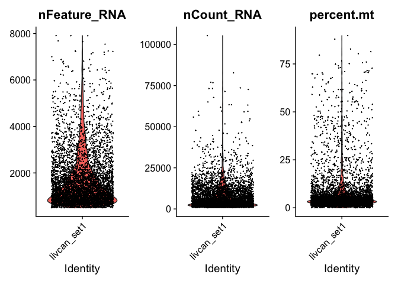

# Libraries

## Installations


```r
# if (!require("BiocManager", quietly = TRUE))
#     install.packages("BiocManager")
# 
# BiocManager::install("GEOquery")

# install.packages(c("R.utils", "Seurat", "dplyr", "patchwork"))
```

## Loading


```r
library(GEOquery)

library(R.utils)

library(Seurat)
library(dplyr)
library(patchwork)
```

# Data retrieval


```r
setwd("/Users/iamakhilverma/Desktop/short_exercise_tsankov_lab")
getwd()
```

```
## [1] "/Users/iamakhilverma/Desktop/short_exercise_tsankov_lab"
```


GEO accession: `GSE125449`
A total of 19 tumors were profiled. Set 1 contains scRNA-seq data of twelve samples, i.e., S16_P10_LCP18, S02_P01_LCP21, S10_P05_LCP23, S09_P04_LCP25, S08_P03_LCP26, S07_P02_LCP28, S11_P06_LCP29, S12_P07_LCP30, S20_P12_LCP35, S21_P13_LCP37, S15_P09_LCP38, and S19_P11_LCP39. Set 2 includes scRNA-seq data of seven samples, i.e., S351_P10_LCP34, S355_P13_LCP42, S358_P16_LCP46, S305_P06_LCP56, S300_P02_LCP60, 364_P21_LCP65, and S365_P22_LCP66. Detailed information can be found in samples.txt file of each Set.

`GPL18573`	Illumina NextSeq 500 (Homo sapiens)
`GPL20301`	Illumina HiSeq 4000 (Homo sapiens)

We care about the data contained in Set 1, i.e., `GSE125449-GPL18573_series_matrix.txt.gz`.


```r
# gse <- getGEO('GSE125449',GSEMatrix=TRUE)
# show(gse)
```

```r
options(timeout = max(300, getOption("timeout")))
# options(download.file.method.GEOquery = "wget")
```


```r
if (!(file.exists("/Users/iamakhilverma/Desktop/short_exercise_tsankov_lab/GSE125449/"))){
  filePaths <- getGEOSuppFiles('GSE125449')
  filePaths
}
```

```r
unzipper <- function(filename) {
  gunzip(filename, destname=paste(
  '/Users/iamakhilverma/Desktop/short_exercise_tsankov_lab/GSE125449/gse125449_set1/',
  gsub("^GSE125449_Set1_", "", tail(strsplit(gsub("[.]gz$", "", filename), '/')[[1]], n=1)),
  sep=''
), remove=FALSE)
}
```


```r
if (!(file.exists("/Users/iamakhilverma/Desktop/short_exercise_tsankov_lab/GSE125449/gse125449_set1"))){
  filenames <- list.files(path="/Users/iamakhilverma/Desktop/short_exercise_tsankov_lab/GSE125449/", pattern="GSE125449_Set1_[A-Za-z0-9.]+.gz", full.names=TRUE)
  filenames
  sapply(filenames, unzipper)
}
```

The MTX format is a sparse matrix format with genes on the rows and cells on the columns as output by Cell Ranger. You should also have TSV files with genes and barcode sequences corresponding to row and column indices, respectively. These files must be located in the same folder as the MTX file with the same base file name. For example if the MTX file is my_data.mtx, you should also have a my_data.genes.txt file and a my_data.barcodes.txt file.


```r
# Load the liver cancer set 1 dataset
livcan.data <- Read10X(data.dir = "./GSE125449/gse125449_set1/")
dim(livcan.data)
```

```
## [1] 20124  5115
```

```r
# Genes were retained with detected expression in more than 0.1% of all the cells (Total cells in our matrix was 5115, hence 0.1% of 5115 is 511.5). Cells with less than 500 detected genes were excluded.
livcan <- CreateSeuratObject(counts = livcan.data, project = "livcan_set1", min.cells = 511, min.features = 500)
dim(livcan)
```

```
## [1] 5124 5115
```

```r
# head(livcan.data)
```
"A total of 5,115 cells passed the initial quality control."
Indeed.

# Preprocessing

## QC and selecting cells for further analysis

"We also performed additional quality control steps including choosing the minimum UMI counts (> 700), removing doublets (0.4%, according to the multiplet rate provided by 10x Genomics based on the number of cells loaded and recovered), filtering cells with the percentage of mitochondrial genes (> 20%) (Vento-Tormo et al., 2018)."

NOTE: The pattern provided (“^MT-“) works for human gene names. You may need to adjust depending on your organism of interest. If you weren’t using gene names as the gene ID, then this function wouldn’t work. 


```r
# Show QC metrics for the first 5 cells
head(livcan@meta.data, 5)
```

```
##                     orig.ident nCount_RNA nFeature_RNA
## AAACCTGAGGCGTACA-1 livcan_set1       2102          779
## AAACGGGAGATCGATA-1 livcan_set1       3304         1030
## AAAGCAAAGATCGGGT-1 livcan_set1       6909         1907
## AAATGCCGTCTCAACA-1 livcan_set1       2942          917
## AACACGTCACGGCTAC-1 livcan_set1       1741          826
```

```r
livcan[["percent.mt"]] <- PercentageFeatureSet(livcan, pattern = "^MT-")
head(livcan@meta.data, 5)
```

```
##                     orig.ident nCount_RNA nFeature_RNA percent.mt
## AAACCTGAGGCGTACA-1 livcan_set1       2102          779   6.232160
## AAACGGGAGATCGATA-1 livcan_set1       3304         1030   4.055690
## AAAGCAAAGATCGGGT-1 livcan_set1       6909         1907   5.804024
## AAATGCCGTCTCAACA-1 livcan_set1       2942          917   5.030591
## AACACGTCACGGCTAC-1 livcan_set1       1741          826   2.125215
```

```r
# Visualize QC metrics as a violin plot
VlnPlot(livcan, features = c("nFeature_RNA", "nCount_RNA", "percent.mt"), ncol = 3)
```

<!-- -->

- nFeature_RNA is the number of genes detected in each cell
- nCount_RNA is the total number of molecules (UMIs) detected within a cell

Low nFeature_RNA for a cell indicates that it may be dead/dying or an empty droplet. High nCount_RNA and/or nFeature_RNA indicates that the "cell" may in fact be a doublet (or multiplet).


```r
dim(livcan)
```

```
## [1] 5124 5115
```

```r
# livcan <- subset(livcan, subset = nCount_RNA > 700 & percent.mt < 20)
livcan <- subset(
  livcan, 
  subset = (nCount_RNA > 700) & 
    (nFeature_RNA < 2500) & 
    (percent.mt < 20)
)
dim(livcan)
```

```
## [1] 5124 4321
```

"We found that additional filtering steps did not change an overall cellular composition among these samples."
In our case, No. of cells passing the quality control dropped from 5115 to 4321!

I added the nFeature_RNA cutoffs to take care of any empty droplets or doublets or multiplets. Also, instead of the standard `nFeature_RNA > 200 & nFeature_RNA < 2500`, I used only `nFeature_RNA < 2500` as we only have cells with at least 500 genes in them because of a previous filtration step.
Even if I wouldn't have added the nFeature_RNA cutoffs, the no. of cells passing the quality control was ~4700.

More on doublet detection and removal can be found on- 
1. http://bioconductor.org/books/3.16/OSCA.advanced/doublet-detection.html
2. https://nbisweden.github.io/workshop-scRNAseq/labs/compiled/seurat/seurat_01_qc.html#Predict_doublets


## Normalizing the data

lorem ipsum dolor sit amet


```r
# lorem ipsum dolor sit amet
```

## Identification of highly variable features (feature selection)

lorem ipsum dolor sit amet


```r
# lorem ipsum dolor sit amet
```


## Scaling the data

lorem ipsum dolor sit amet


```r
# lorem ipsum dolor sit amet
```


# R Markdown

For Markdown setup options, see <https://bookdown.org/yihui/rmarkdown/html-document.html>. 

This is an R Markdown document. Markdown is a simple formatting syntax for authoring HTML, PDF, and MS Word documents. For more details on using R Markdown see <http://rmarkdown.rstudio.com>.

When you click the **Knit** button a document will be generated that includes both content as well as the output of any embedded R code chunks within the document. You can embed an R code chunk like this:


```r
summary(cars)
```

```
##      speed           dist       
##  Min.   : 4.0   Min.   :  2.00  
##  1st Qu.:12.0   1st Qu.: 26.00  
##  Median :15.0   Median : 36.00  
##  Mean   :15.4   Mean   : 42.98  
##  3rd Qu.:19.0   3rd Qu.: 56.00  
##  Max.   :25.0   Max.   :120.00
```

# Including Plots

You can also embed plots, for example:

<!-- -->

Note that the `echo = FALSE` parameter was added to the code chunk to prevent printing of the R code that generated the plot.


# Session Information


```r
sessionInfo(package=NULL)
```

```
## R version 4.2.2 (2022-10-31)
## Platform: x86_64-apple-darwin17.0 (64-bit)
## Running under: macOS Big Sur ... 10.16
## 
## Matrix products: default
## BLAS:   /Library/Frameworks/R.framework/Versions/4.2/Resources/lib/libRblas.0.dylib
## LAPACK: /Library/Frameworks/R.framework/Versions/4.2/Resources/lib/libRlapack.dylib
## 
## locale:
## [1] en_US.UTF-8/en_US.UTF-8/en_US.UTF-8/C/en_US.UTF-8/en_US.UTF-8
## 
## attached base packages:
## [1] stats     graphics  grDevices utils     datasets  methods   base     
## 
## other attached packages:
##  [1] patchwork_1.1.2     dplyr_1.0.10        SeuratObject_4.1.3 
##  [4] Seurat_4.3.0        R.utils_2.12.2      R.oo_1.25.0        
##  [7] R.methodsS3_1.8.2   GEOquery_2.66.0     Biobase_2.58.0     
## [10] BiocGenerics_0.44.0
## 
## loaded via a namespace (and not attached):
##   [1] Rtsne_0.16             colorspace_2.0-3       deldir_1.0-6          
##   [4] ellipsis_0.3.2         ggridges_0.5.4         spatstat.data_3.0-0   
##   [7] farver_2.1.1           leiden_0.4.3           listenv_0.9.0         
##  [10] ggrepel_0.9.2          fansi_1.0.3            xml2_1.3.3            
##  [13] codetools_0.2-18       splines_4.2.2          cachem_1.0.6          
##  [16] knitr_1.41             polyclip_1.10-4        jsonlite_1.8.4        
##  [19] ica_1.0-3              cluster_2.1.4          png_0.1-8             
##  [22] uwot_0.1.14            spatstat.sparse_3.0-0  shiny_1.7.4           
##  [25] sctransform_0.3.5      readr_2.1.3            compiler_4.2.2        
##  [28] httr_1.4.4             Matrix_1.5-3           fastmap_1.1.0         
##  [31] lazyeval_0.2.2         limma_3.54.0           cli_3.5.0             
##  [34] later_1.3.0            htmltools_0.5.4        tools_4.2.2           
##  [37] igraph_1.3.5           gtable_0.3.1           glue_1.6.2            
##  [40] RANN_2.6.1             reshape2_1.4.4         Rcpp_1.0.9            
##  [43] scattermore_0.8        jquerylib_0.1.4        vctrs_0.5.1           
##  [46] nlme_3.1-161           spatstat.explore_3.0-5 progressr_0.12.0      
##  [49] lmtest_0.9-40          spatstat.random_3.0-1  xfun_0.36             
##  [52] stringr_1.5.0          globals_0.16.2         mime_0.12             
##  [55] miniUI_0.1.1.1         lifecycle_1.0.3        irlba_2.3.5.1         
##  [58] goftest_1.2-3          future_1.30.0          MASS_7.3-58.1         
##  [61] zoo_1.8-11             scales_1.2.1           hms_1.1.2             
##  [64] promises_1.2.0.1       spatstat.utils_3.0-1   parallel_4.2.2        
##  [67] RColorBrewer_1.1-3     yaml_2.3.6             reticulate_1.26       
##  [70] pbapply_1.6-0          gridExtra_2.3          ggplot2_3.4.0         
##  [73] sass_0.4.4             stringi_1.7.8          highr_0.10            
##  [76] rlang_1.0.6            pkgconfig_2.0.3        matrixStats_0.63.0    
##  [79] evaluate_0.19          lattice_0.20-45        tensor_1.5            
##  [82] ROCR_1.0-11            purrr_1.0.0            labeling_0.4.2        
##  [85] htmlwidgets_1.6.0      cowplot_1.1.1          tidyselect_1.2.0      
##  [88] parallelly_1.33.0      RcppAnnoy_0.0.20       plyr_1.8.8            
##  [91] magrittr_2.0.3         R6_2.5.1               generics_0.1.3        
##  [94] withr_2.5.0            pillar_1.8.1           fitdistrplus_1.1-8    
##  [97] abind_1.4-5            survival_3.4-0         sp_1.5-1              
## [100] tibble_3.1.8           future.apply_1.10.0    crayon_1.5.2          
## [103] KernSmooth_2.23-20     utf8_1.2.2             spatstat.geom_3.0-3   
## [106] plotly_4.10.1          tzdb_0.3.0             rmarkdown_2.19        
## [109] grid_4.2.2             data.table_1.14.6      digest_0.6.31         
## [112] xtable_1.8-4           tidyr_1.2.1            httpuv_1.6.7          
## [115] munsell_0.5.0          viridisLite_0.4.1      bslib_0.4.2
```

