# Libraries

## Installations


```r
# if (!require("BiocManager", quietly = TRUE))
#   install.packages("BiocManager")
# 
# BiocManager::install("GEOquery")
# BiocManager::install("dittoSeq")
# 
# install.packages(c("R.utils", "Seurat", "dplyr", "patchwork"))
```

## Loading


```r
library(GEOquery)

library(R.utils)
library(data.table)
library(ggplot2)
library(ggthemes)

library(Seurat)
library(dplyr)
library(patchwork)
# library(scCustomize)
# library(dittoSeq)
```

# Data retrieval


```r
setwd("/Users/iamakhilverma/Desktop/short_exercise_tsankov_lab")
getwd()
```

```
## [1] "/Users/iamakhilverma/Desktop/short_exercise_tsankov_lab"
```


GEO accession: `GSE125449`
A total of 19 tumors were profiled. Set 1 contains scRNA-seq data of twelve samples, i.e., S16_P10_LCP18, S02_P01_LCP21, S10_P05_LCP23, S09_P04_LCP25, S08_P03_LCP26, S07_P02_LCP28, S11_P06_LCP29, S12_P07_LCP30, S20_P12_LCP35, S21_P13_LCP37, S15_P09_LCP38, and S19_P11_LCP39. Set 2 includes scRNA-seq data of seven samples, i.e., S351_P10_LCP34, S355_P13_LCP42, S358_P16_LCP46, S305_P06_LCP56, S300_P02_LCP60, 364_P21_LCP65, and S365_P22_LCP66. Detailed information can be found in samples.txt file of each Set.

`GPL18573`	Illumina NextSeq 500 (Homo sapiens)
`GPL20301`	Illumina HiSeq 4000 (Homo sapiens)

We care about the data contained in Set 1, i.e., `GSE125449-GPL18573_series_matrix.txt.gz`.


```r
# gse <- getGEO('GSE125449',GSEMatrix=TRUE)
# show(gse)
```

```r
options(timeout = max(300, getOption("timeout")))
# options(download.file.method.GEOquery = "wget")
```


```r
if (!(
  file.exists(
    "/Users/iamakhilverma/Desktop/short_exercise_tsankov_lab/GSE125449/"
  )
)) {
  filePaths <- getGEOSuppFiles('GSE125449')
  filePaths
}
```

```r
unzipper <- function(filename) {
  gunzip(
    filename,
    destname = paste(
      '/Users/iamakhilverma/Desktop/short_exercise_tsankov_lab/GSE125449/gse125449_set1/',
      gsub("^GSE125449_Set1_", "", tail(strsplit(
        gsub("[.]gz$", "", filename), '/'
      )[[1]], n = 1)),
      sep = ''
    ),
    remove = FALSE
  )
}
```


```r
if (!(
  file.exists(
    "/Users/iamakhilverma/Desktop/short_exercise_tsankov_lab/GSE125449/gse125449_set1"
  )
)) {
  filenames <-
    list.files(path = "/Users/iamakhilverma/Desktop/short_exercise_tsankov_lab/GSE125449/",
               pattern = "GSE125449_Set1_[A-Za-z0-9.]+.gz",
               full.names = TRUE)
  filenames
  sapply(filenames, unzipper)
}
```

The MTX format is a sparse matrix format with genes on the rows and cells on the columns as output by Cell Ranger. You should also have TSV files with genes and barcode sequences corresponding to row and column indices, respectively. These files must be located in the same folder as the MTX file with the same base file name. For example if the MTX file is my_data.mtx, you should also have a my_data.genes.txt file and a my_data.barcodes.txt file.


```r
# Load the liver cancer set 1 dataset
livcan.data <- Read10X(data.dir = "./GSE125449/gse125449_set1/")
dim(livcan.data)
```

```
## [1] 20124  5115
```

```r
# Genes were retained with detected expression in more than 0.1% of all the cells (Total cells in our matrix was 5115, hence 0.1% of 5115 is 511.5). Cells with less than 500 detected genes were excluded.
livcan <-
  CreateSeuratObject(
    counts = livcan.data,
    # min.cells = 511,
    min.cells = 6,
    min.features = 500,
    project = "livcan_set1",
    names.delim = "-",
    names.field = 2
  )
```

```
## Warning: Feature names cannot have underscores ('_'), replacing with dashes
## ('-')
```

```r
dim(livcan)
```

```
## [1] 20041  5115
```

```r
# head(livcan.data)
```


"A total of 5,115 cells passed the initial quality control."
Indeed.


The order is taken from Table 1 from <https://www.ncbi.nlm.nih.gov/geo/query/acc.cgi?acc=GSE125449> and PMID: 31588021:
  GSM4050085	S16_P10_LCP18  Patient no.  1  H18
  GSM4050086	S02_P01_LCP21  Patient no.  2  H21
  GSM4050087	S10_P05_LCP23  Patient no.  3  H23
  GSM4050088	S09_P04_LCP25  Patient no.  4  C25
  GSM4050089	S08_P03_LCP26  Patient no.  5  C26
  GSM4050090	S07_P02_LCP28  Patient no.  6  H28
  GSM4050091	S11_P06_LCP29  Patient no.  7  C29
  GSM4050092	S12_P07_LCP30  Patient no.  8  H30
  GSM4050093	S20_P12_LCP35  Patient no.  9  C35
  GSM4050094	S21_P13_LCP37  Patient no. 10  H37
  GSM4050095	S15_P09_LCP38  Patient no. 11  H38
  GSM4050096	S19_P11_LCP39  Patient no. 12  C39


```r
v_orig_ident <- c(10, 1, 5, 4, 3, 2, 6, 7, 12, 13, 9, 11)
v_patient_ids <- c(1, 2, 3, 4, 5, 6, 7, 8, 9, 10, 11, 12)
v_sample_ids <-
  c("H18",
    "H21",
    "H23",
    "C25",
    "C26",
    "H28",
    "C29",
    "H30",
    "C35",
    "H37",
    "H38",
    "C39")
```


```r
head(livcan@meta.data)
```

```
##                    orig.ident nCount_RNA nFeature_RNA
## AAACCTGAGGCGTACA-1          1       2235          909
## AAACGGGAGATCGATA-1          1       3555         1266
## AAAGCAAAGATCGGGT-1          1       7751         2495
## AAATGCCGTCTCAACA-1          1       3168         1100
## AACACGTCACGGCTAC-1          1       2040         1096
## AACCGCGAGACGCTTT-1          1      10126         2864
```

```r
livcan$patient_id <- NA
livcan$sample_id <- NA
head(livcan$sample_id)
```

```
## AAACCTGAGGCGTACA-1 AAACGGGAGATCGATA-1 AAAGCAAAGATCGGGT-1 AAATGCCGTCTCAACA-1 
##                 NA                 NA                 NA                 NA 
## AACACGTCACGGCTAC-1 AACCGCGAGACGCTTT-1 
##                 NA                 NA
```

```r
for (i in seq.int(1, 12)) {
  livcan$patient_id[livcan$orig.ident == v_orig_ident[i]] <-
    v_patient_ids[i]
  livcan$sample_id[livcan$orig.ident == v_orig_ident[i]] <-
    v_sample_ids[i]
}

head(livcan@meta.data)
```

```
##                    orig.ident nCount_RNA nFeature_RNA patient_id sample_id
## AAACCTGAGGCGTACA-1          1       2235          909          2       H21
## AAACGGGAGATCGATA-1          1       3555         1266          2       H21
## AAAGCAAAGATCGGGT-1          1       7751         2495          2       H21
## AAATGCCGTCTCAACA-1          1       3168         1100          2       H21
## AACACGTCACGGCTAC-1          1       2040         1096          2       H21
## AACCGCGAGACGCTTT-1          1      10126         2864          2       H21
```

```r
head(livcan)
```

```
##                    orig.ident nCount_RNA nFeature_RNA patient_id sample_id
## AAACCTGAGGCGTACA-1          1       2235          909          2       H21
## AAACGGGAGATCGATA-1          1       3555         1266          2       H21
## AAAGCAAAGATCGGGT-1          1       7751         2495          2       H21
## AAATGCCGTCTCAACA-1          1       3168         1100          2       H21
## AACACGTCACGGCTAC-1          1       2040         1096          2       H21
## AACCGCGAGACGCTTT-1          1      10126         2864          2       H21
## AACCGCGGTGACCAAG-1          1       2720          804          2       H21
## AACGTTGCATGCCACG-1          1       8063         2647          2       H21
## AACTCAGAGGCTATCT-1          1      17798         1261          2       H21
## AACTCCCAGCTCTCGG-1          1       5079         1649          2       H21
```


```r
samples <-
  read.table(
    "./GSE125449/gse125449_set1/samples.txt",
    header = TRUE,
    sep = "\t",
    col.names = c("sample_expt_str", "cell_barcode", "cell_type")
  )
head(samples)
```

```
##   sample_expt_str       cell_barcode cell_type
## 1   S02_P01_LCP21 AAACCTGAGGCGTACA-1       CAF
## 2   S02_P01_LCP21 AAACGGGAGATCGATA-1       CAF
## 3   S02_P01_LCP21 AAAGCAAAGATCGGGT-1       CAF
## 4   S02_P01_LCP21 AAATGCCGTCTCAACA-1       CAF
## 5   S02_P01_LCP21 AACACGTCACGGCTAC-1       TEC
## 6   S02_P01_LCP21 AACCGCGAGACGCTTT-1       CAF
```

```r
livcan$cell_barcode <- rownames(livcan@meta.data)
all(livcan$cell_barcode == samples$cell_barcode)
```

```
## [1] TRUE
```

```r
df_metadata <-
  left_join(livcan@meta.data, samples) %>% select(-sample_expt_str)
```

```
## Joining, by = "cell_barcode"
```

# Preprocessing

## QC and selecting cells for further analysis

"We also performed additional quality control steps including choosing the minimum UMI counts (> 700), removing doublets (0.4%, according to the multiplet rate provided by 10x Genomics based on the number of cells loaded and recovered), filtering cells with the percentage of mitochondrial genes (> 20%) (Vento-Tormo et al., 2018)."

Mitochondrial genes can be used to identify low-quality cells. In cells which are broken, cytoplasmic RNA is diluted and RNA which is enclosed in the mitochondria will be retained (Ilicic T. et al. 2016 Classification of low quality cells from single-cell RNA-seq data. Genome Biol.).
Mitochondrial genes starts with prefix “MT-”.

NOTE: The pattern provided (“^MT-“) works for human gene names. You may need to adjust depending on your organism of interest. If you weren’t using gene names as the gene ID, then this function wouldn’t work. 


```r
# Show QC metrics for the first 5 cells
head(livcan@meta.data, 5)
```

```
##                    orig.ident nCount_RNA nFeature_RNA patient_id sample_id
## AAACCTGAGGCGTACA-1          1       2235          909          2       H21
## AAACGGGAGATCGATA-1          1       3555         1266          2       H21
## AAAGCAAAGATCGGGT-1          1       7751         2495          2       H21
## AAATGCCGTCTCAACA-1          1       3168         1100          2       H21
## AACACGTCACGGCTAC-1          1       2040         1096          2       H21
##                          cell_barcode
## AAACCTGAGGCGTACA-1 AAACCTGAGGCGTACA-1
## AAACGGGAGATCGATA-1 AAACGGGAGATCGATA-1
## AAAGCAAAGATCGGGT-1 AAAGCAAAGATCGGGT-1
## AAATGCCGTCTCAACA-1 AAATGCCGTCTCAACA-1
## AACACGTCACGGCTAC-1 AACACGTCACGGCTAC-1
```

```r
livcan[["percent.mt"]] <-
  PercentageFeatureSet(livcan, pattern = "^MT-")
head(livcan@meta.data, 5)
```

```
##                    orig.ident nCount_RNA nFeature_RNA patient_id sample_id
## AAACCTGAGGCGTACA-1          1       2235          909          2       H21
## AAACGGGAGATCGATA-1          1       3555         1266          2       H21
## AAAGCAAAGATCGGGT-1          1       7751         2495          2       H21
## AAATGCCGTCTCAACA-1          1       3168         1100          2       H21
## AACACGTCACGGCTAC-1          1       2040         1096          2       H21
##                          cell_barcode percent.mt
## AAACCTGAGGCGTACA-1 AAACCTGAGGCGTACA-1   5.861298
## AAACGGGAGATCGATA-1 AAACGGGAGATCGATA-1   3.769339
## AAAGCAAAGATCGGGT-1 AAAGCAAAGATCGGGT-1   5.173526
## AAATGCCGTCTCAACA-1 AAATGCCGTCTCAACA-1   4.671717
## AACACGTCACGGCTAC-1 AACACGTCACGGCTAC-1   1.813725
```

```r
# Visualize QC metrics as a violin plot
VlnPlot(
  livcan,
  features = c("nFeature_RNA", "nCount_RNA", "percent.mt"),
  ncol = 3
)
```

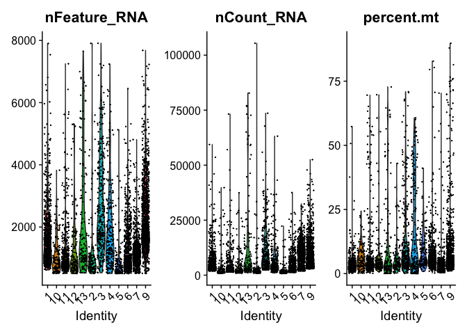<!-- -->

- nFeature_RNA is the number of genes detected in each cell
- nCount_RNA is the total number of molecules (UMIs) detected within a cell

Low nFeature_RNA for a cell indicates that it may be dead/dying or an empty droplet. High nCount_RNA and/or nFeature_RNA indicates that the "cell" may in fact be a doublet (or multiplet).


```r
dim(livcan)
```

```
## [1] 20041  5115
```

```r
# livcan <- subset(livcan, subset = nCount_RNA > 700 & percent.mt < 20)
livcan <- subset(livcan,
                 subset = (nCount_RNA > 700) &
                   # (nFeature_RNA < 2500) &
                   (percent.mt < 20))
dim(livcan)
```

```
## [1] 20041  4749
```

```r
VlnPlot(
  livcan,
  features = c("nFeature_RNA", "nCount_RNA", "percent.mt"),
  ncol = 3
)
```

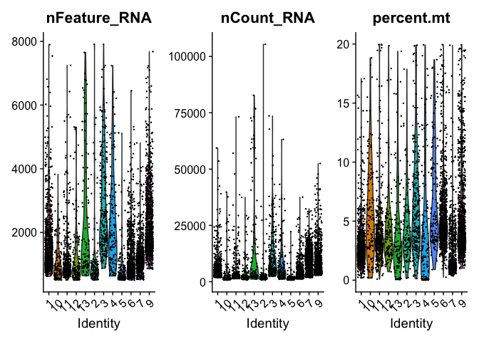<!-- -->

"We found that additional filtering steps did not change an overall cellular composition among these samples."
In our case, No. of cells passing the quality control dropped from 5115 to 4321!

Initially, I added the nFeature_RNA cutoffs to take care of any empty droplets or doublets or multiplets. Also, instead of the standard `nFeature_RNA > 200 & nFeature_RNA < 2500`, I was using only `nFeature_RNA < 2500` as we only have cells with at least 500 genes in them because of a previous filtration step.
Since, this step wasn't mentioned in the publication text, I later decided to not include this filter. Even if I would have added the nFeature_RNA cutoffs, the no. of cells passing the quality control was in 4000s.

More on doublet detection and removal can be found on- 
1. http://bioconductor.org/books/3.16/OSCA.advanced/doublet-detection.html
2. https://nbisweden.github.io/workshop-scRNAseq/labs/compiled/seurat/seurat_01_qc.html#Predict_doublets


## Normalizing the data

"The total number of transcripts in each single-cell was normalized to 10,000, followed by log transformation, i.e., NormalizedExp = log (RawExp/TotalExp * 10000+1), where RawExp, NormalizedExp and TotalExp represent the raw gene expression value, normalized gene expression as well as the total expression of all genes in a single-cell, respectively."

This step is just using the default scaling factor of 10,000 in the "LogNormalize" global-scaling normalization method.


```r
dim(livcan)
```

```
## [1] 20041  4749
```

```r
livcan <-
  NormalizeData(livcan,
                normalization.method = "LogNormalize",
                scale.factor = 10000)
# # Same can be achieved with the following as we're just using the default values
# livcan <- NormalizeData(livcan)
dim(livcan)
```

```
## [1] 20041  4749
```

## Identification of highly variable features (feature selection)

We next calculate a subset of features that exhibit high cell-to-cell variation in the dataset (i.e, they are highly expressed in some cells, and lowly expressed in others). Researchers have found that focusing on these genes in downstream analysis helps to highlight biological signal in single-cell datasets.

"Highly variable genes (k = 2,244) were detected according to average expression (between 0.05 to 3) and dispersion (above 0.5) of the genes, followed by data scaling (subtracting the average expression) and centering (divided by standard deviation)."

More on FindVariableFeatures()- https://satijalab.org/seurat/reference/findvariablefeatures


```r
dim(livcan)
```

```
## [1] 20041  4749
```

```r
livcan <- FindVariableFeatures(
  livcan,
  selection.method = "mvp",
  mean.cutoff = c(0.05, 3),
  dispersion.cutoff = c(0.5, Inf),
  verbose = TRUE
)

dim(livcan)
```

```
## [1] 20041  4749
```

```r
# Identify the 10 most highly variable genes
top10_hvg <- head(VariableFeatures(livcan), 10)
# plot variable features with and without labels
plot1 <- VariableFeaturePlot(livcan)
plot2 <- LabelPoints(plot = plot1,
                     points = top10_hvg,
                     repel = TRUE)
```

```
## When using repel, set xnudge and ynudge to 0 for optimal results
```

```r
plot1 + plot2
```

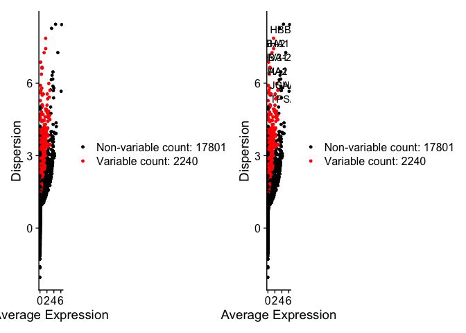<!-- -->
With the stringent cutoffs, only 1086 genes were classified as HVGs out of 5124, i.e., 4038 non-variable genes.

So, maybe they've used only the cutoffs mentioned in their methods. After using only those cutoffs, I got 2240 HVGs (out of 20041) compared to their 2244 HVGs.

## Scaling the data

"...data scaling (subtracting the average expression) and centering (divided by standard deviation)"

Setting center to TRUE will center the expression for each feature by subtracting the average expression for that feature. Setting scale to TRUE will scale the expression level for each feature by dividing the centered feature expression levels by their standard deviations if center is TRUE and by their root mean square otherwise.

More on ScaleData()- https://satijalab.org/seurat/reference/scaledata


```r
all.genes <- rownames(livcan)

livcan <-
  ScaleData(
    livcan,
    do.center = TRUE,
    do.scale = TRUE,
    features = all.genes, 
    verbose = TRUE
  )
```

```
## Centering and scaling data matrix
```

# Linear dimensional reduction

"Those variable genes were considered accounting for cell-to-cell differences, and were further used for PCA."

Now to perform PCA on the scaled data- By default, only the previously determined variable features are used as input, but can be defined using features argument if we wish to choose a different subset.


```r
length(VariableFeatures(object = livcan))
```

```
## [1] 2240
```

```r
livcan <-
  RunPCA(livcan, features = VariableFeatures(object = livcan))
```

```
## PC_ 1 
## Positive:  TF, AMBP, RBP4, SERPINC1, ANG, FGA, APOH, VTN, HPX, APOB 
## 	   GC, KNG1, AHSG, F2, HP, BAAT, ANGPTL3, TTR, AZGP1, FGG 
## 	   ALDOB, C4BPB, AGXT, HSD17B6, CYP3A5, GATM, FGB, APOC2, APOC1, APOC3 
## Negative:  CXCR4, CD52, PTPRC, HCST, CD3D, TRAC, CD2, RGS1, CCL5, LSP1 
## 	   LTB, CD3E, CD69, TRBC2, CREM, FYB, COTL1, IL7R, TRBC1, CD74 
## 	   SAMSN1, GZMA, KLRB1, ALOX5AP, RGS2, CD7, RGCC, CELF2, PTPN7, CD3G 
## PC_ 2 
## Positive:  SPARC, MGP, CALD1, SPARCL1, COL4A1, MYL9, A2M, COL4A2, TINAGL1, GNG11 
## 	   ID3, BGN, TIMP3, PPP1R14A, LHFP, MAP1B, PLAC9, TAGLN, RGS5, ACTA2 
## 	   TPM2, FXYD6, MFGE8, GJA4, PLPP1, COL6A2, NDUFA4L2, ADAMTS1, ADIRF, SPRY1 
## Negative:  CD52, CXCR4, PTPRC, HCST, RGS1, CD3D, TRAC, LSP1, FYB, CD2 
## 	   LTB, SAMSN1, ALOX5AP, CD69, CCL5, CD3E, BIRC3, TRBC2, GPR183, HLA-DPB1 
## 	   HLA-DQA1, TRBC1, GZMA, CTSS, RGS10, IL7R, DOK2, COTL1, UCP2, LST1 
## PC_ 3 
## Positive:  TAGLN, ACTA2, MFGE8, TPM2, FRZB, SOD3, DCN, PDGFRB, MYL9, NDUFA4L2 
## 	   BGN, COL1A2, NOTCH3, COL14A1, CRYAB, MAP3K7CL, ASPN, TPPP3, COL3A1, NEXN 
## 	   MYH11, RGS5, SDC2, CRISPLD2, PDLIM3, SEPT4, LMOD1, COL1A1, ENPEP, HEYL 
## Negative:  RAMP2, CLEC14A, RNASE1, PLVAP, EGFL7, EMCN, FLT1, CD93, ECSCR, RBP7 
## 	   NOTCH4, CD34, THBD, ADGRL4, PODXL, SLC9A3R2, HSPG2, RAMP3, CLDN5, PTPRB 
## 	   IFI27, HYAL2, TMEM88, HBEGF, AQP1, CALCRL, LDB2, PCAT19, FAM198B, KDR 
## PC_ 4 
## Positive:  AIF1, TYROBP, FCER1G, CST3, LYZ, MS4A6A, CD68, C1QA, MNDA, C1QC 
## 	   HLA-DQA1, C1QB, MS4A7, HLA-DRA, CYBB, HLA-DQB1, LST1, IGSF6, CLEC7A, HLA-DRB5 
## 	   HLA-DPA1, PLAUR, SPI1, IL1B, HLA-DMB, FCGR2A, CPVL, MS4A4A, HLA-DPB1, HLA-DMA 
## Negative:  RAMP2, PLVAP, EMCN, CLEC14A, ECSCR, EGFL7, RAMP3, ADGRL4, CD34, PODXL 
## 	   CD3D, FLT1, NOTCH4, RBP7, HSPG2, KDR, SLC9A3R2, TRAC, AQP1, PTPRB 
## 	   PCAT19, TMEM88, CLDN5, LDB2, HYAL2, EFNB2, RNASE1, TIE1, HSPA1B, CD3E 
## PC_ 5 
## Positive:  DMKN, WFDC2, CXCL6, SPP1, MMP7, SLPI, KRT19, AHNAK2, CD24, ELF3 
## 	   CXCL1, CLDN4, CXCL5, PCSK1N, SPINT2, IGFBP1, PERP, SPINK1, TMEM45A, CCL20 
## 	   GPX2, LGALS4, SFN, AKR1C3, ANXA4, BICC1, ATP1B1, C19orf33, EPCAM, DSP 
## Negative:  APOC3, ALDOB, CYP2D6, TAT, AHSG, SDS, AGXT, SLC22A1, HRG, CYP2A6 
## 	   SERPINC1, LINC01485, F2, CYP2A7, HPX, HP, A1BG, FAM99A, HSD17B13, KNG1 
## 	   TTR, SLC22A7, CD14, RBP4, APOA1, CYP17A1, TF, ACSM2A, MRC1, MASP2
```

```r
# Same can be achieved with livcan <- RunPCA(livcan) as it picks-up HVGs by default
# npcs, i.e.,Total Number of PCs to compute and store (50 by default)
```

Some different ways to visualize cells and features that define the PCA-


```r
# Way 1
print(livcan[["pca"]], dims = 1:5, nfeatures = 5)
```

```
## PC_ 1 
## Positive:  TF, AMBP, RBP4, SERPINC1, ANG 
## Negative:  CXCR4, CD52, PTPRC, HCST, CD3D 
## PC_ 2 
## Positive:  SPARC, MGP, CALD1, SPARCL1, COL4A1 
## Negative:  CD52, CXCR4, PTPRC, HCST, RGS1 
## PC_ 3 
## Positive:  TAGLN, ACTA2, MFGE8, TPM2, FRZB 
## Negative:  RAMP2, CLEC14A, RNASE1, PLVAP, EGFL7 
## PC_ 4 
## Positive:  AIF1, TYROBP, FCER1G, CST3, LYZ 
## Negative:  RAMP2, PLVAP, EMCN, CLEC14A, ECSCR 
## PC_ 5 
## Positive:  DMKN, WFDC2, CXCL6, SPP1, MMP7 
## Negative:  APOC3, ALDOB, CYP2D6, TAT, AHSG
```

```r
# Way2
VizDimLoadings(livcan, dims = 1:2, reduction = "pca")
```

<!-- -->

```r
# Way3
DimPlot(livcan, reduction = "pca")
```

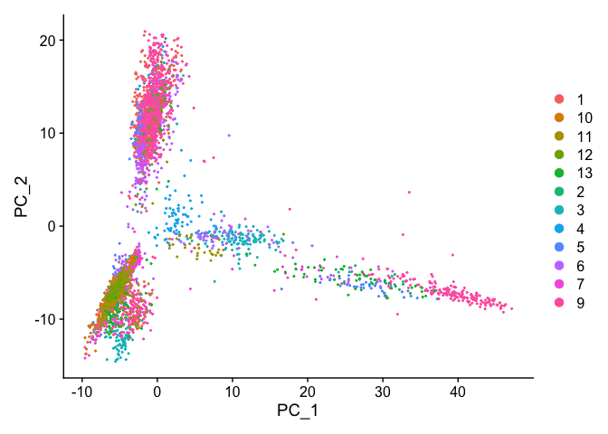<!-- -->

```r
# Way4
DimHeatmap(livcan, dims = 1, cells = 500, balanced = TRUE)
```

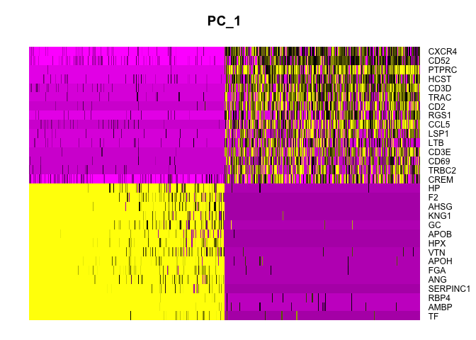<!-- -->

```r
DimHeatmap(livcan, dims = 1:20, cells = 500, balanced = TRUE)
```

<!-- -->

# Determining the "dimensionality" of the dataset

‘Elbow plot’: a ranking of principle components based on the percentage of variance explained by each one (ElbowPlot() function). 


```r
ElbowPlot(livcan, ndims=20)
```

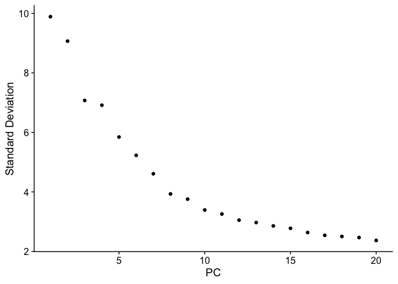<!-- -->

```r
ElbowPlot(livcan, ndims=50)
```

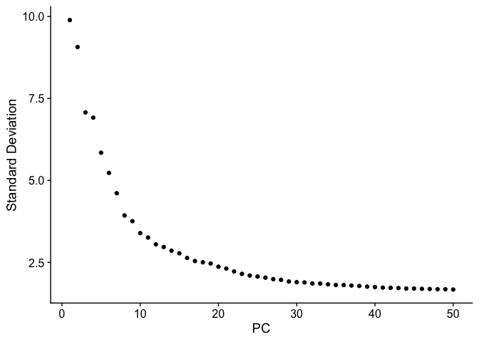<!-- -->

- From the Elbow plot with 20 dims, we can observe an ‘elbow’ around PC19-20, suggesting that the majority of true signal is captured in the first 20 PCs.
- From the Elbow plot with 50 dims, we can observe an ‘elbow’ around PC44-45, suggesting that the majority of true signal is captured in the first 45 PCs.


An alternate approach would be to use JackStrawPlot().


```r
livcan <- JackStraw(livcan, num.replicate = 100, dims = 50, verbose = TRUE)
livcan <- ScoreJackStraw(livcan, dims = 1:50)

JackStrawPlot(livcan, dims = 1:50)
```

```
## Warning: Removed 80817 rows containing missing values (`geom_point()`).
```

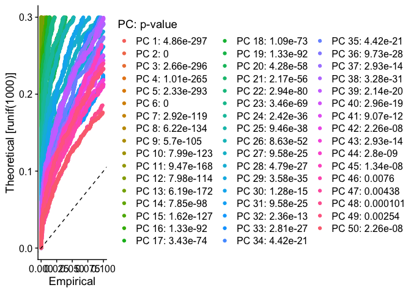<!-- -->

- From the JackStraw plot with 50 dims, it appears that there is a sharp drop-off in significance after the first 45 PCs (same can be said about a sharp drop-off about after 19 PCs or 26 PCs).

# Cluster the cells

Seurat uses a graph-based technique to cluster cells based on their gene expression profiles.


```r
livcan <- FindNeighbors(livcan, dims = 1:20)
```

```
## Computing nearest neighbor graph
```

```
## Computing SNN
```

```r
livcan <- FindClusters(livcan, resolution = 0.325)
```

```
## Modularity Optimizer version 1.3.0 by Ludo Waltman and Nees Jan van Eck
## 
## Number of nodes: 4749
## Number of edges: 157978
## 
## Running Louvain algorithm...
## Maximum modularity in 10 random starts: 0.9466
## Number of communities: 12
## Elapsed time: 0 seconds
```

```r
# Look at cluster IDs of the first 5 cells
head(Idents(livcan), 5)
```

```
## AAACCTGAGGCGTACA-1 AAACGGGAGATCGATA-1 AAAGCAAAGATCGGGT-1 AAATGCCGTCTCAACA-1 
##                  2                  2                  2                  2 
## AACACGTCACGGCTAC-1 
##                  1 
## Levels: 0 1 2 3 4 5 6 7 8 9 10 11
```


# Non-linear dimensional reduction

"The first 20 PCs were applied for t-SNE analysis according to the eigenvalues (data not shown)."

## Fig. 1B


```r
livcan <- RunTSNE(livcan,
                  dims = 1:20,
                  perplexity = 50,
                  theta = 0.3)
DimPlot(
  livcan,
  reduction = "tsne",
  label = FALSE,
  group.by = "sample_id",
  shuffle = TRUE,
  # seed = 100,
  order = rev(v_sample_ids),
  # order = c(13, 12, 11, 10, 9, 7, 6, 5, 4, 3, 2, 1),
  # cols = DiscretePalette(12, palette = "alphabet2")
  cols = DiscretePalette(12, palette = "glasbey")
) + DarkTheme()
```

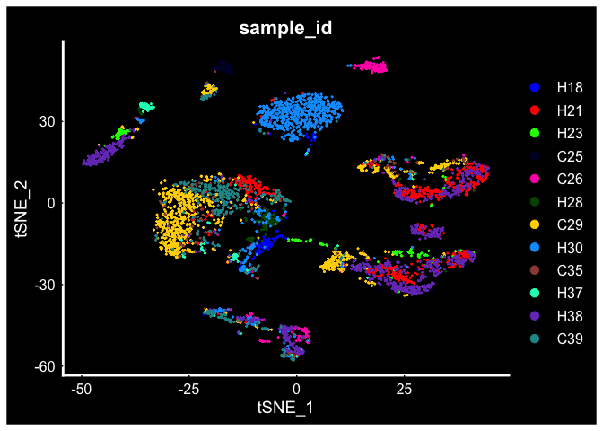<!-- -->

```r
# # By default Seurat’s DimPlot() plots each group on top of the next which can make plots harder to interpret. DimPlot_scCustom sets shuffle = TRUE by default as I believe this setting is more often the visualization that provides the most clarity.
# # https://samuel-marsh.github.io/scCustomize/articles/Gene_Expression_Plotting.html
# DimPlot(seurat_object = marsh_human_pm, group.by = "sample_id")
# DimPlot_scCustom(seurat_object = livcan, group.by = "orig.ident")
```


```r
# By original id
DimPlot(
  livcan,
  reduction = "tsne",
  label = FALSE,
  group.by = "orig.ident",
  shuffle = TRUE,
  # seed = 100,
  order = rev(v_orig_ident),
  cols = DiscretePalette(12, palette = "glasbey")
)
```

<!-- -->

```r
# By sample id
DimPlot(
  livcan,
  reduction = "tsne",
  label = FALSE,
  group.by = "sample_id",
  shuffle = TRUE,
  seed = 100,
  order = rev(v_sample_ids),
  cols = DiscretePalette(12, palette = "glasbey")
)
```

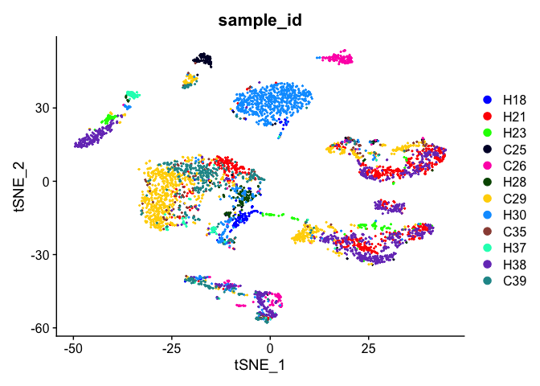<!-- -->

```r
# By patient id
DimPlot(
  livcan,
  reduction = "tsne",
  label = FALSE,
  group.by = "patient_id",
  shuffle = TRUE,
  # seed = 100,
  order = rev(v_patient_ids),
  cols = DiscretePalette(12, palette = "glasbey")
)
```

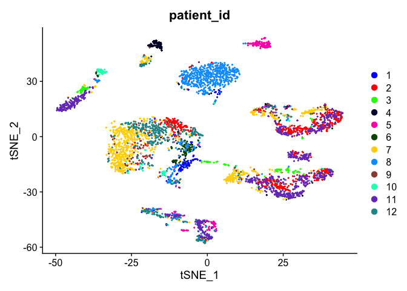<!-- -->


```r
# saveRDS(livcan, file = "./livcan_set1_final.rds")
```


# Percentage composition of samples by cell types


```r
df_metadata <-
  df_metadata[df_metadata$cell_barcode %in% rownames(livcan@meta.data),]

# Vector of eight tumors with ≥ 20 malignant cells
select_8tumors <-
  c("C39", "H30", "C29", "H23", "H37", "C25", "C26", "H38")
df_metadata_8tumor <-
  df_metadata[df_metadata$sample_id %in% select_8tumors,]
```


Way 1: "dittoSeq" was an easy way given `cell_type` info was in our seurat obj's metadata col <https://bioconductor.org/packages/release/bioc/vignettes/dittoSeq/inst/doc/dittoSeq.html#74_dittoBarPlot__dittoFreqPlot>


```r
# dittoBarPlot(object = livcan,
#              var = "sample_id",
#              group.by = "cell_type")
```

Way 2: Manual calculations


```r
table(df_metadata_8tumor$cell_type)
```

```
## 
##         B cell            CAF       HPC-like Malignant cell         T cell 
##            570            396             79            538            995 
##            TAM            TEC   unclassified 
##            406            651             48
```

```r
# According to the text in the publication, we want to plot for only stromal cells
table(df_metadata_8tumor[df_metadata_8tumor$cell_type == "B cell" |
                           df_metadata_8tumor$cell_type == "T cell" |
                           df_metadata_8tumor$cell_type == "CAF" |
                           df_metadata_8tumor$cell_type == "TAM" |
                           df_metadata_8tumor$cell_type == "TEC" , "cell_type"])
```

```
## 
## B cell    CAF T cell    TAM    TEC 
##    570    396    995    406    651
```

```r
df_metadata_8tumor_stromal_cells_only <-
  df_metadata_8tumor[df_metadata_8tumor$cell_type == "B cell" |
                       df_metadata_8tumor$cell_type == "T cell" |
                       df_metadata_8tumor$cell_type == "CAF" |
                       df_metadata_8tumor$cell_type == "TAM" |
                       df_metadata_8tumor$cell_type == "TEC" ,]


head(df_metadata_8tumor_stromal_cells_only)
```

```
##     orig.ident nCount_RNA nFeature_RNA patient_id sample_id       cell_barcode
## 829          3       2361         1267          5       C26 AAACCTGAGATAGCAT-3
## 832          3       5883         1938          5       C26 AACTGGTAGCTAGCCC-3
## 833          3       5765         1900          5       C26 AACTTTCAGGGTGTTG-3
## 834          3       2962         1232          5       C26 AAGGTTCTCCACTCCA-3
## 835          3       6748         2307          5       C26 ACACCAAAGCGTGAAC-3
## 836          3      10575         2701          5       C26 ACACCAAAGTGGGTTG-3
##     cell_type
## 829       TEC
## 832       TAM
## 833       TAM
## 834       TAM
## 835       TAM
## 836       CAF
```

## Fig. 2D


```r
df_metadata_8tumor_stromal_cells_only %>%
  count(sample_id, cell_type) %>%
  group_by(sample_id) %>%
  mutate(pct = prop.table(n) * 100) %>%
  ggplot() + aes(sample_id, pct, fill = factor(cell_type, levels = c("CAF", "T cell", "TEC", "TAM", "B cell"))) + # levels is providing order for the portions in the bar
  geom_bar(stat = "identity") +
  # ylab("Stromal composition (%)") +
  # xlab("") +
  # Ordering the bars in plot
  scale_x_discrete(limits = select_8tumors) +
  # Customizing the legend
  scale_fill_discrete(name = "",
                      labels = c("CAFs", "T cells", "TECs", "TAMs", "B cells")) +
  # geom_text(aes(label = paste0(sprintf("%1.1f", pct), "%")),
  #           position = position_stack(vjust = 0.5)) +
  theme_fivethirtyeight() +
  # axis.title is set to element_blank() in fivethirtyeight theme
  theme(axis.title = element_text(), axis.title.x = element_blank()) + ylab("Stromal composition (%)")
```

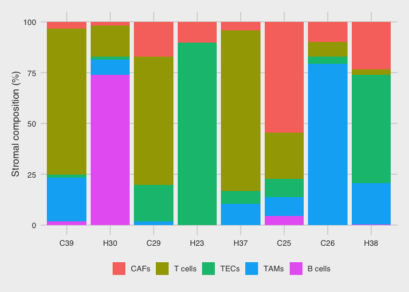<!-- -->


# Session Information


```r
sessionInfo(package=NULL)
```

```
## R version 4.2.2 (2022-10-31)
## Platform: x86_64-apple-darwin17.0 (64-bit)
## Running under: macOS Big Sur ... 10.16
## 
## Matrix products: default
## BLAS:   /Library/Frameworks/R.framework/Versions/4.2/Resources/lib/libRblas.0.dylib
## LAPACK: /Library/Frameworks/R.framework/Versions/4.2/Resources/lib/libRlapack.dylib
## 
## locale:
## [1] en_US.UTF-8/en_US.UTF-8/en_US.UTF-8/C/en_US.UTF-8/en_US.UTF-8
## 
## attached base packages:
## [1] stats     graphics  grDevices utils     datasets  methods   base     
## 
## other attached packages:
##  [1] patchwork_1.1.2     dplyr_1.0.10        SeuratObject_4.1.3 
##  [4] Seurat_4.3.0        ggthemes_4.2.4      ggplot2_3.4.0      
##  [7] data.table_1.14.6   R.utils_2.12.2      R.oo_1.25.0        
## [10] R.methodsS3_1.8.2   GEOquery_2.66.0     Biobase_2.58.0     
## [13] BiocGenerics_0.44.0
## 
## loaded via a namespace (and not attached):
##   [1] ggbeeswarm_0.7.1       Rtsne_0.16             colorspace_2.0-3      
##   [4] deldir_1.0-6           ellipsis_0.3.2         ggridges_0.5.4        
##   [7] spatstat.data_3.0-0    rstudioapi_0.14        farver_2.1.1          
##  [10] leiden_0.4.3           listenv_0.9.0          ggrepel_0.9.2         
##  [13] fansi_1.0.3            xml2_1.3.3             codetools_0.2-18      
##  [16] splines_4.2.2          cachem_1.0.6           knitr_1.41            
##  [19] polyclip_1.10-4        jsonlite_1.8.4         ica_1.0-3             
##  [22] cluster_2.1.4          png_0.1-8              uwot_0.1.14           
##  [25] spatstat.sparse_3.0-0  shiny_1.7.4            sctransform_0.3.5     
##  [28] readr_2.1.3            compiler_4.2.2         httr_1.4.4            
##  [31] Matrix_1.5-3           fastmap_1.1.0          lazyeval_0.2.2        
##  [34] limma_3.54.0           cli_3.5.0              later_1.3.0           
##  [37] htmltools_0.5.4        tools_4.2.2            igraph_1.3.5          
##  [40] gtable_0.3.1           glue_1.6.2             RANN_2.6.1            
##  [43] reshape2_1.4.4         Rcpp_1.0.9             scattermore_0.8       
##  [46] jquerylib_0.1.4        vctrs_0.5.1            nlme_3.1-161          
##  [49] spatstat.explore_3.0-5 progressr_0.12.0       lmtest_0.9-40         
##  [52] spatstat.random_3.0-1  xfun_0.36              stringr_1.5.0         
##  [55] globals_0.16.2         mime_0.12              miniUI_0.1.1.1        
##  [58] lifecycle_1.0.3        irlba_2.3.5.1          goftest_1.2-3         
##  [61] future_1.30.0          MASS_7.3-58.1          zoo_1.8-11            
##  [64] scales_1.2.1           spatstat.utils_3.0-1   hms_1.1.2             
##  [67] promises_1.2.0.1       parallel_4.2.2         RColorBrewer_1.1-3    
##  [70] yaml_2.3.6             reticulate_1.26        pbapply_1.6-0         
##  [73] gridExtra_2.3          ggrastr_1.0.1          sass_0.4.4            
##  [76] stringi_1.7.8          highr_0.10             rlang_1.0.6           
##  [79] pkgconfig_2.0.3        matrixStats_0.63.0     evaluate_0.19         
##  [82] lattice_0.20-45        tensor_1.5             ROCR_1.0-11           
##  [85] purrr_1.0.0            labeling_0.4.2         htmlwidgets_1.6.0     
##  [88] cowplot_1.1.1          tidyselect_1.2.0       parallelly_1.33.0     
##  [91] RcppAnnoy_0.0.20       plyr_1.8.8             magrittr_2.0.3        
##  [94] R6_2.5.1               generics_0.1.3         pillar_1.8.1          
##  [97] withr_2.5.0            fitdistrplus_1.1-8     abind_1.4-5           
## [100] survival_3.4-0         sp_1.5-1               tibble_3.1.8          
## [103] future.apply_1.10.0    crayon_1.5.2           KernSmooth_2.23-20    
## [106] utf8_1.2.2             spatstat.geom_3.0-3    plotly_4.10.1         
## [109] tzdb_0.3.0             rmarkdown_2.19         grid_4.2.2            
## [112] digest_0.6.31          xtable_1.8-4           tidyr_1.2.1           
## [115] httpuv_1.6.7           munsell_0.5.0          beeswarm_0.4.0        
## [118] viridisLite_0.4.1      vipor_0.4.5            bslib_0.4.2
```

